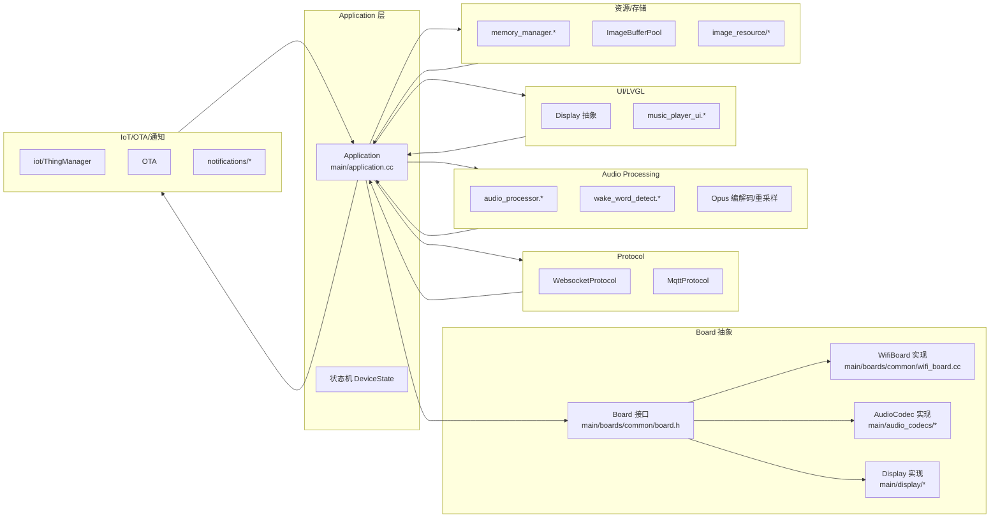
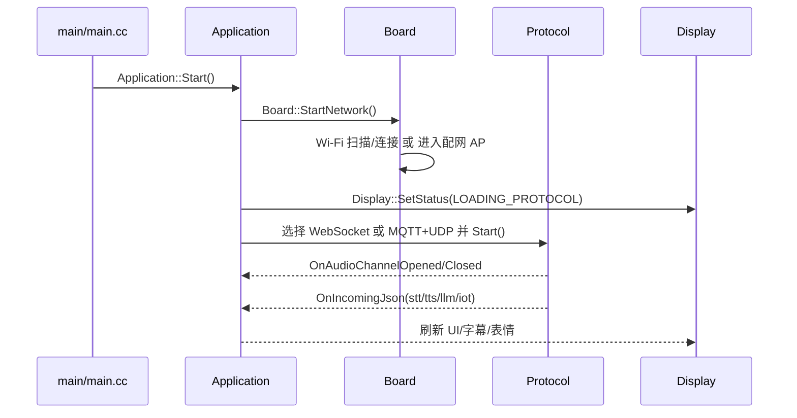
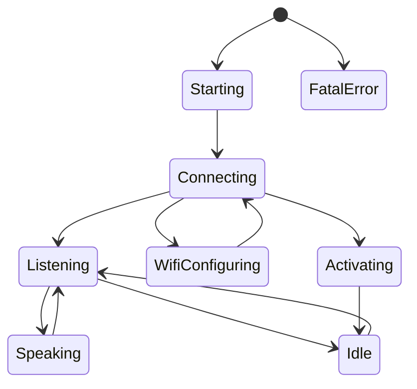

# XiaoZhi AI Chatbot 项目维基（XiaoZhi ESP32）

本维基面向两类读者：
- 初学者：快速上手、环境搭建、常见问题、最小工作流
- 贡献者：架构与模块边界、API 索引、代码风格、优化与测试要点

若你只想快速体验，请先阅读 `README.md` 的“免开发环境烧录”。若你计划参与开发/移植到新板子，请通读本文档。

---

## 目录
- [概览](#概览)
- [快速开始](#快速开始)
- [开发环境搭建](#开发环境搭建)
- [架构总览](#架构总览)
- [核心模块详解与 API 索引](#核心模块详解与-api-索引)
- [配置与定制（开发板）](#配置与定制开发板)
- [贡献指南](#贡献指南)
- [API 参考（精选）](#api-参考精选)
- [常见问题（FAQ）](#常见问题faq)
- [优化建议与最佳实践](#优化建议与最佳实践)
- [附录：术语与重要链接](#附录术语与重要链接)

---

## 概览
- **项目目标**：在 ESP32/ESP32-S3 上实现“可对话的 AI 伴侣”，集成本地唤醒和云端 LLM/TTS，支持屏幕 UI、IoT 控制与 OTA。
- **核心能力**：
  - 语音采集、VAD/AEC/AGC 前处理（可选）
  - 实时上行（WebSocket/MQTT+UDP）与下行 TTS 播放
  - LVGL 屏幕 UI，图标/字幕/二维码
  - IoT 能力模型（ThingManager）
  - OTA、通知、功耗/电池状态管理
- **快速链接**：
  - 项目首页：`README.md`、`README_en.md`
  - 开发板定制：`main/boards/README.md`
  - 协议文档：`docs/websocket.md`

---

## 快速开始
- **免开发环境烧录**：见 `README.md`“Flash 烧录固件（无 IDF 开发环境）”。
- **首次联网**：
  - 默认使用 Wi‑Fi。如果未配置过 Wi‑Fi，设备会进入配网 AP 模式（由 `WifiBoard::StartNetwork()` 控制，见 `main/boards/common/wifi_board.cc`）。
  - 可选打开“声波配网”（`CONFIG_USE_ACOUSTIC_WIFI_PROVISIONING`）。
- **最少步骤**：
  1) 烧录固件并上电
  2) 连接设备 AP 并在 Web 页配置 Wi‑Fi
  3) 设备连网后自动建立协议通道并进入 Listening

---

## 开发环境搭建
- **推荐环境**：ESP‑IDF 5.3+，VSCode/Cursor 插件；Linux 编译更快也更稳定（参考 `README.md`）。
- **基础命令**：
  - 选择目标芯片：`idf.py set-target esp32s3`
  - 构建：`idf.py build`
  - 烧录与监视：`idf.py -p <PORT> flash monitor`
- **Kconfig/分区**：
  - 项目菜单项：`main/Kconfig.projbuild`（如 `CONFIG_USE_ACOUSTIC_WIFI_PROVISIONING`、`CONFIG_USE_ALARM`）
  - 分区：根目录 `partitions*.csv`
  - 默认配置：`sdkconfig.defaults*`
- **板级构建与打包**：
  - 目录与说明：`main/boards/README.md`
  - 脚本：`scripts/release.py [开发板目录]`（用于生成对应固件）

---

## 架构总览

### 顶层组件关系


### 启动流程（序列）


### 设备状态机（DeviceState）


- 状态枚举：见 `main/application.h` 中 `enum DeviceState`。
- 常见转换：协议通道打开/关闭、TTS 开始/结束、用户操作（按钮/唤醒词）。

---

## 核心模块详解与 API 索引

> 说明：本节列出关键类与职责、入口文件路径与常用方法。具体实现请在 IDE 中跳转到相应文件。

### 1) Application（应用核心）
- 路径：`main/application.h|cc`
- 角色：系统主控，管理任务与状态机，路由协议事件，驱动显示与音频。
- 常用方法：
  - `Start()`：启动音频/主循环任务、初始化协议
  - `Schedule(std::function<void()>)`：跨任务调度 UI/状态变更
  - `SetDeviceState(DeviceState)`：切换设备状态
  - `StartListening()/StopListening()/StopListeningFast()`：监听模式控制
  - `GetProtocol()`、`GetOta()`：访问协议与 OTA
  - `ReadAudio(...)`：声波配网等模块读取音频
  - `GetAudioPerformanceScore()`：基于队列与内存评估音频压力（参考 `main/application.cc`）
- 事件回调：
  - `protocol_->OnIncomingJson(...)`：处理 `stt/tts/llm/iot` 等类型
  - `protocol_->OnAudioChannelOpened/Closed`：联动省电与 UI 状态

### 2) Board 抽象与 WifiBoard 实现
- 路径：
  - 抽象：`main/boards/common/board.h|cc`
  - Wi‑Fi 板：`main/boards/common/wifi_board.h|cc`
- 职责：
  - 统一硬件能力：`GetAudioCodec()`、`GetDisplay()`、`CreateWebSocket()/CreateMqtt()`、`SetPowerSaveMode()`
  - 启动网络：`StartNetwork()`（扫描/连接/进入 AP 配网；可启用声波配网）
  - OTA 下发 WebSocket URL 并选择 TCP/TLS 传输

### 3) Protocol 层（WebSocket / MQTT+UDP）
- 路径：`main/protocols/websocket_protocol.*`、`main/protocols/mqtt_protocol.*`
- 关键点：
  - 音频通道与事件：`OnIncomingAudio`、`OnIncomingJson`、`OnAudioChannelOpened/Closed`
  - 设备连通性错误：`OnNetworkError`

### 4) Audio 子系统
- 路径：`main/audio_processing/*`、`main/audio_codecs/*`
- 组成：
  - `AudioCodec` 及具体芯片驱动（ES8311/ES8388/...）
  - `audio_processor.*`：VAD/AEC/AGC 配置，事件位控制，`Start()/Stop()/ForceResetBuffer()`
  - `wake_word_detect.*`：离线唤醒
  - Opus 编解码与重采样：`opus_*`

### 5) Display/UI（LVGL）
- 路径：`main/display/display.h|cc`、`main/ui/*`
- 能力：
  - 状态/通知/字幕/图标/二维码、画布绘制
  - `DisplayLockGuard`：UI 更新加锁，避免并发冲突
  - 定时更新：`Display::StartUpdateTimer()`
  - 示例 UI：`music_player_ui.*`（含性能监控定时器）

### 6) Memory / 资源管理
- 路径：`main/memory/memory_manager.h|cc`、`main/image_resource/*`
- 能力：
  - `MemoryManager` 与 `MemoryBlock`（RAII）
  - `ImageBufferPool`：标准图片缓冲池
  - 网络下载器：`image_resource/network/downloader.cc`（根据 heap 动态调整 buffer）

### 7) IoT 能力与通知/OTA
- 路径：`main/iot/*`、`main/notifications/*`、`main/ota.cc`
- 能力：
  - `ThingManager`：`GetDescriptorsJson()`、`GetStatesJson()`、`Invoke()`
  - 通知上报与 ACK：`notifications/mqtt_notifier.*`
  - OTA 配置分发（例如 WebSocket URL）

---

## 配置与定制（开发板）
- 详见：`main/boards/README.md`
- 核心文件：
  - `config.h`：引脚映射、显示/音频参数、背光极性等
  - `config.json`：目标芯片与编译附加项
  - `xxx_board.cc`：继承 `WifiBoard` 或 `ML307Board`，实现外设初始化、按钮逻辑、显示创建、IoT 注册等
- 重要提示：保证自定义板标识唯一，避免 OTA 覆盖到他人通道（详见 `README.md` 与 `boards/README.md`）。

---

## 贡献指南
- **代码风格**：Google C++（提交前确保格式化与静态检查）
- **分支与提交**：
  - 分支前缀：`feat/`、`fix/`、`refactor/`、`docs/`
  - 提交信息：动词开头 + 影响范围 + 简述（必要时含影响分析）
- **PR 审核要点**：
  - 性能：音频路径不降级、UI/FPS 不抖动
  - 内存：不引入泄漏与严重碎片；大对象使用 RAII
  - 任务：优先级合理、避免热路径 `vTaskDelay` 阻塞
  - 配置：避免魔法数字，能通过 Kconfig 或常量集中管理

---

## API 参考（精选）

- **Application（`main/application.h`）**
  - `void Start()`
  - `void Schedule(std::function<void()>)`
  - `void SetDeviceState(DeviceState)`
  - `void StartListening()` / `void StopListening()` / `void StopListeningFast(bool)`
  - `Protocol& GetProtocol()` / `Ota& GetOta()`
  - `void ReadAudio(std::vector<int16_t>& data, int sample_rate, int samples)`
  - `int GetAudioPerformanceScore() const`（参考 `main/application.cc`）

- **Board（`main/boards/common/board.h`）**
  - `static Board& GetInstance()`
  - `virtual AudioCodec* GetAudioCodec()`、`virtual Display* GetDisplay()`
  - `virtual Http* CreateHttp()`、`virtual WebSocket* CreateWebSocket()`、`virtual Mqtt* CreateMqtt()`、`virtual Udp* CreateUdp()`
  - `virtual void StartNetwork()`、`virtual void SetPowerSaveMode(bool)`

- **WifiBoard（`main/boards/common/wifi_board.cc`）**
  - `void StartNetwork()`：扫描/连接/进入 AP 配网
  - `void EnterWifiConfigMode()`：启动配网 AP、二维码显示、（可选）声波配网任务
  - `WebSocket* CreateWebSocket()`：根据 OTA URL 选择 TCP/TLS

- **Display（`main/display/display.h`）**
  - `void SetStatus(const char*)`、`void ShowNotification(...)`、`void SetChatMessage(...)`
  - `void ShowQRCode(const char* data, int x=-1, int y=-1, int size=0)` / `void HideQRCode()`
  - `void StartUpdateTimer()`、`void CreateCanvas()/DestroyCanvas()`

- **AudioProcessor（`main/audio_processing/audio_processor.*`）**
  - `void Initialize(AudioCodec* codec, bool realtime_chat)`：配置 AEC/VAD/AGC 等
  - `void Start()/Stop()`、`void Feed(...)`、`size_t GetFeedSize()`
  - `void OnOutput(std::function<void(std::vector<int16_t>&&)> cb)`
  - `void OnVadStateChange(std::function<void(bool)> cb)`
  - `void ForceResetBuffer()`

- **MemoryManager（`main/memory/memory_manager.*`）**
  - `std::unique_ptr<MemoryBlock> allocate(size_t size)`
  - `bool has_available_memory(size_t required_size) const`
  - `MemoryStatus get_memory_status() const`、`size_t get_heap_fragmentation_percent() const`

---

## 常见问题（FAQ）

- **无法连接 Wi‑Fi**
  - 检查是否进入配网 AP（`WifiBoard::StartNetwork()` 分支）
  - 使用二维码/网页配置；必要时长按 BOOT 触发 AP 模式（视板子实现）

- **音频无输入/输出或失真**
  - 确认 `config.h` I2S/PA/地址配置；编解码器驱动选择
  - 服务器采样率与本地不一致时会重采样，可能引入失真（见 `Application::OnAudioChannelOpened` 的日志与校验）

- **显示方向/颜色异常**
  - 检查 `esp_lcd_panel_mirror/swap_xy/invert_color` 与 `DISPLAY_*` 配置

- **WebSocket/MQTT 连接失败**
  - 检查 OTA 下发 URL、TLS 参数与网络连通性；关注 `OnNetworkError`

- **低内存或碎片化**
  - 使用 `MemoryManager` RAII 块；减少临时大对象
  - 图片/下载缓冲遵循缓冲池与动态降级策略

- **省电模式切换后响应慢**
  - 确认音频通道开闭时 `SetPowerSaveMode` 的调用与 UI 状态刷新顺序

---

## 优化建议与最佳实践

- **内存管理**
  - 统一使用 RAII（`MemoryBlock`），避免手动 `malloc/free` 交叉
  - 图片缓冲池（`ImageBufferPool`）限制峰值；下载器按 heap 动态收敛 buffer

- **任务与并发**
  - 音频任务高优先级且绑定核心，避免被 UI/网络打断（参考 `xTaskCreatePinnedToCore`）
  - 热路径避免 `vTaskDelay`，UI 动画用帧节流+让步
  - 使用 `DisplayLockGuard` 保护 LVGL 更新，减少锁竞争

- **UI/显示**
  - 弹性刷新与合并更新；长时操作迁移到后台任务

- **网络/下载**
  - 连接/超时/重试有指数退避；根据剩余 heap 调整 `buffer_size`

- **状态机与解耦**
  - 将超长回调（例如 `OnMqttNotification`）拆分为子处理器，便于测试与维护

- **度量与压测**
  - 上报/观察 FPS、CPU、heap 指标；对长时对话/连播做 soak 测试

- **配置治理**
  - 集中消除魔法数字；优先 Kconfig/常量；板级 `config.h` 明确化

## 性能监控与诊断

- **实时系统指标**
  - `esp_get_free_heap_size()`、`esp_get_minimum_free_heap_size()`、`heap_caps_get_free_size(MALLOC_CAP_INTERNAL)` 用于观测堆与内部 SRAM。
  - `SystemInfo::PrintRealTimeStats(...)` 可周期性打印实时统计（参考 `main/application.cc` 中的调试片段）。

- **UI/FPS 观测**
  - `music_player_ui.*` 内置性能计时器，`GetPerformanceStats()` 提供 `fps_current/fps_average` 等，便于联动 MQTT/日志上报。
  - 结合 LVGL `lv_timer` 周期优化刷新频率，避免与音频高优先级任务抢占。

- **音频路径压力**
  - `Application::GetAudioPerformanceScore()` 综合队列长度、设备状态与内存给出分数，低分提示解码/网络拥塞或内存吃紧。

- **协议链路诊断**
  - 打开连接/关闭事件：`OnAudioChannelOpened/Closed` 日志，确认通道生命周期是否与状态机一致。
  - 关注 JSON `type` 路由：`stt/tts/llm/iot` 是否被正确处理。

## 电源管理与睡眠策略

- **入口点**
  - `Board::SetPowerSaveMode(bool)`：在音频通道打开时关闭省电（保证实时性），通道关闭时开启省电（参考 `main/application.cc` 回调）。
  - `Application::CanEnterSleepMode()`：应用层判定是否允许快速进入空闲/睡眠（位于 `main/application.h`）。

- **建议策略**
  - UI 侧：空闲时降低更新频率，必要时关闭动画/暗屏；二维码/提示等短时显示后应自动隐藏。
  - 音频侧：Listening 结束后尽快释放或降频后台处理；避免在热路径中长时间持锁。
  - 网络侧：升级固件时避免占用关键外设（例如 4G UART），见 `main/display/display.cc` 中相关注释逻辑。

## 测试与发布流程

- **功能验证**
  - 板级 Bring‑Up：显示方向/镜像、背光极性、I2S 采样、按钮事件。
  - 会话流程：唤醒→录音→STT→LLM→TTS→结束/继续监听，观察状态机切换是否平滑。

- **压力与回归**
  - 长时连播/对话 soak 测试，持续观测 heap/FPS/CPU；检查内存最小值波动与碎片情况。
  - 断网/重连/降级场景（AP 模式、OTA 中断）。

- **构建与打包**
  - 构建：`idf.py set-target esp32s3 && idf.py build`
  - 烧录：`idf.py -p <PORT> flash monitor`
  - 打包：`scripts/release.py [开发板目录名]`（确保 `config.json` 与唯一板标识）。

## 板级移植检查清单

- **I2C/音频编解码器**：地址与驱动匹配（如 ES8311/ES8388），PA 使能脚是否正确。
- **SPI/显示**：`swap_xy/mirror/invert_color` 与分辨率/偏移；背光极性。
- **按钮/LED**：BOOT 行为、LED PWM/串行灯带是否与模式匹配。
- **网络**：Wi‑Fi 扫描/连接、AP 配网与可选声波配网（`CONFIG_USE_ACOUSTIC_WIFI_PROVISIONING`）。
- **电源**：验证 `SetPowerSaveMode` 启停是否与通道状态一致。

## Kconfig 关键选项一览

- **协议选择**：`CONFIG_CONNECTION_TYPE_WEBSOCKET`（否则构建为 MQTT+UDP 路径）。
- **声波配网**：`CONFIG_USE_ACOUSTIC_WIFI_PROVISIONING`
- **闹钟模块**：`CONFIG_USE_ALARM`
- 结合 `sdkconfig.defaults*` 与分区 `partitions*.csv` 管理不同板型/容量。

## 安全与配置管理

- **标识与鉴权**
  - `Client-Id` 流程与降级：见 `README.md`“Client‑Id 工作流程”。
  - 通过 OTA 下发 WebSocket URL，按 `wss://` 或 `ws://` 自动选择 TLS/TCP（见 `main/boards/common/wifi_board.cc`）。

- **最佳实践**
  - 不要在固件中硬编码敏感 Token；使用配置/OTA 或本地安全存储。
  - 网络请求统一设置必要头（Device‑Id/Client‑Id/UA），便于服务端审计与灰度。

## 模块化故障排查指南

- **网络/协议**：
  - 无法连网→进入 AP 配网；确认 `WifiBoard::StartNetwork()` 路径与 SSID 列表。
  - 握手失败→检查 OTA URL/证书/时间同步；观察 `OnNetworkError`。

- **音频**：
  - 无输入/输出→核对 I2S/PA/采样率；`OnAudioChannelOpened` 日志中的采样率一致性警告。
  - 丢音/卡顿→观察 `GetAudioPerformanceScore()`、减少 UI 负载与锁竞争。

- **显示**：
  - 方向/颜色异常→调整 `swap_xy/mirror/invert_color` 与偏移；确认字体/图标资源加载。

- **内存/资源**：
  - 峰值内存不足→缩小下载/图片缓冲；统一使用 `MemoryBlock` RAII，减少临时大块分配。

- **IoT/通知**：
  - 命令不生效→确认 `iot::ThingManager` 的 `GetDescriptorsJson/Invoke` 逻辑与 MQTT/WS 推送路径。

## MQTT 集成指南

- **代码位置**
  - 处理器：`main/ui/mqtt_music_handler.cpp`
  - 核心职责：连接/断开、订阅/取消订阅、发布状态、自动重连、消息解析并转发到 `MusicPlayerUI`。
  - 当前 TODO（待实现）：连接、断开、订阅、取消订阅、发布的实际 MQTT 客户端调用（可对接 esp-mqtt）。

- **配置结构（关键字段）**
  - 基本：`mqtt_broker_uri`、`client_id`、`username`、`password`
  - 主题：`downlink_topic`、`uplink_topic`
  - 连接：`keepalive_interval_s`、`message_timeout_ms`、`enable_ssl`、`enable_debug_log`
  - 重连：`reconnect.initial_retry_delay_ms`、`max_retry_delay_ms`、`retry_backoff_multiplier`、`max_retry_attempts`、`enable_exponential_backoff`
  - C 侧默认配置工厂：`getDefaultMqttMusicConfig(const char* client_id)`

- **API 速览**
  - 生命周期：`Initialize()` → `Connect()`/`Disconnect()` → `Destroy()`
  - 主题：`Subscribe()` / `Unsubscribe()`
  - 上报：`PublishStatus(const char* json)`（心跳由定时器周期触发）
  - 事件：`SetConnectionCallback()`、`SetMessageCallback()`、`SetMusicCommandCallback()`
  - 重连：`StartAutoReconnect()` / `StopAutoReconnect()`、`GetReconnectStats()`

- **主题规范（与调试工具保持一致）**
  - Downlink：`devices/{client_id}/downlink`（QoS 2）
  - Uplink：`devices/{client_id}/uplink`（QoS 0，心跳/状态）
  - ACK：`devices/{client_id}/ack`（QoS 2）

- **典型接入流程（示例顺序）**
  1. 构造配置：C 接口可用 `getDefaultMqttMusicConfig(client_id)` 基础上按需修改。
  2. 初始化：`initMqttMusicHandler(&config)`（C）或构造 `MqttMusicHandler` 并 `Initialize()`（C++）。
  3. 连接：`connectMqttMusic()`（C）或 `Connect()`（C++）。
  4. 订阅：`Subscribe()`（音乐控制下行主题）。
  5. 回调：注册 `SetConnectionCallback()`、`SetMessageCallback()`；在 `HandleMessage()` 内解析并转交 UI。
  6. 上报：`PublishStatus()` 周期/事件触发上报心跳与状态（包含 `fps`、`free_heap` 等）。
  7. 可靠性：启用 `StartAutoReconnect()`（指数退避、最大次数、上限延迟）。

- **TLS/安全要点**
  - 若 `enable_ssl=true`，需结合 esp-mqtt 配置根证书与认证；避免在固件中硬编码敏感 Token。
  - 客户端请求头/标识与 WS 路径保持一致性（`Device-Id`/`Client-Id`）。

- **联调与验证**
  - 使用 `scripts/mqtt-test/mqtt_debug_tool.py` 进行主题订阅/发布与 ACK 自动回复联调。
  - 观察设备端 `OnNetworkError`、`OnAudioChannelOpened/Closed` 与 UI 状态同步。

## 调试脚本与工具使用

- **目录**：`scripts/mqtt-test/`

- **安装依赖**
  ```bash
  pip install -r scripts/mqtt-test/requirements.txt
  ```

- **MQTT 调试工具（GUI）**
  - 启动：`python scripts/mqtt-test/mqtt_debug_tool.py`
  - 特性：多主题订阅、消息模板、ACK 自动回复、固定/随机 ClientID、TLS CA 自动加载（见 `emqx_ca.crt`）。
  - 默认配置与主题约定、操作流程详见：`scripts/mqtt-test/README.md`。

- **主题快捷说明**（与设备一致）
  - Downlink：`devices/{client_id}/downlink`（服务器→设备，QoS 2）
  - Uplink：`devices/{client_id}/uplink`（设备→服务器，QoS 0，30s 心跳）
  - ACK：`devices/{client_id}/ack`（设备→服务器，QoS 2，工具会自动回执 `ack_receipt`）

- **中间件（HTTP→MQTT）**
  - 服务：`scripts/mqtt-test/alarm_mqtt_middleware.py`
  - 启动：`python scripts/mqtt-test/alarm_mqtt_middleware.py`
  - 端点：
    - `GET /health`
    - `POST /api/v1/alarm/set`
    - `POST /api/v1/alarm/cancel`
    - `POST /api/v1/alarm/quick`
  - 示例（设置每日闹钟）：
    ```bash
    curl -X POST http://localhost:5000/api/v1/alarm/quick \
      -H "Content-Type: application/json" \
      -d '{
        "device_id": "<YOUR_CLIENT_ID>",
        "name": "morning",
        "type": "daily",
        "hour": 7,
        "minute": 30
      }'
    ```
  - 如仓库未包含 `test_middleware.py`，可用上述 curl 或参考 `MIDDLEWARE_README.md` 进行验证。

## 关键参数与默认值参考

- **内存管理（`main/memory/memory_manager.h`）**
  - `MemoryManager`：
    - 默认阈值：`memory_threshold_ = 512 * 1024`（512KB）
    - 监控：`is_memory_critical()`、`is_memory_warning()`、`get_memory_status()`、`get_heap_fragmentation_percent()`
    - 统计结构 `MemoryStats`：`total_allocated/peak_usage/current_usage/allocation_count/deallocation_count`
  - `ImageBufferPool`：
    - `STANDARD_IMAGE_SIZE = 240*240*2`（≈115KB，RGB565）
    - `POOL_SIZE = 3`、`MAX_DYNAMIC_BUFFERS = 7`
    - 能力：`warm_up()` 预热、`available_count()`、`max_total_buffers()`、压力检测 `is_pool_under_pressure()`

- **资源配置（`main/config/resource_config.h`）默认值摘要**
  - `Network`：`timeout_ms=30000`、`retry_count=3`、`retry_delay_ms=3000`、`buffer_size=16384`、`connection_delay_ms=200`、`enable_keep_alive=true`
  - `Memory`：`allocation_threshold=150KB`、`download_threshold=250KB`、`preload_threshold=400KB`、`buffer_pool_size=15`、`enable_memory_pool=true`
  - `FileSystem`：`base_path="/resources"`、`image_path="/resources/images/"`、`cache_path="/resources/cache/"`、`logo_filename="logo.bin"`、`packed_filename="packed.rgb"`、`max_files=30`、`format_on_mount_fail=true`
  - `Image`：`max_image_count=9`、`image_width=240`、`image_height=240`、`bytes_per_pixel=2 (RGB565)`、`enable_format_conversion=true`、`enable_packed_loading=true`
  - `DownloadMode`：`disable_power_save=true`、`pause_audio=true`、`boost_task_priority=true`、`gc_interval_ms=500`、`network_stabilize_ms=300`
  - `Preload`：`check_interval=3`、`load_delay_ms=10`、`progress_update_threshold=2`、`enable_silent_preload=true`、`time_budget_ms=0`
  - `Debug`：`enable_file_verification=false`、`verbose_logging=false`、`enable_memory_tracking=true`、`enable_performance_metrics=false`
  - 常用辅助：`get_image_size()`、`get_total_images_size()`、`get_logo_path()`、`get_packed_path()`、`get_image_filename(index)`

- **音乐播放器 UI（`main/ui/music_player_ui.h`）**
  - `music_player_config_t`：`display_duration_ms/auto_close_timeout/center_radius/icon_scale_factor/rotation_speed_ms/enable_rotation/enable_performance_monitor/enable_debug_info/background_color/album_border_color`
  - `performance_stats_t`：`frame_count/fps_current/fps_average/memory_used/cpu_usage/last_update_time`
  - 关键接口：`Initialize()`、`Show()/Hide()`、`SetAlbumCover()`、`SetSongInfo()`、`HandleMqttMessage()`、`GetPerformanceStats()`、`SetRotationSpeed()/IsIconRotating()`

- **MQTT 音乐控制（`main/ui/mqtt_music_handler.h`）**
  - `mqtt_music_config_t`：`mqtt_broker_uri/client_id/username/password/downlink_topic/uplink_topic/reconnect/keepalive_interval_s/message_timeout_ms/enable_ssl/enable_debug_log`
  - 重连参数 `mqtt_reconnect_config_t`：`initial_retry_delay_ms/max_retry_delay_ms/retry_backoff_multiplier/max_retry_attempts/enable_exponential_backoff`
  - 关键接口：`Initialize()/Connect()/Disconnect()/Subscribe()/Unsubscribe()/PublishStatus()/HandleMessage()`、`StartAutoReconnect()/StopAutoReconnect()`、`GetReconnectStats()`

---

## 附录：术语与重要链接

- **术语**
  - VAD（Voice Activity Detection）：语音活动检测
  - AEC（Acoustic Echo Cancellation）：回声消除
  - AGC（Automatic Gain Control）：自动增益控制
  - OTA（Over‑the‑Air）：远程升级

- **重要路径**
  - 启动入口：`main/main.cc`
  - 应用核心：`main/application.cc`
  - 板级抽象：`main/boards/common/board.h|cc`、`main/boards/common/wifi_board.*`
  - 显示与 UI：`main/display/*`、`main/ui/*`
  - 音频处理：`main/audio_processing/*`、`main/audio_codecs/*`
  - 协议：`main/protocols/websocket_protocol.*`、`main/protocols/mqtt_protocol.*`
  - 内存与资源：`main/memory/*`、`main/image_resource/*`
  - IoT/通知/OTA：`main/iot/*`、`main/notifications/*`、`main/ota.cc`

- **外部文档**
  - ESP‑IDF: https://docs.espressif.com/projects/esp-idf/
  - LVGL: https://docs.lvgl.io/
  - ESP‑SR: https://github.com/espressif/esp-sr
  - WebSocket 协议：`docs/websocket.md`

---

> 本维基为单文件版本，建议配合 IDE“在工作区查找”快速定位到对应模块实现。
