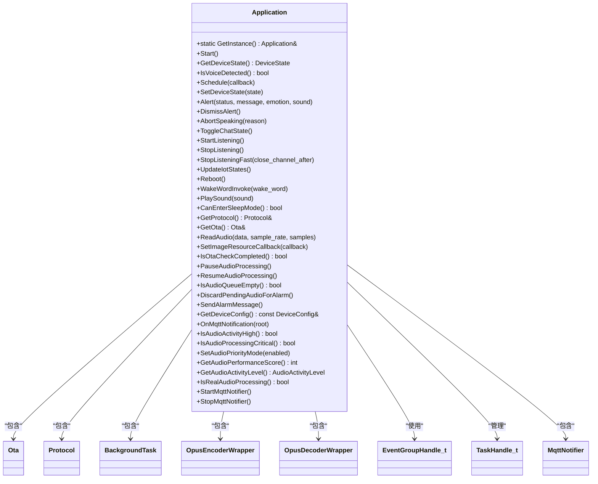
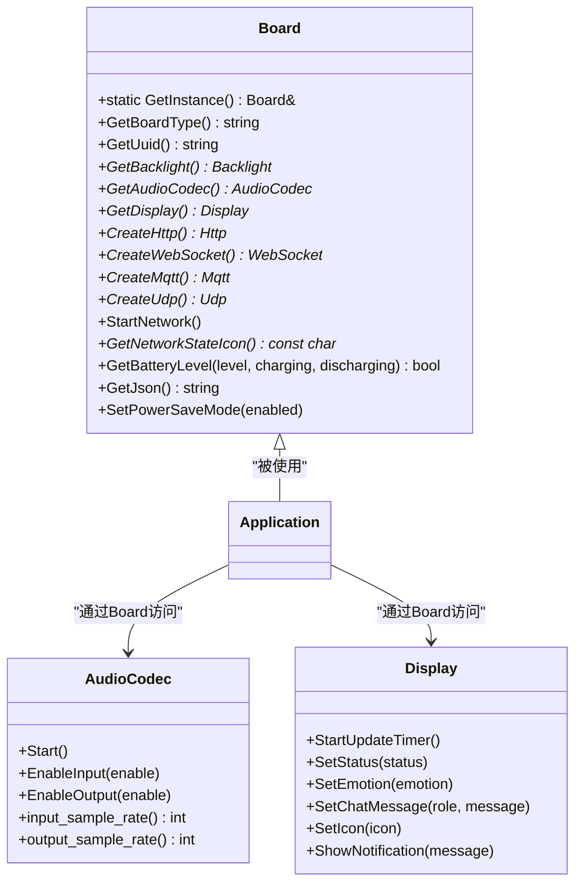
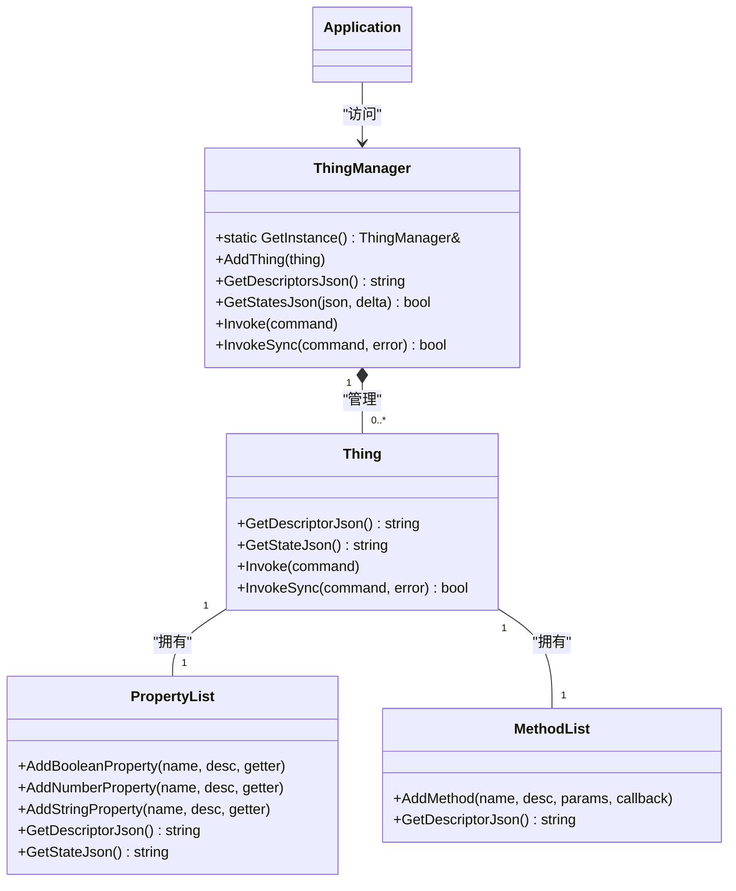
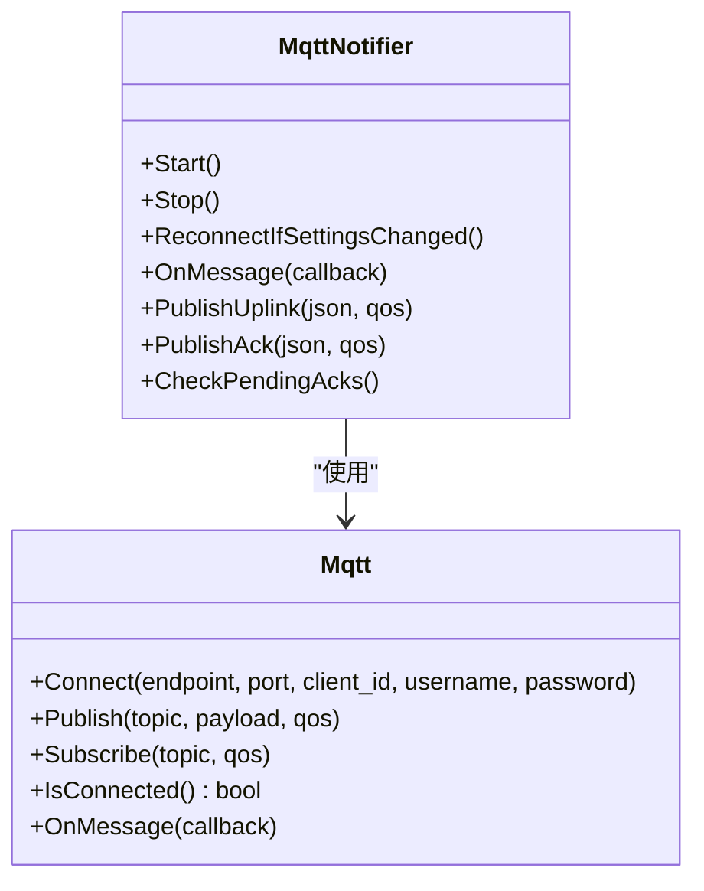

# Application API

<cite>
**本文档引用的文件**  
- [application.h](file://main/application.h) - *新增了StartMqttNotifier和StopMqttNotifier方法*
- [application.cc](file://main/application.cc) - *新增了MQTT通知服务的启动和停止逻辑*
- [board.h](file://main/boards/common/board.h)
- [thing_manager.h](file://main/iot/thing_manager.h)
- [thing.h](file://main/iot/thing.h)
- [mqtt_notifier.h](file://main/notifications/mqtt_notifier.h) - *新增的MQTT通知组件头文件*
- [mqtt_notifier.cc](file://main/notifications/mqtt_notifier.cc) - *新增的MQTT通知组件实现文件*
</cite>

## 更新摘要
**变更内容**   
- 在 **Application类API参考** 部分新增了 `StartMqttNotifier()` 和 `StopMqttNotifier()` 两个核心方法的详细说明
- 在 **调用时机与使用场景** 部分增加了关于省电模式下MQTT服务管理的使用场景描述
- 在 **代码示例** 部分添加了如何在省电模式下控制MQTT通知服务的代码示例
- 更新了 **核心组件分析** 部分的类图，以反映新增的 `MqttNotifier` 组件
- 在 **已弃用API** 部分更新了关于实时聊天模式的说明

## 目录
1. [简介](#简介)
2. [核心组件分析](#核心组件分析)
3. [Application类API参考](#application类api参考)
4. [调用时机与使用场景](#调用时机与使用场景)
5. [代码示例](#代码示例)
6. [线程安全性与上下文要求](#线程安全性与上下文要求)
7. [内存管理责任](#内存管理责任)
8. [已弃用API](#已弃用api)

## 简介
`Application` 类是本项目的核心单例类，负责协调设备的全局状态、网络通信、音频处理、用户界面更新以及物联网设备管理。该类采用单例模式确保在整个系统中仅存在一个实例，提供统一的入口点来控制设备行为。本文档详细记录了 `Application` 类的公共方法、其功能语义、参数说明、返回值类型、调用流程及最佳实践。

**Section sources**
- [application.h](file://main/application.h#L1-L235)

## 核心组件分析

### Application类结构
`Application` 类封装了设备运行所需的关键组件，包括协议栈（Protocol）、OTA升级管理器（Ota）、后台任务处理器（BackgroundTask）、音频编解码器（OpusEncoder/Decoder）和事件组（EventGroup）。它通过 `GetInstance()` 方法提供全局访问点，并通过 `Start()` 方法启动主循环和音频处理任务。**新增了对轻量级MQTT通知服务（MqttNotifier）的支持**，用于在省电模式下管理通知功能。



**Diagram sources**
- [application.h](file://main/application.h#L1-L235)

### Board类接口
`Board` 类是硬件抽象层的基类，通过工厂函数 `create_board()` 创建具体硬件平台的实例。`Application` 通过 `Board::GetInstance()` 获取对当前硬件板的引用，从而访问音频编解码器、显示屏、网络接口等硬件资源。



**Diagram sources**
- [board.h](file://main/boards/common/board.h#L1-L56)

### ThingManager与Thing类
`ThingManager` 是一个单例类，负责管理和协调所有物联网设备对象（`Thing`）。`Application` 通过 `iot::ThingManager::GetInstance()` 获取对设备管理器的引用，以获取设备描述符和状态，并将来自服务器的命令分发给相应的设备。



**Diagram sources**
- [thing_manager.h](file://main/iot/thing_manager.h#L1-L43)
- [thing.h](file://main/iot/thing.h#L1-L301)

### MqttNotifier类
`MqttNotifier` 是一个轻量级的MQTT通知组件，用于在省电模式下管理服务端主动推送的消息。它独立于主通信协议（MQTTProtocol/WebsocketProtocol），可以在主连接关闭时单独运行，以接收系统控制指令（如重启）和通知消息。



**Diagram sources**
- [mqtt_notifier.h](file://main/notifications/mqtt_notifier.h#L1-L100)
- [mqtt_notifier.cc](file://main/notifications/mqtt_notifier.cc#L1-L467)

**Section sources**
- [thing_manager.h](file://main/iot/thing_manager.h#L1-L43)
- [thing.h](file://main/iot/thing.h#L1-L301)
- [mqtt_notifier.h](file://main/notifications/mqtt_notifier.h#L1-L100)
- [mqtt_notifier.cc](file://main/notifications/mqtt_notifier.cc#L1-L467)

## Application类API参考

### get_instance()
**函数签名**:
```cpp
static Application& GetInstance();
```
**参数说明**: 无  
**返回值类型**: `Application&` - 对 `Application` 单例的引用。  
**语义**: 提供对 `Application` 类唯一实例的全局访问点。采用 Meyers' Singleton 模式实现，确保线程安全的延迟初始化。

### init()
**函数签名**:
```cpp
void Start();
```
**参数说明**: 无  
**返回值类型**: `void`  
**语义**: 初始化 `Application` 实例并启动其核心任务。此方法负责创建事件组、初始化后台任务、配置定时器，并启动主循环和音频处理任务。它还负责初始化协议栈（MQTT或WebSocket）、启动网络连接，并启动固件版本检查任务。

### run()
**函数签名**:
```cpp
void MainLoop();
```
**参数说明**: 无  
**返回值类型**: `void`  
**语义**: 这是 `Application` 的主事件循环。它在一个独立的任务中运行，负责处理事件组中的各种事件（如调度任务、音频输入/输出就绪等），并调用相应的处理函数。此方法通常由 `Start()` 内部调用，开发者无需直接调用。

### get_board()
**函数签名**:
```cpp
Board& GetBoard() const; // 此方法在头文件中未直接声明，但可通过 Board::GetInstance() 获取
```
**参数说明**: 无  
**返回值类型**: `Board&` - 对硬件抽象层 `Board` 单例的引用。  
**语义**: 获取对当前硬件平台的引用，以便访问具体的硬件功能，如显示屏、音频编解码器和网络接口。

### get_thing_manager()
**函数签名**:
```cpp
iot::ThingManager& GetThingManager() const; // 此方法在头文件中未直接声明，但可通过 iot::ThingManager::GetInstance() 获取
```
**参数说明**: 无  
**返回值类型**: `iot::ThingManager&` - 对物联网设备管理器单例的引用。  
**语义**: 获取对 `ThingManager` 的引用，用于查询和管理所有注册的物联网设备及其状态。

### StartMqttNotifier()
**函数签名**:
```cpp
void StartMqttNotifier();
```
**参数说明**: 无  
**返回值类型**: `void`  
**语义**: 启动轻量级MQTT通知服务。该服务用于在主连接关闭后，接收来自服务端的推送消息（如系统重启指令、通知等）。它会建立一个独立的MQTT连接，订阅指定的下行主题，并启动心跳和ACK确认监控任务。

### StopMqttNotifier()
**函数签名**:
```cpp
void StopMqttNotifier();
```
**参数说明**: 无  
**返回值类型**: `void`  
**语义**: 停止并清理轻量级MQTT通知服务。该方法会断开MQTT连接，删除相关任务，并清空待确认的消息队列。在设备进入深度省电模式前调用此方法以节省电力。

### 其他核心方法
| 方法名 | 函数签名 | 说明 |
| :--- | :--- | :--- |
| **GetDeviceState** | `DeviceState GetDeviceState() const` | 获取当前设备状态（如 `kDeviceStateIdle`, `kDeviceStateListening`）。 |
| **Schedule** | `void Schedule(std::function<void()> callback)` | 将一个回调函数安排到主任务上下文中执行，确保线程安全。 |
| **SetDeviceState** | `void SetDeviceState(DeviceState state)` | 设置设备的当前状态，并触发相应的UI更新。 |
| **Alert** | `void Alert(const char* status, const char* message, const char* emotion = "", const std::string_view& sound = "")` | 显示一个系统警报，更新状态、表情、消息，并可选择播放提示音。 |
| **PlaySound** | `void PlaySound(const std::string_view& sound)` | 播放一个预编码的P3格式音频片段。 |
| **StartListening** | `void StartListening()` | 启动语音监听流程，通常在用户按下“按住说话”按钮时调用。 |
| **StopListening** | `void StopListening()` | 停止语音监听流程，发送停止消息给服务器。 |
| **StopListeningFast** | `void StopListeningFast(bool close_channel_after = false)` | 快速停止监听，立即切换UI状态，可选择在后台异步关闭音频通道以提高响应速度。 |
| **GetProtocol** | `Protocol& GetProtocol()` | 获取对当前通信协议（MQTT或WebSocket）实例的引用。 |
| **GetOta** | `Ota& GetOta()` | 获取对OTA升级管理器实例的引用。 |
| **SetImageResourceCallback** | `void SetImageResourceCallback(std::function<void()> callback)` | 设置图片资源更新完成后的回调函数。 |
| **IsOtaCheckCompleted** | `bool IsOtaCheckCompleted() const` | 检查OTA版本检查是否已完成，用于协调图片资源下载时机。 |
| **PauseAudioProcessing** | `void PauseAudioProcessing()` | 暂停音频处理，用于在图片下载等高带宽操作时减少音频干扰。 |
| **ResumeAudioProcessing** | `void ResumeAudioProcessing()` | 恢复音频处理，在图片下载完成后调用。 |
| **GetAudioActivityLevel** | `AudioActivityLevel GetAudioActivityLevel() const` | 获取当前音频活动级别（IDLE/STANDBY/ACTIVE/CRITICAL），用于智能资源调度。 |
| **IsAudioActivityHigh** | `bool IsAudioActivityHigh() const` | 检查音频活动是否处于高强度状态。 |
| **IsAudioProcessingCritical** | `bool IsAudioProcessingCritical() const` | 检查音频处理是否处于关键状态（如正在通话）。 |
| **ExecuteLocalIntent** | `void ExecuteLocalIntent(const intent::IntentResult& result)` | 执行本地意图检测结果，如音量调节、亮度控制等。 |
| **DiscardPendingAudioForAlarm** | `void DiscardPendingAudioForAlarm()` | 丢弃待处理的音频数据，用于闹钟触发前的预处理。 |
| **SendAlarmMessage** | `void SendAlarmMessage()` | 发送闹钟触发消息到服务器。 |
| **GetDeviceConfig** | `const DeviceConfig& GetDeviceConfig() const` | 获取设备配置信息，包含MQTT连接参数等。 |

**Section sources**
- [application.h](file://main/application.h#L1-L235)
- [application.cc](file://main/application.cc#L1-L1925)

## 调用时机与使用场景

### init() 的调用流程
`init()` 方法（即 `Start()`）在系统初始化阶段由 `main()` 函数调用。其调用流程如下：
1.  **创建单例实例**: `Application::GetInstance()` 被调用，触发 `Application` 构造函数。
2.  **初始化基础组件**: 在构造函数中，创建 `EventGroup` 和 `BackgroundTask`。
3.  **启动主任务**: `Start()` 方法被调用，创建 `main_loop` 任务（优先级4，Core 0）。
4.  **启动音频任务**: `Start()` 方法创建 `audio_loop` 任务（优先级9，Core 1），负责实时音频处理。
5.  **启动网络**: 调用 `Board::GetInstance().StartNetwork()` 启动Wi-Fi连接。
6.  **初始化协议**: 根据编译配置创建 `MqttProtocol` 或 `WebsocketProtocol` 实例，并设置各种回调函数。
7.  **启动版本检查**: 创建一个独立任务来检查是否有新的固件版本。
8.  **启动MQTT通知服务**: 创建 `MqttNotifier` 实例并调用其 `Start()` 方法，以接收服务端推送。

### 其他方法的使用场景
*   **get_instance()**: 在任何需要与 `Application` 交互的代码中，如UI事件处理、硬件中断服务程序等。
*   **run()**: 由系统内部调用，开发者无需关心。
*   **get_board()**: 当需要直接操作硬件时，例如在自定义功能中直接控制显示屏或音频编解码器。
*   **get_thing_manager()**: 当需要向服务器注册新的物联网设备或查询设备状态时。
*   **StartListening / StopListening**: 在用户界面中，当用户按下和释放“按住说话”按钮时调用。
*   **Alert / PlaySound**: 在发生重要事件（如错误、OTA升级）时，用于向用户发出通知。
*   **StartMqttNotifier / StopMqttNotifier**: 在设备进入或退出省电模式时调用。当设备需要节省电力时，可以关闭主通信连接，但保留 `MqttNotifier` 以接收关键的系统指令（如远程重启）。当设备从省电模式恢复时，再调用 `StartMqttNotifier()` 重新建立通知连接。

**Section sources**
- [application.cc](file://main/application.cc#L400-L600)

## 代码示例

### 获取Application实例并调用核心方法
```cpp
#include "application.h"
#include "board.h"
#include "iot/thing_manager.h"

// 获取Application单例
Application& app = Application::GetInstance();

// 获取当前设备状态
DeviceState state = app.GetDeviceState();
if (state == kDeviceStateIdle) {
    // 设备空闲，可以开始监听
    app.StartListening();
}

// 播放一个提示音
app.PlaySound(Lang::Sounds::P3_SUCCESS);

// 获取硬件板实例以操作显示屏
Board& board = Board::GetInstance();
Display* display = board.GetDisplay();
if (display) {
    display->SetStatus("就绪");
}

// 获取设备管理器以更新IoT状态
iot::ThingManager& thing_manager = iot::ThingManager::GetInstance();
std::string states;
thing_manager.GetStatesJson(states);
app.GetProtocol().SendIotStates(states);
```

### 使用Schedule方法在主任务上下文中执行代码
```cpp
// 假设在一个中断服务程序或高优先级任务中
void SomeHighPriorityTask() {
    // 直接调用UI更新是不安全的，因为UI在主任务中运行
    // display->SetStatus("新状态"); // ❌ 危险！

    // 正确的做法：使用Schedule将任务安排到主任务中执行
    Application::GetInstance().Schedule([]() {
        // 这个lambda函数将在主任务上下文中执行
        auto display = Board::GetInstance().GetDisplay();
        if (display) {
            display->SetStatus("新状态"); // ✅ 安全
        }
    });
}
```

### 省电模式下管理MQTT通知服务
```cpp
// 当设备需要进入省电模式时
void EnterPowerSaveMode() {
    Application& app = Application::GetInstance();
    
    // 1. 停止主通信协议（如果正在运行）
    // app.GetProtocol().CloseAudioChannel(); // 示例操作
    
    // 2. 停止MQTT通知服务以节省电力
    app.StopMqttNotifier();
    
    // 3. 执行其他省电操作...
    // Board::GetInstance().SetPowerSaveMode(true);
}

// 当设备从省电模式恢复时
void ExitPowerSaveMode() {
    Application& app = Application::GetInstance();
    
    // 1. 重新启动MQTT通知服务
    app.StartMqttNotifier();
    
    // 2. 恢复主通信协议...
    // app.GetProtocol().OpenAudioChannel(); // 示例操作
    
    // 3. 执行其他恢复操作...
    // Board::GetInstance().SetPowerSaveMode(false);
}
```

**Section sources**
- [application.h](file://main/application.h#L1-L235)
- [application.cc](file://main/application.cc#L400-L600)
- [mqtt_notifier.h](file://main/notifications/mqtt_notifier.h#L1-L100)
- [mqtt_notifier.cc](file://main/notifications/mqtt_notifier.cc#L1-L467)

## 线程安全性与上下文要求
`Application` 类的设计考虑了多线程环境：
*   **线程安全的方法**: `Schedule()` 方法是线程安全的，可以从任何任务或中断上下文中调用。它使用互斥锁保护任务队列。
*   **主任务上下文要求**: 大多数修改UI状态或核心逻辑的方法（如 `SetDeviceState`, `Alert`, `StartListening`, `StopListening`）**必须**在主任务上下文中调用。直接从其他任务调用可能会导致竞态条件或UI更新异常。应使用 `Schedule()` 方法来确保代码在正确的上下文中执行。
*   **音频任务**: `AudioLoop()` 在一个高优先级、独立的内核上运行，专门处理实时音频数据，以确保低延迟。
*   **MqttNotifier**: `StartMqttNotifier()` 和 `StopMqttNotifier()` 方法设计为线程安全，可以在主任务或其他任务中调用。

**Section sources**
- [application.h](file://main/application.h#L1-L235)
- [application.cc](file://main/application.cc#L400-L600)

## 内存管理责任
`Application` 类遵循清晰的内存管理规则：
*   **对象所有权**: `Application` 类通过 `std::unique_ptr` 拥有其内部组件（如 `protocol_`, `opus_encoder_`, `opus_decoder_`, `notifier_`）。这些对象的生命周期由 `Application` 实例管理，当 `Application` 析构时，它们会自动被销毁。
*   **回调函数**: 通过 `Schedule()` 提交的 `std::function` 回调会被复制并存储在内部队列中。`Application` 负责在执行后销毁这些回调。
*   **音频数据**: `audio_decode_queue_` 中的音频数据由 `Application` 管理。`PlaySound()` 方法会将音频数据复制到该队列中，`Application` 在播放完成后负责清理。
*   **外部对象**: `Application` 不拥有通过 `AddThing()` 添加的 `Thing` 对象，这些对象的内存管理责任由调用者承担。

**Section sources**
- [application.h](file://main/application.h#L1-L235)
- [application.cc](file://main/application.cc#L400-L600)

## 已弃用API
根据当前代码分析，`Application` 类中没有明确标记为已弃用（`[[deprecated]]`）的API。所有公共方法均为当前推荐使用的方法。

然而，代码中存在一些潜在的过时模式：
*   **LED控制**: 代码注释中提到 `// LED功能已移除`，表明之前用于控制LED的API已被移除。
*   **Realtime模式**: 代码中 `realtime_chat_enabled_` 被硬编码为 `false`，并注释 `// 使用auto模式而不是realtime模式`，表明实时聊天模式可能已被弃用或不推荐使用。建议使用自动停止模式（`kListeningModeAutoStop`）或手动停止模式（`kListeningModeManualStop`）。

**Section sources**
- [application.cc](file://main/application.cc#L400-L600)