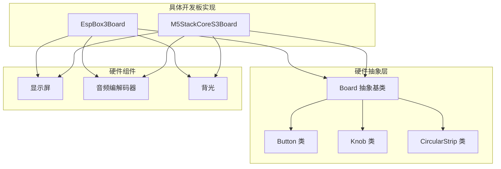
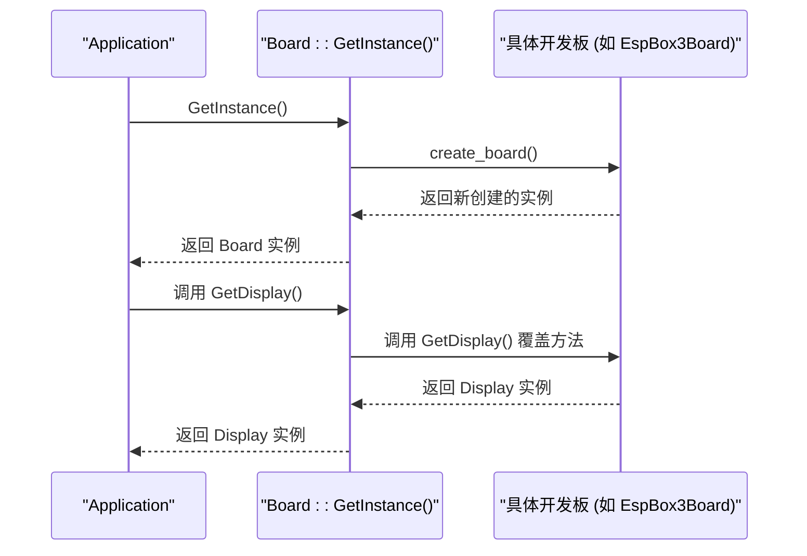
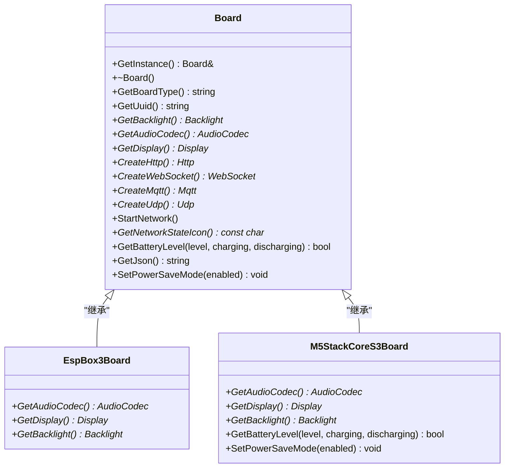
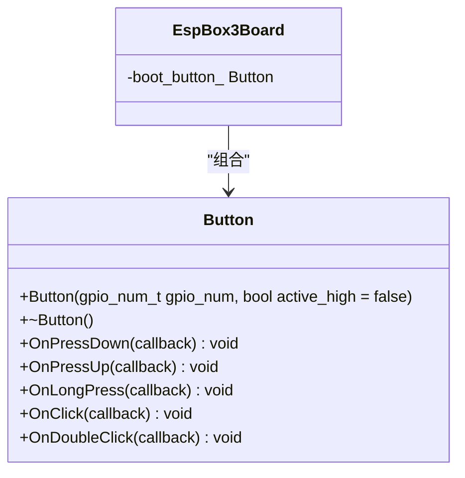
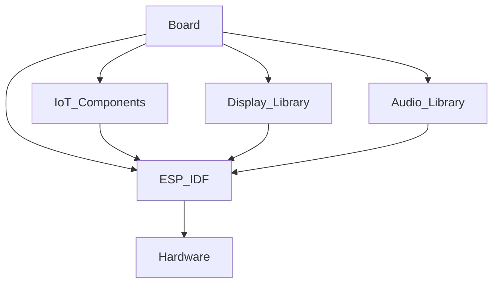

# Board API

<cite>
**本文档中引用的文件**   
- [board.h](file://main/boards/common/board.h)
- [board.cc](file://main/boards/common/board.cc)
- [esp_box_board.cc](file://main/boards/esp-box/esp_box_board.cc)
- [m5stack_core_s3.cc](file://main/boards/m5stack-core-s3/m5stack_core_s3.cc)
- [button.h](file://main/boards/common/button.h)
- [button.cc](file://main/boards/common/button.cc)
- [knob.h](file://main/boards/common/knob.h)
- [knob.cc](file://main/boards/common/knob.cc)
- [circular_strip.h](file://main/led/circular_strip.h)
- [circular_strip.cc](file://main/led/circular_strip.cc)
- [config.h](file://main/boards/esp-box/config.h)
- [config.json](file://main/boards/esp-box/config.json)
</cite>

## 目录
1. [简介](#简介)
2. [项目结构](#项目结构)
3. [核心组件](#核心组件)
4. [架构概述](#架构概述)
5. [详细组件分析](#详细组件分析)
6. [依赖分析](#依赖分析)
7. [性能考虑](#性能考虑)
8. [故障排除指南](#故障排除指南)
9. [结论](#结论)

## 简介
Board API 是一个为嵌入式设备设计的硬件抽象层（HAL），旨在为不同硬件平台提供统一的接口。该API通过抽象基类`Board`定义了一组虚函数接口，允许上层应用以一致的方式访问底层硬件资源，如显示屏、音频编解码器、按钮、旋钮和LED灯带等。通过工厂模式和`DECLARE_BOARD`宏，系统能够在运行时创建特定于开发板的硬件实例，从而实现硬件无关的软件设计。本文档详细描述了`Board`类的接口规范、具体实现方式以及如何在应用中使用这些接口。

## 项目结构
项目结构遵循功能模块化的设计原则，将不同类型的硬件组件和功能分离到独立的目录中。`main/boards/common`目录包含了`Board`抽象基类和通用硬件组件的定义，而具体的开发板实现则位于`main/boards`下的各个子目录中，如`esp-box`和`m5stack-core-s3`。这种结构使得添加新的开发板支持变得简单，只需在相应目录下实现`Board`的派生类并使用`DECLARE_BOARD`宏注册即可。



**图示来源**
- [board.h](file://main/boards/common/board.h)
- [esp_box_board.cc](file://main/boards/esp-box/esp_box_board.cc)
- [m5stack_core_s3.cc](file://main/boards/m5stack-core-s3/m5stack_core_s3.cc)

**本节来源**
- [board.h](file://main/boards/common/board.h)
- [esp_box_board.cc](file://main/boards/esp-box/esp_box_board.cc)

## 核心组件
`Board`类是整个硬件抽象层的核心，它定义了一系列纯虚函数和虚函数，用于访问和控制各种硬件资源。`Board`类采用单例模式，通过`GetInstance()`方法获取全局唯一的实例。`Board`的构造函数负责初始化设备的唯一标识符（UUID），该标识符优先从NVS（非易失性存储）中读取的Client-Id获取，若不存在则生成一个新的UUID并存储在设置中。

**本节来源**
- [board.h](file://main/boards/common/board.h)
- [board.cc](file://main/boards/common/board.cc)

## 架构概述
系统架构采用分层设计，上层应用通过`Board`类的接口与底层硬件交互，而具体的硬件操作由各个开发板的派生类实现。`Application`类作为应用的入口点，通过`Board::GetInstance()`获取`Board`实例，并调用其方法来控制硬件。工厂模式通过`DECLARE_BOARD`宏和`create_board()`函数实现，确保在编译时就能确定具体创建哪个开发板的实例。



**图示来源**
- [board.h](file://main/boards/common/board.h)
- [board.cc](file://main/boards/common/board.cc)
- [esp_box_board.cc](file://main/boards/esp-box/esp_box_board.cc)

## 详细组件分析

### Board 抽象基类分析
`Board`类是一个抽象基类，定义了所有开发板必须实现的接口。它通过纯虚函数强制派生类提供具体实现，同时提供了一些默认实现的虚函数。

#### Board 类图


**图示来源**
- [board.h](file://main/boards/common/board.h)
- [esp_box_board.cc](file://main/boards/esp-box/esp_box_board.cc)
- [m5stack_core_s3.cc](file://main/boards/m5stack-core-s3/m5stack_core_s3.cc)

**本节来源**
- [board.h](file://main/boards/common/board.h)
- [board.cc](file://main/boards/common/board.cc)

### 硬件接口分析

#### 显示屏接口 (get_display)
`GetDisplay()` 是一个虚函数，基类中提供了默认实现，返回一个`NoDisplay`实例。派生类需要重写此方法以返回实际的显示屏实例。

- **参数**: 无
- **返回值**: `Display*` - 指向`Display`对象的指针。如果硬件不支持显示屏，则返回`nullptr`或默认的`NoDisplay`实例。
- **异常情况**: 无显式异常抛出，但返回`nullptr`表示显示屏不可用。

在`EspBox3Board`中，`GetDisplay()`返回一个在构造函数中初始化的`SpiLcdDisplay`实例。

**本节来源**
- [board.h](file://main/boards/common/board.h)
- [board.cc](file://main/boards/common/board.cc)
- [esp_box_board.cc](file://main/boards/esp-box/esp_box_board.cc)

#### 按钮接口 (get_button)
`Board`基类中并未直接提供`GetButton()`方法。按钮功能通过`Button`类实现，具体开发板在初始化时创建`Button`实例并设置回调函数。

- **Button 类接口**:
  - `OnClick(std::function<void()> callback)`: 注册单击回调。
  - `OnDoubleClick(std::function<void()> callback)`: 注册双击回调。
  - `OnLongPress(std::function<void()> callback)`: 注册长按回调。

在`EspBox3Board`中，通过`boot_button_.OnClick()`设置了一个回调，用于在设备启动时重置Wi-Fi配置或切换聊天状态。



**图示来源**
- [button.h](file://main/boards/common/button.h)
- [esp_box_board.cc](file://main/boards/esp-box/esp_box_board.cc)

**本节来源**
- [button.h](file://main/boards/common/button.h)
- [button.cc](file://main/boards/common/button.cc)
- [esp_box_board.cc](file://main/boards/esp-box/esp_box_board.cc)

#### 旋钮接口 (get_knob)
与按钮类似，`Board`基类中没有`GetKnob()`方法。旋钮功能由`Knob`类提供。

- **Knob 类接口**:
  - `Knob(gpio_num_t pin_a, gpio_num_t pin_b)`: 构造函数，指定A相和B相的GPIO引脚。
  - `OnRotate(std::function<void(bool)> callback)`: 注册旋转回调，参数`bool`表示旋转方向（`true`为顺时针）。

**本节来源**
- [knob.h](file://main/boards/common/knob.h)
- [knob.cc](file://main/boards/common/knob.cc)

#### 音频编解码器接口 (get_audio_codec)
`GetAudioCodec()` 是一个纯虚函数，所有派生类都必须实现。

- **参数**: 无
- **返回值**: `AudioCodec*` - 指向`AudioCodec`对象的指针。返回`nullptr`表示音频功能不可用。
- **异常情况**: 无显式异常，但应确保在调用前硬件已正确初始化。

在`EspBox3Board`中，`GetAudioCodec()`返回一个静态的`BoxAudioCodec`实例，该实例在首次调用时被创建和初始化。

**本节来源**
- [board.h](file://main/boards/common/board.h)
- [esp_box_board.cc](file://main/boards/esp-box/esp_box_board.cc)

#### LED灯带接口 (get_led_strip)
`Board`基类中没有直接的`GetLedStrip()`方法。LED灯带由`CircularStrip`类管理。

- **CircularStrip 类接口**:
  - `CircularStrip(gpio_num_t gpio, uint8_t max_leds)`: 构造函数。
  - `SetAllColor(StripColor color)`: 设置所有LED的颜色。
  - `SetSingleColor(uint8_t index, StripColor color)`: 设置单个LED的颜色。
  - `Blink(StripColor color, int interval_ms)`: 让LED灯带闪烁。

在`kevin-c3`开发板中，`LedStripControl`类使用`CircularStrip`来实现对LED灯带的物联网控制。

**本节来源**
- [circular_strip.h](file://main/led/circular_strip.h)
- [circular_strip.cc](file://main/led/circular_strip.cc)

### 工厂模式与实例创建
`DECLARE_BOARD`宏是实现工厂模式的关键。它定义了一个全局的`create_board()`函数，该函数返回一个新创建的指定开发板类的实例。`Board::GetInstance()`通过调用这个函数来获取具体实例。

```cpp
#define DECLARE_BOARD(BOARD_CLASS_NAME) \
void* create_board() { \
    return new BOARD_CLASS_NAME(); \
}
```

当编译`esp_box_board.cc`时，`DECLARE_BOARD(EspBox3Board)`会展开为：
```cpp
void* create_board() {
    return new EspBox3Board();
}
```
这确保了`Board::GetInstance()`总是返回一个`EspBox3Board`实例。

**本节来源**
- [board.h](file://main/boards/common/board.h)
- [esp_box_board.cc](file://main/boards/esp-box/esp_box_board.cc)

### 代码示例
以下示例展示了如何通过`Application`获取`Board`实例并调用其硬件控制方法：

```cpp
#include "application.h"
#include "board.h"

int main() {
    auto& app = Application::GetInstance();
    auto& board = Board::GetInstance(); // 获取Board单例

    // 获取并使用显示屏
    auto* display = board.GetDisplay();
    if (display) {
        display->ShowText("Hello World");
    }

    // 获取并使用音频编解码器
    auto* audio_codec = board.GetAudioCodec();
    if (audio_codec) {
        audio_codec->StartPlayback();
    }

    // 获取设备信息
    std::string uuid = board.GetUuid();
    ESP_LOGI("Main", "Device UUID: %s", uuid.c_str());

    return 0;
}
```

**本节来源**
- [application.h](file://main/application.h)
- [board.h](file://main/boards/common/board.h)

### 不同开发板的实现差异
不同的开发板对`Board`接口的实现存在显著差异：

- **esp-box**: 使用`ili9341`驱动的SPI显示屏，通过I2C总线连接音频编解码器。背光由PWM控制。
- **m5stack-core-s3**: 同样使用`ili9341`兼容的显示屏，但通过`AXP2101`电源管理芯片（PMIC）来控制背光亮度。它还实现了`GetBatteryLevel()`方法来报告电池状态，并通过`PowerSaveTimer`实现省电模式。

这些差异通过各自的`config.h`和`config.json`文件进行配置，例如`DISPLAY_WIDTH`、`AUDIO_I2S_GPIO_BCLK`等宏定义。

**本节来源**
- [esp_box_board.cc](file://main/boards/esp-box/esp_box_board.cc)
- [m5stack_core_s3.cc](file://main/boards/m5stack-core-s3/m5stack_core_s3.cc)
- [config.h](file://main/boards/esp-box/config.h)

### 硬件配置文件的影响
硬件配置文件（`config.h`和`config.json`）通过C/C++宏定义和JSON配置，深刻影响着`Board`的行为。例如：
- `BOARD_NAME`宏定义了开发板的型号，影响`GetBoardType()`的返回值。
- `DISPLAY_WIDTH`和`DISPLAY_HEIGHT`决定了显示屏的分辨率。
- `AUDIO_INPUT_SAMPLE_RATE`设置了音频输入的采样率。

这些配置使得同一套代码可以在不同硬件上编译运行，只需更改相应的配置文件即可。

**本节来源**
- [config.h](file://main/boards/esp-box/config.h)
- [config.json](file://main/boards/esp-box/config.json)

## 依赖分析
`Board`类及其派生类依赖于多个外部组件和库：
- **ESP-IDF**: 提供了I2C、SPI、GPIO、定时器等底层驱动。
- **IoT组件**: `iot_button`、`iot_knob`等用于封装按钮和旋钮的逻辑。
- **显示库**: `esp_lcd_ili9341`用于驱动特定型号的LCD。
- **音频库**: `box_audio_codec`等用于处理音频输入输出。



**图示来源**
- [board.h](file://main/boards/common/board.h)
- [esp_box_board.cc](file://main/boards/esp-box/esp_box_board.cc)

**本节来源**
- [board.h](file://main/boards/common/board.h)
- [esp_box_board.cc](file://main/boards/esp-box/esp_box_board.cc)

## 性能考虑
- **单例模式**: `Board::GetInstance()`确保了全局只有一个实例，避免了重复创建和资源浪费。
- **静态实例**: 在`GetAudioCodec()`等方法中使用`static`变量，确保硬件资源只初始化一次。
- **延迟初始化**: 某些资源（如显示屏）在`Board`构造函数中初始化，确保在应用启动时就绪。

## 故障排除指南
- **问题**: `GetDisplay()`返回`nullptr`。
  **解决**: 检查`config.h`中的`DISPLAY_WIDTH`等宏是否正确定义，确认显示屏的SPI引脚配置是否正确。
- **问题**: 按钮无响应。
  **解决**: 检查GPIO引脚号是否正确，确认按钮的`active_high`参数与硬件设计匹配。
- **问题**: UUID每次重启都变化。
  **解决**: 确保NVS分区已正确初始化，并且`SystemInfo::GetClientId()`能正确读取存储的Client-Id。

**本节来源**
- [board.cc](file://main/boards/common/board.cc)
- [button.cc](file://main/boards/common/button.cc)

## 结论
Board API 通过精心设计的抽象基类和工厂模式，成功地将上层应用与底层硬件解耦。开发者可以专注于应用逻辑的开发，而无需关心具体硬件的细节。通过分析`esp-box`和`m5stack-core-s3`等具体实现，可以看出该架构具有良好的扩展性和灵活性，能够轻松支持新的开发板。合理使用配置文件和模块化设计是该系统成功的关键。