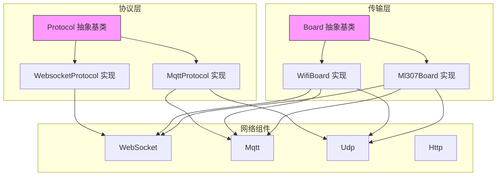
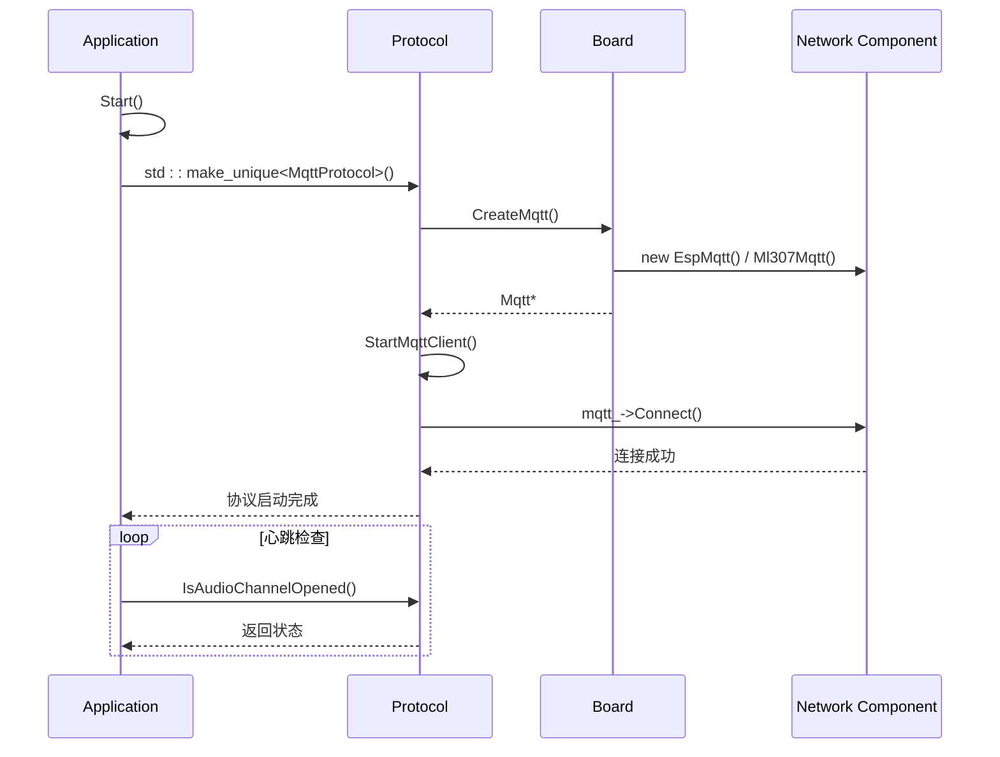
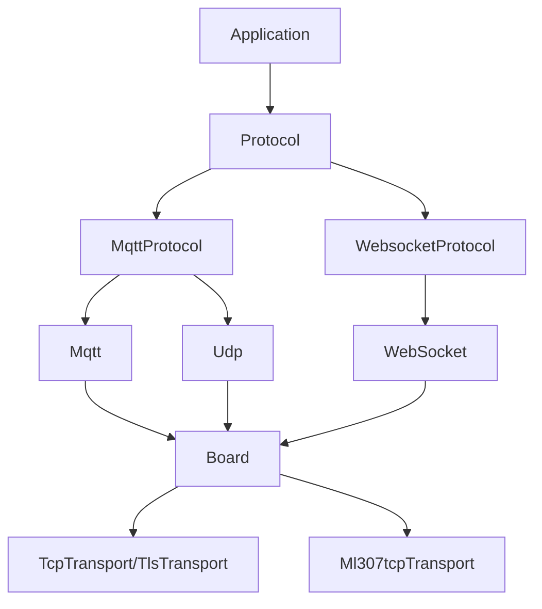

# 协议API

<cite>
**本文档中引用的文件**   
- [protocol.h](file://main/protocols/protocol.h)
- [protocol.cc](file://main/protocols/protocol.cc)
- [mqtt_protocol.h](file://main/protocols/mqtt_protocol.h)
- [mqtt_protocol.cc](file://main/protocols/mqtt_protocol.cc)
- [websocket_protocol.h](file://main/protocols/websocket_protocol.h)
- [application.cc](file://main/application.cc)
- [application.h](file://main/application.h)
- [board.h](file://main/boards/common/board.h)
- [wifi_board.cc](file://main/boards/common/wifi_board.cc)
- [ml307_board.cc](file://main/boards/common/ml307_board.cc)
- [mqtt_error_recovery_config.h](file://main/notifications/mqtt_error_recovery_config.h)
- [mqtt_error_recovery_config.cc](file://main/notifications/mqtt_error_recovery_config.cc)
- [mqtt_publish_manager.cc](file://main/notifications/mqtt_publish_manager.cc)
</cite>

## 目录
1. [引言](#引言)
2. [项目结构](#项目结构)
3. [核心组件](#核心组件)
4. [架构概述](#架构概述)
5. [详细组件分析](#详细组件分析)
6. [依赖分析](#依赖分析)
7. [性能考虑](#性能考虑)
8. [故障排除指南](#故障排除指南)
9. [结论](#结论)

## 引言
本文档旨在全面记录和说明`xiaozhi-esp32`项目中的通用协议接口（Protocol API）及其具体实现。该系统设计用于在嵌入式设备上处理与服务器的通信，支持多种通信协议，并提供了一套统一的接口来管理连接、发送和接收数据。文档将详细阐述`Protocol`抽象基类的接口规范、`WebSocketProtocol`和`MQTTProtocol`的具体实现、事件回调机制、协议选择与故障转移策略、连接配置、重连机制以及如何扩展以支持新的通信协议。

## 项目结构
`xiaozhi-esp32`项目是一个基于ESP32平台的复杂嵌入式应用，其结构清晰地划分为多个功能模块。核心的协议实现位于`main/protocols/`目录下，而与硬件相关的网络传输层则分散在`main/boards/common/`目录中。这种分层设计使得协议逻辑与底层硬件解耦，提高了代码的可维护性和可移植性。



**图示来源**
- [protocol.h](file://main/protocols/protocol.h)
- [websocket_protocol.h](file://main/protocols/websocket_protocol.h)
- [mqtt_protocol.h](file://main/protocols/mqtt_protocol.h)
- [board.h](file://main/boards/common/board.h)
- [wifi_board.cc](file://main/boards/common/wifi_board.cc)
- [ml307_board.cc](file://main/boards/common/ml307_board.cc)

**本节来源**
- [main/protocols/](file://main/protocols/)
- [main/boards/common/](file://main/boards/common/)

## 核心组件
本系统的核心组件是`Protocol`抽象基类，它定义了所有通信协议必须遵循的统一接口。通过继承此基类，可以实现不同的具体协议（如MQTT或WebSocket），而上层应用（如`Application`）则可以透明地使用这些协议，无需关心底层细节。这种设计模式极大地增强了系统的灵活性和可扩展性。

**本节来源**
- [protocol.h](file://main/protocols/protocol.h)
- [application.h](file://main/application.h)

## 架构概述
整个通信架构采用分层设计。最上层是`Application`，它负责业务逻辑和用户交互。`Application`通过`std::unique_ptr<Protocol>`持有具体的协议实例。`Protocol`的实现（如`MqttProtocol`）则依赖于`Board`单例来获取底层的网络组件（如`Mqtt`、`Udp`）。`Board`的具体实现（如`WifiBoard`）负责创建这些网络组件，并根据硬件平台选择合适的传输层（TCP或TLS）。这种依赖关系确保了协议逻辑与硬件平台的分离。



**图示来源**
- [application.cc](file://main/application.cc#L426-L460)
- [protocol.h](file://main/protocols/protocol.h)
- [mqtt_protocol.cc](file://main/protocols/mqtt_protocol.cc#L50-L85)
- [board.h](file://main/boards/common/board.h)
- [wifi_board.cc](file://main/boards/common/wifi_board.cc#L170-L175)

## 详细组件分析
### Protocol抽象基类分析
`Protocol`类是一个纯虚基类，定义了所有通信协议必须实现的核心方法和可选的回调机制。它为上层应用提供了统一的API。

#### 核心方法接口规范
`Protocol`类定义了以下纯虚方法，所有子类都必须实现：

```mermaid
classDiagram
class Protocol {
<<abstract>>
+server_sample_rate() int
+server_frame_duration() int
+session_id() string
+OnIncomingAudio(callback) void
+OnIncomingJson(callback) void
+OnAudioChannelOpened(callback) void
+OnAudioChannelClosed(callback) void
+OnNetworkError(callback) void
+Start() void*
+OpenAudioChannel() bool*
+CloseAudioChannel() void*
+IsAudioChannelOpened() bool*
+SendAudio(data) void*
+SendText(text) bool*
}
note right of Protocol
* : 必须由子类实现的纯虚方法
: 提供默认实现的虚方法
end note
```

**图示来源**
- [protocol.h](file://main/protocols/protocol.h#L0-L79)

**本节来源**
- [protocol.h](file://main/protocols/protocol.h)

**关键方法说明**:
- **connect**: 通过`Start()`方法启动连接。该方法是异步的，具体的连接逻辑由子类实现。
- **disconnect**: 通过`CloseAudioChannel()`方法关闭连接。此方法会主动断开与服务器的连接。
- **send**: 通过`SendText()`和`SendAudio()`方法发送数据。`SendText()`用于发送JSON文本消息，`SendAudio()`用于发送音频数据。
- **receive**: 通过`OnIncomingAudio()`和`OnIncomingJson()`回调接收数据。当有新的音频数据或JSON消息到达时，协议层会调用这些回调。

#### 协议事件回调机制
`Protocol`类提供了灵活的回调机制，允许上层应用注册函数来响应特定事件：

- **on_connected**: 通过`OnAudioChannelOpened()`回调实现。当音频通道成功打开时触发。
- **on_message_received**: 通过`OnIncomingJson()`和`OnIncomingAudio()`回调实现。当接收到JSON消息或音频数据时触发。
- **on_disconnected**: 通过`OnAudioChannelClosed()`回调实现。当音频通道关闭时触发。
- **on_error**: 通过`OnNetworkError()`回调实现。当发生网络错误时触发。

这些回调在`application.cc`中被注册，例如：
```cpp
protocol_->OnNetworkError([this](const std::string& message) {
    SetDeviceState(kDeviceStateIdle);
    Alert(Lang::Strings::ERROR, message.c_str(), "sad", Lang::Sounds::P3_EXCLAMATION);
});
```

### MQTTProtocol具体实现分析
`MqttProtocol`是`Protocol`的一个具体实现，它使用MQTT协议进行信令通信，并使用UDP协议进行音频数据传输。

#### 配置选项
`MqttProtocol`的连接参数主要通过`Application`的`DeviceConfig`获取，包括：
- **endpoint**: MQTT服务器地址和端口 (e.g., `x6bf310e.ala.cn-hangzhou.emqxsl.cn:8883`)
- **client_id**: 客户端ID
- **username**: 用户名
- **password**: 密码
- **publish_topic**: 发布消息的主题

这些配置在`application.cc`中从NVS存储读取：
```cpp
Settings mqtt_settings("mqtt", false);
std::string endpoint = mqtt_settings.GetString("endpoint", "default_host");
device_config_.mqtt_username = mqtt_settings.GetString("username", "default_user");
```

#### 实现细节
`MqttProtocol`的`Start()`方法首先创建`Mqtt`客户端实例，然后设置消息回调。当收到类型为`hello`的JSON消息时，会解析服务器的问候信息并触发`OnAudioChannelOpened`回调。

```mermaid
flowchart TD
A[Start()] --> B[CreateMqtt()]
B --> C[Set KeepAlive]
C --> D[Set OnDisconnected Callback]
D --> E[Set OnMessage Callback]
E --> F[Connect to endpoint]
F --> G{连接成功?}
G --> |是| H[返回 true]
G --> |否| I[SetError, 返回 false]
```

**图示来源**
- [mqtt_protocol.cc](file://main/protocols/mqtt_protocol.cc#L50-L85)

**本节来源**
- [mqtt_protocol.h](file://main/protocols/mqtt_protocol.h)
- [mqtt_protocol.cc](file://main/protocols/mqtt_protocol.cc)

### WebSocketProtocol具体实现分析
`WebsocketProtocol`是`Protocol`的另一个具体实现，它使用WebSocket协议进行全双工通信。与`MqttProtocol`不同，它不需要额外的UDP通道来传输音频，所有数据（信令和音频）都通过同一个WebSocket连接传输。

#### 配置选项
其连接URL从OTA配置中动态获取，可以是`ws://`（非加密）或`wss://`（加密）。

#### 实现细节
`WebsocketProtocol`的`Start()`方法会创建一个`WebSocket`实例，并根据URL的协议选择`TcpTransport`或`TlsTransport`作为底层传输。其`SendAudio()`和`SendText()`方法都通过`websocket_->Send()`发送数据。

### 协议选择策略和故障转移机制
系统通过编译时宏`CONFIG_CONNECTION_TYPE_WEBSOCKET`来决定使用哪种协议。在`application.cc`中，代码使用`#ifdef`指令进行选择：

```cpp
#ifdef CONFIG_CONNECTION_TYPE_WEBSOCKET
    protocol_ = std::make_unique<WebsocketProtocol>();
#else
    protocol_ = std::make_unique<MqttProtocol>();
#endif
```

这是一种静态的协议选择策略，设备在编译时就确定了使用的协议。目前的代码中没有实现运行时的动态故障转移（例如，当MQTT连接失败时自动切换到WebSocket）。故障转移主要体现在连接恢复上，而不是协议切换。

## 依赖分析
系统组件之间的依赖关系清晰。`Application`依赖于`Protocol`，`Protocol`的实现依赖于`Board`，而`Board`的实现则依赖于具体的网络组件。这种单向依赖确保了模块的独立性。



**图示来源**
- [application.h](file://main/application.h)
- [protocol.h](file://main/protocols/protocol.h)
- [board.h](file://main/boards/common/board.h)

**本节来源**
- [application.h](file://main/application.h)
- [protocol.h](file://main/protocols/protocol.h)
- [board.h](file://main/boards/common/board.h)

## 性能考虑
- **超时机制**: `Protocol`基类实现了`IsTimeout()`方法，如果120秒内没有收到任何数据，则认为连接超时。这可以防止设备在连接中断时无限期等待。
- **重连策略**: `MqttPublishManager`和`MqttMusicHandler`实现了重连机制。`MqttErrorRecoveryConfig`允许配置最大重试次数和重试延迟，支持递增延迟策略，避免在网络不稳定时频繁重试。
- **资源管理**: `HandleProtocolTimeout()`方法在超时时会主动关闭音频通道、清理音频队列、重置编码器/解码器状态，确保系统资源得到释放。

## 故障排除指南
### 常见问题
1.  **连接失败**: 检查`mqtt`设置中的`endpoint`、`username`和`password`是否正确。确认设备网络连接正常。
2.  **音频通道无法打开**: 检查服务器是否返回了`hello`消息。确认`publish_topic`配置正确。
3.  **协议超时**: 检查网络连接是否稳定，服务器是否正常响应。

### 错误处理
系统通过`OnNetworkError()`回调进行错误处理。当发生错误时，`Application`会将设备状态设置为`idle`并显示错误提示。错误信息会通过`SetError()`方法设置。

**本节来源**
- [protocol.cc](file://main/protocols/protocol.cc#L115-L135)
- [application.cc](file://main/application.cc#L810-L842)
- [mqtt_error_recovery_config.h](file://main/notifications/mqtt_error_recovery_config.h)

## 结论
`Protocol API`的设计体现了良好的面向对象原则和分层架构思想。通过`Protocol`基类，系统实现了通信协议的抽象化，使得添加新的协议实现变得简单。虽然当前的协议选择是静态的，但其模块化的设计为未来实现动态故障转移奠定了基础。系统的重连和超时机制确保了在复杂网络环境下的稳定性。要扩展支持新的通信协议，只需创建一个新的类继承`Protocol`，实现所有纯虚方法，并在`application.cc`中通过编译宏将其纳入构建流程即可。