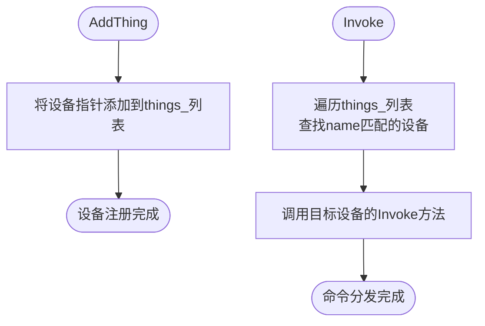

# Thing API

<cite>
**本文档中引用的文件**  
- [thing.h](file://main/iot/thing.h)
- [thing.cc](file://main/iot/thing.cc)
- [thing_manager.h](file://main/iot/thing_manager.h)
- [thing_manager.cc](file://main/iot/thing_manager.cc)
- [lamp.cc](file://main/iot/things/lamp.cc)
- [AlarmClock.h](file://main/AlarmClock/AlarmClock.h)
- [AlarmClock.cc](file://main/AlarmClock/AlarmClock.cc)
- [README.md](file://main/iot/README.md)
</cite>

## 目录
1. [简介](#简介)
2. [项目结构](#项目结构)
3. [核心组件](#核心组件)
4. [架构概述](#架构概述)
5. [详细组件分析](#详细组件分析)
6. [依赖分析](#依赖分析)
7. [性能考虑](#性能考虑)
8. [故障排除指南](#故障排除指南)
9. [结论](#结论)

## 简介
本文档提供了Thing基类及物联网设备管理API的完整参考。该系统设计用于在ESP32平台上实现物联网设备的统一管理，通过语音指令与AI服务器交互，实现对各种硬件设备的远程控制。系统采用面向对象的设计模式，允许开发者通过继承Thing基类来创建自定义的物联网设备，并通过ThingManager进行集中注册和管理。核心功能包括设备属性定义、方法调用、状态同步和事件通知机制。

## 项目结构
物联网设备管理模块位于`main/iot`目录下，其核心组件包括Thing基类、ThingManager管理器以及预定义的设备实现。系统采用分层架构，将设备抽象、状态管理、命令分发等功能分离。


**图示来源**  
- [thing.h](file://main/iot/thing.h)
- [thing_manager.h](file://main/iot/thing_manager.h)
- [lamp.cc](file://main/iot/things/lamp.cc)
- [AlarmClock.h](file://main/AlarmClock/AlarmClock.h)

**本节来源**  
- [thing.h](file://main/iot/thing.h)
- [thing_manager.h](file://main/iot/thing_manager.h)

## 核心组件
系统的核心由Thing基类和ThingManager管理器构成。Thing基类定义了所有物联网设备的通用接口和行为，包括属性管理、方法调用和状态序列化。ThingManager作为单例模式的管理器，负责设备的注册、查找、状态收集和命令分发。设备通过继承Thing基类并实现其构造函数来定义自身的属性和可执行方法。系统支持通过DECLARE_THING宏自动注册通用设备类型，或在板级初始化时直接创建特定设备实例。

**本节来源**  
- [thing.h](file://main/iot/thing.h#L258-L300)
- [thing_manager.h](file://main/iot/thing_manager.h#L15-L20)

## 架构概述
系统采用分层架构，将设备抽象、状态管理、命令分发等功能分离。用户通过语音与AI服务器交互，AI服务器解析意图后生成JSON格式的控制命令，通过MQTT或WebSocket协议发送给ESP32设备。ThingManager接收命令并分发给对应的Thing实例执行。设备状态通过轮询或事件驱动的方式同步回AI服务器，形成闭环控制。


**图示来源**  
- [thing_manager.cc](file://main/iot/thing_manager.cc#L50-L55)
- [thing.cc](file://main/iot/thing.cc#L60-L80)

## 详细组件分析
### Thing基类分析
Thing基类是所有物联网设备的抽象基类，定义了设备的生命周期和交互接口。它通过protected成员`properties_`和`methods_`分别管理设备的可查询状态和可执行操作。

#### 属性与方法管理


**图示来源**  
- [thing.h](file://main/iot/thing.h#L15-L250)

**本节来源**  
- [thing.h](file://main/iot/thing.h#L15-L250)
- [thing.cc](file://main/iot/thing.cc#L30-L50)

### ThingManager分析
ThingManager是物联网设备的中央管理器，采用单例模式实现，负责所有设备的生命周期管理。

#### 设备注册与命令分发


**图示来源**  
- [thing_manager.cc](file://main/iot/thing_manager.cc#L10-L20)
- [thing_manager.cc](file://main/iot/thing_manager.cc#L50-L55)

**本节来源**  
- [thing_manager.h](file://main/iot/thing_manager.h#L15-L40)
- [thing_manager.cc](file://main/iot/thing_manager.cc#L10-L60)

### 自定义设备实现分析
#### Lamp设备示例
Lamp类展示了如何继承Thing基类创建一个简单的物联网设备。它通过GPIO控制LED的开关状态，并定义了相应的属性和方法。

```cpp
class Lamp : public Thing {
private:
    gpio_num_t gpio_num_ = GPIO_NUM_18;
    bool power_ = false;

    void InitializeGpio() {
        // GPIO初始化代码
    }

public:
    Lamp() : Thing("Lamp", "一个测试用的灯") {
        InitializeGpio();

        // 定义属性
        properties_.AddBooleanProperty("power", "灯是否打开", [this]() -> bool {
            return power_;
        });

        // 定义方法
        methods_.AddMethod("TurnOn", "打开灯", ParameterList(), [this](const ParameterList& parameters) {
            power_ = true;
            gpio_set_level(gpio_num_, 1);
        });

        methods_.AddMethod("TurnOff", "关闭灯", ParameterList(), [this](const ParameterList& parameters) {
            power_ = false;
            gpio_set_level(gpio_num_, 0);
        });
    }
};
```

**本节来源**  
- [lamp.cc](file://main/iot/things/lamp.cc#L10-L50)

#### AlarmClock设备示例
AlarmClock类实现了一个复杂的闹钟设备，展示了如何在Thing基类中集成定时器和持久化存储。

```cpp
class AlarmManager {
public:
    void SetAlarm(int second_from_now, std::string alarm_name);
    void CancelAlarm(std::string alarm_name);
    std::string GetAlarmsStatus();
    void OnAlarm();

private:
    std::vector<Alarm> alarms_;
    std::mutex mutex_;
    esp_timer_handle_t timer_;
    std::atomic<bool> ring_flag{false};
};

// 在AlarmClock.cc中，AlarmManager与Thing基类结合使用
```

**本节来源**  
- [AlarmClock.h](file://main/AlarmClock/AlarmClock.h#L10-L50)
- [AlarmClock.cc](file://main/AlarmClock/AlarmClock.cc#L100-L200)

### DECLARE_THING宏分析
DECLARE_THING宏提供了一种便捷的设备类型注册机制，它在编译时生成设备创建函数和注册代码。

```cpp
#define DECLARE_THING(TypeName) \
    static iot::Thing* Create##TypeName() { \
        return new iot::TypeName(); \
    } \
    static bool Register##TypeNameHelper = []() { \
        RegisterThing(#TypeName, Create##TypeName); \
        return true; \
    }();
```

该宏展开后会创建一个设备创建函数和一个静态变量，该变量的初始化会调用`RegisterThing`函数将设备类型注册到全局映射表中。

**本节来源**  
- [thing.h](file://main/iot/thing.h#L290-L300)
- [thing.cc](file://main/iot/thing.cc#L5-L15)

## 依赖分析
系统内部组件之间存在明确的依赖关系。ThingManager依赖于Thing基类接口来管理设备，而具体的设备实现则依赖于硬件抽象层（如board.h、gpio.h）来控制物理设备。系统通过回调函数和lambda表达式实现松耦合，设备方法的执行逻辑被封装在回调中，与命令分发机制分离。

```mermaid
graph LR
ThingManager --> Thing
Thing --> PropertyList
Thing --> MethodList
Lamp --> GPIO
AlarmClock --> Timer
AlarmClock --> Settings
Thing --> Application : "调度"
```

**图示来源**  
- [thing_manager.h](file://main/iot/thing_manager.h#L10)
- [thing.h](file://main/iot/thing.h#L10)
- [lamp.cc](file://main/iot/things/lamp.cc#L5)
- [AlarmClock.cc](file://main/AlarmClock/AlarmClock.cc#L5)

**本节来源**  
- [thing_manager.h](file://main/iot/thing_manager.h)
- [thing.h](file://main/iot/thing.h)
- [lamp.cc](file://main/iot/things/lamp.cc)
- [AlarmClock.cc](file://main/AlarmClock/AlarmClock.cc)

## 性能考虑
系统在设计时考虑了嵌入式环境的资源限制。状态同步支持增量更新模式（delta=true），只返回发生变化的设备状态，减少网络传输开销。命令执行采用异步调度机制，通过Application::Schedule将方法调用放入事件队列，避免阻塞主线程。对于频繁查询的属性，建议在getter函数中实现适当的缓存策略，避免重复的硬件读取操作。多线程访问通过std::mutex进行保护，如AlarmClock中的互斥锁，确保数据一致性。

## 故障排除指南
常见问题包括设备未正确注册、命令执行失败和状态不同步。检查设备是否已通过AddThing或CreateThing正确添加到ThingManager。验证JSON命令格式是否正确，特别是name、method和parameters字段。对于异步执行的方法，确保Application事件循环正常运行。调试时可启用ESP_LOG日志输出，查看Thing::Invoke和ThingManager::Invoke中的错误信息。对于定时器相关的设备，检查定时器回调是否正确设置，并确认系统时间已正确同步。

**本节来源**  
- [thing.cc](file://main/iot/thing.cc#L60-L80)
- [thing_manager.cc](file://main/iot/thing_manager.cc#L50-L55)
- [AlarmClock.cc](file://main/AlarmClock/AlarmClock.cc#L150-L200)

## 结论
Thing API提供了一套完整且灵活的物联网设备管理框架。通过Thing基类和ThingManager的组合，系统实现了设备抽象、集中管理和远程控制的核心功能。开发者可以轻松地通过继承Thing基类来创建新的设备类型，并利用DECLARE_THING宏实现自动注册。该设计模式不仅提高了代码的可重用性，还为AI驱动的语音控制提供了标准化的接口。未来可扩展方向包括支持更多属性类型、增强安全性机制和优化状态同步算法。