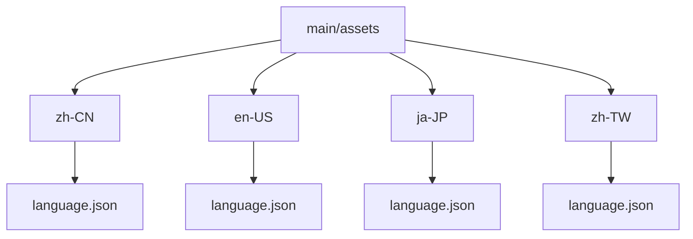
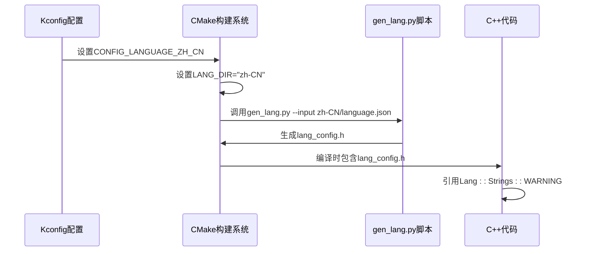

# 多语言支持

<cite>
**本文档中引用的文件**
- [gen_lang.py](file://scripts/gen_lang.py#L1-L91)
- [CMakeLists.txt](file://main/CMakeLists.txt#L198-L256)
- [lang_config.h](file://main/assets/lang_config.h#L1-L220)
- [zh-CN/language.json](file://main/assets/zh-CN/language.json#L1-L50)
- [en-US/language.json](file://main/assets/en-US/language.json#L1-L50)
- [ja-JP/language.json](file://main/assets/ja-JP/language.json#L1-L50)
- [zh-TW/language.json](file://main/assets/zh-TW/language.json#L1-L50)
</cite>

## 目录
1. [多语言支持](#多语言支持)
2. [语言资源组织结构](#语言资源组织结构)
3. [语言键值对设计原则](#语言键值对设计原则)
4. [语言切换流程](#语言切换流程)
5. [语言资源自动化生成](#语言资源自动化生成)
6. [添加新语言的完整步骤](#添加新语言的完整步骤)
7. [UI中语言文本的使用方式](#ui中语言文本的使用方式)
8. [语言资源优化建议](#语言资源优化建议)

## 语言资源组织结构

项目中的多语言支持通过在 `main/assets` 目录下按区域设置（locale）组织语言资源文件来实现。每个语言都有一个独立的子目录，如 `zh-CN`、`en-US`、`ja-JP` 和 `zh-TW`，每个子目录中包含一个 `language.json` 文件，用于存储该语言的字符串翻译。

这种组织方式具有以下优点：
- **清晰的结构**：每种语言的资源独立存放，便于管理和维护。
- **易于扩展**：添加新语言只需创建新的语言目录并翻译对应的 JSON 文件。
- **构建时选择**：通过构建系统（CMake）根据配置选择对应的语言资源。



**Diagram sources**
- [zh-CN/language.json](file://main/assets/zh-CN/language.json#L1-L50)
- [en-US/language.json](file://main/assets/en-US/language.json#L1-L50)
- [ja-JP/language.json](file://main/assets/ja-JP/language.json#L1-L50)
- [zh-TW/language.json](file://main/assets/zh-TW/language.json#L1-L50)

**Section sources**
- [zh-CN/language.json](file://main/assets/zh-CN/language.json#L1-L50)
- [en-US/language.json](file://main/assets/en-US/language.json#L1-L50)

## 语言键值对设计原则

语言资源文件 `language.json` 采用标准的 JSON 格式，包含两个主要部分：`language` 元数据和 `strings` 字符串映射。

### 文件结构
```json
{
    "language": {
        "type": "zh-CN"
    },
    "strings": {
        "WARNING": "警告",
        "INFO": "信息",
        "ERROR": "错误"
    }
}
```

### 命名规范
- **键名（Key）**：全部使用大写字母和下划线，采用描述性命名，如 `WIFI_CONFIG_MODE`、`BATTERY_LOW`。
- **值（Value）**：存储对应语言的翻译文本，支持中文、英文、日文等字符。
- **一致性**：所有语言文件的键名保持完全一致，确保多语言切换时的正确映射。

### 设计原则
1. **语义化命名**：键名应清晰表达其用途，便于开发者理解。
2. **避免硬编码**：所有用户界面文本都应通过键名引用，而非直接写入代码。
3. **支持动态内容**：对于包含变量的文本（如 "新版本 {version}"），应在翻译时预留占位符。

**Section sources**
- [zh-CN/language.json](file://main/assets/zh-CN/language.json#L1-L50)
- [en-US/language.json](file://main/assets/en-US/language.json#L1-L50)

## 语言切换流程

语言切换流程在项目构建阶段完成，而非运行时动态切换。系统根据 Kconfig 配置在编译时选择对应的语言资源，并生成 C++ 头文件供代码引用。

### 切换机制
1. **配置选择**：通过 Kconfig 选项（如 `CONFIG_LANGUAGE_ZH_CN`）确定目标语言。
2. **资源定位**：CMake 根据配置设置 `LANG_DIR` 变量，指向相应的语言目录。
3. **头文件生成**：调用 `gen_lang.py` 脚本，将 `language.json` 转换为 `lang_config.h`。
4. **代码引用**：C++ 代码通过 `Lang::Strings` 命名空间访问翻译文本。



**Diagram sources**
- [CMakeLists.txt](file://main/CMakeLists.txt#L198-L256)
- [gen_lang.py](file://scripts/gen_lang.py#L1-L91)

**Section sources**
- [CMakeLists.txt](file://main/CMakeLists.txt#L198-L256)
- [gen_lang.py](file://scripts/gen_lang.py#L1-L91)

## 语言资源自动化生成

`scripts/gen_lang.py` 脚本负责将 JSON 格式的语言资源转换为 C++ 头文件，实现语言资源的自动化生成。

### 脚本功能
- **输入**：指定的 `language.json` 文件路径。
- **输出**：生成 `lang_config.h` 头文件，包含所有字符串常量和音效资源声明。
- **处理流程**：
  1. 读取 JSON 文件并验证结构。
  2. 提取字符串资源，转换为 `constexpr const char*` 常量。
  3. 扫描目录中的 `.p3` 音效文件，生成外部符号声明。
  4. 使用模板填充生成最终的头文件。

### 生成的头文件结构
生成的 `lang_config.h` 文件定义了 `Lang` 命名空间，包含：
- `CODE`：当前语言代码（如 "zh-CN"）。
- `Strings` 子命名空间：所有字符串常量。
- `Sounds` 子命名空间：音效资源的二进制视图。

```cpp
namespace Lang {
    constexpr const char* CODE = "zh-CN";
    namespace Strings {
        constexpr const char* WARNING = "警告";
        constexpr const char* INFO = "信息";
    }
    namespace Sounds {
        static const std::string_view P3_WELCOME { ... };
    }
}
```

**Section sources**
- [gen_lang.py](file://scripts/gen_lang.py#L1-L91)
- [lang_config.h](file://main/assets/lang_config.h#L1-L220)

## 添加新语言的完整步骤

要为项目添加新的语言支持（如法语 `fr-FR`），需遵循以下步骤：

### 1. 创建语言目录
在 `main/assets` 下创建新的语言目录：
```bash
mkdir main/assets/fr-FR
```

### 2. 创建语言文件
在新目录中创建 `language.json` 文件，结构如下：
```json
{
    "language": {
        "type": "fr-FR"
    },
    "strings": {
        "WARNING": "Avertissement",
        "INFO": "Information",
        "ERROR": "Erreur",
        "WIFI_CONFIG_MODE": "Mode de configuration Wi-Fi"
    }
}
```

### 3. 翻译所有键值
参考现有语言文件，将所有字符串键翻译为目标语言。

### 4. 更新构建配置
修改 `CMakeLists.txt` 或 Kconfig 文件，添加对新语言的支持选项：
```cmake
if(CONFIG_LANGUAGE_FR_FR)
    set(LANG_DIR "fr-FR")
endif()
```

### 5. 构建验证
重新构建项目，确保 `gen_lang.py` 能正确生成 `lang_config.h`。

**Section sources**
- [gen_lang.py](file://scripts/gen_lang.py#L1-L91)
- [CMakeLists.txt](file://main/CMakeLists.txt#L198-L256)

## UI中语言文本的使用方式

虽然在当前代码库中未找到直接引用 `Lang::Strings` 的 UI 代码示例，但根据生成的 `lang_config.h` 结构，其使用方式应如下：

### C++代码中的引用
```cpp
#include "assets/lang_config.h"

// 在UI代码中使用语言文本
void showWarning() {
    const char* warningText = Lang::Strings::WARNING;
    // 更新UI控件的文本
    label->setText(warningText);
}

void displayBatteryStatus(bool isLow) {
    if (isLow) {
        const char* batteryText = Lang::Strings::BATTERY_LOW;
        display->showMessage(batteryText);
    }
}
```

### 动态文本拼接
对于需要变量的文本，可结合 `sprintf` 或字符串流：
```cpp
char buffer[64];
sprintf(buffer, "%s%s", Lang::Strings::NEW_VERSION, currentVersion);
display->showMessage(buffer);
```

**Section sources**
- [lang_config.h](file://main/assets/lang_config.h#L1-L220)

## 语言资源优化建议

为了提高多语言支持的效率和可维护性，建议采取以下优化措施：

### 1. 减少冗余字符串
- **合并相似文本**：如 "正在充电" 和 "电量已满" 可通过状态变量动态生成。
- **使用模板**：对于模式固定的文本（如 "连接 {device}"），使用占位符减少重复。

### 2. 支持动态文本拼接
引入简单的模板引擎或格式化函数，支持运行时变量替换：
```cpp
// 改进前：需要多个键
Lang::Strings::CONNECTING_TO_WIFI
Lang::Strings::CONNECTING_TO_SERVER

// 改进后：使用模板
Lang::Strings::CONNECTING_TO_X
formatString(Lang::Strings::CONNECTING_TO_X, "Wi-Fi");
```

### 3. 自动化翻译同步
- **脚本验证**：编写脚本检查所有语言文件是否包含相同的键集。
- **缺失检测**：构建时检查是否有未翻译的键，防止遗漏。

### 4. 音效资源管理
`gen_lang.py` 已支持自动扫描 `.p3` 音效文件，建议：
- 将音效文件按语言分类存放。
- 使用统一的命名规范，便于脚本处理。

### 5. 构建优化
- **增量生成**：仅在 `language.json` 文件更改时重新生成 `lang_config.h`。
- **缓存机制**：避免重复解析和生成。

**Section sources**
- [gen_lang.py](file://scripts/gen_lang.py#L1-L91)
- [lang_config.h](file://main/assets/lang_config.h#L1-L220)