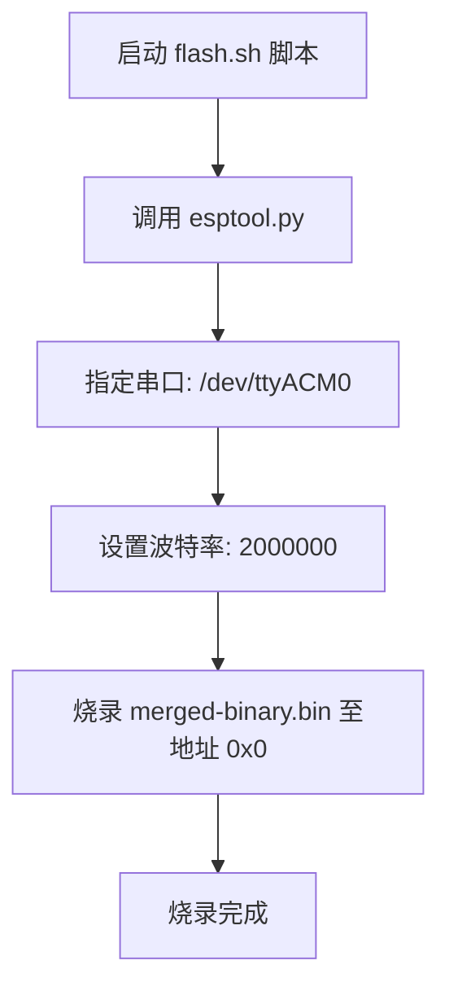
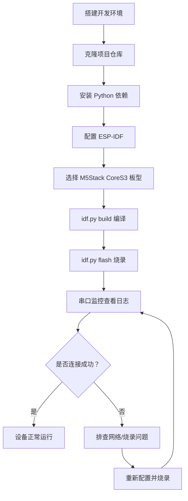

# 快速入门

<cite>
**本文档中引用的文件**   
- [README.md](file://README.md)
- [requirements.txt](file://requirements.txt)
- [CMakeLists.txt](file://CMakeLists.txt)
- [main/CMakeLists.txt](file://main/CMakeLists.txt)
- [scripts/flash.sh](file://scripts/flash.sh)
- [main/boards/m5stack-core-s3/config.h](file://main/boards/m5stack-core-s3/config.h)
- [main/boards/m5stack-core-s3/m5stack_core_s3.cc](file://main/boards/m5stack-core-s3/m5stack_core_s3.cc)
- [main/boards/common/board.h](file://main/boards/common/board.h)
- [main/application.cc](file://main/application.cc)
</cite>

## 目录
1. [开发环境搭建](#开发环境搭建)
2. [项目配置与编译](#项目配置与编译)
3. [烧录与自动化流程](#烧录与自动化流程)
4. [首次运行验证](#首次运行验证)
5. [常见问题排查](#常见问题排查)
6. [实例演示：M5Stack CoreS3](#实例演示m5stack-cores3)

## 开发环境搭建

### ESP-IDF 开发框架安装与配置

本项目基于乐鑫 ESP-IDF 框架开发，需安装 ESP-IDF SDK 版本 5.3 或以上。推荐使用 Linux 系统进行开发，因其编译速度快且避免了 Windows 下的驱动问题。

安装步骤如下：
1. 下载并安装 ESP-IDF 工具链（IDF Tools）。
2. 使用 `idf.py` 命令行工具设置目标芯片型号，例如 `idf.py set-target esp32s3`。
3. 配置环境变量 `IDF_PATH` 指向 ESP-IDF 安装路径。

推荐使用 VSCode 或 Cursor 编辑器，并安装官方 ESP-IDF 插件以获得更好的开发体验。

**Section sources**
- [README.md](file://README.md#L25-L30)

### Python 依赖包安装

项目依赖若干 Python 包用于构建和脚本执行。这些依赖定义在项目根目录的 `requirements.txt` 文件中。

```txt
PySide6>=6.5.0
requests>=2.28.0
pyserial>=3.5
PyMySQL>=1.0.2
bcrypt>=4.0.1
configparser>=5.3.0
```

安装命令：
```bash
pip install -r requirements.txt
```

其中：
- `PySide6`：用于图形界面工具
- `requests` 和 `pyserial`：用于网络请求和串口通信
- `PyMySQL`、`bcrypt`、`configparser`：用于用户管理系统

**Section sources**
- [requirements.txt](file://requirements.txt#L1-L17)

### 编译工具链设置

确保已正确安装 `esptool.py`，它是烧录 ESP32 系列芯片的核心工具。通常通过 ESP-IDF 自动安装。

验证安装：
```bash
esptool.py --version
```

若未安装，请通过 pip 安装：
```bash
pip install esptool
```

## 项目配置与编译

### 项目配置（idf.py menuconfig）

使用 `idf.py menuconfig` 命令进入图形化配置界面，可对项目进行精细化配置。

主要配置项包括：
- **板型选择**：在 `Board Configuration` 中选择目标开发板，如 `M5Stack CoreS3`。
- **连接方式**：选择 WebSocket 或 UDP 协议。
- **语言设置**：支持中文（简体/繁体）、英文、日文等。
- **音频处理**：启用离线唤醒词检测或声纹识别功能。
- **分区表**：根据开发板 Flash 大小选择合适的分区表（如 8MB 板卡需使用 `partitions_8M.csv`）。

配置完成后，保存为 `sdkconfig` 文件。

**Section sources**
- [main/CMakeLists.txt](file://main/CMakeLists.txt#L50-L190)

### 选择目标开发板

通过 Kconfig 配置系统选择目标开发板类型。每种开发板对应一个唯一的 `CONFIG_BOARD_TYPE_xxx` 宏定义。

例如，选择 M5Stack CoreS3 开发板：
```bash
idf.py menuconfig
# 在 Board Configuration -> Board Type 中选择 M5Stack CoreS3
```

该选择将决定编译时包含哪些板级驱动文件（如显示屏、音频编解码器等）。

**Section sources**
- [main/CMakeLists.txt](file://main/CMakeLists.txt#L50-L190)

### 执行编译（idf.py build）

编译命令：
```bash
idf.py build
```

此命令会：
1. 根据 `CMakeLists.txt` 和 `sdkconfig` 生成构建配置。
2. 编译所有源文件（位于 `main/` 目录下）。
3. 嵌入资源文件（如语言包、音频文件）。
4. 生成最终的固件镜像（`build/xiaozhi.bin`）。

项目顶层 `CMakeLists.txt` 设置了项目版本号（当前为 1.2.4），并引入 ESP-IDF 构建系统。

```cmake
set(PROJECT_VER "1.2.4")
include($ENV{IDF_PATH}/tools/cmake/project.cmake)
project(xiaozhi)
```

**Section sources**
- [CMakeLists.txt](file://CMakeLists.txt#L1-L15)
- [main/CMakeLists.txt](file://main/CMakeLists.txt#L1-L257)

## 烧录与自动化流程

### 手动烧录（idf.py flash）

烧录命令：
```bash
idf.py flash
```

此命令将自动调用 `esptool.py` 将固件烧录至开发板。默认串口为 `/dev/ttyACM0`（Linux）或 `COMx`（Windows）。

对于某些开发板（如 SenseCAP Watcher），烧录前需特别注意不要擦除设备信息分区（EUI 等），建议先备份：
```bash
esptool.py --chip esp32s3 --baud 2000000 read_flash 0x9000 204800 nvsfactory.bin
```

**Section sources**
- [main/boards/sensecap-watcher/README.md](file://main/boards/sensecap-watcher/README.md#L20-L33)

### 自动化烧录流程（scripts/flash.sh）

项目提供 `scripts/flash.sh` 脚本用于自动化烧录：

```bash
#!/bin/sh
esptool.py -p /dev/ttyACM0 -b 2000000 write_flash 0 ../releases/v0.9.9_bread-compact-wifi/merged-binary.bin
```

该脚本直接调用 `esptool.py`，指定串口端口、波特率和固件路径。适用于无需重新编译的快速部署场景。

**Diagram sources**
- [scripts/flash.sh](file://scripts/flash.sh#L1-L3)



**Diagram sources**
- [scripts/flash.sh](file://scripts/flash.sh#L1-L3)

## 首次运行验证

### 串口日志查看

烧录完成后，使用串口监控工具查看日志输出：
```bash
idf.py monitor
```

关键日志信息包括：
- **Client-Id 加载**：验证设备唯一标识是否正确加载
  ```
  I SystemInfo: Client-Id loaded from NVS: abc123def456
  ```
- **Wi-Fi 连接状态**：确认网络连接成功
  ```
  I WifiStation: Connected to AP, IP: 192.168.1.100
  ```
- **协议初始化**：WebSocket 连接建立
  ```
  I WS: Using Client-Id for WebSocket connection: abc123def456
  ```

**Section sources**
- [main/image_manager.cc](file://main/image_manager.cc#L466-L508)

### 设备启动自检

设备启动时会执行以下自检流程：
1. 初始化硬件外设（显示屏、音频、按钮）
2. 从 NVS 加载 Client-Id
3. 连接 Wi-Fi 网络
4. 检查服务器资源（Logo、动态表情）
5. 播放启动提示音

若任一环节失败，日志中会有相应错误提示（如 `无法连接到logo服务器`）。

**Section sources**
- [main/boards/moon/abrobot-1.28tft-wifi.cc](file://main/boards/moon/abrobot-1.28tft-wifi.cc#L2179-L2207)

### 网络连接状态确认

通过以下方式确认网络连接：
- **串口日志**：观察 `Connected to AP` 提示
- **设备行为**：成功连接后会播放提示音并显示 IP 地址
- **服务器端**：登录 [xiaozhi.me](https://xiaozhi.me) 控制台查看设备在线状态

**Section sources**
- [main/boards/common/wifi_board.cc](file://main/boards/common/wifi_board.cc#L49-L84)

## 常见问题排查

### 烧录失败

可能原因及解决方案：
- **串口权限问题（Linux）**：使用 `sudo` 或添加用户到 `dialout` 组
- **开发板未进入下载模式**：按住 `BOOT` 键再按 `RESET` 键
- **芯片型号不匹配**：确保 `idf.py set-target` 正确设置
- **固件分区错误**：参考开发板文档选择正确的分区表

特别注意：对于 SenseCAP Watcher 等设备，错误擦除 `0x9000` 分区可能导致永久性损坏。

**Section sources**
- [main/boards/sensecap-watcher/README.md](file://main/boards/sensecap-watcher/README.md#L20-L33)

### 串口无输出

可能原因：
- **串口线故障**：更换 USB 线缆
- **开发板未正常启动**：检查电源和复位电路
- **波特率不匹配**：尝试 115200、921600、2000000 等常见波特率
- **ESP-Spot 特殊情况**：需打开前盖并按住 BOOT 键插回 PCB 板

**Section sources**
- [main/boards/esp-spot-s3/README.md](file://main/boards/esp-spot-s3/README.md#L49-L57)

### Wi-Fi 连接超时

可能原因：
- **SSID/密码错误**：通过声波配网或 Web 配网重新设置
- **信号弱**：靠近路由器重试
- **DHCP 失败**：检查路由器是否满载
- **固件配置错误**：确认 `sdkconfig` 中 Wi-Fi 配置正确

日志中会出现 `无法接入网络，请检查流量卡状态` 或 `等待网络...` 等提示。

**Section sources**
- [main/assets/zh-CN/language.json](file://main/assets/zh-CN/language.json#L1-L40)

## 实例演示：M5Stack CoreS3

以 M5Stack CoreS3 开发板为例，演示完整工作流。

### 开发板配置文件分析

`main/boards/m5stack-core-s3/config.h` 定义了硬件引脚配置：

```c
// 音频配置
#define AUDIO_INPUT_SAMPLE_RATE  24000
#define AUDIO_OUTPUT_SAMPLE_RATE 24000
#define AUDIO_I2S_GPIO_MCLK GPIO_NUM_10
#define AUDIO_I2S_GPIO_WS   GPIO_NUM_12
#define AUDIO_I2S_GPIO_BCLK GPIO_NUM_8
#define AUDIO_I2S_GPIO_DIN  GPIO_NUM_7
#define AUDIO_I2S_GPIO_DOUT GPIO_NUM_11

// 显示屏配置
#define DISPLAY_WIDTH   320
#define DISPLAY_HEIGHT  240
#define DISPLAY_SPI_SCK_PIN     GPIO_NUM_3
#define DISPLAY_SPI_MOSI_PIN    GPIO_NUM_5
#define DISPLAY_DC_PIN          GPIO_NUM_6
#define DISPLAY_SPI_CS_PIN      GPIO_NUM_4
```

**Section sources**
- [main/boards/m5stack-core-s3/config.h](file://main/boards/m5stack-core-s3/config.h#L1-L46)

### 完整工作流



**Diagram sources**
- [main/boards/m5stack-core-s3/README.md](file://main/boards/m5stack-core-s3/README.md#L26-L30)
- [README.md](file://README.md#L25-L30)