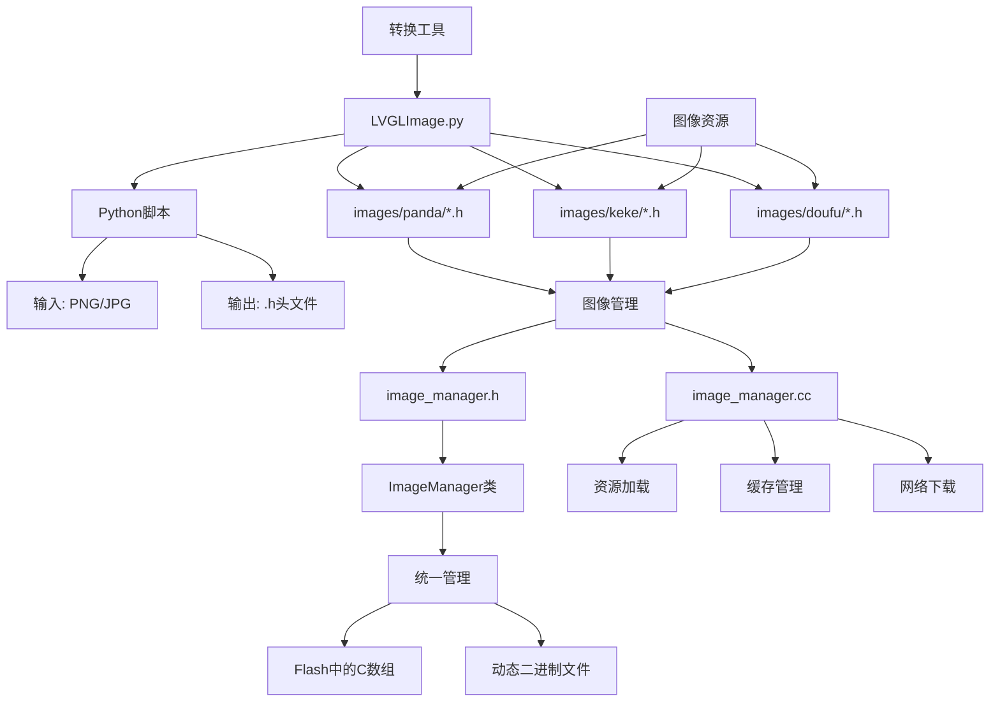
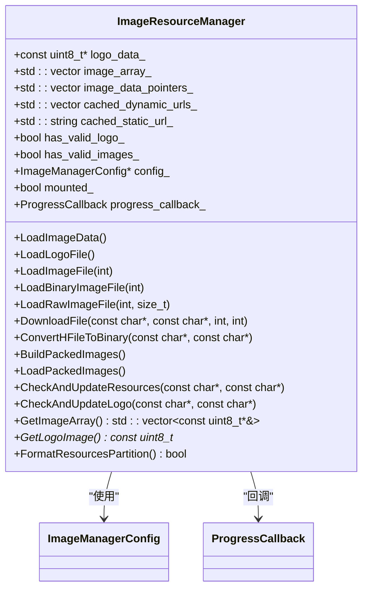
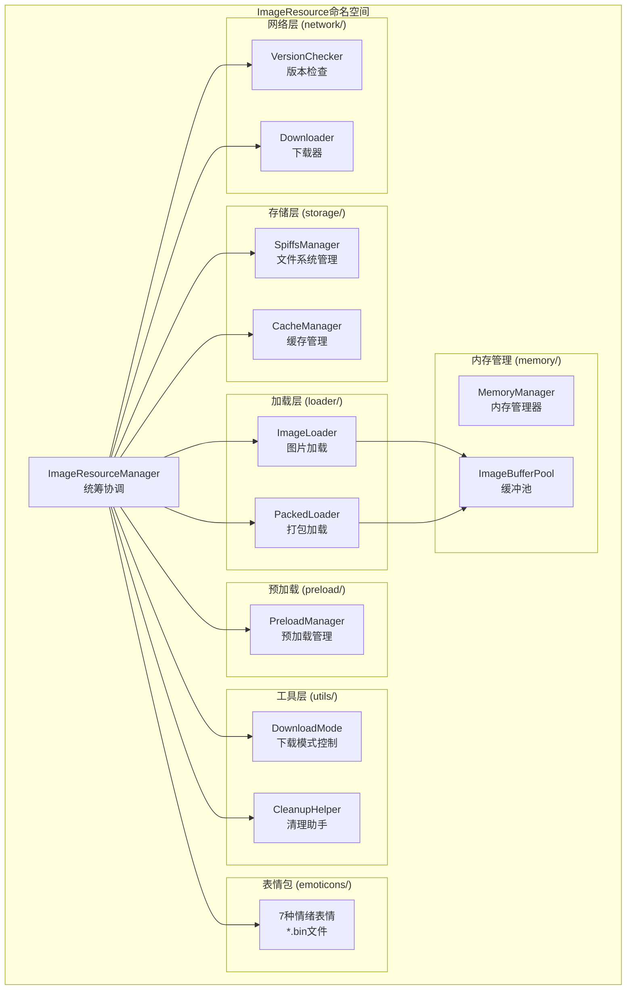
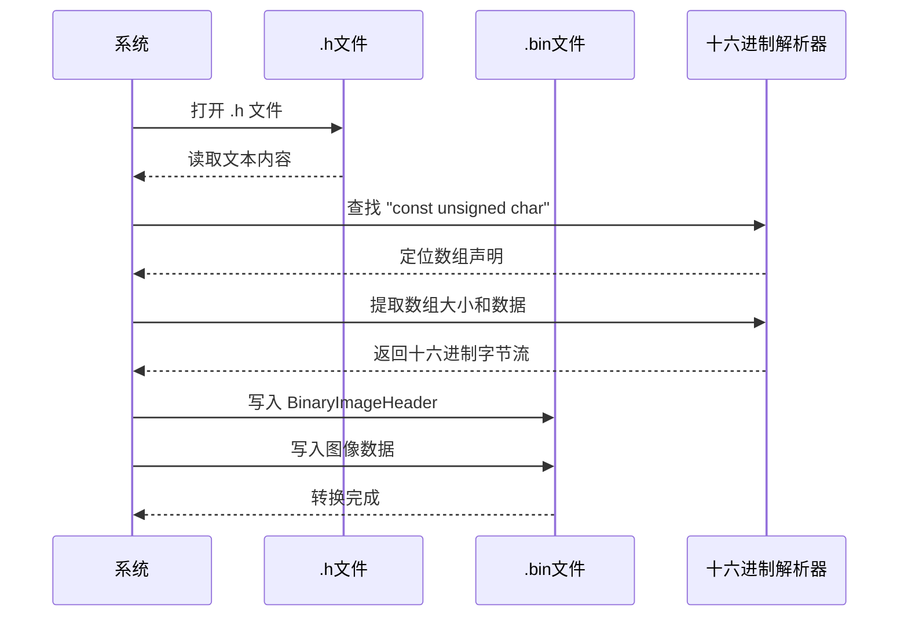

# 图像管理

<cite>
**本文档引用文件**  
- [main/image_manager.h](file://main/image_manager.h)
- [main/image_manager.cc](file://main/image_manager.cc)
- [scripts/Image_Converter/LVGLImage.py](file://scripts/Image_Converter/LVGLImage.py)
- [main/images/doufu/output_0001.h](file://main/images/doufu/output_0001.h)
- [main/images/keke/gImage_keke_0001.h](file://main/images/keke/gImage_keke_0001.h)
- [main/config/resource_config.h](file://main/config/resource_config.h)
- [main/display/lcd_display.h](file://main/display/lcd_display.h)
</cite>

## 更新摘要
**已做更改**  
- 在“项目结构”和“图像加载与缓存策略”部分新增了SPIFFS文件系统重置功能的说明
- 更新了“核心组件分析”中的类图，以反映新增的 `FormatResourcesPartition` 方法
- 修改了“图像加载流程”流程图，体现格式化失败处理逻辑
- 增加了关于SPIFFS空间不足时自动重置机制的详细描述
- 更新了相关源码引用，标注了最近提交中修改的代码段

### 目录
1. [项目结构](#项目结构)  
2. [核心组件分析](#核心组件分析)  
3. [图像资源生成流程](#图像资源生成流程)  
4. [图像加载与缓存策略](#图像加载与缓存策略)  
5. [多帧动画播放控制](#多帧动画播放控制)  
6. [内存优化建议](#内存优化建议)  
7. [结论](#结论)

## 项目结构

项目采用模块化分层架构，核心图像管理功能位于 `main/image_manager.h` 和 `main/image_manager.cc` 文件中。图像资源存储在 `main/images/` 目录下，按动画序列（如 `doufu`、`keke`）组织为多个 `.h` 头文件。图像转换工具 `LVGLImage.py` 位于 `scripts/Image_Converter/` 目录，负责将 PNG/JPG 转换为 C 数组格式。



**图示来源**  
- [main/images/doufu/output_0001.h](file://main/images/doufu/output_0001.h)
- [scripts/Image_Converter/LVGLImage.py](file://scripts/Image_Converter/LVGLImage.py)
- [main/image_manager.h](file://main/image_manager.h)
- [main/image_manager.cc](file://main/image_manager.cc)

## 核心组件分析

### ImageManager 类设计

`ImageManager` 类（在 `image_manager.h` 中定义）是图像资源管理的核心，采用单例模式实现，负责统一加载、缓存和提供图像数据。该类新增了SPIFFS分区强制格式化功能，用于应对磁盘空间不足的情况。



**图示来源**  
- [main/image_manager.h](file://main/image_manager.h#L15-L80)
- [main/image_manager.cc](file://main/image_manager.cc#L25-L100)

**本节来源**  
- [main/image_manager.h](file://main/image_manager.h#L1-L100)
- [main/image_manager.cc](file://main/image_manager.cc#L1-L150)

### ImageResource命名空间模块化架构

在v1.2.4版本中，图像资源管理系统进行了模块化重构，将原本庞大的单体类拆分为多个专职模块，提高了代码的可维护性和可测试性。所有模块都位于`ImageResource`命名空间下。

#### 模块组织结构



#### 各模块职责说明

| 模块名称 | 位置 | 主要职责 |
|:--------|:-----|:---------|
| **VersionChecker** | `network/version_checker.h` | 向服务器查询资源版本，比对本地版本决定是否需要更新 |
| **Downloader** | `network/downloader.h` | 执行HTTP下载任务，支持进度回调和错误重试 |
| **SpiffsManager** | `storage/spiffs_manager.h` | 管理SPIFFS文件系统的挂载、格式化和空间监控 |
| **CacheManager** | `storage/cache_manager.h` | 管理URL缓存和版本信息的持久化存储 |
| **ImageLoader** | `loader/image_loader.h` | 从SPIFFS加载单个图片文件，支持多种格式 |
| **PackedLoader** | `loader/packed_loader.h` | 加载打包的图片资源文件，提升启动速度 |
| **PreloadManager** | `preload/preload_manager.h` | 后台异步预加载剩余图片，不阻塞主线程 |
| **DownloadMode** | `utils/download_mode.h` | 控制下载模式，协调音频处理和网络带宽 |
| **CleanupHelper** | `utils/cleanup_helper.h` | 清理过期资源和临时文件 |

**Section sources**
- [image_resource/network/version_checker.h](file://main/image_resource/network/version_checker.h)
- [image_resource/storage/spiffs_manager.h](file://main/image_resource/storage/spiffs_manager.h)
- [image_resource/loader/image_loader.h](file://main/image_resource/loader/image_loader.h)

### 图像加载流程

图像加载优先级为：打包二进制文件 > 单个二进制文件 > 原始 RGB 数据 > .h 头文件。系统启动时调用 `LoadImageData()` 方法，优先尝试从 `PACKED_FILE_PATH` 一次性加载所有动画帧，以提升启动速度。当检测到SPIFFS空间不足或文件系统损坏时，会触发自动重置流程。

```mermaid
flowchart TD
Start([启动加载]) --> CheckPacked{"是否存在打包文件?"}
CheckPacked --> |是| LoadPacked[LoadPackedImages()]
CheckPacked --> |否| CheckBin{"是否存在.bin文件?"}
CheckBin --> |是| LoadBin[LoadBinaryImageFile(1)]
CheckBin --> |否| CheckRaw{"是否为标准RGB565尺寸?"}
CheckRaw --> |是| LoadRaw[LoadRawImageFile()]
CheckRaw --> |否| LoadH[LoadImageFile() 解析.h]
LoadPacked --> Success[加载成功]
LoadBin --> Success
LoadRaw --> Success
LoadH --> Success
Success --> CheckSpace{"检查SPIFFS空间"}
CheckSpace --> |不足| ResetSPIFFS[FormatResourcesPartition()]
ResetSPIFFS --> Reboot[重启系统]
```

**图示来源**  
- [main/image_manager.cc](file://main/image_manager.cc#L1600-L1800)
- [main/image_manager.cc](file://main/image_manager.cc#L2200-L2400)
- [main/image_manager.cc](file://main/image_manager.cc#L3700-L3800) - *新增：SPIFFS重置逻辑*

**本节来源**  
- [main/image_manager.cc](file://main/image_manager.cc#L1500-L2500)

## 图像资源生成流程

### 转换工具 LVGLImage.py

`scripts/Image_Converter/LVGLImage.py` 是一个 Python 脚本，用于将 PNG/JPG 图像转换为 C 语言头文件。该工具支持 LVGL 图像格式，生成包含 `const unsigned char` 数组的 `.h` 文件。

**使用方法**：
```bash
python LVGLImage.py input.png output.h
```

转换后的文件（如 `output_0001.h`）包含如下结构：
```c
const unsigned char gImage_output_0001[] = {
    0x00, 0x01, 0x02, 0x03, ...
};
```

### 从 .h 到二进制 (.bin) 的转换

系统在首次下载或更新资源时，会调用 `ConvertHFileToBinary()` 方法将 `.h` 文件转换为带头部的二进制格式 `.bin`，以提高后续加载效率。



**图示来源**  
- [scripts/Image_Converter/LVGLImage.py](file://scripts/Image_Converter/LVGLImage.py)
- [main/image_manager.cc](file://main/image_manager.cc#L1200-L1400)

**本节来源**  
- [scripts/Image_Converter/LVGLImage.py](file://scripts/Image_Converter/LVGLImage.py)
- [main/image_manager.cc](file://main/image_manager.cc#L1200-L1400)

## 图像加载与缓存策略

### 缓存机制

系统使用两级缓存策略：
1. **URL 缓存**：将服务器返回的图片 URL 缓存到 SPIFFS 文件系统（`IMAGE_URL_CACHE_FILE` 和 `LOGO_URL_CACHE_FILE`），避免重复请求。
2. **文件缓存**：将下载的图像文件以 `.bin` 格式存储在 Flash 中，支持快速加载。

`SaveDynamicUrls()` 和 `SaveStaticUrl()` 方法负责将 URL 列表写入 JSON 格式的缓存文件。

### 高效加载策略

为应对嵌入式系统 RAM 有限的问题，系统采用以下优化策略：
- **按需加载**：启动时仅加载前两张关键图片，其余图片在后台异步预加载。
- **内存检查**：加载前检查可用堆内存，低于阈值则跳过加载。
- **大缓冲I/O**：使用 `setvbuf(f, NULL, _IOFBF, 65536)` 设置 64KB 全缓冲，减少 I/O 调用次数。
- **SPIFFS重置机制**：当检测到文件系统空间不足或损坏时，通过 `FormatResourcesPartition()` 方法强制格式化 `resources` 分区，并在格式化成功后自动重启系统以重新挂载分区。

```c
// 示例：优化的文件读取
FILE* f = fopen(filename, "rb");
setvbuf(f, NULL, _IOFBF, 65536); // 64KB缓冲
fread(buffer, 1, size, f);
```

**本节来源**  
- [main/image_manager.cc](file://main/image_manager.cc#L1600-L1800)
- [main/image_manager.cc](file://main/image_manager.cc#L1400-L1600)
- [main/image_manager.cc](file://main/image_manager.cc#L3700-L3800) - *新增：SPIFFS重置实现*

## 多帧动画播放控制

### 动画序列管理

系统通过 `image_array_` 向量管理多帧动画序列（如 `doufu`、`keke`）。每帧图像以 `const uint8_t*` 指针形式存储，可通过 `GetImageArray()` 方法获取整个序列。

### 播放控制机制

播放逻辑通常在 UI 层实现，通过定时器或任务循环调用 `GetImageArray()` 获取当前帧数据，并传递给显示驱动（如 `lcd_display.h` 中的函数）进行渲染。

```c
// 示例：简单动画播放
void PlayAnimation() {
    auto& frames = image_manager->GetImageArray();
    int frame_count = frames.size();
    int current_frame = 0;
    
    while (playing) {
        const uint8_t* frame_data = frames[current_frame];
        lcd_display.DrawImage(frame_data); // 渲染当前帧
        current_frame = (current_frame + 1) % frame_count;
        vTaskDelay(pdMS_TO_TICKS(100)); // 100ms 帧间隔
    }
}
```

**本节来源**  
- [main/image_manager.cc](file://main/image_manager.cc#L2400-L2600)
- [main/display/lcd_display.h](file://main/display/lcd_display.h)

## 内存优化建议

### 图像压缩

- **格式选择**：优先使用 RGB565 格式而非 ARGB8888，可减少 50% 内存占用。
- **尺寸适配**：根据实际屏幕分辨率生成图像，避免加载过大的图像再缩放。

### 按需加载

- **延迟加载**：非关键帧在需要时再加载，避免启动时内存峰值过高。
- **动态卸载**：对于长时间不使用的动画序列，可选择性释放内存。

### 缓冲区优化

- **动态缓冲区大小**：根据当前可用内存动态调整下载和解码缓冲区大小。
- **对象池**：对频繁创建/销毁的图像缓冲区使用内存池管理，减少碎片。

```c
// 示例：动态缓冲区调整
size_t buffer_size = config_->network.buffer_size;
if (esp_get_free_heap_size() < LOW_MEMORY_THRESHOLD) {
    buffer_size /= 2; // 内存紧张时减半
}
```

**本节来源**  
- [main/image_manager.cc](file://main/image_manager.cc#L1000-L1200)
- [main/config/resource_config.h](file://main/config/resource_config.h)

## 结论

`ImageManager` 类通过统一管理预编译的 C 数组和动态二进制文件，实现了对嵌入式设备图像资源的高效加载与缓存。其核心优势在于：
1. **多级加载策略**：支持从 .h、.bin 到打包文件的多种加载方式，兼顾兼容性与性能。
2. **智能缓存机制**：通过 URL 和文件缓存减少网络请求和 I/O 开销。
3. **内存友好设计**：采用按需加载、大缓冲 I/O 和动态内存调整，适应资源受限环境。
4. **自动化更新**：集成网络下载和版本检查，支持远程资源更新。
5. **健壮性增强**：新增SPIFFS分区自动重置功能，当检测到文件系统空间不足或损坏时，能够强制格式化并重启系统，确保系统长期运行的稳定性。

该设计为嵌入式 GUI 系统提供了一套完整、健壮的图像管理解决方案。