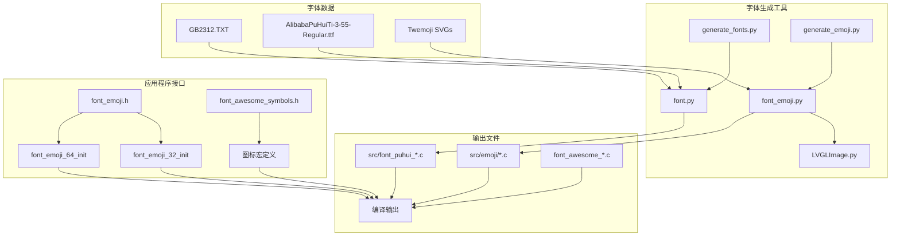
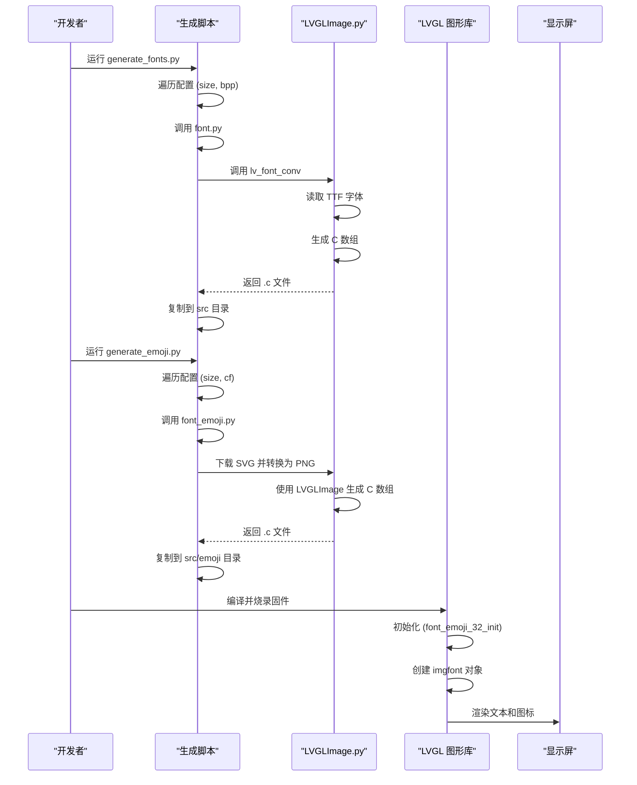
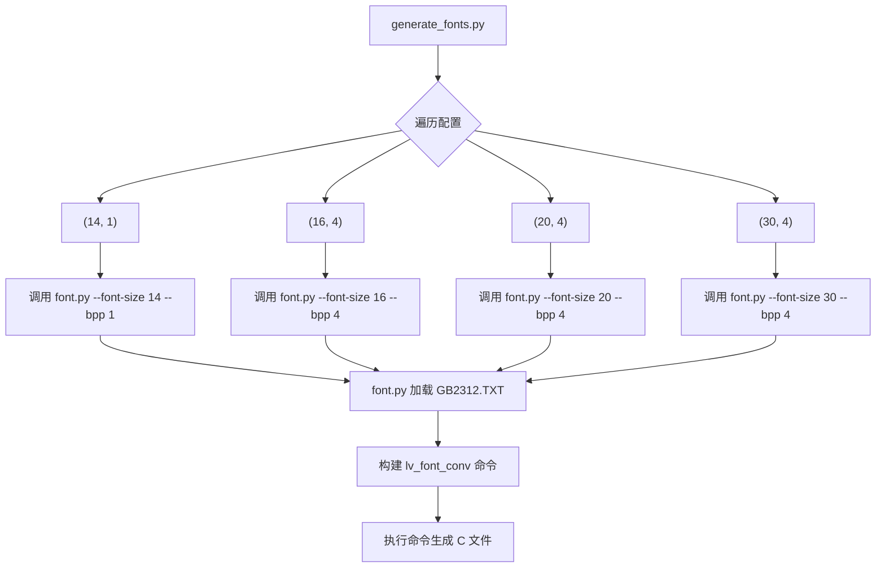
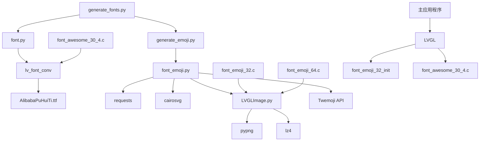

# 字体渲染

<cite>
**本文档中引用的文件**   
- [font_awesome_symbols.h](file://xiaozhi-fonts/include/font_awesome_symbols.h)
- [font_emoji.h](file://xiaozhi-fonts/include/font_emoji.h)
- [font_emoji_32.c](file://xiaozhi-fonts/src/font_emoji_32.c)
- [font_emoji_64.c](file://xiaozhi-fonts/src/font_emoji_64.c)
- [font_awesome_30_4.c](file://xiaozhi-fonts/src/font_awesome_30_4.c)
- [generate_fonts.py](file://xiaozhi-fonts/generate_fonts.py)
- [font.py](file://xiaozhi-fonts/font.py)
- [font_emoji.py](file://xiaozhi-fonts/font_emoji.py)
- [generate_emoji.py](file://xiaozhi-fonts/generate_emoji.py)
- [LVGLImage.py](file://xiaozhi-fonts/LVGLImage.py)
- [GB2312.TXT](file://xiaozhi-fonts/GB2312.TXT)
</cite>

## 目录
1. [引言](#引言)
2. [项目结构](#项目结构)
3. [核心组件](#核心组件)
4. [架构概述](#架构概述)
5. [详细组件分析](#详细组件分析)
6. [依赖分析](#依赖分析)
7. [性能考虑](#性能考虑)
8. [故障排除指南](#故障排除指南)
9. [结论](#结论)

## 引言
本文档系统阐述了嵌入式系统中字体渲染系统的构建过程，重点介绍中文字体、Emoji表情和FontAwesome图标的集成方案。文档详细说明了如何使用`generate_fonts.py`和`font.py`脚本将TTF字体文件转换为适合嵌入式系统使用的C数组格式，并深入分析了不同字号（如32px、64px）和编码格式（如1bpp、4bpp）对显示效果与内存占用的影响。通过分析`font_emoji.h`和`font_awesome_symbols.h`头文件的结构设计，解释了如何在LVGL中注册和使用这些自定义字体。文档还提供了实际代码示例，展示文本绘制、字体切换和多语言混合显示的实现方法，并讨论了字体抗锯齿、字间距调整等显示质量优化技巧，最后给出了常见问题如乱码、字体缺失的解决方案。

## 项目结构
字体渲染系统位于`xiaozhi-fonts`目录下，采用模块化设计，清晰地分离了头文件、源文件和构建脚本。该系统的核心是利用LVGL（Light and Versatile Graphics Library）的图像字体（imgfont）功能，将字体和图标以图像形式嵌入，从而在资源受限的嵌入式设备上实现高质量的文本和图形显示。



**图源**
- [generate_fonts.py](file://xiaozhi-fonts/generate_fonts.py)
- [font.py](file://xiaozhi-fonts/font.py)
- [font_emoji.py](file://xiaozhi-fonts/font_emoji.py)
- [LVGLImage.py](file://xiaozhi-fonts/LVGLImage.py)
- [font_emoji.h](file://xiaozhi-fonts/include/font_emoji.h)
- [font_awesome_symbols.h](file://xiaozhi-fonts/include/font_awesome_symbols.h)

**本节来源**
- [xiaozhi-fonts](file://xiaozhi-fonts)

## 核心组件
字体渲染系统的核心组件包括字体生成脚本、图像处理工具和LVGL集成接口。`generate_fonts.py`和`generate_emoji.py`作为主控脚本，分别负责中文字体和Emoji表情的批量生成。`font.py`和`font_emoji.py`是具体的转换逻辑实现，它们调用`LVGLImage.py`工具将TTF字体和SVG图标转换为LVGL可识别的C数组格式。最终生成的字体数据通过`font_emoji.h`和`font_awesome_symbols.h`提供的API在主应用程序中被调用。

**本节来源**
- [generate_fonts.py](file://xiaozhi-fonts/generate_fonts.py#L1-L25)
- [generate_emoji.py](file://xiaozhi-fonts/generate_emoji.py#L1-L40)
- [font.py](file://xiaozhi-fonts/font.py#L1-L50)
- [font_emoji.py](file://xiaozhi-fonts/font_emoji.py#L1-L119)

## 架构概述
整个字体渲染系统采用“生成-集成”两阶段架构。第一阶段是离线生成，开发者在开发机上运行Python脚本，利用`lv_font_conv`等工具将原始字体文件（TTF）和图标资源（SVG）转换为C语言源文件（.c）。第二阶段是运行时集成，这些C源文件被编译进固件，通过LVGL的API在运行时动态创建字体对象，并注册到LVGL的字体管理系统中。这种架构将计算密集型的字体转换过程从嵌入式设备中剥离，极大地减轻了设备的运行时负担。



**图源**
- [generate_fonts.py](file://xiaozhi-fonts/generate_fonts.py#L1-L25)
- [generate_emoji.py](file://xiaozhi-fonts/generate_emoji.py#L1-L40)
- [font.py](file://xiaozhi-fonts/font.py#L1-L50)
- [font_emoji.py](file://xiaozhi-fonts/font_emoji.py#L1-L119)
- [LVGLImage.py](file://xiaozhi-fonts/LVGLImage.py#L1-L199)
- [font_emoji_32.c](file://xiaozhi-fonts/src/font_emoji_32.c#L50-L76)
- [font_emoji_64.c](file://xiaozhi-fonts/src/font_emoji_64.c#L51-L77)

## 详细组件分析

### 字体生成脚本分析
`generate_fonts.py`脚本定义了中文字体的生成配置，包括字号（14, 16, 20, 30）和位深度（bpp）。它通过`os.system`调用`font.py`脚本，并传递相应的参数。`font.py`脚本是核心转换器，它解析参数，加载`GB2312.TXT`文件中的汉字字符集，并构建`lv_font_conv`命令行，最终生成`src/font_puhui_{size}_{bpp}.c`格式的C源文件。这种方式确保了所有常用汉字都能被包含在生成的字体中。



**图源**
- [generate_fonts.py](file://xiaozhi-fonts/generate_fonts.py#L1-L25)
- [font.py](file://xiaozhi-fonts/font.py#L1-L50)
- [GB2312.TXT](file://xiaozhi-fonts/GB2312.TXT)

**本节来源**
- [generate_fonts.py](file://xiaozhi-fonts/generate_fonts.py#L1-L25)
- [font.py](file://xiaozhi-fonts/font.py#L1-L50)

### Emoji表情字体分析
Emoji字体系统通过`generate_emoji.py`和`font_emoji.py`协同工作。`generate_emoji.py`定义了要生成的尺寸（32x32, 64x64），并调用`font_emoji.py`。`font_emoji.py`脚本首先从Twitter的Twemoji项目下载指定Unicode码点的SVG文件，然后使用`cairosvg`库将其转换为指定尺寸的PNG图像，最后通过`LVGLImage.py`工具将PNG转换为LVGL的C数组格式。`font_emoji_32.c`和`font_emoji_64.c`文件中的`get_imgfont_path`函数是关键，它实现了LVGL的图像字体回调，根据Unicode码点查找并返回对应的图像描述符。

```mermaid
classDiagram
class font_emoji_py {
+emoji_mapping : dict
+get_emoji_png(emoji_utf8, size) : str
+generate_lvgl_image(png_path, cf_str, compress_str) : tuple
+main()
}
class LVGLImage_py {
+from_png(filename, cf) : LVGLImage
+to_c_array(filename, compress) : None
+to_bin(filename, compress) : None
}
class font_emoji_32_c {
+get_imgfont_path() : const void*
+font_emoji_32_init() : const lv_font_t*
}
font_emoji_py --> LVGLImage_py : "使用"
font_emoji_py --> font_emoji_32_c : "生成"
font_emoji_32_c --> "lvgl.h" : "包含"
```

**图源**
- [generate_emoji.py](file://xiaozhi-fonts/generate_emoji.py#L1-L40)
- [font_emoji.py](file://xiaozhi-fonts/font_emoji.py#L1-L119)
- [LVGLImage.py](file://xiaozhi-fonts/LVGLImage.py#L1-L199)
- [font_emoji_32.c](file://xiaozhi-fonts/src/font_emoji_32.c#L1-L77)
- [font_emoji_64.c](file://xiaozhi-fonts/src/font_emoji_64.c#L1-L78)

**本节来源**
- [generate_emoji.py](file://xiaozhi-fonts/generate_emoji.py#L1-L40)
- [font_emoji.py](file://xiaozhi-fonts/font_emoji.py#L1-L119)
- [font_emoji_32.c](file://xiaozhi-fonts/src/font_emoji_32.c#L1-L77)

### FontAwesome图标集成分析
FontAwesome图标被集成到中文字体文件中，如`font_awesome_30_4.c`所示。这些图标以特定的Unicode码点（如U+E04B）被编码，并作为位图嵌入到字体数据中。`font_awesome_symbols.h`头文件定义了一系列宏，将易记的名称（如`FONT_AWESOME_WIFI`）映射到其对应的UTF-8字节序列。在代码中，开发者只需使用这些宏，LVGL就会自动将其渲染为对应的图标，实现了图标与文本的无缝混合显示。

**本节来源**
- [font_awesome_symbols.h](file://xiaozhi-fonts/include/font_awesome_symbols.h#L1-L29)
- [font_awesome_30_4.c](file://xiaozhi-fonts/src/font_awesome_30_4.c#L1-L199)

## 依赖分析
该系统依赖于多个外部工具和库。Python脚本依赖`pypng`、`lz4`和`cairosvg`库来处理图像。字体转换依赖于`lv_font_conv`命令行工具，它是LVGL官方提供的字体转换器。嵌入式端则完全依赖LVGL库来渲染这些生成的字体。这种设计将复杂的图像处理和字体转换逻辑放在了开发环境，确保了嵌入式固件的轻量化和高效性。



**图源**
- [generate_fonts.py](file://xiaozhi-fonts/generate_fonts.py)
- [font.py](file://xiaozhi-fonts/font.py)
- [generate_emoji.py](file://xiaozhi-fonts/generate_emoji.py)
- [font_emoji.py](file://xiaozhi-fonts/font_emoji.py)
- [LVGLImage.py](file://xiaozhi-fonts/LVGLImage.py)
- [font_awesome_30_4.c](file://xiaozhi-fonts/src/font_awesome_30_4.c)
- [font_emoji_32.c](file://xiaozhi-fonts/src/font_emoji_32.c)
- [font_emoji_64.c](file://xiaozhi-fonts/src/font_emoji_64.c)

**本节来源**
- [generate_fonts.py](file://xiaozhi-fonts/generate_fonts.py#L1-L25)
- [font.py](file://xiaozhi-fonts/font.py#L1-L50)
- [generate_emoji.py](file://xiaozhi-fonts/generate_emoji.py#L1-L40)
- [font_emoji.py](file://xiaozhi-fonts/font_emoji.py#L1-L119)
- [LVGLImage.py](file://xiaozhi-fonts/LVGLImage.py#L1-L199)

## 性能考虑
选择合适的`bpp`（位深度）对性能至关重要。`1bpp`（1位每像素）仅支持黑白，内存占用最小，适合小字号或单色显示。`4bpp`（4位每像素）支持16级灰度，能实现平滑的抗锯齿效果，是显示质量与内存占用的良好平衡。对于Emoji表情，使用`RGB565A8`格式，即16位RGB颜色加8位Alpha通道，能完美保留彩色图标的视觉效果。在运行时，`lv_imgfont_create`函数会创建一个轻量级的字体对象，实际的图像数据在需要时才被加载，优化了内存使用。

## 故障排除指南
**乱码问题**：确保在`font.py`中正确加载了`GB2312.TXT`文件，并且`lv_font_conv`命令包含了所有需要的字符范围。检查生成的C文件是否完整。
**字体缺失**：确认`generate_fonts.py`脚本已成功执行，且生成的`.c`文件已正确编译进项目。检查`CMakeLists.txt`是否包含了这些源文件。
**图标不显示**：检查`font_awesome_symbols.h`中的宏定义是否正确，确保在代码中使用了正确的宏名称。确认`font_awesome_*.c`文件已编译。
**内存不足**：对于大尺寸（如64px）或高`bpp`的字体，内存占用会显著增加。考虑降低`bpp`或使用更小的字号，或启用LVGL的字体缓存功能。

**本节来源**
- [font.py](file://xiaozhi-fonts/font.py#L1-L50)
- [GB2312.TXT](file://xiaozhi-fonts/GB2312.TXT)
- [font_awesome_symbols.h](file://xiaozhi-fonts/include/font_awesome_symbols.h#L1-L29)

## 结论
该字体渲染系统通过巧妙的“离线生成，在线使用”架构，成功地在嵌入式设备上实现了高质量的中文字体、Emoji表情和FontAwesome图标的显示。系统设计模块化，易于维护和扩展。通过合理选择`bpp`和字号，可以在显示效果和内存占用之间取得最佳平衡。该方案为资源受限的嵌入式GUI开发提供了一个高效、可靠的字体解决方案。