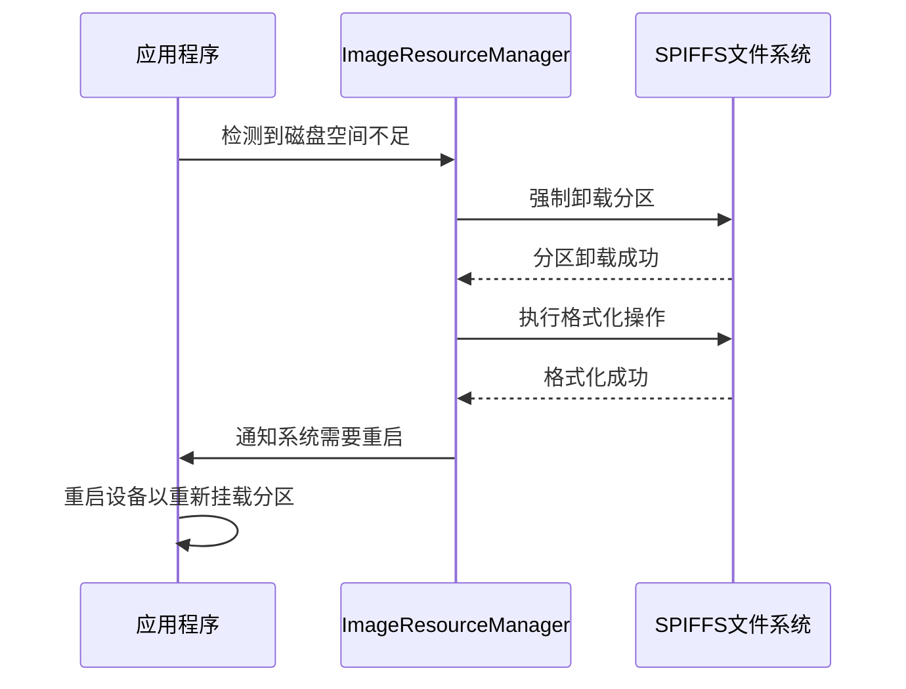

# 显示系统

<cite>
**本文档引用的文件**   
- [display.h](file://main\display\display.h) - *显示系统核心抽象基类*
- [lcd_display.h](file://main\display\lcd_display.h) - *LCD显示驱动基类*
- [oled_display.h](file://main\display\oled_display.h) - *OLED显示驱动实现*
- [image_manager.h](file://main\image_manager.h) - *图像资源管理器接口*
- [image_manager.cc](file://main\image_manager.cc) - *图像资源管理器实现*
- [font_awesome_symbols.h](file://xiaozhi-fonts\include\font_awesome_symbols.h) - *FontAwesome图标符号定义*
- [font_emoji.h](file://xiaozhi-fonts\include\font_emoji.h) - *Emoji字体定义*
- [font_emoji.py](file://xiaozhi-fonts\font_emoji.py) - *Emoji字体生成脚本*
- [generate_fonts.py](file://xiaozhi-fonts\generate_fonts.py) - *字体生成主脚本*
- [images/doufu/output_0001.h](file://main\images\doufu\output_0001.h) - *预编译图像资源示例*
- [images/keke/gImage_keke_0001.h](file://main\images\keke\gImage_keke_0001.h) - *预编译图像资源示例*
- [main/ui/music_player_ui.cpp](file://main\ui\music_player_ui.cpp) - *音乐播放器UI动画控制逻辑更新*
- [main/boards/moon/abrobot-1.28tft-wifi.cc](file://main\boards\moon\abrobot-1.28tft-wifi.cc) - *时钟显示与地理位置信息集成*
- [main/image_manager.cc](file://main\image_manager.cc) - *SPIFFS文件系统重置功能实现*
</cite>

## 更新摘要
**变更内容**   
- 新增SPIFFS文件系统重置功能，以处理磁盘空间不足的异常情况
- 在时钟显示中集成从服务器获取的地理位置信息，实现本地时区自动转换
- 更新了性能优化建议部分，增加了音乐播放器UI动画控制的系统负载检测机制
- 在性能优化建议中补充了旋转动画速度调整和UI更新频率优化的内容
- 增强了源码追踪系统，添加了图像管理器和主板相关文件的引用

## 目录
1. [项目结构](#项目结构)
2. [核心组件](#核心组件)
3. [显示系统架构](#显示系统架构)
4. [详细组件分析](#详细组件分析)
5. [图像资源管理](#图像资源管理)
6. [字体系统](#字体系统)
7. [性能优化建议](#性能优化建议)

## 项目结构

项目采用模块化设计，主要分为以下几个核心模块：

- **main/display**: 显示系统核心，包含抽象基类和具体驱动实现
- **main/images**: 预编译的图像资源，以C头文件形式存储
- **xiaozhi-fonts**: 字体生成和管理模块，包含中文字体、Emoji和图标
- **main/image_manager**: 图像资源管理器，负责动态资源的下载和管理

```
mermaid
graph TD
A[显示系统] --> B[display.h]
A --> C[lcd_display.h]
A --> D[oled_display.h]
E[图像资源] --> F[doufu]
E --> G[keke]
H[字体系统] --> I[xiaozhi-fonts]
I --> J[中文字体]
I --> K[Emoji]
I --> L[FontAwesome]
M[资源管理] --> N[image_manager.h]
N --> O[动态下载]
N --> P[本地缓存]
```

**图示来源**
- [display.h](file://main\display\display.h)
- [image_manager.h](file://main\image_manager.h)
- [xiaozhi-fonts](file://xiaozhi-fonts)

## 核心组件

显示系统采用面向对象的设计模式，通过继承实现不同显示设备的驱动。

**显示抽象基类 (Display)**
- 定义了所有显示设备的通用接口
- 提供状态、通知、表情、聊天消息等UI元素的设置方法
- 管理LVGL图形库的显示对象和缓冲区
- 实现双缓冲机制和更新定时器

**具体显示驱动**
- **LcdDisplay**: LCD显示器基类，支持多种接口类型
- **OledDisplay**: OLED显示器驱动，针对小尺寸屏幕优化
- **NoDisplay**: 无显示设备的空实现，用于调试和测试

**图示来源**
- [display.h](file://main\display\display.h)
- [lcd_display.h](file://main\display\lcd_display.h)
- [oled_display.h](file://main\display\oled_display.h)

## 显示系统架构

显示系统采用分层架构设计，从底层硬件驱动到上层UI组件形成完整的显示链路。

```
mermaid
classDiagram
class Display {
+width() int
+height() int
+SetStatus(status)
+ShowNotification(notification, duration)
+SetEmotion(emotion)
+SetChatMessage(role, content)
+SetIcon(icon)
+SetTheme(theme_name)
+GetTheme() string
+StartUpdateTimer()
+CreateCanvas()
+DestroyCanvas()
+DrawImageOnCanvas(x, y, width, height, img_data)
+HasCanvas() bool
+GetCanvas() lv_obj_t*
+GetCanvasBuffer() void*
}
class LcdDisplay {
+SetupUI()
+SetEmotion(emotion)
+SetIcon(icon)
+SetChatMessage(role, content)
+SetTheme(theme_name)
}
class OledDisplay {
+SetChatMessage(role, content)
}
class NoDisplay {
+Lock(timeout_ms) bool
+Unlock()
}
Display <|-- LcdDisplay
Display <|-- OledDisplay
Display <|-- NoDisplay
LcdDisplay <|-- RgbLcdDisplay
LcdDisplay <|-- MipiLcdDisplay
LcdDisplay <|-- SpiLcdDisplay
LcdDisplay <|-- QspiLcdDisplay
LcdDisplay <|-- Mcu8080LcdDisplay
```

**图示来源**
- [display.h](file://main\display\display.h)
- [lcd_display.h](file://main\display\lcd_display.h)
- [oled_display.h](file://main\display\oled_display.h)

## 详细组件分析

### 显示抽象基类分析

显示抽象基类`Display`是整个显示系统的核心，定义了所有显示设备必须实现的接口。

```
mermaid
classDiagram
class Display {
-width_ int
-height_ int
-pm_lock_ esp_pm_lock_handle_t
-display_ lv_display_t*
-emotion_label_ lv_obj_t*
-network_label_ lv_obj_t*
-status_label_ lv_obj_t*
-notification_label_ lv_obj_t*
-mute_label_ lv_obj_t*
-battery_label_ lv_obj_t*
-battery_percentage_label_ lv_obj_t*
-chat_message_label_ lv_obj_t*
-low_battery_popup_ lv_obj_t*
-low_battery_label_ lv_obj_t*
-canvas_ lv_obj_t*
-canvas_buffer_ void*
-battery_icon_ const char*
-network_icon_ const char*
-muted_ bool
-current_theme_name_ std : : string
-notification_timer_ esp_timer_handle_t
-update_timer_ esp_timer_handle_t
+Display()
+~Display()
+SetStatus(status)
+ShowNotification(notification, duration_ms)
+ShowNotification(notification, duration_ms)
+SetEmotion(emotion)
+SetChatMessage(role, content)
+SetIcon(icon)
+SetTheme(theme_name)
+GetTheme() string
+SetIdle(status)
+StartUpdateTimer()
+CreateCanvas()
+DestroyCanvas()
+DrawImageOnCanvas(x, y, width, height, img_data)
+HasCanvas() bool
+width() int
+GetCanvas() lv_obj_t*
+GetCanvasBuffer() void*
-Lock(timeout_ms) bool
-Unlock()
-Update()
}
class DisplayLockGuard {
-display_ Display*
-locked_ bool
+DisplayLockGuard(display)
+~DisplayLockGuard()
+IsLocked() bool
}
Display --> DisplayLockGuard : "使用"
```

**图示来源**
- [display.h](file://main\display\display.h)

### LCD显示驱动分析

LCD显示驱动`LcdDisplay`继承自`Display`基类，为不同类型的LCD显示器提供统一的接口。

```
mermaid
classDiagram
class LcdDisplay {
-panel_io_ esp_lcd_panel_io_handle_t
-panel_ esp_lcd_panel_handle_t
-draw_buf_ lv_draw_buf_t
-status_bar_ lv_obj_t*
-content_ lv_obj_t*
-container_ lv_obj_t*
-side_bar_ lv_obj_t*
-fonts_ DisplayFonts
+~LcdDisplay()
+SetEmotion(emotion)
+SetIcon(icon)
+SetChatMessage(role, content)
+SetTheme(theme_name)
-SetupUI()
-Lock(timeout_ms) bool
-Unlock()
}
class RgbLcdDisplay {
+RgbLcdDisplay(panel_io, panel, width, height, offset_x, offset_y, mirror_x, mirror_y, swap_xy, fonts)
}
class MipiLcdDisplay {
+MipiLcdDisplay(panel_io, panel, width, height, offset_x, offset_y, mirror_x, mirror_y, swap_xy, fonts)
}
class SpiLcdDisplay {
+SpiLcdDisplay(panel_io, panel, width, height, offset_x, offset_y, mirror_x, mirror_y, swap_xy, fonts)
}
class QspiLcdDisplay {
+QspiLcdDisplay(panel_io, panel, width, height, offset_x, offset_y, mirror_x, mirror_y, swap_xy, fonts)
}
class Mcu8080LcdDisplay {
+Mcu8080LcdDisplay(panel_io, panel, width, height, offset_x, offset_y, mirror_x, mirror_y, swap_xy, fonts)
}
Display <|-- LcdDisplay
LcdDisplay <|-- RgbLcdDisplay
LcdDisplay <|-- MipiLcdDisplay
LcdDisplay <|-- SpiLcdDisplay
LcdDisplay <|-- QspiLcdDisplay
LcdDisplay <|-- Mcu8080LcdDisplay
```

**图示来源**
- [lcd_display.h](file://main\display\lcd_display.h)

### OLED显示驱动分析

OLED显示驱动`OledDisplay`专为小尺寸OLED屏幕设计，针对128x64和128x32等常见分辨率进行了优化。

```
mermaid
classDiagram
class OledDisplay {
-panel_io_ esp_lcd_panel_io_handle_t
-panel_ esp_lcd_panel_handle_t
-status_bar_ lv_obj_t*
-content_ lv_obj_t*
-content_left_ lv_obj_t*
-content_right_ lv_obj_t*
-container_ lv_obj_t*
-side_bar_ lv_obj_t*
-fonts_ DisplayFonts
+OledDisplay(panel_io, panel, width, height, mirror_x, mirror_y, fonts)
+~OledDisplay()
+SetChatMessage(role, content)
-Lock(timeout_ms) bool
-Unlock()
-SetupUI_128x64()
-SetupUI_128x32()
}
Display <|-- OledDisplay
```

**图示来源**
- [oled_display.h](file://main\display\oled_display.h)

## 图像资源管理

图像资源管理器负责管理预编译的图像资源和动态下载的图片。

### 图像资源加载流程

```
mermaid
sequenceDiagram
participant App as 应用程序
participant ImageManager as ImageResourceManager
participant SPIFFS as SPIFFS文件系统
participant Server as 服务器
App->>ImageManager : 初始化
ImageManager->>SPIFFS : 挂载resources分区
ImageManager->>SPIFFS : 读取URL缓存
ImageManager->>SPIFFS : 检查本地图片是否存在
alt 本地图片有效
ImageManager->>SPIFFS : 加载图片数据
ImageManager-->>App : 准备就绪
else 本地图片无效
ImageManager->>Server : 检查服务器版本
Server-->>ImageManager : 返回最新URL
alt URL有更新
ImageManager->>Server : 下载新图片
ImageManager->>SPIFFS : 保存图片和URL缓存
ImageManager->>SPIFFS : 构建打包文件
ImageManager->>App : 重启设备
else URL无更新
ImageManager-->>App : 使用本地图片
end
end
```

**图示来源**
- [image_manager.h](file://main\image_manager.h)
- [image_manager.cc](file://main\image_manager.cc)

### 图像文件格式

系统支持多种图像文件格式：

- **二进制格式 (.bin)**: 带有文件头的二进制图片，包含魔数、版本、尺寸等信息
- **原始RGB格式**: 无文件头的纯RGB565数据，直接按240x240x2字节加载
- **C头文件格式 (.h)**: 预编译的图像资源，以C数组形式嵌入代码

```
mermaid
erDiagram
BINARY_IMAGE_HEADER {
uint32_t magic PK
uint32_t version
uint32_t width
uint32_t height
uint32_t data_size
uint32_t reserved[3]
}
IMAGE_DATA {
uint8_t data[]
}
BINARY_IMAGE_HEADER ||--o{ IMAGE_DATA : "包含"
```

**图示来源**
- [image_manager.h](file://main\image_manager.h)
- [image_manager.cc](file://main\image_manager.cc)

### SPIFFS文件系统重置功能

当磁盘空间不足时，图像资源管理器提供SPIFFS文件系统重置功能，确保系统稳定运行。



**图示来源**
- [image_manager.cc](file://main\image_manager.cc)

## 字体系统

字体系统通过`xiaozhi-fonts`模块生成和管理各种字体资源。

### 字体生成流程

```
mermaid
flowchart TD
Start([开始]) --> GenerateFonts["生成中文字体"]
GenerateFonts --> GenerateEmoji["生成Emoji表情"]
GenerateEmoji --> GenerateIcons["生成FontAwesome图标"]
GenerateIcons --> ConvertToC["转换为C头文件"]
ConvertToC --> Compile["编译到固件"]
Compile --> End([完成])
subgraph 字体生成工具
GenerateFonts
GenerateEmoji
GenerateIcons
end
subgraph 固件集成
ConvertToC
Compile
end
```

**图示来源**
- [generate_fonts.py](file://xiaozhi-fonts\generate_fonts.py)
- [font_emoji.py](file://xiaozhi-fonts\font_emoji.py)

### 字体资源结构

```
mermaid
classDiagram
class DisplayFonts {
+text_font const lv_font_t*
+icon_font const lv_font_t*
}
class FontManager {
+LoadChineseFont()
+LoadEmojiFont()
+LoadIconFont()
+GetFont(font_type) const lv_font_t*
}
class FontConverter {
+ConvertTTFToLVGL(ttf_file, output_file)
+ConvertPNGToC(png_file, output_file)
}
FontManager --> DisplayFonts : "管理"
FontConverter --> FontManager : "提供"
```

**图示来源**
- [font_awesome_symbols.h](file://xiaozhi-fonts\include\font_awesome_symbols.h)
- [font_emoji.h](file://xiaozhi-fonts\include\font_emoji.h)

## 性能优化建议

### 显示性能优化

1. **减少重绘区域**: 只更新发生变化的UI元素，避免全屏刷新
2. **合理使用DMA传输**: 利用DMA进行数据传输，减轻CPU负担
3. **双缓冲机制**: 使用双缓冲减少屏幕闪烁
4. **预加载关键资源**: 启动时立即加载关键图片，其余资源异步加载
5. **打包资源文件**: 将多个小文件打包成单个大文件，提高加载速度
6. **音乐播放器UI动画优化**: 在显示音乐播放器时，会检查当前运行的动画数量，如果系统负载过高，则禁用旋转动画，避免看门狗超时。同时调整旋转动画速度以减少CPU负载，并减少不必要的UI更新频率，提升系统稳定性。
7. **SPIFFS空间管理**: 当检测到磁盘空间不足时，自动触发SPIFFS文件系统重置，确保系统稳定运行。

**更新** 音乐播放器UI动画控制逻辑已优化，增加了系统负载检测机制

**节源**
- [main/ui/music_player_ui.cpp](file://main\ui\music_player_ui.cpp) - *音乐播放器UI动画控制逻辑更新*

### 内存使用优化

1. **动态内存管理**: 及时释放不再使用的图像数据
2. **缓冲区复用**: 复用显示缓冲区，避免频繁分配和释放
3. **按需加载**: 只在需要时加载图像资源，减少内存占用
4. **内存池管理**: 使用内存池管理频繁分配的小对象

### 网络性能优化

1. **串行下载**: 启用串行下载，避免并发网络请求
2. **重试机制**: 实现渐进式重试延时，避免网络拥塞
3. **连接复用**: 启用HTTP连接复用，提高下载速度
4. **大缓冲区**: 使用大缓冲区进行高速下载
5. **进度反馈**: 提供实时下载进度反馈，改善用户体验