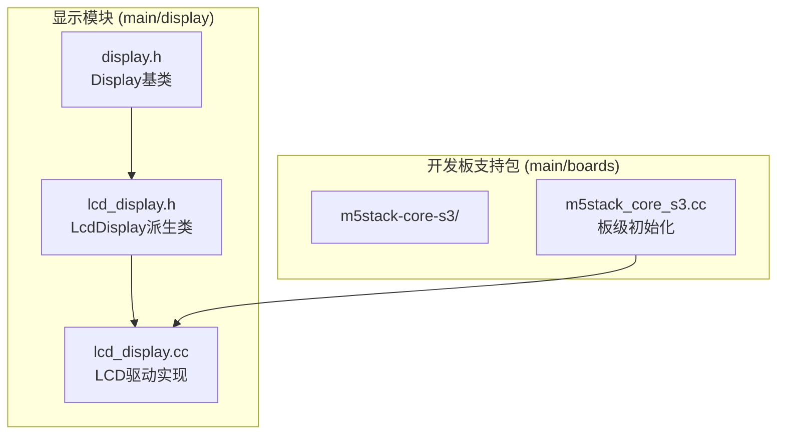
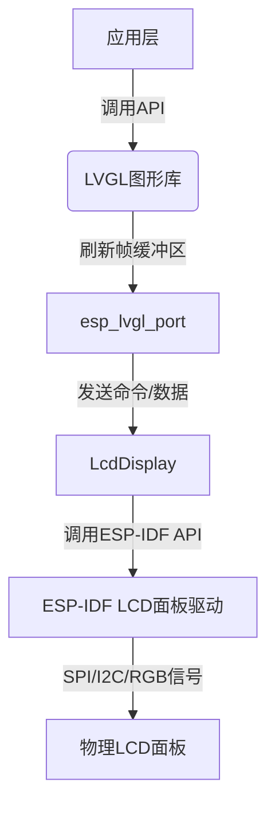
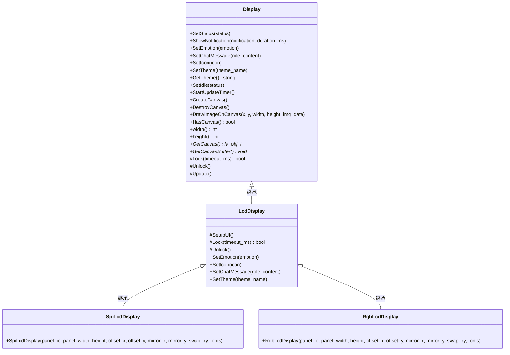
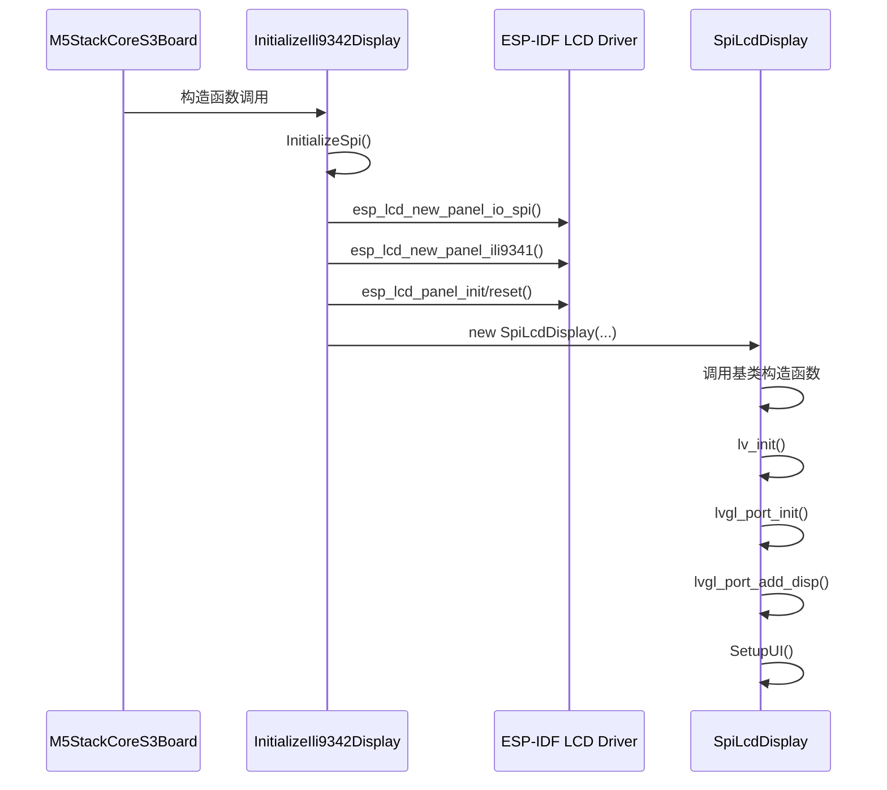
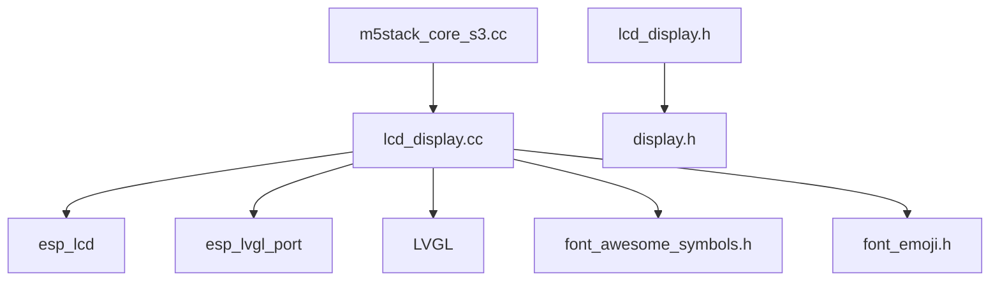

# LCD驱动

<cite>
**本文档引用的文件**   
- [display.h](file://main/display/display.h)
- [lcd_display.h](file://main/display/lcd_display.h)
- [lcd_display.cc](file://main/display/lcd_display.cc)
- [m5stack_core_s3.cc](file://main/boards/m5stack-core-s3/m5stack_core_s3.cc)
</cite>

## 目录
1. [引言](#引言)
2. [项目结构](#项目结构)
3. [核心组件](#核心组件)
4. [架构概述](#架构概述)
5. [详细组件分析](#详细组件分析)
6. [依赖分析](#依赖分析)
7. [性能考虑](#性能考虑)
8. [故障排除指南](#故障排除指南)
9. [结论](#结论)

## 引言
本文档详细阐述了基于ESP-IDF框架的LCD驱动模块的设计与实现。重点分析了`LcdDisplay`类如何继承`Display`基类并实现其虚函数接口，以及`lcd_display.cc`中基于ESP-IDF LCD面板驱动组件的初始化流程。文档深入解析了DMA刷新机制如何与LVGL图形库协同工作以实现高效屏幕更新，并解释了双缓冲策略在消除显示撕裂中的作用。通过`m5stack-core-s3`开发板的实际代码示例，展示了LCD驱动的注册与启动过程。此外，还涵盖了常见问题的调试方法和性能优化建议。

## 项目结构
项目结构遵循功能模块化设计，LCD驱动相关的核心文件位于`main/display`目录下。该目录包含了`Display`基类的定义、`LcdDisplay`派生类的具体实现，以及针对不同显示技术（如LCD、OLED）的专用驱动。与特定开发板相关的LCD初始化代码则分散在`main/boards`目录下的各个板级支持包（BSP）文件中，例如`m5stack-core-s3`开发板的实现位于`main/boards/m5stack-core-s3`目录。

**图示来源**
- [display.h](file://main/display/display.h)
- [lcd_display.h](file://main/display/lcd_display.h)
- [lcd_display.cc](file://main/display/lcd_display.cc)
- [m5stack_core_s3.cc](file://main/boards/m5stack-core-s3/m5stack_core_s3.cc)

## 核心组件
LCD驱动模块的核心组件包括`Display`基类、`LcdDisplay`派生类以及其具体的实现类（如`SpiLcdDisplay`）。`Display`基类定义了所有显示设备的通用接口，如设置状态、显示通知、更新主题等。`LcdDisplay`类继承自`Display`，并引入了与LCD硬件相关的成员，如`panel_io_`和`panel_`，用于与ESP-IDF的LCD面板驱动组件交互。具体的显示技术实现类（如`SpiLcdDisplay`）则负责完成特定硬件的初始化和配置。

**本节来源**
- [display.h](file://main/display/display.h)
- [lcd_display.h](file://main/display/lcd_display.h)

## 架构概述
LCD驱动模块的架构基于分层设计。最底层是ESP-IDF提供的LCD面板驱动组件，负责与物理LCD面板进行通信。中间层是`LcdDisplay`类，它封装了ESP-IDF的API，并提供了面向对象的接口。最上层是LVGL图形库，它通过`esp_lvgl_port`与`LcdDisplay`交互，将图形绘制指令传递给底层驱动。这种架构实现了硬件抽象，使得上层应用无需关心具体的LCD硬件细节。

**图示来源**
- [lcd_display.cc](file://main/display/lcd_display.cc)
- [m5stack_core_s3.cc](file://main/boards/m5stack-core-s3/m5stack_core_s3.cc)

## 详细组件分析
本节将深入分析LCD驱动模块的关键组件，包括类继承关系、初始化流程和核心功能实现。

### LcdDisplay类继承与虚函数实现
`LcdDisplay`类通过继承`Display`基类，实现了多态性。它重写了`Display`中的多个虚函数，如`SetEmotion`、`SetIcon`和`SetTheme`，以提供LCD特有的功能。`Display`基类中定义了`Lock`和`Unlock`两个纯虚函数，用于实现线程安全的显示访问。`LcdDisplay`通过`DisplayLockGuard`类（一个RAII风格的锁管理器）来调用`lvgl_port_lock`和`lvgl_port_unlock`，确保在LVGL操作期间不会发生资源竞争。

**图示来源**
- [display.h](file://main/display/display.h#L15-L112)
- [lcd_display.h](file://main/display/lcd_display.h#L15-L90)

### LCD初始化流程
LCD的初始化流程始于开发板的BSP代码。以`m5stack-core-s3`开发板为例，其`M5StackCoreS3Board`构造函数中调用了`InitializeIli9342Display`函数。该函数首先配置SPI总线，然后创建LCD面板的IO句柄（`esp_lcd_panel_io_spi_config_t`）和面板句柄（`esp_lcd_panel_dev_config_t`），最后调用`esp_lcd_new_panel_ili9341`来实例化一个ILI9341 LCD面板的驱动对象。

**图示来源**
- [m5stack_core_s3.cc](file://main/boards/m5stack-core-s3/m5stack_core_s3.cc#L266-L309)
- [lcd_display.cc](file://main/display/lcd_display.cc#L82-L157)

### DMA刷新与双缓冲机制
`SpiLcdDisplay`和`RgbLcdDisplay`的初始化流程中，通过`lvgl_port_add_disp`和`lvgl_port_add_disp_rgb`函数将LVGL与底层LCD驱动连接起来。在`lvgl_port_display_cfg_t`配置结构体中，关键的`.flags.buff_dma = 1`标志启用了DMA传输，`.buffer_size`定义了帧缓冲区的大小。对于SPI LCD，通常使用单缓冲（`.double_buffer = false`），而RGB LCD则启用了双缓冲（`.double_buffer = true`）和直接模式（`.direct_mode = 1`）。

双缓冲机制通过`lvgl_port_display_rgb_cfg_t`中的`.bb_mode = true`和`.avoid_tearing = true`来实现。这创建了两个帧缓冲区，LVGL在一个缓冲区中进行绘制，而DMA控制器则从另一个缓冲区读取数据并刷新到屏幕上。当一帧绘制完成后，两个缓冲区的角色互换（翻转），从而有效避免了屏幕撕裂现象。`lvgl_port_lock`和`lvgl_port_unlock`确保了缓冲区翻转时的线程安全。

**本节来源**
- [lcd_display.cc](file://main/display/lcd_display.cc#L82-L229)

## 依赖分析
LCD驱动模块依赖于多个关键组件。其核心依赖是ESP-IDF的`esp_lcd`和`esp_lvgl_port`组件，它们提供了与硬件交互的底层API。`LcdDisplay`类依赖于`Display`基类，形成了继承关系。此外，该模块还依赖于LVGL库进行图形渲染，以及`font_awesome_symbols.h`和`font_emoji.h`等字体文件来显示图标和表情。开发板的BSP代码（如`m5stack_core_s3.cc`）则依赖于`lcd_display.cc`来创建具体的显示实例。

**图示来源**
- [lcd_display.cc](file://main/display/lcd_display.cc)
- [m5stack_core_s3.cc](file://main/boards/m5stack-core-s3/m5stack_core_s3.cc)
- [lcd_display.h](file://main/display/lcd_display.h)

## 性能考虑
为了优化LCD驱动的性能，可以调整多个参数。像素时钟频率（`pclk_hz`）直接影响刷新率，提高频率可以提升流畅度，但也会增加功耗和EMI。对于SPI LCD，`buffer_size`的大小需要在内存占用和刷新效率之间取得平衡。启用双缓冲虽然能消除撕裂，但会占用双倍的内存。此外，LVGL的`timer_period_ms`参数决定了UI刷新的频率，降低此值可以提高响应速度，但会增加CPU负载。在`m5stack_core_s3.cc`中，SPI时钟频率被设置为40MHz，这是一个在性能和稳定性之间的常见折衷。

## 故障排除指南
常见的LCD问题包括花屏、黑屏和刷新异常。**花屏**通常由SPI时钟频率过高或信号完整性差引起，应尝试降低`pclk_hz`。**黑屏**可能是背光未开启、电源问题或初始化失败导致，需检查电源电压、背光控制引脚和初始化日志。**刷新异常**（如撕裂、闪烁）可能与LVGL的刷新任务优先级或双缓冲配置有关，应确保`lvgl_port`任务的优先级足够高，并正确配置双缓冲和避免撕裂选项。使用`ESP_LOGI`和`ESP_LOGE`输出的调试信息是诊断这些问题的关键。

**本节来源**
- [lcd_display.cc](file://main/display/lcd_display.cc)
- [m5stack_core_s3.cc](file://main/boards/m5stack-core-s3/m5stack_core_s3.cc)

## 结论
本文档全面分析了基于ESP-IDF和LVGL的LCD驱动模块。通过继承`Display`基类，`LcdDisplay`及其派生类实现了对不同LCD技术的统一抽象。初始化流程清晰地展示了从板级配置到LVGL集成的全过程。DMA传输和双缓冲机制是实现高效、无撕裂显示的关键。通过`m5stack-core-s3`开发板的实例，验证了该设计的可行性和有效性。未来的工作可以集中在进一步优化内存使用、支持更多LCD型号以及增强错误恢复机制上。