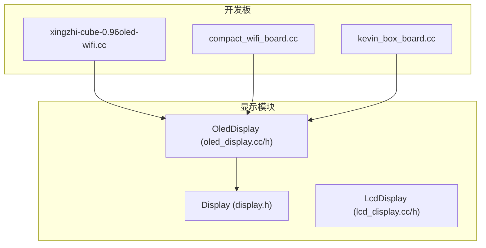
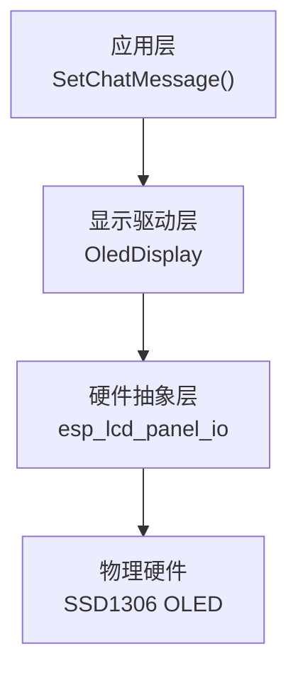
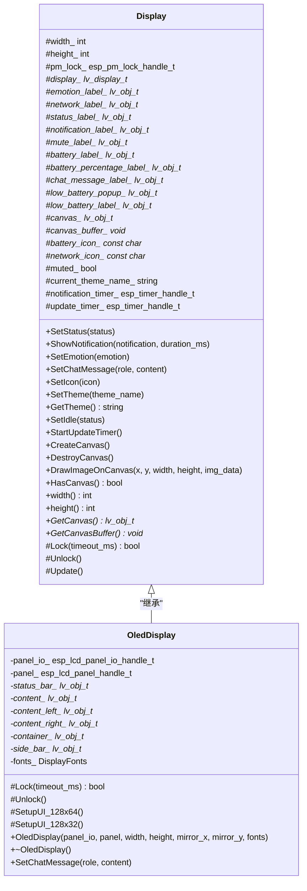
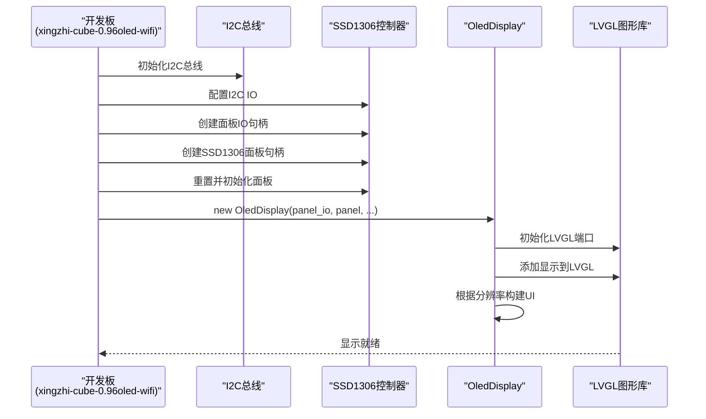
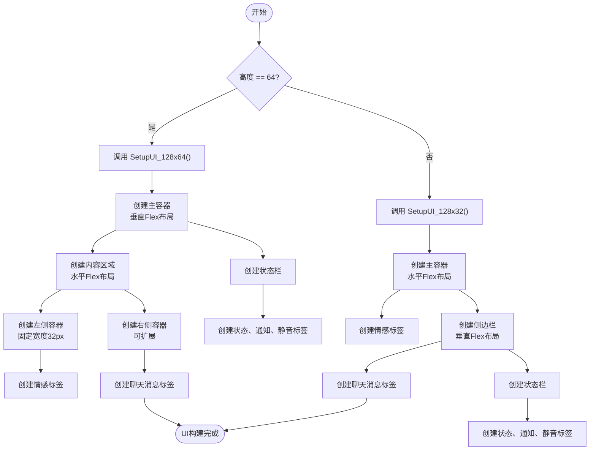
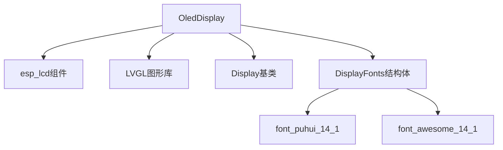

# OLED驱动

<cite>
**本文档引用的文件**   
- [oled_display.h](file://main/display/oled_display.h)
- [oled_display.cc](file://main/display/oled_display.cc)
- [display.h](file://main/display/display.h)
- [display.cc](file://main/display/display.cc)
- [xingzhi-cube-0.96oled-wifi.cc](file://main/boards/xingzhi-cube-0.96oled-wifi/xingzhi-cube-0.96oled-wifi.cc)
- [compact_wifi_board.cc](file://main/boards/bread-compact-wifi/compact_wifi_board.cc)
- [kevin_box_board.cc](file://main/boards/kevin-box-1/kevin_box_board.cc)
- [esp_lcd_gc9d01n.c](file://main/boards/lilygo-t-circle-s3/esp_lcd_gc9d01n.c)
</cite>

## 目录
1. [引言](#引言)
2. [项目结构](#项目结构)
3. [核心组件](#核心组件)
4. [架构概述](#架构概述)
5. [详细组件分析](#详细组件分析)
6. [依赖分析](#依赖分析)
7. [性能考虑](#性能考虑)
8. [故障排查指南](#故障排查指南)
9. [结论](#结论)

## 引言
本文档深入解析了OLED驱动的实现原理，重点描述了`OledDisplay`类如何通过I2C或SPI接口与SSD1306、SH1106等OLED控制器通信。文档分析了设备初始化序列的构造、命令与数据切换机制、页模式或水平模式的写入方式，以及帧缓冲区在有限显存下的管理策略。同时，说明了OLED驱动如何适配不同分辨率和尺寸的屏幕，并与Display抽象层无缝集成。结合`xingzhi-cube-0.96oled-wifi`等使用OLED的开发板实例，展示了驱动注册与显示调用流程。最后，提供了常见故障排查指南和降低功耗、延长屏幕寿命的最佳实践。

## 项目结构
项目结构清晰地组织了代码，`main/display`目录下包含了所有显示相关的实现。`oled_display.cc`和`oled_display.h`是OLED驱动的核心文件，而`display.h`定义了所有显示设备的抽象基类。开发板特定的实现位于`main/boards`目录下，例如`xingzhi-cube-0.96oled-wifi`和`bread-compact-wifi`等开发板通过包含`oled_display.h`并实例化`OledDisplay`类来使用OLED功能。

**图示来源**
- [oled_display.h](file://main/display/oled_display.h)
- [display.h](file://main/display/display.h)
- [xingzhi-cube-0.96oled-wifi.cc](file://main/boards/xingzhi-cube-0.96oled-wifi/xingzhi-cube-0.96oled-wifi.cc)

## 核心组件
`OledDisplay`类是OLED驱动的核心，它继承自`Display`抽象基类，实现了与LVGL图形库的集成。该类负责初始化OLED控制器（如SSD1306），配置LVGL显示驱动，并构建用户界面。`OledDisplay`通过`esp_lcd_panel_io_handle_t`和`esp_lcd_panel_handle_t`与底层硬件通信，利用`lvgl_port_add_disp`函数将硬件显示添加到LVGL框架中。

**组件来源**
- [oled_display.h](file://main/display/oled_display.h#L8-L34)
- [oled_display.cc](file://main/display/oled_display.cc#L15-L63)

## 架构概述
OLED驱动的架构分为三层：硬件抽象层（HAL）、显示驱动层和应用层。硬件抽象层由ESP-IDF的`esp_lcd`组件提供，负责与I2C或SPI总线通信。显示驱动层由`OledDisplay`类实现，它利用`esp_lcd`组件初始化OLED控制器，并将显示注册到LVGL。应用层通过`Display`基类的接口（如`SetChatMessage`）与OLED交互，实现了硬件与应用逻辑的解耦。

**图示来源**
- [oled_display.cc](file://main/display/oled_display.cc#L15-L63)
- [display.h](file://main/display/display.h#L16-L76)

## 详细组件分析

### OledDisplay类分析
`OledDisplay`类的构造函数是驱动初始化的核心。它首先初始化LVGL端口，然后配置`lvgl_port_display_cfg_t`结构体，将`panel_io_`和`panel_`句柄传递给`lvgl_port_add_disp`函数，从而将OLED硬件与LVGL图形库连接起来。根据屏幕高度（64或32像素），调用`SetupUI_128x64`或`SetupUI_128x32`方法来构建不同的用户界面布局。

#### 类图

**图示来源**
- [oled_display.h](file://main/display/oled_display.h#L8-L34)
- [display.h](file://main/display/display.h#L16-L76)

### 显示初始化流程
当开发板（如`xingzhi-cube-0.96oled-wifi`）启动时，其初始化流程会创建I2C总线，配置`esp_lcd_panel_io_i2c_config_t`，并通过`esp_lcd_new_panel_io_i2c_v2`创建面板IO句柄。接着，使用`esp_lcd_new_panel_ssd1306`创建SSD1306面板句柄。最后，将这些句柄传递给`OledDisplay`的构造函数，完成整个显示系统的初始化。

#### 序列图

**图示来源**
- [xingzhi-cube-0.96oled-wifi.cc](file://main/boards/xingzhi-cube-0.96oled-wifi/xingzhi-cube-0.96oled-wifi.cc#L113-L147)
- [oled_display.cc](file://main/display/oled_display.cc#L15-L63)

### 用户界面布局
`OledDisplay`根据屏幕分辨率提供了两种UI布局。对于128x64的屏幕，它创建一个包含状态栏、内容区域和侧边栏的垂直布局。内容区域分为左侧的固定宽度情感图标和右侧的可扩展聊天消息标签。对于128x32的屏幕，布局更紧凑，采用水平排列，左侧为情感图标，右侧为状态栏和消息标签。

#### 流程图

**图示来源**
- [oled_display.cc](file://main/display/oled_display.cc#L216-L309)

## 依赖分析
`OledDisplay`类依赖于多个关键组件。它直接依赖于ESP-IDF的`esp_lcd`组件来与OLED硬件通信，依赖于LVGL库来实现图形用户界面。`Display`基类提供了统一的接口契约，使得上层应用无需关心具体的显示类型。`DisplayFonts`结构体则用于传递字体配置，确保文本和图标能正确显示。

**图示来源**
- [oled_display.h](file://main/display/oled_display.h#L8-L34)
- [display.h](file://main/display/display.h#L10-L14)

## 性能考虑
OLED驱动在性能上进行了优化。通过将`double_buffer`设置为`false`，减少了内存占用，这对于资源受限的嵌入式系统至关重要。使用`lvgl_port_lock`和`lvgl_port_unlock`确保了对LVGL的线程安全访问。`DisplayLockGuard`类的使用简化了锁的管理，避免了死锁风险。此外，通过`lv_obj_set_style_anim`为聊天消息标签添加了循环滚动动画，提升了用户体验。

## 故障排查指南

### 常见问题及解决方案
- **屏幕无响应**：检查I2C总线是否正确初始化，确认OLED的I2C地址（通常为0x3C或0x3D）是否正确。使用`i2c_scanner`工具扫描总线，确保设备在线。
- **显示残影**：确保在初始化后调用了`esp_lcd_panel_disp_on_off(panel_, true)`来开启显示。检查`esp_lcd_panel_init`是否成功返回`ESP_OK`。
- **对比度异常**：可以通过发送SSD1306的`SET_CONTRAST`命令（0x81）来调整对比度。在`esp_lcd`组件中，这通常通过`esp_lcd_panel_set_contrast`函数实现。

### 最佳实践
- **降低功耗**：在设备空闲时，调用`esp_lcd_panel_disp_on_off(panel_, false)`关闭屏幕。使用`esp_pm_lock_create`创建电源管理锁，防止在显示更新时CPU进入深度睡眠。
- **延长屏幕寿命**：避免长时间显示静态图像，以防止OLED烧屏。实现一个屏幕保护程序，在一段时间无操作后自动关闭屏幕或显示动态内容。

**组件来源**
- [oled_display.cc](file://main/display/oled_display.cc#L15-L63)
- [compact_wifi_board.cc](file://main/boards/bread-compact-wifi/compact_wifi_board.cc#L79-L115)

## 结论
`OledDisplay`类提供了一个高效且易于集成的OLED驱动解决方案。它通过ESP-IDF的`esp_lcd`组件与硬件通信，并利用LVGL构建用户界面，实现了硬件抽象与应用逻辑的分离。通过对`Display`基类的继承，它能够无缝集成到现有的显示系统中。开发板通过简单的初始化流程即可使用OLED功能，而`DisplayLockGuard`等设计模式确保了线程安全。遵循本文档中的最佳实践，可以有效降低功耗并延长OLED屏幕的使用寿命。