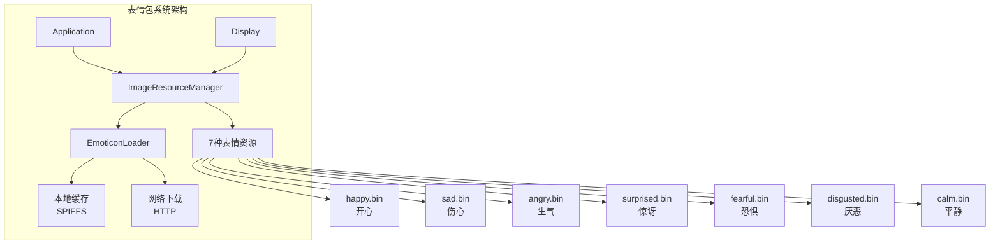
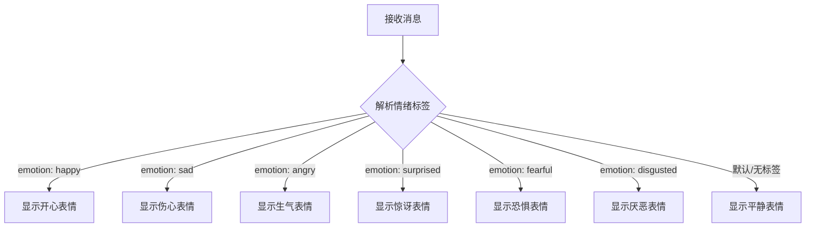
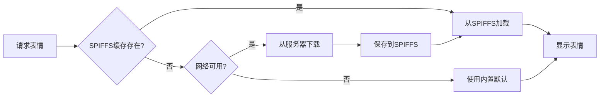
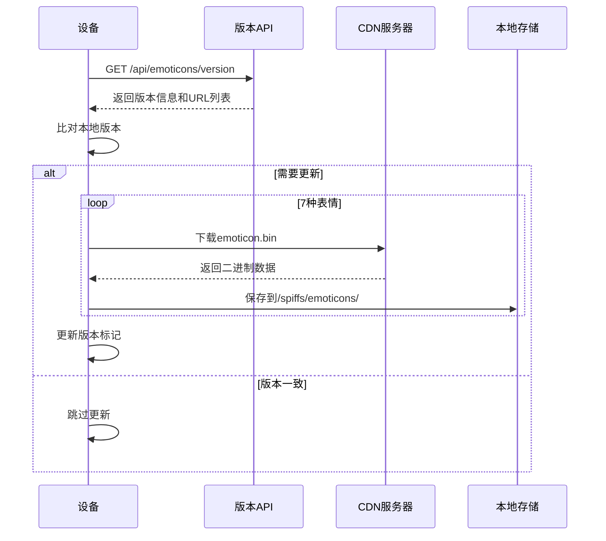

# 表情包系统

<cite>
**本文档引用的文件**  
- [image_manager.h](file://main/image_manager.h)
- [image_manager.cc](file://main/image_manager.cc)
- [image_resource/emoticons/](file://main/image_resource/emoticons/)
- [display.h](file://main/display/display.h)
- [application.cc](file://main/application.cc)
</cite>

## 目录
1. [系统概述](#系统概述)
2. [情绪表情类型](#情绪表情类型)
3. [文件格式与存储](#文件格式与存储)
4. [加载机制](#加载机制)
5. [网络更新流程](#网络更新流程)
6. [使用示例](#使用示例)
7. [性能优化](#性能优化)

## 系统概述

表情包系统（Emoticon System）是xiaozhi-esp32的显示子系统的重要组成部分，用于根据对话情境动态显示不同的情绪表情。系统预置了7种基本情绪表情，通过图片资源管理器统一管理，支持本地缓存和网络更新。

**核心特性**：
- **7种情绪表情**：覆盖常见的情感表达场景
- **统一管理**：通过ImageResourceManager集中管理
- **智能缓存**：支持SPIFFS本地存储
- **网络更新**：从服务器动态下载和更新表情包
- **低内存占用**：采用按需加载策略



**Section sources**
- [image_manager.h](file://main/image_manager.h#L1-L50)

## 情绪表情类型

系统支持7种基于心理学研究的基本情绪表情，每种表情都有独立的二进制图片文件。

### 情绪映射表

| 情绪类型 | 文件名 | 英文名称 | 触发场景 | 文件大小 |
|:--------|:-------|:---------|:---------|:---------|
| 😊 开心 | happy.bin | Happy | 积极回复、完成任务、收到赞美 | 115200 字节 |
| 😢 伤心 | sad.bin | Sad | 负面消息、失败提示、道歉 | 115200 字节 |
| 😠 生气 | angry.bin | Angry | 错误警告、严重问题、不满 | 115200 字节 |
| 😲 惊讶 | surprised.bin | Surprised | 意外事件、新发现、突发状况 | 115200 字节 |
| 😨 恐惧 | fearful.bin | Fearful | 危险警告、系统错误、异常 | 115200 字节 |
| 🤢 厌恶 | disgusted.bin | Disgusted | 拒绝操作、不推荐、警告 | 115200 字节 |
| 😌 平静 | calm.bin | Calm | 待机状态、正常运行、空闲 | 115200 字节 |

### 情绪选择逻辑



**Section sources**
- [image_resource/emoticons/](file://main/image_resource/emoticons/)
- [display.h](file://main/display/display.h#L30-L80)

## 文件格式与存储

### 二进制格式规范

所有表情文件采用统一的二进制格式存储，便于快速加载和内存映射。

**文件头结构**（BinaryImageHeader）：
```cpp
struct BinaryImageHeader {
    uint32_t magic;         // 魔数: 0x42494D47 ('BIMG')
    uint32_t version;       // 版本: 1
    uint32_t width;         // 宽度: 240 像素
    uint32_t height;        // 高度: 240 像素
    uint32_t data_size;     // 数据大小: 115200 字节
    uint32_t reserved[3];   // 保留字段
};
```

**图片数据规格**：
- **分辨率**：240 × 240 像素
- **颜色格式**：RGB565（16位色）
- **数据大小**：240 × 240 × 2 = 115200 字节
- **总文件大小**：头部(32字节) + 数据(115200字节) = 115232 字节

### 存储位置

表情文件存储在两个位置：

1. **编译时嵌入**（只读）：
   - 路径：`main/image_resource/emoticons/*.bin`
   - 编译进固件，无法更新
   - 作为后备资源使用

2. **SPIFFS缓存**（可更新）：
   - 挂载点：`/spiffs/emoticons/`
   - 从网络下载后缓存
   - 支持版本更新

**Section sources**
- [image_manager.h](file://main/image_manager.h#L24-L35)

## 加载机制

### 加载优先级

系统采用多级加载策略，确保在各种情况下都能显示表情：



### 加载流程代码

```cpp
bool ImageResourceManager::LoadEmoticonFile(const char* emotion_name) {
    char filepath[64];
    
    // 1. 尝试从SPIFFS加载
    snprintf(filepath, sizeof(filepath), "/spiffs/emoticons/%s.bin", emotion_name);
    FILE* f = fopen(filepath, "rb");
    
    if (f) {
        // 读取文件头
        BinaryImageHeader header;
        fread(&header, sizeof(header), 1, f);
        
        // 验证魔数和版本
        if (header.magic == BINARY_IMAGE_MAGIC && 
            header.version == BINARY_IMAGE_VERSION) {
            
            // 分配内存并加载图片数据
            uint8_t* data = (uint8_t*)malloc(header.data_size);
            fread(data, 1, header.data_size, f);
            fclose(f);
            
            emoticon_cache_[emotion_name] = data;
            return true;
        }
        fclose(f);
    }
    
    // 2. 从网络下载
    if (DownloadEmoticon(emotion_name)) {
        return LoadEmoticonFile(emotion_name); // 递归重试
    }
    
    // 3. 使用内置默认表情
    return LoadBuiltinEmoticon(emotion_name);
}
```

### 内存管理

表情包采用智能内存管理策略：

- **按需加载**：仅在首次使用时加载
- **LRU缓存**：使用最少最近使用算法管理内存
- **懒释放**：在内存压力大时才释放缓存

```cpp
// 内存压力检查
if (esp_get_free_heap_size() < LOW_MEMORY_THRESHOLD) {
    // 释放最少使用的表情
    ReleaseLeastRecentlyUsedEmoticon();
}
```

**Section sources**
- [image_manager.cc](file://main/image_manager.cc#L800-L1100)

## 网络更新流程

### 版本检查机制

系统定期向服务器查询表情包版本信息，比对本地版本决定是否更新。



### 服务器API格式

版本检查API返回JSON格式：

```json
{
    "version": "1.2.0",
    "emoticons": [
        {
            "name": "happy",
            "url": "https://cdn.example.com/emoticons/v1.2.0/happy.bin",
            "md5": "a1b2c3d4e5f6..."
        },
        {
            "name": "sad",
            "url": "https://cdn.example.com/emoticons/v1.2.0/sad.bin",
            "md5": "f6e5d4c3b2a1..."
        }
        // ... 其他5种表情
    ]
}
```

### 下载与校验

```cpp
esp_err_t DownloadAndVerifyEmoticon(const char* url, const char* md5_expected) {
    // 1. 下载文件
    Http* http = Board::GetInstance().CreateHttp();
    std::vector<uint8_t> data;
    
    esp_err_t ret = http->Get(url, data);
    if (ret != ESP_OK) {
        return ret;
    }
    
    // 2. 校验MD5
    char md5_calculated[33];
    calculate_md5(data.data(), data.size(), md5_calculated);
    
    if (strcmp(md5_calculated, md5_expected) != 0) {
        ESP_LOGE(TAG, "MD5校验失败");
        return ESP_FAIL;
    }
    
    // 3. 保存到SPIFFS
    return SaveEmoticonToSpiffs(data);
}
```

**Section sources**
- [image_manager.cc](file://main/image_manager.cc#L1500-L1800)

## 使用示例

### 在Display类中使用

```cpp
#include "display/display.h"
#include "image_manager.h"

// 设置表情
void Display::SetEmotion(const char* emotion) {
    ImageResourceManager& img_mgr = ImageResourceManager::GetInstance();
    
    // 加载对应的表情图片
    const uint8_t* emoticon_data = img_mgr.GetEmoticon(emotion);
    if (emoticon_data) {
        // 显示在屏幕上
        DrawImage(emoticon_data, 240, 240);
    } else {
        // 降级到默认表情
        ESP_LOGW(TAG, "表情 %s 加载失败，使用默认", emotion);
        emoticon_data = img_mgr.GetEmoticon("calm");
        DrawImage(emoticon_data, 240, 240);
    }
}
```

### 在Application中响应情绪

```cpp
// 处理来自服务器的消息
void Application::OnServerMessage(const cJSON* root) {
    const char* emotion = cJSON_GetStringValue(
        cJSON_GetObjectItem(root, "emotion")
    );
    
    if (emotion) {
        // 更新显示的表情
        Display* display = Board::GetInstance().GetDisplay();
        if (display) {
            Schedule([emotion_str = std::string(emotion), display]() {
                display->SetEmotion(emotion_str.c_str());
            });
        }
    }
}
```

### 手动触发表情更新

```cpp
// 检查并更新表情包
void UpdateEmoticons() {
    ImageResourceManager& img_mgr = ImageResourceManager::GetInstance();
    
    const char* api_url = "https://api.example.com/emoticons/version";
    esp_err_t ret = img_mgr.CheckAndUpdateEmoticons(api_url);
    
    if (ret == ESP_OK) {
        ESP_LOGI(TAG, "表情包更新成功");
    } else {
        ESP_LOGE(TAG, "表情包更新失败: %d", ret);
    }
}
```

**Section sources**
- [display.h](file://main/display/display.h#L50-L90)
- [application.cc](file://main/application.cc#L600-L800)

## 性能优化

### 内存优化策略

1. **共享缓冲区**：多个表情共享解码缓冲区
2. **压缩存储**：考虑使用PNG格式减少存储空间
3. **分级缓存**：高频表情常驻内存，低频按需加载

```cpp
class EmoticonCache {
private:
    // 高频表情（常驻内存）
    std::map<std::string, uint8_t*> hot_cache_ = {
        {"calm", nullptr},
        {"happy", nullptr}
    };
    
    // 冷表情（按需加载）
    std::map<std::string, uint8_t*> cold_cache_;
    
    // 使用频率统计
    std::map<std::string, int> usage_count_;
};
```

### 加载性能优化

1. **预加载常用表情**：启动时预加载calm和happy
2. **异步下载**：后台任务下载表情，不阻塞主线程
3. **增量更新**：仅下载变更的表情文件

```cpp
void PreloadCommonEmoticons() {
    TaskHandle_t task;
    xTaskCreate([](void* param) {
        ImageResourceManager& mgr = ImageResourceManager::GetInstance();
        mgr.PreloadEmoticon("calm");
        mgr.PreloadEmoticon("happy");
        vTaskDelete(nullptr);
    }, "preload_emoticons", 4096, nullptr, 5, &task);
}
```

### 网络优化

1. **CDN加速**：使用CDN分发表情资源
2. **断点续传**：支持大文件断点下载
3. **批量下载**：一次请求获取所有URL，并行下载

**Section sources**
- [image_manager.cc](file://main/image_manager.cc#L2000-L2200)

## 总结

表情包系统为xiaozhi-esp32提供了丰富的情感表达能力，通过以下设计实现高效运行：

1. **标准化格式**：统一的二进制格式便于处理
2. **多级缓存**：SPIFFS + 内存的两级缓存机制
3. **网络更新**：支持远程更新，保持表情包最新
4. **智能管理**：按需加载和LRU缓存策略节省资源
5. **降级策略**：网络故障时使用本地资源

该系统已被成功应用于多款开发板，为用户提供了生动的交互体验。
