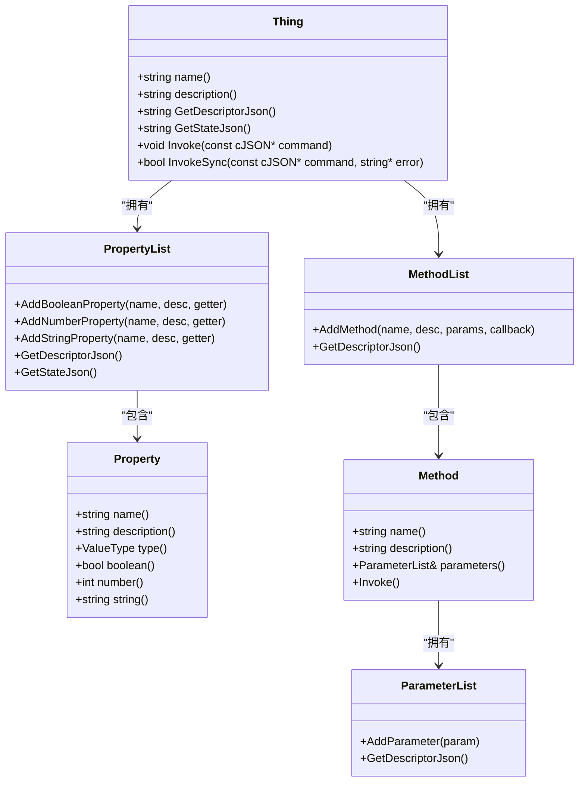
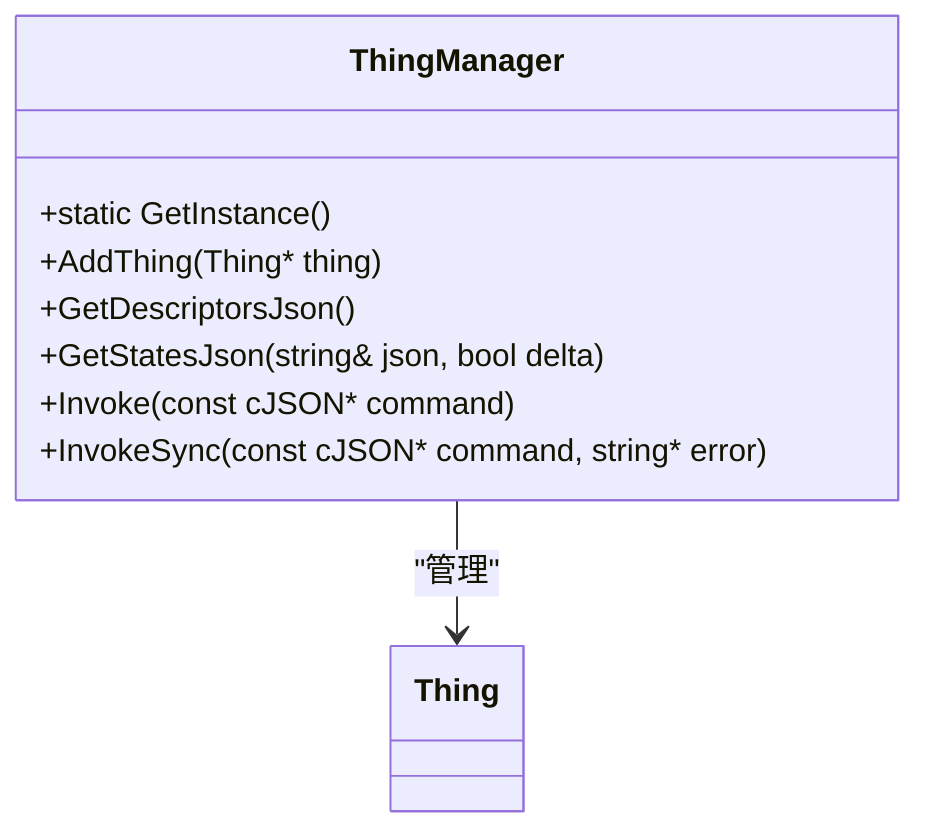
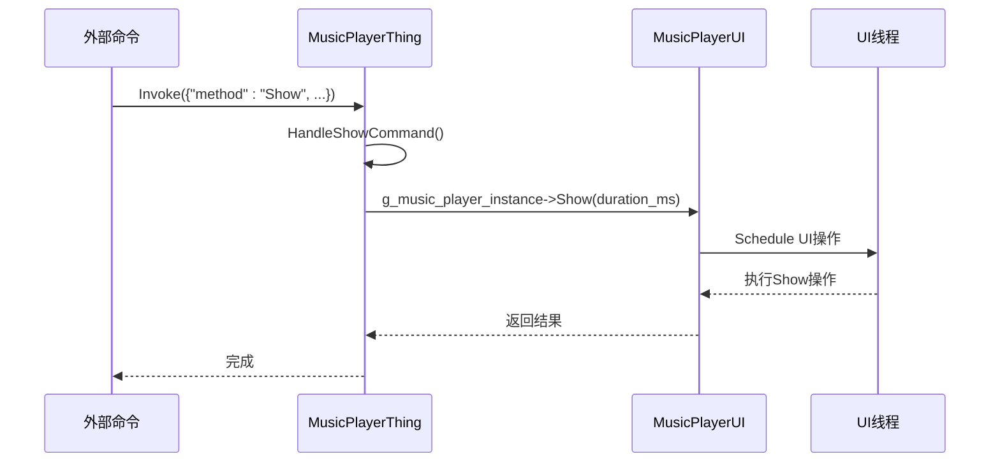

# 具体设备实现

<cite>
**本文档中引用的文件**   
- [alarm.cc](file://main/iot/things/alarm.cc)
- [battery.cc](file://main/iot/things/battery.cc)
- [lamp.cc](file://main/iot/things/lamp.cc)
- [music_player.cc](file://main/iot/things/music_player.cc)
- [music_player.h](file://main/iot/things/music_player.h)
- [screen.cc](file://main/iot/things/screen.cc)
- [speaker.cc](file://main/iot/things/speaker.cc)
- [thing.h](file://main/iot/thing.h)
- [thing.cc](file://main/iot/thing.cc)
- [thing_manager.h](file://main/iot/thing_manager.h)
- [thing_manager.cc](file://main/iot/thing_manager.cc)
- [music_player_ui.cpp](file://main/ui/music_player_ui.cpp)
- [music_player_ui.h](file://main/ui/music_player_ui.h)
- [application.h](file://main/application.h)
- [application.cc](file://main/application.cc)
- [board.h](file://main/boards/common/board.h)
- [display.h](file://main/display/display.h)
- [audio_codec.h](file://main/audio_codecs/audio_codec.h)
</cite>

## 目录
1. [引言](#引言)
2. [核心架构与基类设计](#核心架构与基类设计)
3. [具体设备实现分析](#具体设备实现分析)
    1. [音乐播放器 (music_player)](#音乐播放器-music_player)
    2. [电池 (battery)](#电池-battery)
    3. [灯 (lamp)](#灯-lamp)
    4. [屏幕 (screen)](#屏幕-screen)
    5. [扬声器 (speaker)](#扬声器-speaker)
    6. [闹钟 (alarm)](#闹钟-alarm)
4. [新增设备类型指南](#新增设备类型指南)
5. [总结](#总结)

## 引言
本文档旨在深入分析物联网（IoT）设备的具体实现，涵盖`alarm`、`battery`、`lamp`、`music_player`、`screen`、`speaker`等设备类型。文档将详细阐述每种设备的功能逻辑、状态机设计、控制指令集以及与硬件模块的交互方式。通过分析`music_player.cc`的实现，我们将了解其如何处理播放/暂停/音量调节等命令，并与UI模块联动。同时，文档将解释`battery.cc`如何获取系统电量信息并上报，描述`lamp.cc`和`screen.cc`对LED和显示屏的控制逻辑。最后，提供一份完整的步骤指南，指导开发者如何新增设备类型。

## 核心架构与基类设计

### Thing 基类分析
所有具体设备均继承自`Thing`基类，该类定义了物联网设备的通用模型，包括属性（Properties）和方法（Methods）。



**图示来源**
- [thing.h](file://main/iot/thing.h#L102-L301)

**本节来源**
- [thing.h](file://main/iot/thing.h#L102-L301)

`Thing`类的核心功能如下：
- **属性 (Properties)**：通过`PropertyList`管理设备的只读状态，如电量、音量、开关状态等。属性的值通过`std::function`（即getter函数）在查询时动态获取。
- **方法 (Methods)**：通过`MethodList`管理设备可执行的指令，如“打开灯”、“设置音量”等。每个方法关联一个回调函数。
- **Invoke**：`Invoke`方法是设备的入口，它接收一个JSON命令，解析出`method`和`parameters`，然后在`MethodList`中查找对应的方法并执行其回调。
- **DECLARE_THING宏**：该宏用于将具体设备类注册到全局的设备创建器映射表中，使得`ThingManager`能够动态创建实例。

### 设备管理器 (ThingManager) 分析
`ThingManager`是所有设备的中央管理器，负责设备的注册、状态查询和指令分发。



**图示来源**
- [thing_manager.h](file://main/iot/thing_manager.h#L1-L43)
- [thing_manager.cc](file://main/iot/thing_manager.cc#L1-L89)

**本节来源**
- [thing_manager.h](file://main/iot/thing_manager.h#L1-L43)
- [thing_manager.cc](file://main/iot/thing_manager.cc#L1-L89)

`ThingManager`的关键方法：
- **AddThing**：将一个`Thing`实例添加到内部的`things_`列表中。
- **GetStatesJson**：遍历所有设备，调用其`GetStateJson`方法，收集所有设备的当前状态。当`delta`为`true`时，只返回状态发生变化的设备。
- **Invoke**：根据命令中的`name`字段，找到对应的`Thing`实例，并调用其`Invoke`方法。

## 具体设备实现分析

### 音乐播放器 (music_player)

`MusicPlayerThing`类实现了对音乐播放器UI的控制。



**图示来源**
- [music_player.cc](file://main/iot/things/music_player.cc#L1-L262)
- [music_player_ui.cpp](file://main/ui/music_player_ui.cpp#L1-L1074)
- [application.cc](file://main/application.cc#L1-L1889)

**本节来源**
- [music_player.cc](file://main/iot/things/music_player.cc#L1-L262)
- [music_player.h](file://main/iot/things/music_player.h#L1-L31)
- [music_player_ui.cpp](file://main/ui/music_player_ui.cpp#L1-L1074)
- [music_player_ui.h](file://main/ui/music_player_ui.h#L1-L337)

#### 功能逻辑与控制指令
- **方法注册**：在构造函数中，`MusicPlayerThing`注册了两个方法：`Show`和`Hide`。
    - `Show`方法接受三个可选参数：`duration_ms`（显示时长）、`song_title`（歌曲标题）、`artist_name`（艺术家名称）。
    - `Hide`方法无参数，用于隐藏播放器界面。
- **指令处理**：`Invoke`方法根据JSON命令中的`method`字段，调用`HandleShowCommand`或`HandleHideCommand`。
- **与UI模块联动**：`MusicPlayerThing`通过全局单例`g_music_player_instance`（`MusicPlayerUI`的实例）来控制UI。例如，`HandleShowCommand`会调用`g_music_player_instance->SetSongInfo()`设置歌曲信息，然后调用`g_music_player_instance->Show()`显示界面。

#### 关键实现细节
- **线程安全**：`MusicPlayerUI`内部使用`std::mutex`保护其成员变量，确保多线程环境下的安全。
- **性能监控**：`MusicPlayerUI`支持通过`esp_timer`进行性能监控，可以统计FPS、内存使用等。
- **看门狗保护**：在执行`Show`等耗时操作时，会调用`WatchdogManager::BeforeLongOperation`和`AfterLongOperation`来防止系统看门狗超时。

### 电池 (battery)

`Battery`类负责上报设备的电池状态。

**本节来源**
- [battery.cc](file://main/iot/things/battery.cc#L1-L34)

#### 功能逻辑与状态机
- **属性定义**：`Battery`类定义了两个属性：
    - `level`：当前电量百分比。其getter函数通过`Board::GetInstance().GetBatteryLevel()`获取系统电量信息。
    - `charging`：是否正在充电。其值由`GetBatteryLevel`函数的输出参数`charging_`决定。
- **状态上报**：`ThingManager`会定期调用`GetStatesJson`，从而触发`Battery`的属性getter，动态获取最新的电量和充电状态并上报。

### 灯 (lamp)

`Lamp`类实现了对LED灯的控制。

**本节来源**
- [lamp.cc](file://main/iot/things/lamp.cc#L1-L58)

#### 控制逻辑与硬件交互
- **GPIO初始化**：在构造函数中，`InitializeGpio()`方法配置了指定的GPIO引脚（根据芯片型号不同，可能是GPIO12或GPIO18）为输出模式。
- **属性与方法**：
    - `power`属性：一个布尔值，反映灯的当前开关状态。
    - `TurnOn`方法：将`power_`设为`true`，并通过`gpio_set_level(gpio_num_, 1)`将GPIO电平拉高，从而点亮LED。
    - `TurnOff`方法：将`power_`设为`false`，并通过`gpio_set_level(gpio_num_, 0)`将GPIO电平拉低，从而熄灭LED。

### 屏幕 (screen)

`Screen`类用于控制显示屏的主题和亮度。

**本节来源**
- [screen.cc](file://main/iot/things/screen.cc#L1-L53)

#### 控制逻辑与硬件交互
- **属性**：
    - `theme`属性：通过`Board::GetInstance().GetDisplay()->GetTheme()`获取当前屏幕主题。
    - `brightness`属性：通过`Board::GetInstance().GetBacklight()->brightness()`获取当前背光亮度。
- **方法**：
    - `SetTheme`方法：接受一个`theme_name`参数（"light"或"dark"），调用`display->SetTheme()`来设置主题。
    - `SetBrightness`方法：接受一个`brightness`参数（0-100），调用`backlight->SetBrightness()`来设置亮度。

### 扬声器 (speaker)

`Speaker`类用于控制扬声器的音量。

**本节来源**
- [speaker.cc](file://main/iot/things/speaker.cc#L1-L33)

#### 控制逻辑与硬件交互
- **属性**：
    - `volume`属性：通过`Board::GetInstance().GetAudioCodec()->output_volume()`获取当前音量值。
- **方法**：
    - `SetVolume`方法：接受一个`volume`参数（0-100），调用`codec->SetOutputVolume()`来设置音量。

### 闹钟 (alarm)

`AlarmIot`类提供了对闹钟的远程控制接口。

**本节来源**
- [alarm.cc](file://main/iot/things/alarm.cc#L1-L63)

#### 功能逻辑与控制指令
- **属性**：
    - `Alarm_List`属性：通过`Application::GetInstance().alarm_m_->GetAlarmsStatus()`获取当前所有闹钟的状态描述。
- **方法**：
    - `SetAlarm`方法：接受`second_from_now`（多少秒后响）和`alarm_name`（闹钟名称）两个参数，调用`alarm_m_->SetAlarm()`来设置闹钟。
    - `CancelAlarm`方法：接受`alarm_name`参数，调用`alarm_m_->CancelAlarm()`来取消指定的闹钟。

## 新增设备类型指南

要新增一个设备类型，需遵循以下完整步骤：

1.  **创建新文件**：在`main/iot/things/`目录下创建新的`.cc`和`.h`文件，例如`new_device.cc`和`new_device.h`。

2.  **继承Thing基类**：在头文件中定义一个新类，继承自`iot::Thing`。
    ```cpp
    // new_device.h
    #ifndef IOT_NEW_DEVICE_H
    #define IOT_NEW_DEVICE_H
    
    #include "iot/thing.h"
    
    namespace iot {
    
    class NewDevice : public Thing {
    public:
        NewDevice();
        void Invoke(const cJSON* command) override;
    private:
        // 私有成员变量和方法
    };
    
    } // namespace iot
    
    #endif // IOT_NEW_DEVICE_H
    ```

3.  **实现控制逻辑**：
    - 在`.cc`文件中实现构造函数，注册设备的属性和方法。
    - 实现`Invoke`方法，处理传入的JSON命令。
    ```cpp
    // new_device.cc
    #include "new_device.h"
    #include <esp_log.h>
    
    #define TAG "NewDevice"
    
    namespace iot {
    
    NewDevice::NewDevice() : Thing("NewDevice", "新设备描述") {
        // 添加属性
        properties_.AddBooleanProperty("status", "设备状态", [this]() -> bool {
            return is_active_;
        });
    
        // 添加方法
        methods_.AddMethod("Activate", "激活设备", ParameterList(), [this](const ParameterList& parameters) {
            is_active_ = true;
            ESP_LOGI(TAG, "设备已激活");
        });
    
        methods_.AddMethod("Deactivate", "停用设备", ParameterList(), [this](const ParameterList& parameters) {
            is_active_ = false;
            ESP_LOGI(TAG, "设备已停用");
        });
    }
    
    void NewDevice::Invoke(const cJSON* command) {
        // 调用基类的Invoke，它会自动处理方法调用
        Thing::Invoke(command);
    }
    
    } // namespace iot
    
    // 使用宏注册设备
    DECLARE_THING(NewDevice);
    ```

4.  **使用DECLARE_THING宏注册**：在文件末尾使用`DECLARE_THING(NewDevice);`宏。该宏会将`NewDevice`类的创建函数注册到全局映射表中，使其能被`ThingManager`发现和创建。

完成以上步骤后，新设备将自动被系统识别，并可以通过MQTT等协议进行控制和状态查询。

## 总结
本文档详细分析了项目中各类具体物联网设备的实现机制。所有设备均通过继承`Thing`基类，利用属性和方法的模式，实现了统一的接口。设备通过`DECLARE_THING`宏注册，由`ThingManager`统一管理。这种设计模式清晰、解耦，便于扩展。开发者可以遵循新增设备类型的指南，快速实现新的硬件功能。