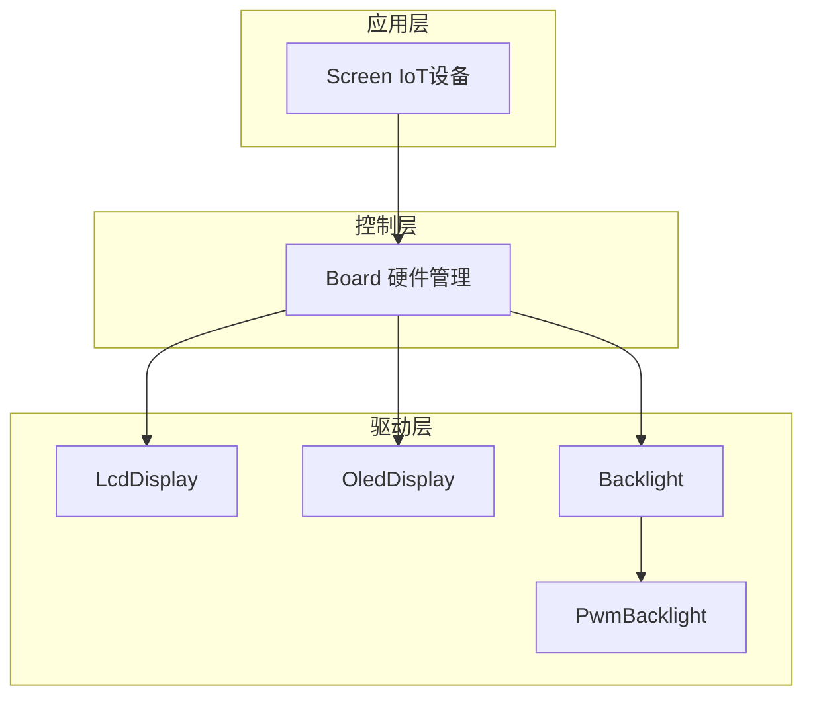
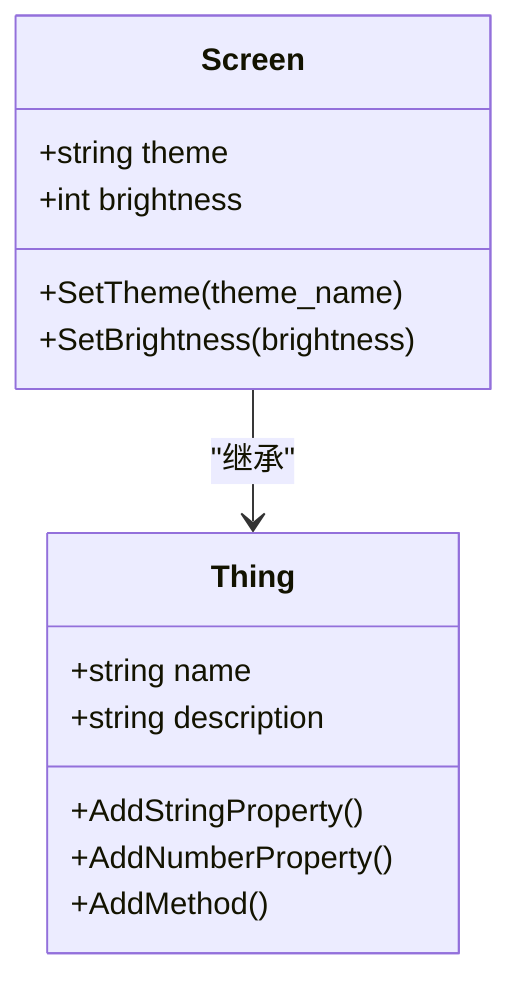
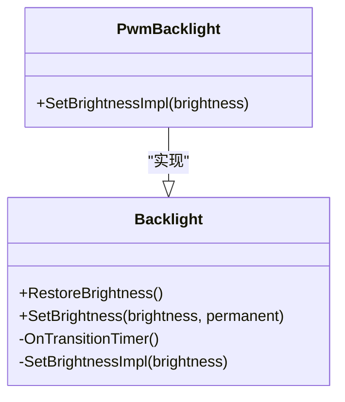
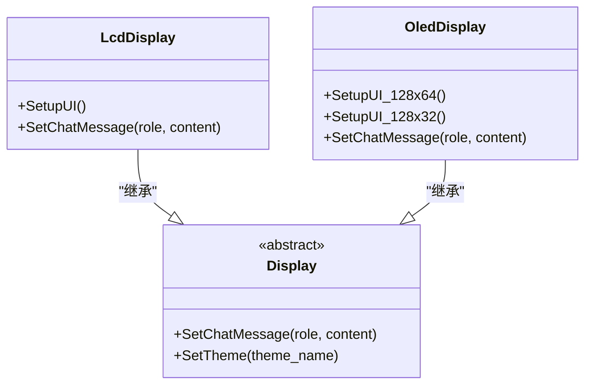
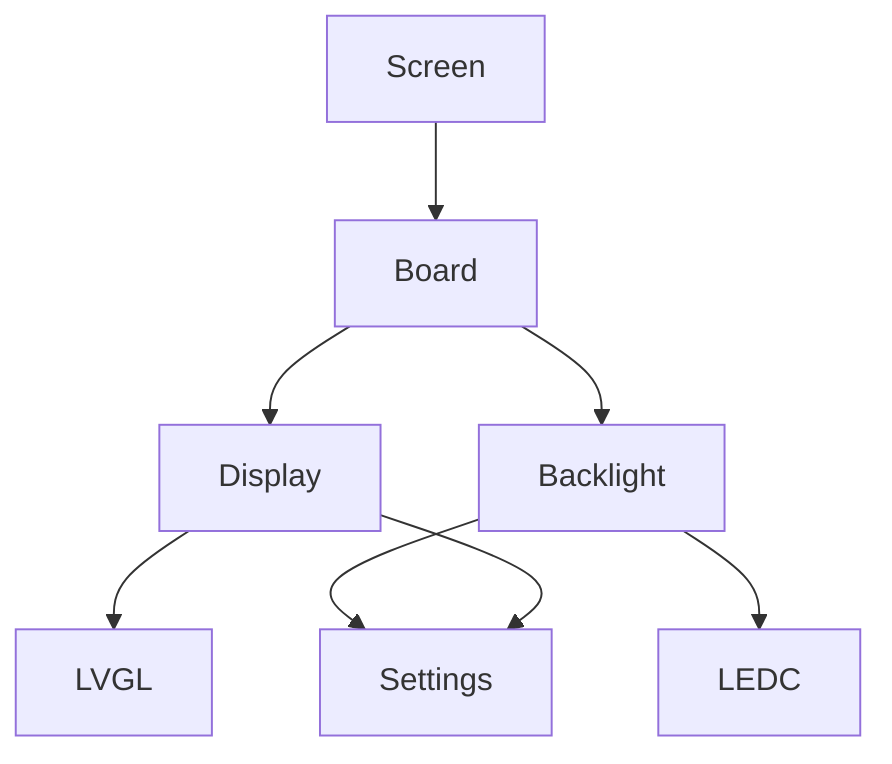
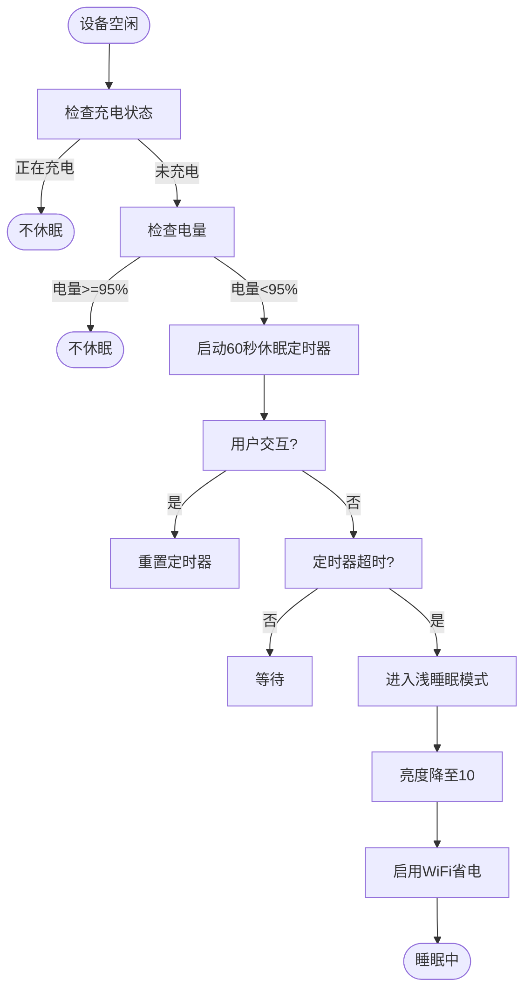

# 屏幕设备实现

<cite>
**本文档引用的文件**   
- [screen.cc](file://main/iot/things/screen.cc#L1-L54)
- [backlight.cc](file://main/boards/common/backlight.cc#L0-L121)
- [backlight.h](file://main/boards/common/backlight.h#L0-L36)
- [lcd_display.cc](file://main/display/lcd_display.cc#L0-L844)
- [oled_display.cc](file://main/display/oled_display.cc#L0-L310)
- [oled_display.h](file://main/display/oled_display.h#L0-L37)
- [abrobot-1.28tft-wifi.cc](file://main/boards/moon/abrobot-1.28tft-wifi.cc#L2018-L2053)
</cite>

## 目录
1. [项目结构](#项目结构)
2. [核心组件](#核心组件)
3. [架构概述](#架构概述)
4. [详细组件分析](#详细组件分析)
5. [依赖关系分析](#依赖关系分析)
6. [性能考量](#性能考量)
7. [故障排除指南](#故障排除指南)
8. [结论](#结论)

## 项目结构
项目采用模块化设计，主要分为以下几个核心模块：
- **main**: 主应用程序逻辑，包含设备控制、显示管理、音频处理等。
- **boards**: 不同硬件板的配置和驱动实现。
- **display**: 显示模块，包含LCD和OLED显示驱动。
- **iot**: 物联网设备抽象层，将屏幕等硬件抽象为可远程控制的“事物”。
- **boards/common**: 通用硬件驱动，如背光控制。

屏幕相关的功能主要分布在 `main/display` 和 `main/iot/things` 目录下，通过 `Board` 单例进行统一管理。

**Section sources**
- [project_structure](file://workspace_path)

## 核心组件
屏幕设备的核心功能由以下几个组件协同实现：
- **Screen (IoT设备)**: 提供远程控制接口，允许设置主题和亮度。
- **LcdDisplay/OledDisplay**: 具体的显示驱动，负责UI渲染和显示控制。
- **Backlight/PwmBacklight**: 背光控制模块，负责调节屏幕亮度。
- **Board**: 硬件抽象层，集中管理显示和背光实例。

这些组件通过清晰的接口进行交互，实现了高内聚、低耦合的设计。

**Section sources**
- [screen.cc](file://main/iot/things/screen.cc#L1-L54)
- [lcd_display.cc](file://main/display/lcd_display.cc#L0-L844)
- [backlight.cc](file://main/boards/common/backlight.cc#L0-L121)

## 架构概述
系统采用分层架构，从上到下分为：
1. **应用层 (IoT)**: 通过 `Screen` 类暴露RESTful风格的控制接口。
2. **控制层 (Board)**: 作为硬件访问的单一入口，管理显示和背光对象。
3. **驱动层 (Display/Backlight)**: 直接与硬件和LVGL图形库交互，实现具体功能。

这种架构确保了业务逻辑与硬件细节的分离，提高了代码的可维护性和可扩展性。

**Diagram sources**
- [screen.cc](file://main/iot/things/screen.cc#L1-L54)
- [backlight.h](file://main/boards/common/backlight.h#L0-L36)
- [lcd_display.cc](file://main/display/lcd_display.cc#L0-L844)

## 详细组件分析

### 屏幕设备 (Screen) 分析
`Screen` 类继承自 `Thing`，代表一个可被远程控制的物联网设备。它通过属性（Properties）和方法（Methods）暴露其功能。

#### 属性
- **theme**: 字符串属性，表示当前屏幕主题（light/dark）。
- **brightness**: 数值属性，表示当前亮度百分比。

#### 方法
- **SetTheme**: 接收主题名称参数，调用 `Display::SetTheme` 切换主题。
- **SetBrightness**: 接收亮度值参数，调用 `Backlight::SetBrightness` 调节亮度。

**Diagram sources**
- [screen.cc](file://main/iot/things/screen.cc#L1-L54)

**Section sources**
- [screen.cc](file://main/iot/things/screen.cc#L1-L54)

### 背光控制 (Backlight) 分析
背光控制模块采用面向对象设计，`Backlight` 是抽象基类，`PwmBacklight` 是其具体实现。

#### Backlight 类
- **功能**: 提供亮度调节的公共接口和渐变动画逻辑。
- **关键方法**:
  - `SetBrightness(brightness, permanent)`: 设置目标亮度，可选择是否持久化。
  - `RestoreBrightness()`: 从设置中恢复上次的亮度值。
  - `OnTransitionTimer()`: 定时器回调，实现亮度的平滑过渡。

#### PwmBacklight 类
- **功能**: 使用ESP32的LEDC外设通过PWM信号控制背光电流。
- **关键实现**:
  - 在构造函数中配置LEDC定时器（25kHz频率）和通道。
  - `SetBrightnessImpl(brightness)`: 将0-100的亮度值转换为10位PWM占空比（0-1023）并更新。

**Diagram sources**
- [backlight.h](file://main/boards/common/backlight.h#L0-L36)
- [backlight.cc](file://main/boards/common/backlight.cc#L83-L108)

**Section sources**
- [backlight.cc](file://main/boards/common/backlight.cc#L0-L121)
- [backlight.h](file://main/boards/common/backlight.h#L0-L36)

### 显示驱动 (Display) 分析
显示驱动模块负责UI的渲染和布局，支持LCD和OLED两种技术。

#### LCD 显示 (LcdDisplay)
- **UI布局**: 采用Flex布局，分为状态栏和内容区。
- **主题管理**: 定义了明暗两种主题的颜色方案，通过 `SetTheme` 方法切换。
- **消息气泡**: 实现了类似微信的聊天气泡，根据角色（user/assistant/system）使用不同颜色和对齐方式。
- **内存管理**: 限制最大消息数（20条），自动删除最早的消息以防止内存溢出。

#### OLED 显示 (OledDisplay)
- **UI布局**: 针对小尺寸屏幕（128x32/128x64）优化，左侧显示图标，右侧显示滚动文本。
- **单色显示**: 配置LVGL为单色模式，适应OLED特性。
- **文本滚动**: 对长文本启用循环滚动动画，确保信息完整显示。

**Diagram sources**
- [lcd_display.cc](file://main/display/lcd_display.cc#L0-L844)
- [oled_display.cc](file://main/display/oled_display.cc#L0-L310)
- [oled_display.h](file://main/display/oled_display.h#L0-L37)

**Section sources**
- [lcd_display.cc](file://main/display/lcd_display.cc#L0-L844)
- [oled_display.cc](file://main/display/oled_display.cc#L0-L310)

## 依赖关系分析
系统各组件间的依赖关系清晰，形成了稳定的调用链。

**Diagram sources**
- [screen.cc](file://main/iot/things/screen.cc#L1-L54)
- [backlight.cc](file://main/boards/common/backlight.cc#L0-L121)
- [lcd_display.cc](file://main/display/lcd_display.cc#L0-L844)

**Section sources**
- [screen.cc](file://main/iot/things/screen.cc#L1-L54)
- [backlight.cc](file://main/boards/common/backlight.cc#L0-L121)
- [lcd_display.cc](file://main/display/lcd_display.cc#L0-L844)

## 性能考量
### 低内存环境优化
- **双缓冲**: LCD驱动中可选择启用双缓冲，平衡性能与内存占用。
- **消息限制**: 限制聊天消息数量，防止动态创建对象导致内存碎片。
- **资源复用**: 使用 `DisplayLockGuard` 确保LVGL操作的线程安全，避免频繁加锁开销。

### 功耗差异与控制策略
- **LCD vs OLED**: OLED在显示黑色时像素点完全关闭，功耗远低于LCD。因此，在暗色主题下，OLED设备功耗优势明显。
- **休眠策略**: 在 `abrobot-1.28tft-wifi.cc` 中实现了智能休眠机制：
  - **触发条件**: 设备处于时钟页面且长时间无用户交互。
  - **防误触发**: 检查充电状态和电量，插电或电量高时不进入休眠。
  - **浅睡眠模式**: 降低亮度至10%，启用WiFi省电模式，保持时钟正常运行。
  - **唤醒机制**: 用户交互（如触摸）立即唤醒，恢复原亮度。

**Diagram sources**
- [abrobot-1.28tft-wifi.cc](file://main/boards/moon/abrobot-1.28tft-wifi.cc#L510-L605)
- [abrobot-1.28tft-wifi.cc](file://main/boards/moon/abrobot-1.28tft-wifi.cc#L2018-L2053)

**Section sources**
- [abrobot-1.28tft-wifi.cc](file://main/boards/moon/abrobot-1.28tft-wifi.cc#L510-L605)
- [abrobot-1.28tft-wifi.cc](file://main/boards/moon/abrobot-1.28tft-wifi.cc#L2018-L2053)

## 故障排除指南
### 常见问题
1. **屏幕不亮**
   - 检查 `esp_lcd_panel_disp_on_off` 调用是否成功。
   - 确认背光GPIO配置正确，PWM信号正常输出。
2. **亮度调节无效**
   - 检查 `PwmBacklight` 构造函数中的GPIO引脚和定时器配置。
   - 确认 `SetBrightnessImpl` 中的占空比计算无误。
3. **UI显示错乱**
   - 确保LVGL端口初始化成功。
   - 检查显示分辨率、偏移量和旋转设置是否与硬件匹配。

**Section sources**
- [lcd_display.cc](file://main/display/lcd_display.cc#L0-L844)
- [backlight.cc](file://main/boards/common/backlight.cc#L0-L121)

## 结论
本系统实现了功能完整、架构清晰的屏幕设备控制方案。通过 `Screen` IoT设备暴露控制接口，`Board` 统一管理硬件资源，`Display` 和 `Backlight` 模块分别负责UI渲染和亮度调节。系统充分考虑了不同显示技术（LCD/OLED）的特性，在功耗、性能和用户体验之间取得了良好平衡。特别是智能休眠机制，有效延长了电池供电设备的续航时间。