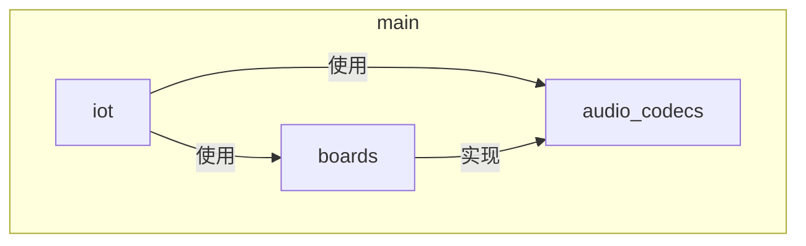
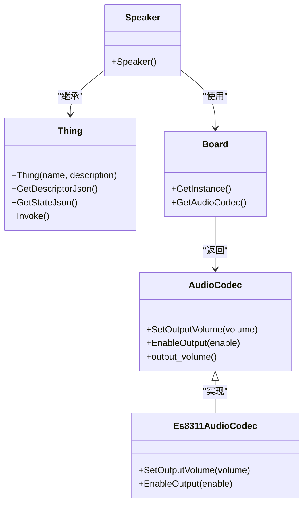
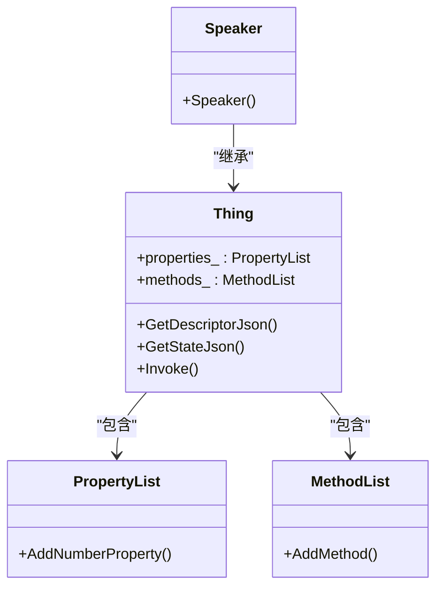
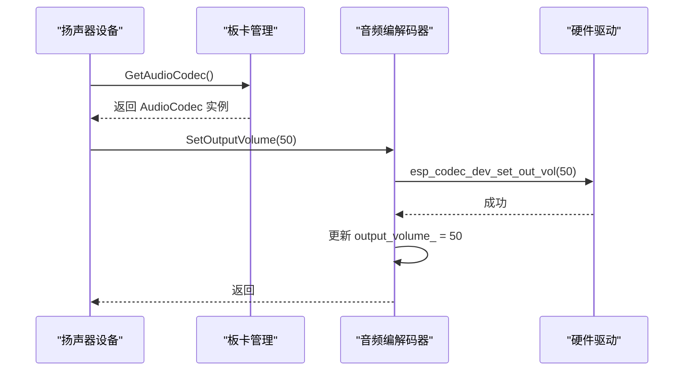
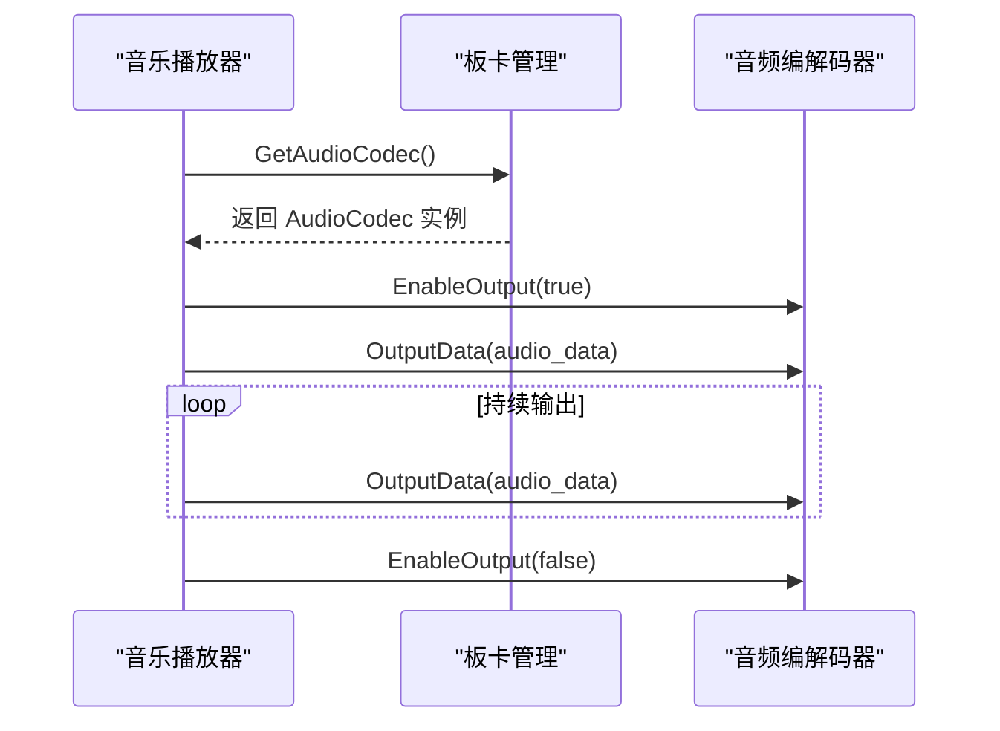
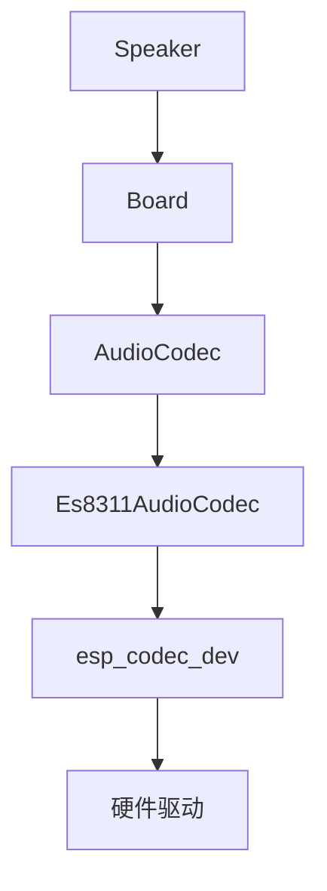

# 扬声器设备实现

<cite>
**本文档中引用的文件**   
- [speaker.cc](file://main\iot\things\speaker.cc)
- [audio_codec.h](file://main\audio_codecs\audio_codec.h)
- [es8311_audio_codec.cc](file://main\audio_codecs\es8311_audio_codec.cc)
- [board.h](file://main\boards\common\board.h)
- [thing.h](file://main\iot\thing.h)
- [music_player.cc](file://main\iot\things\music_player.cc)
- [alarm.cc](file://main\iot\things\alarm.cc)
- [AlarmClock.cc](file://main\AlarmClock\AlarmClock.cc)
</cite>

## 目录
1. [项目结构](#项目结构)
2. [核心组件](#核心组件)
3. [架构概述](#架构概述)
4. [详细组件分析](#详细组件分析)
5. [依赖分析](#依赖分析)
6. [性能考虑](#性能考虑)
7. [故障排除指南](#故障排除指南)

## 项目结构

本项目采用模块化设计，将功能按目录组织。`main` 目录下包含 `iot`、`audio_codecs`、`boards` 等关键模块。`iot` 目录存放物联网设备的实现，其中 `things` 子目录包含了 `speaker.cc` 这个核心文件。`audio_codecs` 目录定义了与音频编解码器交互的接口和具体实现。`boards` 目录则包含了针对不同硬件板卡的适配代码。



**图示来源**
- [speaker.cc](file://main\iot\things\speaker.cc)
- [audio_codec.h](file://main\audio_codecs\audio_codec.h)
- [board.h](file://main\boards\common\board.h)

**本节来源**
- [speaker.cc](file://main\iot\things\speaker.cc)
- [audio_codec.h](file://main\audio_codecs\audio_codec.h)

## 核心组件

扬声器设备的核心功能由 `speaker.cc` 文件中的 `Speaker` 类实现。该类继承自 `Thing` 基类，通过定义属性和方法来暴露其功能。`Speaker` 类的核心职责是管理音量，并通过 `Board` 单例获取底层的 `AudioCodec` 实例来执行实际的硬件操作。

```cpp
class Speaker : public Thing {
public:
    Speaker() : Thing("Speaker", "扬声器") {
        properties_.AddNumberProperty("volume", "当前音量值", [this]() -> int {
            auto codec = Board::GetInstance().GetAudioCodec();
            return codec->output_volume();
        });

        methods_.AddMethod("SetVolume", "设置音量", ParameterList({
            Parameter("volume", "0到100之间的整数", kValueTypeNumber, true)
        }), [this](const ParameterList& parameters) {
            auto codec = Board::GetInstance().GetAudioCodec();
            codec->SetOutputVolume(static_cast<uint8_t>(parameters["volume"].number()));
        });
    }
};
```

**本节来源**
- [speaker.cc](file://main\iot\things\speaker.cc)
- [thing.h](file://main\iot\thing.h)

## 架构概述

整个扬声器系统的架构遵循分层设计原则。顶层是 `Speaker` 设备，它作为物联网设备暴露接口。中间层是 `Board` 抽象，它负责管理硬件板卡的特定实现。底层是 `AudioCodec` 接口及其具体实现（如 `Es8311AudioCodec`），它们直接与硬件进行交互。



**图示来源**
- [speaker.cc](file://main\iot\things\speaker.cc)
- [board.h](file://main\boards\common\board.h)
- [audio_codec.h](file://main\audio_codecs\audio_codec.h)
- [es8311_audio_codec.cc](file://main\audio_codecs\es8311_audio_codec.cc)

## 详细组件分析

### 扬声器设备分析

`Speaker` 类通过 `Thing` 基类提供的机制，定义了 `volume` 属性和 `SetVolume` 方法。`volume` 属性的获取器（getter）会通过 `Board` 单例获取 `AudioCodec` 实例，并调用其 `output_volume()` 方法来获取当前音量。`SetVolume` 方法的回调函数则会调用 `AudioCodec` 的 `SetOutputVolume` 方法来设置新音量。

#### 扬声器状态与控制类图


**图示来源**
- [speaker.cc](file://main\iot\things\speaker.cc)
- [thing.h](file://main\iot\thing.h)

**本节来源**
- [speaker.cc](file://main\iot\things\speaker.cc)
- [thing.h](file://main\iot\thing.h)

### 音频编解码器分析

`AudioCodec` 是一个抽象基类，定义了音量控制、输入/输出使能等核心接口。`Es8311AudioCodec` 是其实现之一，它在 `SetOutputVolume` 方法中调用底层驱动 `esp_codec_dev_set_out_vol` 来设置音量，并更新基类的 `output_volume_` 成员变量。

#### 音频编解码器音量设置序列图


**图示来源**
- [speaker.cc](file://main\iot\things\speaker.cc)
- [es8311_audio_codec.cc](file://main\audio_codecs\es8311_audio_codec.cc)

**本节来源**
- [audio_codec.h](file://main\audio_codecs\audio_codec.h)
- [es8311_audio_codec.cc](file://main\audio_codecs\es8311_audio_codec.cc)

### 与其他设备的协同工作分析

扬声器设备需要与音乐播放器、闹钟等其他需要发声的设备协同工作。这种协同主要通过共享同一个 `AudioCodec` 实例来实现。当音乐播放器或闹钟需要播放声音时，它们会间接地通过 `Board` 获取 `AudioCodec` 并控制其输出。

#### 与音乐播放器协同工作序列图


**图示来源**
- [music_player.cc](file://main\iot\things\music_player.cc)
- [es8311_audio_codec.cc](file://main\audio_codecs\es8311_audio_codec.cc)

**本节来源**
- [music_player.cc](file://main\iot\things\music_player.cc)
- [alarm.cc](file://main\iot\things\alarm.cc)

## 依赖分析

`Speaker` 类依赖于 `Board` 和 `AudioCodec` 两个关键组件。`Board` 类是一个抽象基类，其具体实现由不同的板卡文件（如 `esp_box_board.cc`）提供，这些实现会重写 `GetAudioCodec()` 方法以返回特定于该板卡的 `AudioCodec` 实例。`AudioCodec` 的具体实现（如 `Es8311AudioCodec`）则依赖于 ESP-IDF 的音频驱动库。



**图示来源**
- [speaker.cc](file://main\iot\things\speaker.cc)
- [board.h](file://main\boards\common\board.h)
- [es8311_audio_codec.cc](file://main\audio_codecs\es8311_audio_codec.cc)

**本节来源**
- [speaker.cc](file://main\iot\things\speaker.cc)
- [board.h](file://main\boards\common\board.h)
- [audio_codec.h](file://main\audio_codecs\audio_codec.h)

## 性能考虑

音量调节范围为0-100，由 `AudioCodec` 的 `SetOutputVolume` 方法处理。该方法会将输入的整数映射到硬件支持的音量级别。为防止音频失真和爆音，系统在启用或禁用输出时会进行相应的硬件配置。例如，在 `Es8311AudioCodec` 的 `EnableOutput` 方法中，开启输出时会先调用 `esp_codec_dev_open` 打开设备，然后设置音量，最后通过 `gpio_set_level` 打开功放（PA）引脚。关闭时则按相反顺序操作，先关闭功放，再关闭设备，这有助于消除开关瞬间的爆音。

## 故障排除指南

- **问题：设置音量后没有反应**
  - **检查点**：确认 `Board` 的具体实现是否正确返回了 `AudioCodec` 实例。检查 `GetAudioCodec()` 方法的实现。
- **问题：播放声音时有爆音**
  - **检查点**：确认 `EnableOutput` 方法的执行顺序是否正确。应确保在打开I2S通道前打开功放，在关闭I2S通道后关闭功放。
- **问题：无法获取当前音量**
  - **检查点**：检查 `output_volume()` 方法的返回值是否被正确更新。在 `SetOutputVolume` 调用后，基类的 `output_volume_` 成员变量应被同步更新。

**本节来源**
- [es8311_audio_codec.cc](file://main\audio_codecs\es8311_audio_codec.cc)
- [audio_codec.h](file://main\audio_codecs\audio_codec.h)