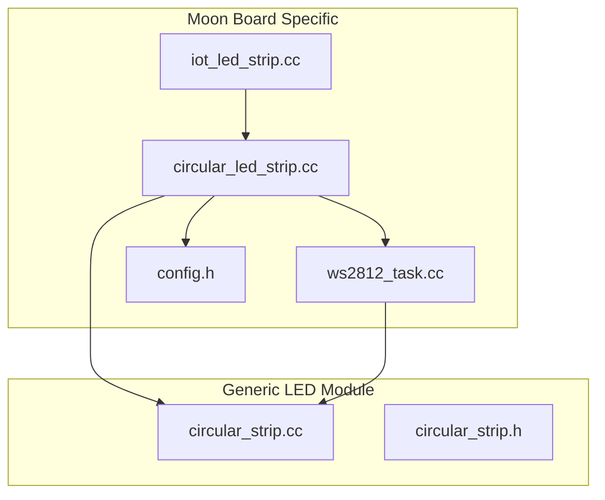
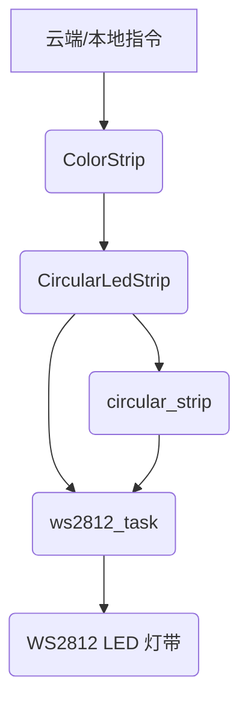
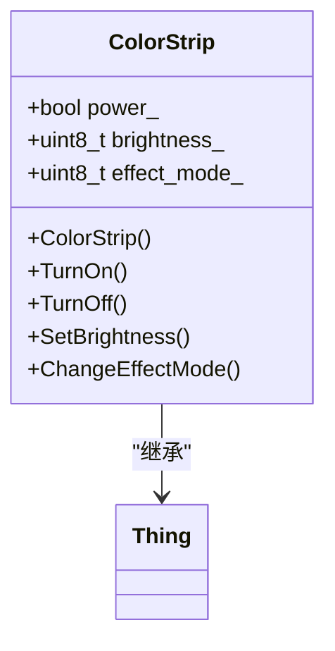
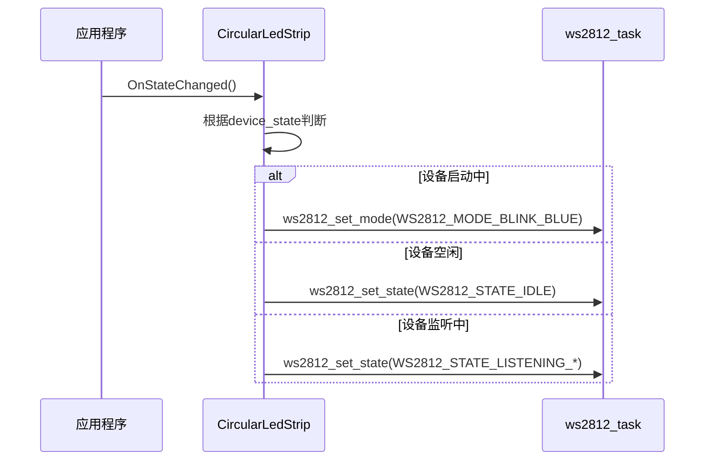
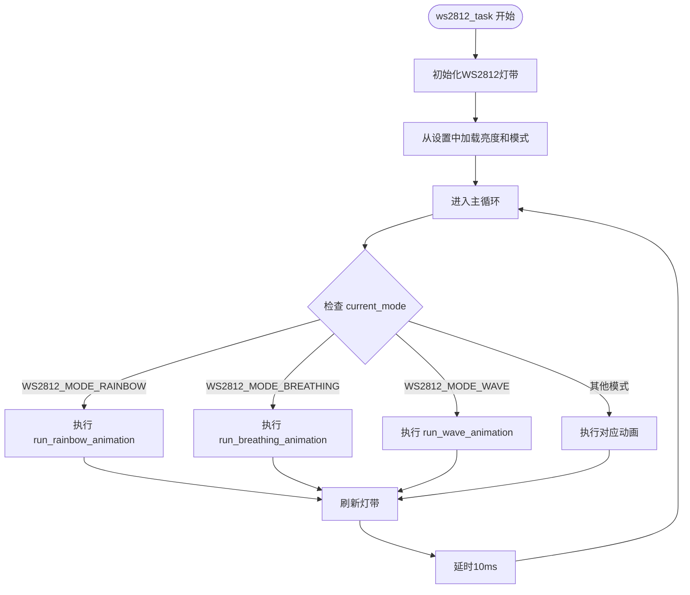
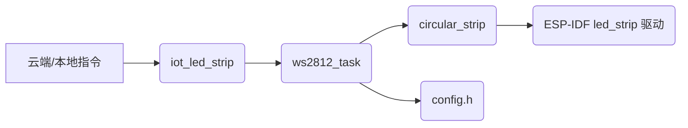

# 灯光设备实现

<cite>
**本文档中引用的文件**   
- [iot_led_strip.cc](file://main/boards/moon/iot_led_strip.cc)
- [circular_led_strip.cc](file://main/boards/moon/circular_led_strip.cc)
- [circular_led_strip.h](file://main/boards/moon/circular_led_strip.h)
- [ws2812_task.cc](file://main/boards/moon/ws2812_task.cc)
- [ws2812_task.h](file://main/boards/moon/ws2812_task.h)
- [circular_strip.cc](file://main/led/circular_strip.cc)
- [circular_strip.h](file://main/led/circular_strip.h)
- [config.h](file://main/boards/moon/config.h)
</cite>

## 目录
1. [项目结构](#项目结构)
2. [核心组件](#核心组件)
3. [架构概述](#架构概述)
4. [详细组件分析](#详细组件分析)
5. [依赖分析](#依赖分析)

## 项目结构
根据项目目录结构，灯光设备的实现主要集中在 `main/boards/moon` 目录下，该目录专为 moon 开发板定制了灯光控制逻辑。核心文件包括：
- `iot_led_strip.cc`：定义了可联网控制的彩灯设备 `ColorStrip`
- `circular_led_strip.cc` 和 `circular_led_strip.h`：实现了 moon 板子上圆形LED灯带的具体控制
- `ws2812_task.cc` 和 `ws2812_task.h`：提供了WS2812灯带的底层驱动和多种动态效果
- `config.h`：定义了硬件相关的GPIO引脚和参数

此外，通用的LED控制模块位于 `main/led` 目录下，其中 `circular_strip.cc` 提供了圆形灯带的基类功能。



**图源**
- [iot_led_strip.cc](file://main/boards/moon/iot_led_strip.cc)
- [circular_led_strip.cc](file://main/boards/moon/circular_led_strip.cc)
- [ws2812_task.cc](file://main/boards/moon/ws2812_task.cc)
- [circular_strip.cc](file://main/led/circular_strip.cc)

**节源**
- [iot_led_strip.cc](file://main/boards/moon/iot_led_strip.cc)
- [circular_led_strip.cc](file://main/boards/moon/circular_led_strip.cc)
- [ws2812_task.cc](file://main/boards/moon/ws2812_task.cc)
- [circular_strip.cc](file://main/led/circular_strip.cc)

## 核心组件
本项目的核心是 `ColorStrip` 类，它代表了一个可通过云端或本地指令控制的智能彩灯设备。该类继承自 `Thing`，使其具备物联网设备的属性和方法。其主要功能包括：
- **开关控制**：通过 `TurnOn` 和 `TurnOff` 方法实现
- **亮度调节**：通过 `SetBrightness` 方法，以0-100的整数调节
- **灯效切换**：通过 `ChangeEffectMode` 方法循环切换预设的动态效果

这些功能的实现依赖于底层的 `ws2812_task` 模块，该模块负责直接与WS2812灯带硬件通信。

**节源**
- [iot_led_strip.cc](file://main/boards/moon/iot_led_strip.cc#L20-L80)

## 架构概述
整个灯光控制系统采用分层架构，从上到下分为：
1. **设备抽象层** (`ColorStrip`)：提供用户和云端交互的接口
2. **板级控制层** (`CircularLedStrip`)：处理与特定开发板（moon）相关的状态响应
3. **驱动与效果层** (`ws2812_task`)：管理WS2812灯带的底层驱动和丰富的动态效果
4. **硬件抽象层** (`circular_strip`)：提供对圆形LED灯带的通用控制方法



**图源**
- [iot_led_strip.cc](file://main/boards/moon/iot_led_strip.cc)
- [circular_led_strip.cc](file://main/boards/moon/circular_led_strip.cc)
- [ws2812_task.cc](file://main/boards/moon/ws2812_task.cc)
- [circular_strip.cc](file://main/led/circular_strip.cc)

## 详细组件分析
### ColorStrip 类分析
`ColorStrip` 类是智能彩灯的逻辑核心，它定义了设备的属性和可执行的方法。

#### 属性
- **power**：布尔值，表示彩灯是否开启
- **brightness**：整数值（0-100），表示当前亮度
- **effect_mode**：整数值，表示当前的灯效模式

#### 方法
- **TurnOn**：开启彩灯，调用 `ws2812_turn_on()` 
- **TurnOff**：关闭彩灯，调用 `ws2812_turn_off()` 
- **SetBrightness**：设置亮度，调用 `ws2812_set_brightness(brightness)` 
- **ChangeEffectMode**：切换灯效模式，调用 `ws2812_set_wave_mode(effect_mode_)` 



**图源**
- [iot_led_strip.cc](file://main/boards/moon/iot_led_strip.cc#L20-L80)

**节源**
- [iot_led_strip.cc](file://main/boards/moon/iot_led_strip.cc#L20-L80)

### CircularLedStrip 类分析
`CircularLedStrip` 类是 `Led` 类的子类，专门用于控制 moon 板子上的圆形LED灯带。它通过 `OnStateChanged` 方法响应设备状态的变化。

#### 设备状态响应
当设备状态改变时，`OnStateChanged` 方法会被调用，根据不同的状态设置不同的灯效：
- **启动中/连接中**：蓝色闪烁 (`WS2812_MODE_BLINK_BLUE`)
- **空闲**：呼吸灯模式 (`WS2812_STATE_IDLE`)
- **监听中（无声）**：微光模式 (`WS2812_STATE_LISTENING_NO_VOICE`)
- **监听中（有声）**：根据律动模式选择跑马灯、波浪等效果
- **说话中**：根据律动模式选择颜色追逐、颜色波浪等效果
- **升级中/激活中**：绿色闪烁 (`WS2812_MODE_BLINK_GREEN`)



**图源**
- [circular_led_strip.cc](file://main/boards/moon/circular_led_strip.cc#L19-L58)
- [ws2812_task.cc](file://main/boards/moon/ws2812_task.cc)

**节源**
- [circular_led_strip.cc](file://main/boards/moon/circular_led_strip.cc#L19-L58)

### ws2812_task 模块分析
`ws2812_task` 是整个灯光系统的核心驱动，它在一个独立的FreeRTOS任务中运行，循环执行当前模式的动画。

#### 亮度调节实现
亮度调节通过 `ws2812_set_brightness` 函数实现。该函数接收一个0-100的整数作为亮度值，并将其存储在全局变量 `global_brightness` 中。在渲染每个动画时，会调用 `apply_brightness` 函数，将原始的RGB值按比例缩放。

```c++
extern "C" void ws2812_set_brightness(uint8_t brightness) {
    if (brightness <= 100) {
        global_brightness = brightness;
        Settings settings("led_strip", true);
        settings.SetInt("brightness", brightness);
        ESP_LOGI(TAG, "设置WS2812亮度: %d", brightness);
    } else {
        ESP_LOGE(TAG, "无效的亮度值: %d, 有效范围为0-100", brightness);
    }
}
```

#### 灯效模式实现
灯效模式通过 `ws2812_set_wave_mode` 函数切换。该函数将模式编号存储在 `current_wave_mode` 变量中，并调用 `update_led_mode_by_state()` 来更新当前的灯带模式。例如，当设备处于“监听且有声”状态时，不同的 `current_wave_mode` 会对应 `WS2812_MODE_CHASE`、`WS2812_MODE_WAVE` 等不同的动画。

```c++
extern "C" void ws2812_set_wave_mode(int mode) {
    if (mode < WAVE_MODE_MAX) {
        current_wave_mode = mode;
        update_led_mode_by_state(); // 关键：根据状态和模式更新实际的灯带模式
        Settings settings("led_strip", true);
        settings.SetInt("effect_mode", mode);
        ESP_LOGI(TAG, "设置WS2812律动模式: %d", mode);
    } else {
        ESP_LOGE(TAG, "无效的WS2812律动模式: %d", mode);
    }
}
```

#### 动态灯光效果
`ws2812_task` 实现了超过30种动态效果，包括：
- **彩虹模式** (`WS2812_MODE_RAINBOW`)：LED灯带呈现流动的彩虹色
- **呼吸灯模式** (`WS2812_MODE_BREATHING`)：LED灯带亮度周期性变化，模拟呼吸
- **波浪效果** (`WS2812_MODE_WAVE`)：亮度像波浪一样在灯带上移动
- **彗星效果** (`WS2812_MODE_COMET`)：一个亮点在灯带上移动，后面拖着渐暗的尾巴

这些效果在 `ws2812_task` 的主循环中，根据 `current_mode` 变量的值来调用相应的动画函数。



**图源**
- [ws2812_task.cc](file://main/boards/moon/ws2812_task.cc)

**节源**
- [ws2812_task.cc](file://main/boards/moon/ws2812_task.cc)

## 依赖分析
系统中的组件依赖关系清晰，形成了一个稳定的调用链。



- `iot_led_strip` 依赖于 `ws2812_task` 来执行具体的灯光操作。
- `ws2812_task` 依赖于 `circular_strip` 提供的通用灯带控制接口（如 `led_strip_set_pixel`）和 `config.h` 中定义的硬件引脚（如 `BUILTIN_LED_GPIO`）。
- `circular_strip` 最终依赖于ESP-IDF提供的 `led_strip` 驱动库来与硬件通信。

这种分层设计使得代码具有良好的可维护性和可扩展性。例如，要为另一块开发板添加支持，只需创建一个新的 `circular_led_strip` 实现，而无需修改 `ws2812_task` 或 `iot_led_strip`。

**图源**
- [iot_led_strip.cc](file://main/boards/moon/iot_led_strip.cc)
- [ws2812_task.cc](file://main/boards/moon/ws2812_task.cc)
- [circular_strip.cc](file://main/led/circular_strip.cc)
- [config.h](file://main/boards/moon/config.h)

**节源**
- [iot_led_strip.cc](file://main/boards/moon/iot_led_strip.cc)
- [ws2812_task.cc](file://main/boards/moon/ws2812_task.cc)
- [circular_strip.cc](file://main/led/circular_strip.cc)
- [config.h](file://main/boards/moon/config.h)