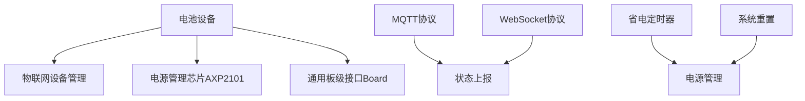
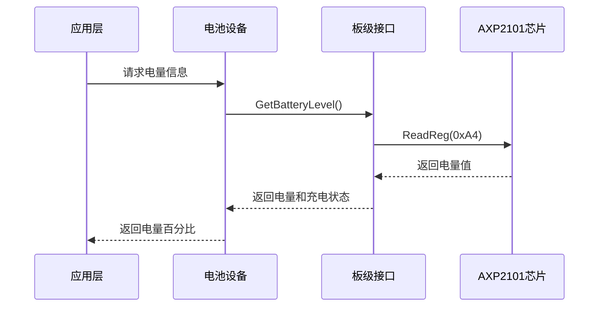
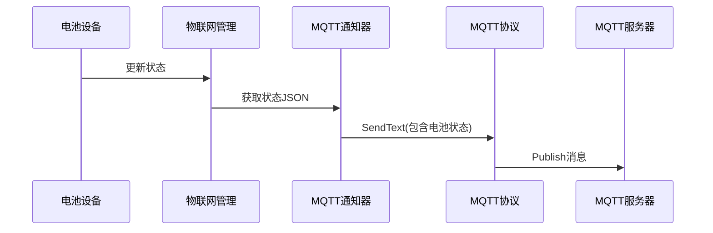
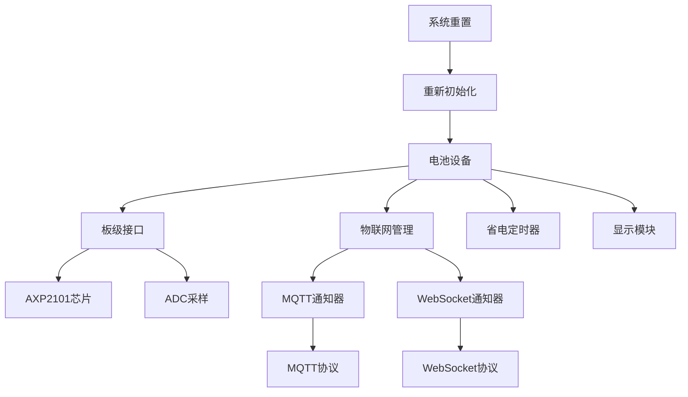

# 电池设备实现

<cite>
**本文档引用的文件**  
- [battery.cc](file://main/iot/things/battery.cc)
- [board.h](file://main/boards/common/board.h)
- [axp2101.h](file://main/boards/common/axp2101.h)
- [axp2101.cc](file://main/boards/common/axp2101.cc)
- [mqtt_notifier.cc](file://main/notifications/mqtt_notifier.cc)
- [mqtt_protocol.cc](file://main/protocols/mqtt_protocol.cc)
- [websocket_protocol.cc](file://main/protocols/websocket_protocol.cc)
- [power_save_timer.cc](file://main/boards/common/power_save_timer.cc)
- [system_reset.cc](file://main/boards/common/system_reset.cc)
- [power_manager.h](file://main/boards/magiclick-2p5/power_manager.h)
- [power_manager.h](file://main/boards/moon/power_manager.h)
- [power_manager.h](file://main/boards/du-chatx/power_manager.h)
- [power_manager.h](file://main/boards/xingzhi-cube-1.54tft-wifi/power_manager.h)
- [display.cc](file://main/display/display.cc)
</cite>

## 目录
1. [项目结构分析](#项目结构分析)
2. [核心组件分析](#核心组件分析)
3. [电池电量获取机制](#电池电量获取机制)
4. [电池状态上报机制](#电池状态上报机制)
5. [低电量预警逻辑](#低电量预警逻辑)
6. [与其他电源管理模块的协同工作](#与其他电源管理模块的协同工作)
7. [精度优化与功耗平衡策略](#精度优化与功耗平衡策略)

## 项目结构分析

本项目采用模块化设计，主要功能模块分布在`main`目录下。电池管理功能位于`main/iot/things/battery.cc`，属于物联网设备管理的一部分。电源管理相关的硬件驱动和通用功能位于`main/boards/common`目录下，包括AXP2101电源管理芯片驱动、省电定时器和系统重置模块。



**图示来源**  
- [battery.cc](file://main/iot/things/battery.cc)
- [axp2101.cc](file://main/boards/common/axp2101.cc)
- [board.h](file://main/boards/common/board.h)

**本节来源**  
- [battery.cc](file://main/iot/things/battery.cc)
- [board.h](file://main/boards/common/board.h)

## 核心组件分析

电池设备的核心实现位于`battery.cc`文件中，通过继承`Thing`类实现物联网设备的通用接口。该类通过`Board`单例获取系统电池信息，并提供电量百分比和充电状态两个属性。

```cpp
class Battery : public Thing {
private:
    int level_ = 0;
    bool charging_ = false;
    bool discharging_ = false;

public:
    Battery() : Thing("Battery", "电池管理") {
        properties_.AddNumberProperty("level", "当前电量百分比", [this]() -> int {
            auto& board = Board::GetInstance();
            if (board.GetBatteryLevel(level_, charging_, discharging_)) {
                return level_;
            }
            return 0;
        });
        properties_.AddBooleanProperty("charging", "是否充电中", [this]() -> int {
            return charging_;
        });
    }
};
```

`Board`类作为硬件抽象层，定义了`GetBatteryLevel`虚函数，具体实现由各个开发板的派生类完成。这种设计实现了硬件无关的上层应用逻辑。

**本节来源**  
- [battery.cc](file://main/iot/things/battery.cc#L0-L34)
- [board.h](file://main/boards/common/board.h#L0-L56)

## 电池电量获取机制

### 基于AXP2101芯片的实现

对于支持AXP2101电源管理芯片的设备，电池电量通过I2C接口读取。AXP2101芯片提供直接的电量寄存器读取功能。

```cpp
int Axp2101::GetBatteryLevel() {
    return ReadReg(0xA4);
}
```

该实现直接从AXP2101的0xA4寄存器读取电池电量百分比值，范围为0-100%。同时通过读取0x01寄存器的特定位来判断充电状态。



**图示来源**  
- [battery.cc](file://main/iot/things/battery.cc#L0-L34)
- [axp2101.cc](file://main/boards/common/axp2101.cc#L0-L37)
- [axp2101.h](file://main/boards/common/axp2101.h#L0-L19)

### 基于ADC采样的实现

对于不使用专用PMU芯片的设备，通过ADC采样电池电压并转换为电量百分比。多个开发板（如magiclick-2p5、moon、du-chatx等）实现了类似的ADC采样逻辑。

```cpp
void ReadBatteryAdcData() {
    int adc_value;
    ESP_ERROR_CHECK(adc_oneshot_read(adc_handle_, ADC_CHANNEL_6, &adc_value));
    
    // 将ADC值添加到队列中
    adc_values_.push_back(adc_value);
    if (adc_values_.size() > kBatteryAdcDataCount) {
        adc_values_.erase(adc_values_.begin());
    }
    
    uint32_t average_adc = 0;
    for (auto value : adc_values_) {
        average_adc += value;
    }
    average_adc /= adc_values_.size();

    // 定义电池电量区间
    const struct {
        uint16_t adc;
        uint8_t level;
    } levels[] = {
        {1985, 0},
        {2079, 20},
        {2141, 40},
        {2296, 60},
        {2420, 80},
        {2606, 100}
    };

    // 低于最低值时
    if (average_adc < levels[0].adc) {
        battery_level_ = 0;
    }
    // 高于最高值时
    else if (average_adc >= levels[5].adc) {
        battery_level_ = 100;
    } else {
        // 线性插值计算中间值
        for (int i = 0; i < 5; i++) {
            if (average_adc >= levels[i].adc && average_adc < levels[i+1].adc) {
                float ratio = static_cast<float>(average_adc - levels[i].adc) / (levels[i+1].adc - levels[i].adc);
                battery_level_ = levels[i].level + ratio * (levels[i+1].level - levels[i].level);
                break;
            }
        }
    }
}
```

该实现采用以下策略：
1. 使用ADC单次读取模式采集电池电压
2. 维护一个ADC值队列进行平均滤波
3. 基于预定义的ADC-电量映射表进行线性插值计算

**本节来源**  
- [axp2101.cc](file://main/boards/common/axp2101.cc#L0-L37)
- [power_manager.h](file://main/boards/magiclick-2p5/power_manager.h#L38-L84)
- [power_manager.h](file://main/boards/moon/power_manager.h#L37-L74)

## 电池状态上报机制

### 上报频率与触发条件

电池状态的上报频率不是固定的定时上报，而是基于状态变化的智能上报机制。在`mqtt_notifier.cc`中，系统信息（包括电池状态）仅在状态发生变化时上报，避免频繁上报大量数据。

```cpp
// IoT设备状态（快照）：仅在状态变化时上报，避免频繁上报大量数据
static std::string last_iot_states_json;
auto& thing_manager = iot::ThingManager::GetInstance();
std::string iot_states_json;
thing_manager.GetStatesJson(iot_states_json, false);
```

对于ADC采样方式，电量读取频率由定时器控制。以magiclick-2p5为例，电池检查定时器每秒触发一次，但ADC采样每60秒执行一次。

```cpp
const int kBatteryAdcInterval = 60;
ticks_++;
if (ticks_ % kBatteryAdcInterval == 0) {
    ReadBatteryAdcData();
}
```

### 数据格式

电池状态以JSON格式上报，包含电量百分比、充电状态和放电状态。

```json
{
    "battery": {
        "level": 75,
        "charging": true,
        "discharging": false
    }
}
```

### 与MQTT协议的集成

通过`MqttProtocol`类实现与MQTT服务器的通信。电池状态作为系统信息的一部分，通过`SendText`方法发布到指定主题。

```cpp
bool MqttProtocol::SendText(const std::string& text) {
    if (publish_topic_.empty()) {
        return false;
    }
    if (!mqtt_->Publish(publish_topic_, text)) {
        ESP_LOGE(TAG, "Failed to publish message: %s", text.c_str());
        SetError(Lang::Strings::SERVER_ERROR);
        return false;
    }
    return true;
}
```

### 与WebSocket协议的集成

WebSocket协议的集成方式与MQTT类似，通过`WebsocketProtocol`类的`SendText`方法发送JSON格式的电池状态信息。

```cpp
bool WebsocketProtocol::SendText(const std::string& text) {
    if (websocket_ == nullptr) {
        return false;
    }

    if (!websocket_->Send(text)) {
        ESP_LOGE(TAG, "Failed to send text: %s", text.c_str());
        SetError(Lang::Strings::SERVER_ERROR);
        return false;
    }

    return true;
}
```



**图示来源**  
- [mqtt_notifier.cc](file://main/notifications/mqtt_notifier.cc#L162-L190)
- [mqtt_protocol.cc](file://main/protocols/mqtt_protocol.cc#L0-L199)
- [websocket_protocol.cc](file://main/protocols/websocket_protocol.cc#L0-L199)

**本节来源**  
- [mqtt_notifier.cc](file://main/notifications/mqtt_notifier.cc#L162-L190)
- [mqtt_protocol.cc](file://main/protocols/mqtt_protocol.cc#L0-L199)
- [websocket_protocol.cc](file://main/protocols/websocket_protocol.cc#L0-L199)

## 低电量预警逻辑

系统实现了多层次的低电量预警机制：

### 软件层预警

在`power_manager.h`中，当电量低于预设阈值（通常为20%）时，触发低电量状态变化回调。

```cpp
const int kLowBatteryLevel = 20;
// Check low battery status
if (adc_values_.size() >= kBatteryAdcDataCount) {
    bool new_low_battery_status = battery_level_ <= kLowBatteryLevel;
    if (new_low_battery_status != is_low_battery_) {
        is_low_battery_ = new_low_battery_status;
        if (on_low_battery_status_changed_) {
            on_low_battery_status_changed_(is_low_battery_);
        }
    }
}
```

### 用户界面预警

在`display.cc`中，当检测到低电量且处于放电状态时，显示低电量弹窗并播放提示音。

```cpp
if (low_battery_popup_ != nullptr) {
    if (strcmp(icon, FONT_AWESOME_BATTERY_EMPTY) == 0 && discharging) {
        if (lv_obj_has_flag(low_battery_popup_, LV_OBJ_FLAG_HIDDEN)) {
            lv_obj_clear_flag(low_battery_popup_, LV_OBJ_FLAG_HIDDEN);
            auto& app = Application::GetInstance();
            app.PlaySound(Lang::Sounds::P3_LOW_BATTERY);
        }
    } else {
        if (!lv_obj_has_flag(low_battery_popup_, LV_OBJ_FLAG_HIDDEN)) {
            lv_obj_add_flag(low_battery_popup_, LV_OBJ_FLAG_HIDDEN);
        }
    }
}
```

### 硬件层保护

虽然当前代码中未直接实现，但AXP2101芯片支持低电压关机功能，可通过`PowerOff()`方法实现硬件级保护。

```cpp
void Axp2101::PowerOff() {
    uint8_t value = ReadReg(0x10);
    value = value | 0x01;
    WriteReg(0x10, value);
}
```

**本节来源**  
- [power_manager.h](file://main/boards/magiclick-2p5/power_manager.h#L80-L116)
- [power_manager.h](file://main/boards/moon/power_manager.h#L100-L130)
- [display.cc](file://main/display/display.cc#L148-L177)

## 与其他电源管理模块的协同工作

### 与省电定时器的协同

`PowerSaveTimer`模块通过定时检查系统状态，当满足省电条件时降低CPU频率或进入睡眠模式。电池状态是决定是否进入省电模式的重要因素之一。

```cpp
void PowerSaveTimer::PowerSaveCheck() {
    auto& app = Application::GetInstance();
    if (!in_sleep_mode_ && !app.CanEnterSleepMode()) {
        ticks_ = 0;
        return;
    }

    ticks_++;
    if (seconds_to_sleep_ != -1 && ticks_ >= seconds_to_sleep_) {
        if (!in_sleep_mode_) {
            in_sleep_mode_ = true;
            if (on_enter_sleep_mode_) {
                on_enter_sleep_mode_();
            }
            // 降低CPU频率
            if (cpu_max_freq_ != -1) {
                esp_pm_config_t pm_config = {
                    .max_freq_mhz = cpu_max_freq_,
                    .min_freq_mhz = 40,
                    .light_sleep_enable = true,
                };
                esp_pm_configure(&pm_config);
            }
        }
    }
}
```

电池设备与省电定时器通过`Application::CanEnterSleepMode()`接口协同工作，确保在低电量或充电状态下不进入深度睡眠。

### 与系统重置模块的协同

`SystemReset`模块负责处理硬件重置请求，包括NVS闪存重置和恢复出厂设置。电池状态虽然不直接影响重置逻辑，但系统重置后会重新初始化电池管理模块。

```cpp
void SystemReset::ResetNvsFlash() {
    ESP_LOGI(TAG, "Resetting NVS flash");
    esp_err_t ret = nvs_flash_erase();
    if (ret != ESP_OK) {
        ESP_LOGE(TAG, "Failed to erase NVS flash");
    }
    ret = nvs_flash_init();
    if (ret != ESP_OK) {
        ESP_LOGE(TAG, "Failed to initialize NVS flash");
    }
}
```

系统重置后，电池管理模块会重新读取校准参数和配置，确保电量计算的准确性。



**图示来源**  
- [battery.cc](file://main/iot/things/battery.cc)
- [power_save_timer.cc](file://main/boards/common/power_save_timer.cc)
- [system_reset.cc](file://main/boards/common/system_reset.cc)

**本节来源**  
- [power_save_timer.cc](file://main/boards/common/power_save_timer.cc#L0-L103)
- [system_reset.cc](file://main/boards/common/system_reset.cc#L0-L72)

## 精度优化与功耗平衡策略

### 精度优化策略

1. **多点校准**：使用多个ADC值-电量对进行线性插值，提高转换精度
2. **数据滤波**：维护ADC值队列进行平均滤波，减少噪声影响
3. **状态变化检测**：仅在电量变化超过5%时更新显示，避免频繁刷新

```cpp
// 只在电量值有显著变化时打印日志（变化超过5%）
if (abs((int)battery_level_ - (int)last_reported_battery_level_) >= 5) {
    ESP_LOGI("PowerManager", "ADC value: %d average: %ld level: %ld", adc_value, average_adc, battery_level_);
    last_reported_battery_level_ = battery_level_;
}
```

### 功耗平衡策略

1. **采样频率控制**：将ADC采样频率设置为每60秒一次，平衡精度与功耗
2. **条件采样**：当电池电量数据不足时立即采样，确保数据完整性
3. **事件驱动上报**：仅在状态变化时上报，减少网络通信功耗

```cpp
// 如果电池电量数据不足，则读取电池电量数据
if (adc_values_.size() < kBatteryAdcDataCount) {
    ReadBatteryAdcData();
    return;
}

// 如果电池电量数据充足，则每kBatteryAdcInterval个tick读取一次
ticks_++;
if (ticks_ % kBatteryAdcInterval == 0) {
    ReadBatteryAdcData();
}
```

4. **硬件集成优势**：对于使用AXP2101芯片的设备，直接读取电量寄存器，避免了频繁的ADC采样，显著降低功耗。

**本节来源**  
- [power_manager.h](file://main/boards/moon/power_manager.h#L100-L130)
- [power_manager.h](file://main/boards/magiclick-2p5/power_manager.h#L38-L84)
- [axp2101.cc](file://main/boards/common/axp2101.cc#L0-L37)