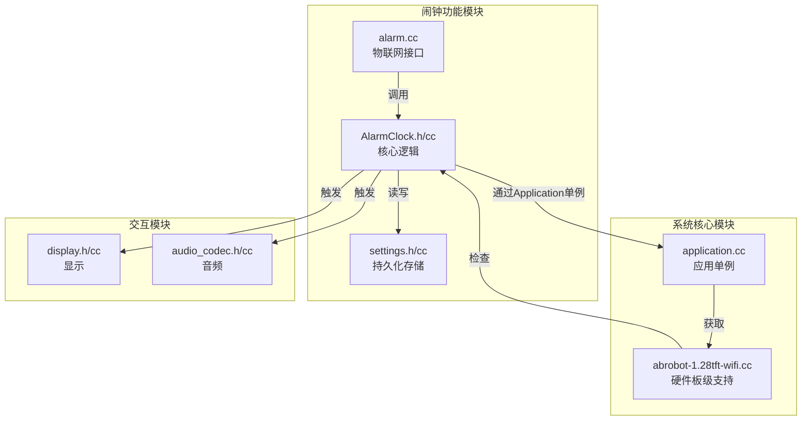
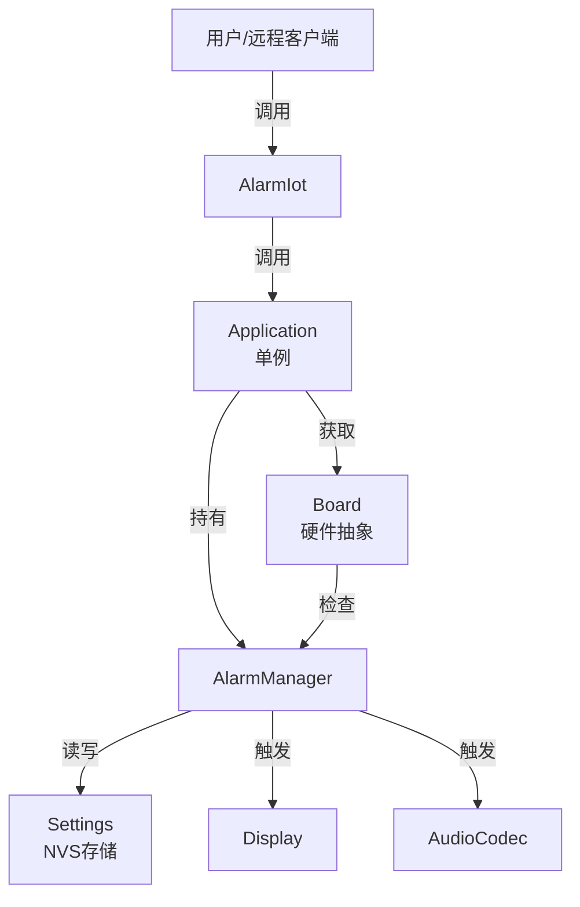
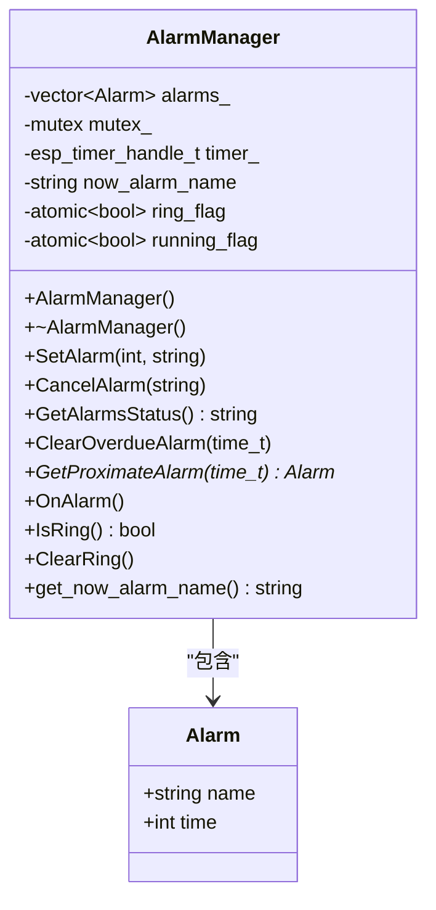
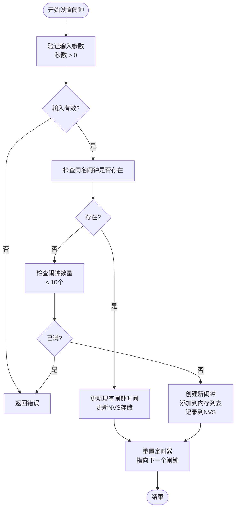
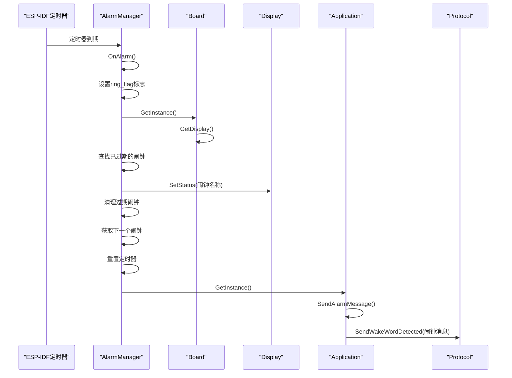
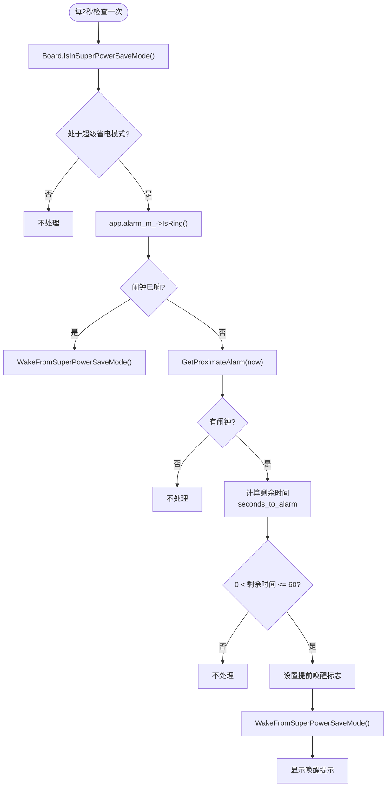
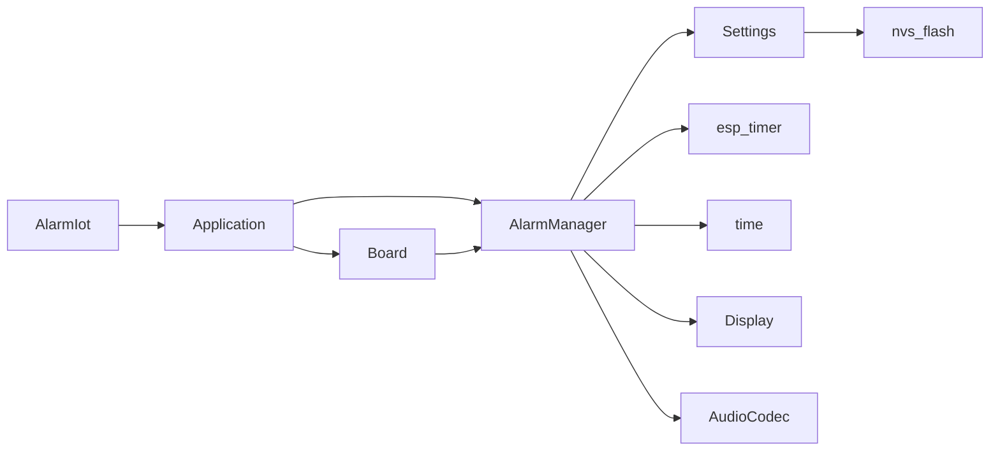

# 闹钟设备实现

<cite>
**本文档引用的文件**   
- [AlarmClock.cc](file://main/AlarmClock/AlarmClock.cc)
- [AlarmClock.h](file://main/AlarmClock/AlarmClock.h)
- [alarm.cc](file://main/iot/things/alarm.cc)
- [application.cc](file://main/application.cc)
- [abrobot-1.28tft-wifi.cc](file://main/boards/moon/abrobot-1.28tft-wifi.cc)
- [settings.cc](file://main/settings.cc)
- [settings.h](file://main/settings.h)
</cite>

## 目录
1. [项目结构](#项目结构)
2. [核心组件](#核心组件)
3. [架构概述](#架构概述)
4. [详细组件分析](#详细组件分析)
5. [依赖分析](#依赖分析)
6. [性能考虑](#性能考虑)
7. [故障排除指南](#故障排除指南)
8. [结论](#结论)

## 项目结构

闹钟功能的实现主要分布在 `main/AlarmClock` 和 `main/iot/things` 目录下。`main/AlarmClock` 目录包含闹钟管理的核心逻辑，而 `main/iot/things` 目录则定义了闹钟作为物联网设备的接口。此外，闹钟功能还与 `main/boards` 目录下的具体硬件板级支持包（如 `moon` 板）紧密集成，以处理低功耗模式下的唤醒等特定行为。

**图源**
- [AlarmClock.cc](file://main/AlarmClock/AlarmClock.cc)
- [alarm.cc](file://main/iot/things/alarm.cc)
- [application.cc](file://main/application.cc)
- [abrobot-1.28tft-wifi.cc](file://main/boards/moon/abrobot-1.28tft-wifi.cc)
- [settings.cc](file://main/settings.cc)

## 核心组件

闹钟功能的核心由 `AlarmManager` 类实现，它负责管理闹钟的生命周期，包括设置、取消、触发和状态查询。该类通过 `esp_timer` 机制实现定时功能，并利用 `Settings` 类将闹钟配置持久化存储在非易失性存储器（NVS）中。`AlarmIot` 类则作为物联网设备，暴露了设置和取消闹钟的远程方法，使得闹钟可以通过网络进行控制。

**节源**
- [AlarmClock.cc](file://main/AlarmClock/AlarmClock.cc#L0-L280)
- [AlarmClock.h](file://main/AlarmClock/AlarmClock.h#L0-L49)
- [alarm.cc](file://main/iot/things/alarm.cc#L0-L63)

## 架构概述

闹钟系统的架构是一个典型的分层设计。最底层是硬件抽象层（HAL），由 `Board` 类提供，它封装了具体的硬件操作。中间层是应用逻辑层，`Application` 单例作为系统的中枢，管理着 `AlarmManager` 实例。最上层是服务接口层，`AlarmIot` 类通过 `Application` 访问 `AlarmManager`，为外部提供服务。这种设计实现了关注点分离，使得核心逻辑与硬件细节和网络接口解耦。

**图源**
- [alarm.cc](file://main/iot/things/alarm.cc#L0-L63)
- [application.cc](file://main/application.cc#L1680-L1838)
- [AlarmClock.cc](file://main/AlarmClock/AlarmClock.cc#L0-L280)
- [abrobot-1.28tft-wifi.cc](file://main/boards/moon/abrobot-1.28tft-wifi.cc#L1700-L2200)

## 详细组件分析

### AlarmManager 分析

`AlarmManager` 是闹钟功能的核心，它管理着一个闹钟列表，并使用一个单次触发的 `esp_timer` 来调度下一个闹钟。

#### 类图

**图源**
- [AlarmClock.h](file://main/AlarmClock/AlarmClock.h#L0-L49)

#### 设置与取消闹钟流程

**节源**
- [AlarmClock.cc](file://main/AlarmClock/AlarmClock.cc#L67-L142)

### 闹钟触发与提醒流程

当 `esp_timer` 到期时，会调用 `AlarmManager::OnAlarm()` 回调函数，启动闹钟提醒流程。

#### 序列图

**图源**
- [AlarmClock.cc](file://main/AlarmClock/AlarmClock.cc#L203-L245)
- [application.cc](file://main/application.cc#L1680-L1838)

### 低功耗模式下的闹钟处理

在超级省电模式下，系统会关闭大部分外设以节省功耗，但必须确保闹钟功能正常工作。`CustomBoard` 类通过一个后台定时器定期检查闹钟状态。

#### 流程图

**图源**
- [abrobot-1.28tft-wifi.cc](file://main/boards/moon/abrobot-1.28tft-wifi.cc#L1700-L2200)

## 依赖分析

闹钟功能依赖于多个核心模块，形成了一个紧密的依赖网络。

**图源**
- [alarm.cc](file://main/iot/things/alarm.cc#L0-L63)
- [application.cc](file://main/application.cc#L1680-L1838)
- [AlarmClock.cc](file://main/AlarmClock/AlarmClock.cc#L0-L280)
- [abrobot-1.28tft-wifi.cc](file://main/boards/moon/abrobot-1.28tft-wifi.cc#L1700-L2200)
- [settings.cc](file://main/settings.cc#L0-L47)

**节源**
- [settings.cc](file://main/settings.cc#L0-L47)
- [settings.h](file://main/settings.h#L0-L26)

## 性能考虑

闹钟功能的性能主要体现在定时精度和低功耗模式下的响应能力上。`esp_timer` 提供了微秒级的精度，足以满足日常闹钟的需求。在低功耗模式下，系统通过每2秒轮询一次的方式检查闹钟状态，虽然存在最多2秒的延迟，但这是为了平衡功耗和响应速度的合理折衷。对于需要更高精度的场景，可以考虑使用RTC定时器。

## 故障排除指南

*   **闹钟未触发**：首先检查 `AlarmManager` 是否成功初始化，`Application` 单例中的 `alarm_m_` 指针是否为空。其次，确认 `esp_timer` 是否成功创建和启动。最后，检查系统时间是否正确。
*   **闹钟无法在超级省电模式下唤醒设备**：确保 `CustomBoard` 的 `InitializeAlarmMonitor` 函数被正确调用，后台检查定时器正在运行。检查 `is_alarm_pre_wake_active_` 标志位的逻辑是否正确。
*   **闹钟设置无法保存**：检查 `Settings` 类的 `ns_` 命名空间是否正确，`read_write_` 标志是否为 `true`。确认NVS分区已正确初始化。

**节源**
- [AlarmClock.cc](file://main/AlarmClock/AlarmClock.cc#L203-L245)
- [abrobot-1.28tft-wifi.cc](file://main/boards/moon/abrobot-1.28tft-wifi.cc#L1700-L2200)
- [application.cc](file://main/application.cc#L1680-L1838)

## 结论

闹钟设备的实现是一个设计精良的系统，它将核心逻辑、持久化存储、硬件交互和网络服务清晰地分离开来。通过 `AlarmManager` 类管理闹钟的生命周期，利用 `Settings` 类实现配置的持久化，并通过 `AlarmIot` 类提供远程控制能力。在低功耗场景下，通过 `CustomBoard` 的后台监控机制，确保了闹钟功能的可靠性。该实现充分考虑了嵌入式系统的资源限制和功耗要求，是一个稳定且高效的解决方案。