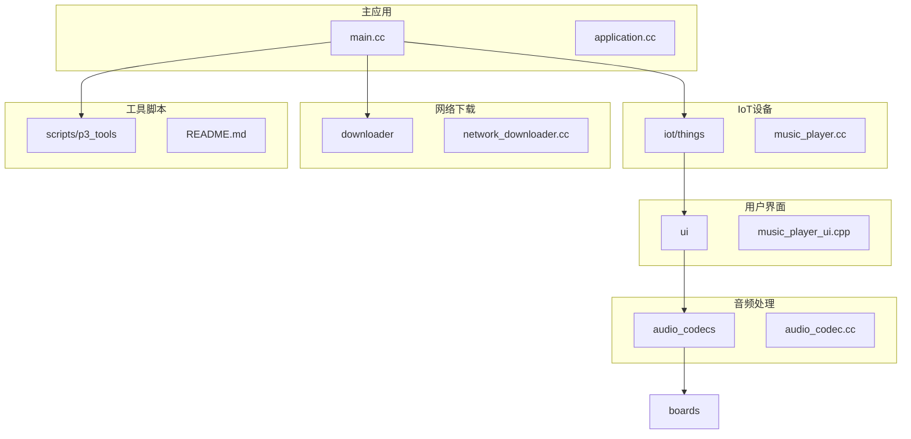
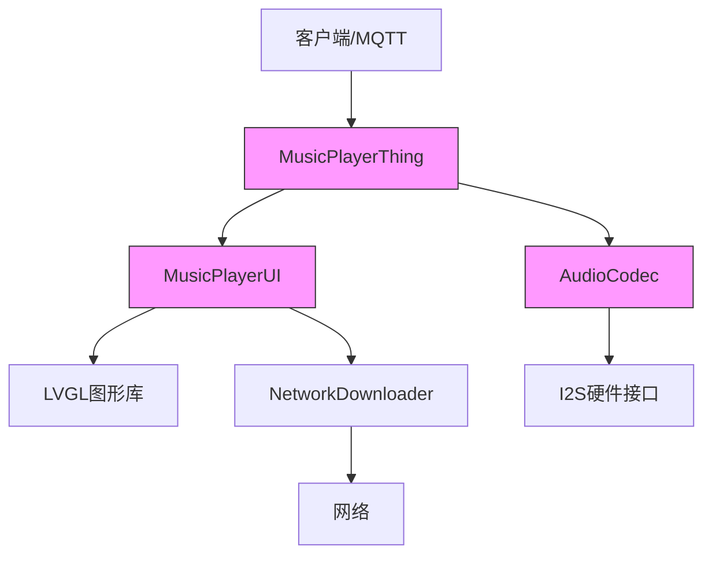
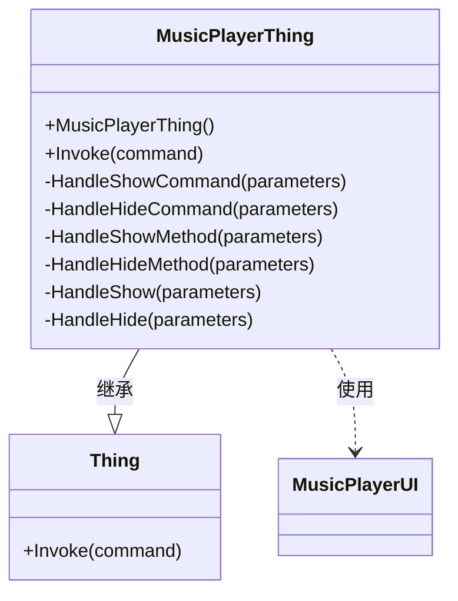
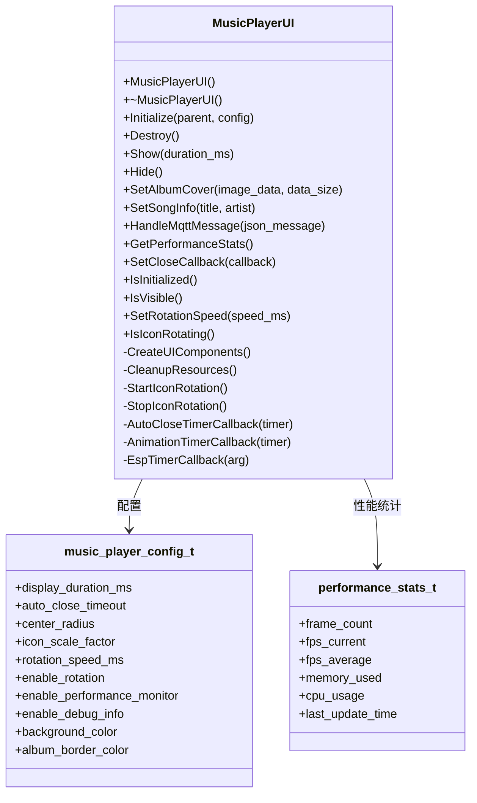
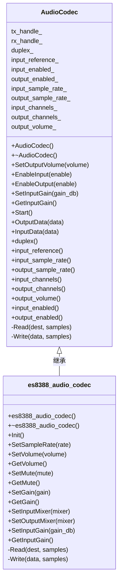
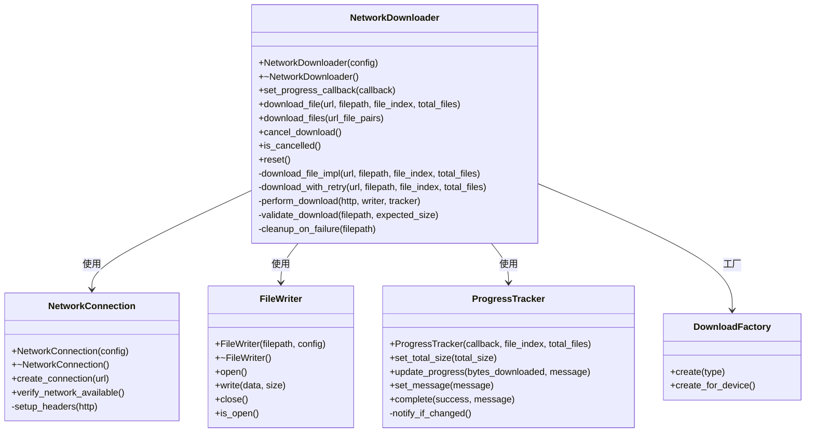
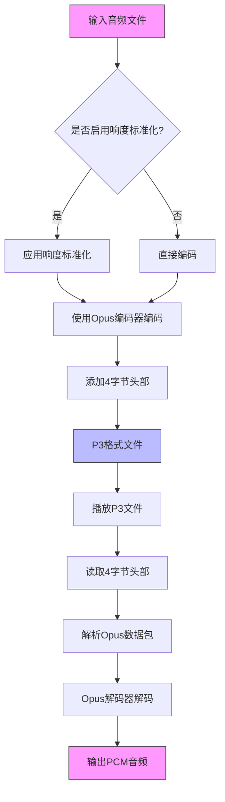
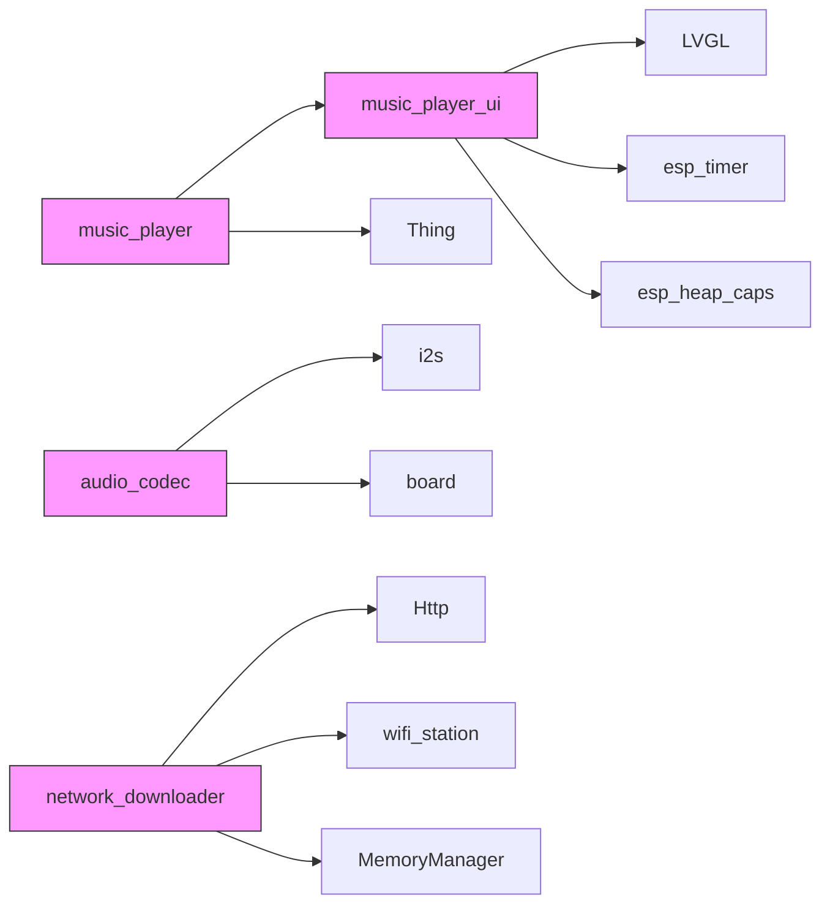

# 音乐播放器设备实现

<cite>
**本文档引用的文件**   
- [music_player.cc](file://main/iot/things/music_player.cc)
- [music_player.h](file://main/iot/things/music_player.h)
- [music_player_ui.cpp](file://main/ui/music_player_ui.cpp)
- [music_player_ui.h](file://main/ui/music_player_ui.h)
- [audio_codec.cc](file://main/audio_codecs/audio_codec.cc)
- [audio_codec.h](file://main/audio_codecs/audio_codec.h)
- [network_downloader.cc](file://main/downloader/network_downloader.cc)
- [network_downloader.h](file://main/downloader/network_downloader.h)
- [scripts/p3_tools/README.md](file://scripts/p3_tools/README.md)
</cite>

## 目录
1. [项目结构](#项目结构)
2. [核心组件](#核心组件)
3. [架构概述](#架构概述)
4. [详细组件分析](#详细组件分析)
5. [依赖分析](#依赖分析)
6. [性能考虑](#性能考虑)
7. [故障排除指南](#故障排除指南)
8. [结论](#结论)

## 项目结构
该项目是一个基于ESP32的嵌入式系统，实现了音乐播放器功能。项目结构清晰，按功能模块组织。

**图源**
- [main.cc](file://main/main.cc)
- [project_structure](file://)

**本节来源**
- [main.cc](file://main/main.cc)
- [project_structure](file://)

## 核心组件
音乐播放器系统由三个核心组件构成：IoT控制层、UI显示层和音频编解码层。

**音乐播放器IoT组件** (`music_player.cc`) 负责接收外部命令（如MQTT消息），并调用UI组件进行相应操作。它实现了`Thing`基类，通过注册`Show`和`Hide`方法来响应控制指令。

**音乐播放器UI组件** (`music_player_ui.cpp`) 负责创建和管理音乐播放器的用户界面，包括专辑封面、歌曲标题和艺术家信息的显示，以及图标旋转动画等视觉效果。

**音频编解码组件** (`audio_codec.cc`) 提供了音频数据的输入输出接口，通过I2S总线与硬件编解码器通信，实现音频流的播放和录制功能。

**本节来源**
- [music_player.cc](file://main/iot/things/music_player.cc#L1-L262)
- [music_player_ui.cpp](file://main/ui/music_player_ui.cpp#L1-L841)
- [audio_codec.cc](file://main/audio_codecs/audio_codec.cc#L1-L68)

## 架构概述
系统采用分层架构设计，各组件职责分明，通过清晰的接口进行交互。

**图源**
- [music_player.cc](file://main/iot/things/music_player.cc#L1-L262)
- [music_player_ui.cpp](file://main/ui/music_player_ui.cpp#L1-L841)
- [audio_codec.cc](file://main/audio_codecs/audio_codec.cc#L1-L68)

## 详细组件分析

### 音乐播放器IoT组件分析
`MusicPlayerThing`类是音乐播放器的IoT设备实现，负责处理来自外部系统的控制命令。

**图源**
- [music_player.h](file://main/iot/things/music_player.h#L1-L32)
- [music_player.cc](file://main/iot/things/music_player.cc#L1-L262)

**本节来源**
- [music_player.h](file://main/iot/things/music_player.h#L1-L32)
- [music_player.cc](file://main/iot/things/music_player.cc#L1-L262)

### 音乐播放器UI组件分析
`MusicPlayerUI`类负责管理音乐播放器的用户界面，提供了初始化、显示、隐藏等核心功能。

**图源**
- [music_player_ui.h](file://main/ui/music_player_ui.h#L1-L337)
- [music_player_ui.cpp](file://main/ui/music_player_ui.cpp#L1-L841)

**本节来源**
- [music_player_ui.h](file://main/ui/music_player_ui.h#L1-L337)
- [music_player_ui.cpp](file://main/ui/music_player_ui.cpp#L1-L841)

### 音频编解码组件分析
`AudioCodec`是一个抽象基类，定义了音频编解码器的通用接口，具体的硬件编解码器通过继承该类来实现特定功能。

**图源**
- [audio_codec.h](file://main/audio_codecs/audio_codec.h#L1-L59)
- [audio_codec.cc](file://main/audio_codecs/audio_codec.cc#L1-L68)

**本节来源**
- [audio_codec.h](file://main/audio_codecs/audio_codec.h#L1-L59)
- [audio_codec.cc](file://main/audio_codecs/audio_codec.cc#L1-L68)

### 网络下载组件分析
`NetworkDownloader`类负责从网络下载资源，支持重试机制和进度回调，为流媒体播放提供支持。

**图源**
- [network_downloader.h](file://main/downloader/network_downloader.h#L1-L155)
- [network_downloader.cc](file://main/downloader/network_downloader.cc#L1-L413)

**本节来源**
- [network_downloader.h](file://main/downloader/network_downloader.h#L1-L155)
- [network_downloader.cc](file://main/downloader/network_downloader.cc#L1-L413)

### P3音频格式分析
P3格式是一种专为嵌入式设备优化的流式音频格式，基于Opus编码，具有高效的存储和播放特性。

**图源**
- [scripts/p3_tools/README.md](file://scripts/p3_tools/README.md#L1-L94)

**本节来源**
- [scripts/p3_tools/README.md](file://scripts/p3_tools/README.md#L1-L94)

## 依赖分析
系统各组件之间的依赖关系清晰，遵循低耦合的设计原则。

**图源**
- [music_player.cc](file://main/iot/things/music_player.cc#L1-L262)
- [music_player_ui.cpp](file://main/ui/music_player_ui.cpp#L1-L841)
- [audio_codec.cc](file://main/audio_codecs/audio_codec.cc#L1-L68)
- [network_downloader.cc](file://main/downloader/network_downloader.cc#L1-L413)

**本节来源**
- [music_player.cc](file://main/iot/things/music_player.cc#L1-L262)
- [music_player_ui.cpp](file://main/ui/music_player_ui.cpp#L1-L841)
- [audio_codec.cc](file://main/audio_codecs/audio_codec.cc#L1-L68)
- [network_downloader.cc](file://main/downloader/network_downloader.cc#L1-L413)

## 性能考虑
系统在设计时充分考虑了嵌入式设备的资源限制，采用了多种优化策略：

1. **内存管理**：使用`std::lock_guard<std::mutex>`确保线程安全，避免资源竞争。
2. **定时器优化**：在UI显示和隐藏时使用`taskYIELD()`和`vTaskDelay()`让出CPU时间片，防止看门狗超时。
3. **动画控制**：通过`lv_anim_count_running()`检查系统负载，避免过多动画导致系统不稳定。
4. **网络下载**：提供三种下载器类型（标准、优化、保守），根据设备内存自动选择合适的配置。

## 故障排除指南
### 常见问题及解决方案

**问题1：音乐播放器无法显示**
- **可能原因**：UI未初始化或`g_music_player_instance`为空
- **解决方案**：检查`Initialize()`是否成功调用，确保传入有效的`parent`对象

**问题2：音频播放卡顿**
- **可能原因**：系统负载过高或I2S总线通信问题
- **解决方案**：检查是否有过多动画运行，确认音频编解码器驱动正常工作

**问题3：网络下载失败**
- **可能原因**：网络连接不稳定或服务器问题
- **解决方案**：系统已内置重试机制，检查`RetryStrategy`配置，确保网络连接正常

**问题4：内存分配失败**
- **可能原因**：堆内存不足
- **解决方案**：使用`esp_get_free_heap_size()`检查可用内存，优化内存使用或选择保守模式的下载器

**本节来源**
- [music_player_ui.cpp](file://main/ui/music_player_ui.cpp#L1-L841)
- [audio_codec.cc](file://main/audio_codecs/audio_codec.cc#L1-L68)
- [network_downloader.cc](file://main/downloader/network_downloader.cc#L1-L413)

## 结论
本音乐播放器系统采用模块化设计，各组件职责分明，接口清晰。系统支持通过IoT命令控制UI显示，使用LVGL实现流畅的用户界面，并通过音频编解码器实现高质量音频播放。P3音频格式的引入优化了音频存储和播放效率，而网络下载组件则为流媒体播放提供了可靠支持。整体设计充分考虑了嵌入式设备的资源限制，在性能和功能之间取得了良好平衡。