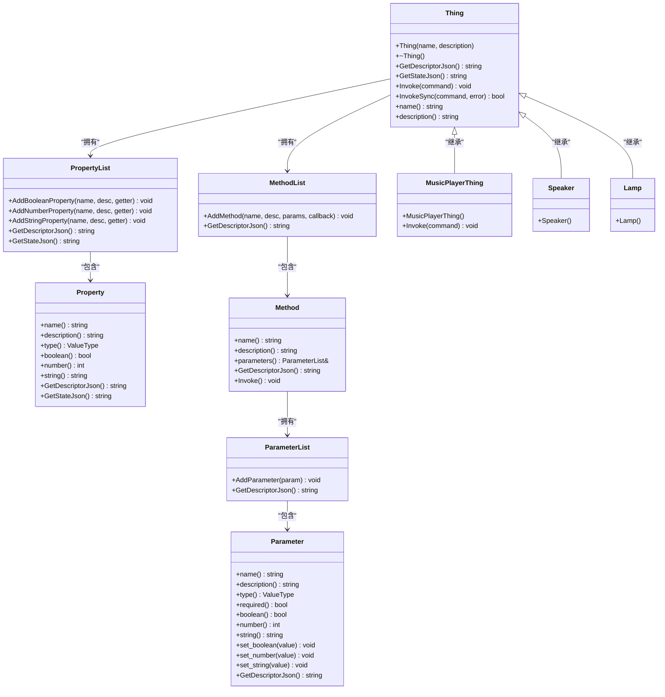

# 设备模型

<cite>
**本文档引用的文件**   
- [thing.h](file://main/iot/thing.h)
- [thing.cc](file://main/iot/thing.cc)
- [thing_manager.h](file://main/iot/thing_manager.h)
- [music_player.h](file://main/iot/things/music_player.h)
- [music_player.cc](file://main/iot/things/music_player.cc)
- [speaker.cc](file://main/iot/things/speaker.cc)
- [lamp.cc](file://main/iot/things/lamp.cc)
- [battery.cc](file://main/iot/things/battery.cc)
- [screen.cc](file://main/iot/things/screen.cc)
- [AlarmClock.cc](file://main/AlarmClock/AlarmClock.cc)
</cite>

## 目录
1. [引言](#引言)
2. [核心抽象接口设计](#核心抽象接口设计)
3. [设备属性与状态管理](#设备属性与状态管理)
4. [命令处理与方法调用](#命令处理与方法调用)
5. [继承与多态应用示例](#继承与多态应用示例)
6. [自定义设备开发指南](#自定义设备开发指南)
7. [设备注册与唯一性机制](#设备注册与唯一性机制)
8. [类图说明](#类图说明)
9. [内存布局优化建议](#内存布局优化建议)

## 引言
本文档详细阐述了物联网设备模型（Thing）的抽象接口设计，聚焦于`thing.h`中定义的核心基类。文档解释了`Thing`基类提供的关键方法，如`setup()`、`handleCommand()`、`getState()`等（在代码中对应`Invoke`、`GetStateJson`等），以及这些方法在具体设备中的实现方式。同时，文档说明了设备属性（如名称、类型、状态）的封装机制和状态变更通知模式，结合具体子类（如`music_player.h`）展示了继承与多态的应用。最后，文档提供了自定义设备类开发的完整示例，并阐述了设备ID生成策略和唯一性保障机制。

## 核心抽象接口设计

`Thing`基类是整个物联网设备模型的核心，它定义了一个抽象接口，所有具体的设备（如音乐播放器、灯、扬声器）都必须继承此类。该设计遵循面向对象的封装、继承和多态原则，为设备的统一管理和控制提供了基础。

`Thing`类的主要职责包括：
- **设备标识**：通过`name_`和`description_`成员变量存储设备的名称和描述。
- **状态封装**：通过`properties_`成员变量管理设备的可读状态。
- **行为定义**：通过`methods_`成员变量定义设备可执行的操作。
- **命令分发**：通过`Invoke`和`InvokeSync`方法处理外部命令。

**Section sources**
- [thing.h](file://main/iot/thing.h#L262-L283)

## 设备属性与状态管理

设备模型通过`Property`和`PropertyList`类来封装设备的属性和状态，实现了数据与行为的分离。

### 属性（Property）封装
`Property`类代表设备的一个具体属性，如灯的开关状态、电池的电量等。其核心设计特点如下：
- **类型安全**：使用`ValueType`枚举（`kValueTypeBoolean`、`kValueTypeNumber`、`kValueTypeString`）来定义属性的数据类型。
- **延迟求值**：通过`std::function`类型的`getter`函数（如`boolean_getter_`、`number_getter_`）来获取属性的当前值。这允许属性值在被查询时动态计算，而不是存储一个静态副本。
- **元数据**：每个属性都包含`name_`（名称）和`description_`（描述），便于生成设备描述信息。

```cpp
class Property {
private:
    std::string name_;
    std::string description_;
    ValueType type_;
    std::function<bool()> boolean_getter_;
    std::function<int()> number_getter_;
    std::function<std::string()> string_getter_;

public:
    // 构造函数根据getter函数类型自动推断ValueType
    Property(const std::string& name, const std::string& description, std::function<bool()> getter);
    // ... 其他构造函数

    // 获取属性的当前值
    bool boolean() const { return boolean_getter_(); }
    int number() const { return number_getter_(); }
    std::string string() const { return string_getter_(); }

    // 生成该属性的JSON描述和状态
    std::string GetDescriptorJson();
    std::string GetStateJson();
};
```

### 属性列表（PropertyList）
`PropertyList`是一个容器类，用于管理一个设备的所有属性。
- **集合管理**：内部使用`std::vector<Property>`存储属性。
- **便捷添加**：提供`AddBooleanProperty`、`AddNumberProperty`、`AddStringProperty`等方法，简化了不同类型属性的添加。
- **JSON序列化**：`GetDescriptorJson`和`GetStateJson`方法会遍历所有属性，将它们的描述和状态组合成一个完整的JSON对象。

**Section sources**
- [thing.h](file://main/iot/thing.h#L25-L100)

## 命令处理与方法调用

设备模型通过`Method`和`MethodList`类来定义和处理设备的可执行操作。

### 方法（Method）定义
`Method`类代表设备的一个可调用方法。
- **参数化**：每个方法都关联一个`ParameterList`，定义了调用该方法所需的参数。
- **回调机制**：通过`std::function<void(const ParameterList&)> callback_`成员变量存储一个回调函数。当方法被调用时，系统会执行此回调。
- **元数据**：包含`name_`和`description_`，用于描述方法的功能。

```cpp
class Method {
private:
    std::string name_;
    std::string description_;
    ParameterList parameters_;
    std::function<void(const ParameterList&)> callback_;

public:
    Method(const std::string& name, const std::string& description, 
           const ParameterList& parameters, 
           std::function<void(const ParameterList&)> callback);

    void Invoke() { callback_(parameters_); } // 执行回调
};
```

### 方法列表（MethodList）
`MethodList`是`Method`的容器，功能与`PropertyList`类似，用于管理设备的所有方法。

### 命令分发（Invoke）
`Thing`基类的`Invoke`方法是命令处理的核心。它接收一个`cJSON`格式的命令对象，解析出`method`和`parameters`，然后在`methods_`列表中查找对应的方法。
- **参数绑定**：将`cJSON`中的参数值解析并绑定到`ParameterList`中对应参数的实例上。
- **异步执行**：通过`Application::GetInstance().Schedule`将方法的`Invoke()`调用调度到应用的主循环中执行，避免阻塞当前线程。

```cpp
void Thing::Invoke(const cJSON* command) {
    auto method_name = cJSON_GetObjectItem(command, "method");
    auto input_params = cJSON_GetObjectItem(command, "parameters");

    try {
        auto& method = methods_[method_name->valuestring]; // 查找方法
        // ... 绑定参数 ...
        Application::GetInstance().Schedule([&method]() {
            method.Invoke(); // 异步执行回调
        });
    } catch (const std::runtime_error& e) {
        ESP_LOGE(TAG, "Method not found: %s", method_name->valuestring);
    }
}
```

**Section sources**
- [thing.h](file://main/iot/thing.h#L218-L264)
- [thing.cc](file://main/iot/thing.cc#L78-L100)

## 继承与多态应用示例

通过具体的子类实现，可以清晰地看到继承与多态的应用。

### 音乐播放器（MusicPlayerThing）
`MusicPlayerThing`是`Thing`的一个具体子类，用于控制音乐播放器界面的显示和隐藏。

- **继承**：`class MusicPlayerThing : public Thing`，继承了`Thing`的所有成员和方法。
- **构造函数初始化**：在构造函数中，通过调用父类构造函数`Thing("MusicPlayer", "音乐播放器界面控制")`来设置设备的名称和描述。
- **方法注册**：在构造函数中，使用`methods_.AddMethod`注册了`Show`和`Hide`两个方法。每个方法都关联了一个`ParameterList`和一个`lambda`回调函数。
- **多态重写**：重写了`Invoke`方法，以支持直接处理`cJSON`命令，这展示了多态性——基类指针可以调用子类的`Invoke`实现。

```cpp
// music_player.h
class MusicPlayerThing : public Thing {
public:
    MusicPlayerThing(); // 构造函数中注册方法
    void Invoke(const cJSON* command) override; // 重写基类方法
};

// music_player.cc
MusicPlayerThing::MusicPlayerThing() : Thing("MusicPlayer", "音乐播放器界面控制") {
    // 注册Show方法
    std::vector<Parameter> show_params = {
        Parameter("duration_ms", "显示持续时间（毫秒）", kValueTypeNumber, false),
        Parameter("song_title", "歌曲标题", kValueTypeString, false),
        Parameter("artist_name", "艺术家名称", kValueTypeString, false)
    };
    methods_.AddMethod("Show", "显示音乐播放器界面", ParameterList(show_params), 
        [this](const ParameterList& parameters) {
            HandleShowMethod(parameters); // 回调函数
        });
    
    // 注册Hide方法
    methods_.AddMethod("Hide", "隐藏音乐播放器界面", ParameterList(), 
        [this](const ParameterList& parameters) {
            HandleHideMethod(parameters); // 回调函数
        });
}
```

### 其他设备示例
其他设备如`Speaker`、`Lamp`、`Battery`等，都遵循相同的模式：
- **扬声器（Speaker）**：定义`volume`属性，并提供`SetVolume`方法来调整音量。
- **灯（Lamp）**：定义`power`属性，并提供`TurnOn`和`TurnOff`方法来控制开关。
- **电池（Battery）**：定义`level`和`charging`属性，其getter函数会动态查询硬件状态。

**Section sources**
- [music_player.h](file://main/iot/things/music_player.h#L7-L26)
- [music_player.cc](file://main/iot/things/music_player.cc#L13-L32)
- [speaker.cc](file://main/iot/things/speaker.cc#L11-L28)
- [lamp.cc](file://main/iot/things/lamp.cc#L11-L28)
- [battery.cc](file://main/iot/things/battery.cc#L11-L28)

## 自定义设备开发指南

要创建一个新的物联网设备，可以遵循以下步骤：

1.  **创建头文件**：定义一个新的类，继承自`Thing`。
    ```cpp
    // my_device.h
    #ifndef MY_DEVICE_H
    #define MY_DEVICE_H
    #include "iot/thing.h"
    namespace iot {
        class MyDevice : public Thing {
        public:
            MyDevice();
            // 可以选择重写Invoke等方法
        private:
            // 私有成员变量和方法
            int my_state_;
            void HandleCustomMethod(const ParameterList& params);
        };
    }
    #endif
    ```

2.  **实现源文件**：在构造函数中初始化设备，并注册属性和方法。
    ```cpp
    // my_device.cc
    #include "my_device.h"
    #include <esp_log.h>
    namespace iot {
        MyDevice::MyDevice() : Thing("MyDevice", "我的自定义设备") {
            my_state_ = 0;

            // 添加属性
            properties_.AddNumberProperty("state", "当前状态", [this]() -> int {
                return my_state_;
            });

            // 添加方法
            methods_.AddMethod("SetState", "设置状态", ParameterList({
                Parameter("value", "状态值", kValueTypeNumber, true)
            }), [this](const ParameterList& parameters) {
                my_state_ = parameters["value"].number();
                ESP_LOGI("MyDevice", "State set to %d", my_state_);
            });
        }

        // 实现方法的处理逻辑
        void MyDevice::HandleCustomMethod(const ParameterList& params) {
            // ...
        }
    }
    DECLARE_THING(MyDevice); // 注册设备
    ```

3.  **注册设备**：使用`DECLARE_THING(MyDevice);`宏在文件末尾注册设备，使其可以被`ThingManager`创建。

## 设备注册与唯一性机制

设备的注册和创建由`ThingManager`和全局函数`RegisterThing`/`CreateThing`协同完成。

### 注册机制（DECLARE_THING宏）
`DECLARE_THING(TypeName)`宏是设备注册的核心。它展开后会创建两个静态成员：
1.  `Create##TypeName`函数：一个工厂函数，用于创建`TypeName`类型的设备实例。
2.  `Register##TypeNameHelper`变量：一个静态布尔变量，其初始化列表会调用`RegisterThing(#TypeName, Create##TypeName)`，将设备类型名和创建函数注册到全局的`thing_creators`映射表中。

```cpp
#define DECLARE_THING(TypeName) \
    static iot::Thing* Create##TypeName() { \
        return new iot::TypeName(); \
    } \
    static bool Register##TypeNameHelper = []() { \
        RegisterThing(#TypeName, Create##TypeName); \
        return true; \
    }();
```

### 唯一性保障
- **类型名唯一**：`thing_creators`是一个`std::map<std::string, std::function<Thing*()>>`，以设备类型名（如`"Lamp"`、`"Speaker"`）作为键。当使用`DECLARE_THING`宏时，宏中的`#TypeName`会将类名转换为字符串字面量，作为键插入映射表。如果尝试注册同名的设备，后注册的会覆盖先注册的，这通常在编译时就能发现。
- **实例管理**：`ThingManager`通过`AddThing(Thing* thing)`方法将设备实例添加到其`things_`向量中。每个设备实例都是独立的，其唯一性由指针地址保证。

**Section sources**
- [thing.h](file://main/iot/thing.h#L258-L300)
- [thing.cc](file://main/iot/thing.cc#L47-L55)
- [thing_manager.h](file://main/iot/thing_manager.h#L28-L30)

## 类图说明

以下类图展示了`Thing`基类及其相关组件的继承和组合关系。



**Diagram sources**
- [thing.h](file://main/iot/thing.h)
- [music_player.h](file://main/iot/things/music_player.h)
- [speaker.cc](file://main/iot/things/speaker.cc)
- [lamp.cc](file://main/iot/things/lamp.cc)

## 内存布局优化建议

1.  **避免在getter中进行耗时操作**：`Property`的getter函数在每次调用`GetStateJson`时都会被执行。如果getter函数涉及复杂的计算或I/O操作（如读取传感器），可能会导致状态查询延迟。建议在getter中只进行快速的内存访问，或使用缓存机制。
2.  **谨慎使用lambda捕获**：在`AddMethod`中使用的lambda回调函数，如果捕获了大量外部变量（尤其是`[this]`），可能会增加内存开销。确保捕获的变量是必要的。
3.  **管理设备实例生命周期**：`ThingManager`持有`Thing*`指针，但不负责释放内存。开发者需要确保在适当的时候（如程序结束时）手动删除这些实例，或使用智能指针（如`std::unique_ptr`）进行管理，以避免内存泄漏。
4.  **减少不必要的属性和方法**：每个`Property`和`Method`都会占用内存。只定义真正需要的属性和方法，以减少内存占用。