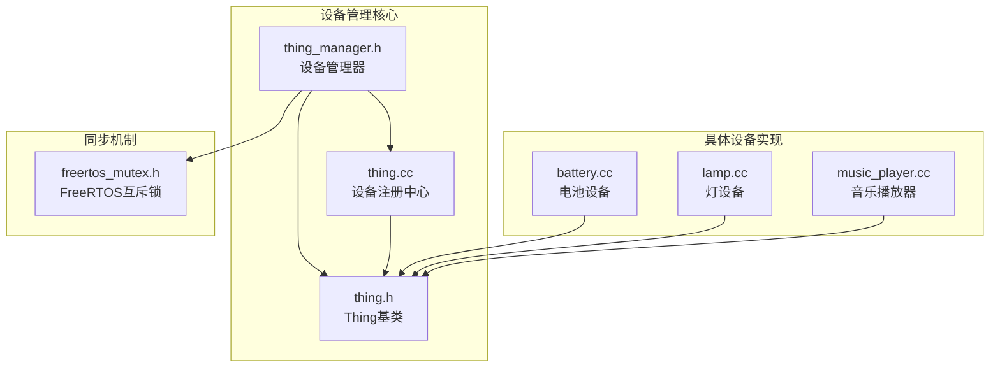
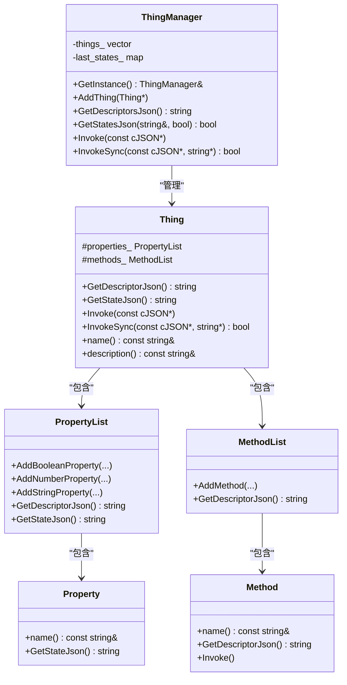
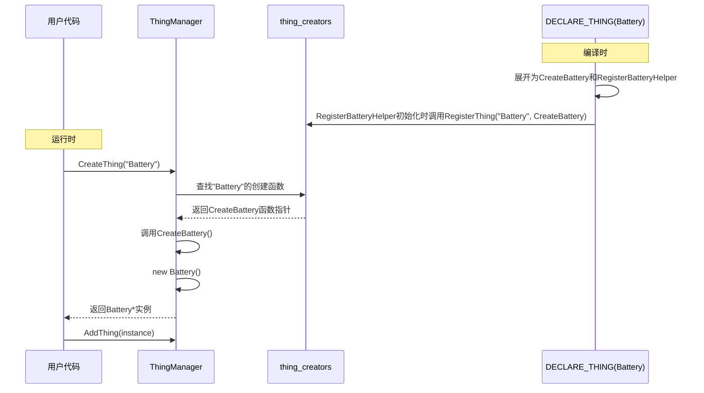
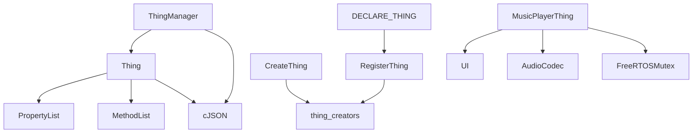

# 设备管理

<cite>
**本文档引用的文件**  
- [thing_manager.h](file://main/iot/thing_manager.h)
- [thing_manager.cc](file://main/iot/thing_manager.cc)
- [thing.h](file://main/iot/thing.h)
- [thing.cc](file://main/iot/thing.cc)
- [freertos_mutex.h](file://main/memory/freertos_mutex.h)
- [battery.cc](file://main/iot/things/battery.cc)
- [lamp.cc](file://main/iot/things/lamp.cc)
- [music_player.cc](file://main/iot/things/music_player.cc)
- [music_player.h](file://main/iot/things/music_player.h)
</cite>

## 目录
1. [简介](#简介)
2. [项目结构](#项目结构)
3. [核心组件](#核心组件)
4. [架构概览](#架构概览)
5. [详细组件分析](#详细组件分析)
6. [依赖分析](#依赖分析)
7. [性能考量](#性能考量)
8. [故障排除指南](#故障排除指南)
9. [结论](#结论)

## 简介
本文档详细阐述了基于ESP32平台的设备管理系统设计与实现，重点分析了`ThingManager`类的核心机制。系统采用面向对象设计模式，通过`Thing`基类定义通用物联网设备接口，并利用`ThingManager`进行统一管理。文档深入探讨了设备注册、查找、枚举等核心功能的内部实现，分析了容器选择与性能特征，解释了`DECLARE_THING`宏如何实现设备类型的自动发现与动态实例化，并讨论了多线程环境下的同步机制与设备热插拔的扩展可能性。

## 项目结构
设备管理功能主要位于`main/iot`目录下，其核心组件包括`thing.h`、`thing.cc`、`thing_manager.h`和`thing_manager.cc`。具体设备实现（如电池、灯、音乐播放器）位于`main/iot/things`子目录中。系统采用分层架构，`Thing`类提供设备抽象，`ThingManager`负责设备生命周期管理，而`freertos_mutex.h`则提供多线程同步支持。



**图示来源**
- [thing_manager.h](file://main/iot/thing_manager.h)
- [thing.h](file://main/iot/thing.h)
- [thing.cc](file://main/iot/thing.cc)
- [freertos_mutex.h](file://main/iot/freertos_mutex.h)

**本节来源**
- [thing_manager.h](file://main/iot/thing_manager.h)
- [thing.h](file://main/iot/thing.h)

## 核心组件
设备管理系统的核心是`ThingManager`单例类，它负责管理所有注册的物联网设备（`Thing`）。`ThingManager`提供了`AddThing`用于注册设备，`GetDescriptorsJson`和`GetStatesJson`用于获取设备描述和状态，以及`Invoke`和`InvokeSync`用于调用设备方法。设备通过继承`Thing`基类并重写其虚函数来实现特定功能。`DECLARE_THING`宏是实现设备类型自动注册的关键，它在编译时生成静态初始化代码，将设备创建函数注册到全局注册表中。

**本节来源**
- [thing_manager.h](file://main/iot/thing_manager.h)
- [thing.h](file://main/iot/thing.h)
- [thing.cc](file://main/iot/thing.cc)

## 架构概览
系统采用注册-发现模式。`Thing`类定义了设备的通用接口，包括属性（`Property`）和方法（`Method`）。`ThingManager`作为中心管理器，维护一个设备指针列表（`things_`）和一个状态缓存（`last_states_`）。`DECLARE_THING`宏利用C++的静态初始化特性，在程序启动时自动调用`RegisterThing`函数，将设备类型与创建函数的映射关系注册到全局的`thing_creators`映射表中。当需要创建设备实例时，`CreateThing`函数通过类型名称查找并调用相应的创建函数。



**图示来源**
- [thing_manager.h](file://main/iot/thing_manager.h)
- [thing.h](file://main/iot/thing.h)

## 详细组件分析

### ThingManager类分析
`ThingManager`类是设备管理的核心，采用单例模式确保全局唯一实例。其主要功能包括设备注册、状态查询和命令调用。

#### 设备注册与容器选择
设备通过`AddThing`方法注册到`ThingManager`中。该方法将设备指针添加到`std::vector<Thing*> things_`容器中。选择`vector`而非`map`或`list`的原因如下：
- **时间复杂度**：`vector`的`push_back`操作平均时间复杂度为O(1)，而`map`的插入为O(log n)。对于设备注册这种主要为追加操作的场景，`vector`更高效。
- **内存局部性**：`vector`在内存中连续存储，遍历所有设备时（如获取状态）具有极佳的缓存友好性，能显著提升性能。
- **简单性**：设备查找通常通过名称在`Invoke`方法中进行线性搜索，设备总数有限，O(n)的查找成本可接受。

```cpp
void ThingManager::AddThing(Thing* thing) {
    things_.push_back(thing); // 高效的尾部插入
}
```

#### 设备查找与枚举
- **查找 (`Invoke`)**：`Invoke`方法通过遍历`things_`向量，比较设备名称来查找目标设备。这是一种线性搜索，时间复杂度为O(n)。
- **枚举 (`GetDescriptorsJson`, `GetStatesJson`)**：这两个方法都通过遍历`things_`向量来收集所有设备的信息。`GetStatesJson`方法还支持增量更新（`delta=true`），通过`last_states_`映射表缓存上次状态，仅当设备状态发生变化时才将其包含在返回的JSON中，从而减少网络传输开销。

```cpp
bool ThingManager::GetStatesJson(std::string& json, bool delta) {
    if (!delta) {
        last_states_.clear(); // 非增量模式清空缓存
    }
    bool changed = false;
    json = "[";
    for (auto& thing : things_) {
        if (thing->name() == "RotateDisplay") continue; // 过滤特定设备
        std::string state = thing->GetStateJson();
        if (delta) {
            auto it = last_states_.find(thing->name());
            if (it != last_states_.end() && it->second == state) {
                continue; // 状态未变，跳过
            }
            changed = true;
            last_states_[thing->name()] = state; // 更新缓存
        } else {
            last_states_[thing->name()] = state; // 同步快照
        }
        json += state + ",";
    }
    // ... 处理JSON字符串
    return changed;
}
```

**本节来源**
- [thing_manager.cc](file://main/iot/thing_manager.cc)
- [thing_manager.h](file://main/iot/thing_manager.h)

### DECLARE_THING宏与自动发现机制
`DECLARE_THING`宏是实现设备类型自动发现和动态实例化的关键。它利用了C++的两个特性：宏定义和静态变量的初始化。

#### 宏定义分析
```cpp
#define DECLARE_THING(TypeName) \
    static iot::Thing* Create##TypeName() { \
        return new iot::TypeName(); \
    } \
    static bool Register##TypeNameHelper = []() { \
        RegisterThing(#TypeName, Create##TypeName); \
        return true; \
    }();
```
- `Create##TypeName`：拼接出一个名为`CreateXxx`的静态函数，该函数负责创建并返回一个`Xxx`类型的设备实例。
- `Register##TypeNameHelper`：定义一个名为`RegisterXxxHelper`的静态布尔变量。其初始化值由一个立即执行的Lambda表达式决定。
- Lambda表达式：在程序启动时（静态变量初始化阶段）自动执行，调用`RegisterThing`函数，将设备类型名称（字符串）和创建函数（`CreateXxx`）的映射关系注册到全局注册表中。

#### 协同工作流程
1. **注册**：在`battery.cc`等设备实现文件末尾使用`DECLARE_THING(Battery)`。
2. **初始化**：程序启动时，`RegisterBatteryHelper`变量被初始化，其Lambda表达式执行，调用`RegisterThing("Battery", CreateBattery)`。
3. **实例化**：在板级初始化代码中，调用`iot::CreateThing("Battery")`。该函数在全局注册表中查找"Battery"对应的创建函数`CreateBattery`，并调用它来创建实例。
4. **管理**：将创建的实例通过`AddThing`添加到`ThingManager`中进行管理。

此机制实现了设备类型的解耦，`ThingManager`无需知道具体设备的实现，只需通过类型名称即可动态创建。



**图示来源**
- [thing.h](file://main/iot/thing.h#L289-L295)
- [thing.cc](file://main/iot/thing.cc#L7-L15)
- [battery.cc](file://main/iot/things/battery.cc#L34)

**本节来源**
- [thing.h](file://main/iot/thing.h)
- [thing.cc](file://main/iot/thing.cc)
- [battery.cc](file://main/iot/things/battery.cc)

### 设备生命周期管理
系统的设备生命周期管理策略如下：
- **初始化顺序**：设备的创建和注册发生在程序启动的静态初始化阶段（由`DECLARE_THING`宏触发）。设备实例的添加（`AddThing`）则发生在板级初始化代码中，通常在`main`函数或特定板级初始化函数内执行。这确保了在系统其他部分需要访问设备之前，设备已经准备就绪。
- **资源释放时机**：当前实现中，设备通过`new`在堆上创建，但没有显式的`delete`调用。这意味着设备的生命周期与整个程序的生命周期绑定，程序退出时由操作系统回收资源。这是一种简单但有效的策略，适用于嵌入式系统中通常不会动态卸载设备的场景。如果需要支持设备的动态加载和卸载，则需要在`ThingManager`中增加`RemoveThing`方法，并在适当时机调用`delete`。

### 多线程同步机制
虽然`ThingManager`本身没有直接使用锁，但其管理的设备可能在多线程环境下被访问（例如，一个任务查询状态，另一个任务执行命令）。`freertos_mutex.h`文件提供了一个`FreeRTOSMutex`类，它是FreeRTOS互斥信号量的C++封装。

#### 同步机制说明
- **FreeRTOSMutex**：该类包装了`xSemaphoreCreateMutex`创建的互斥锁，提供了`lock()`、`unlock()`和`try_lock()`等方法。它支持优先级继承，能有效防止优先级反转问题。
- **RAII支持**：提供了`lock_guard`和`unique_lock`模板类，遵循RAII原则，确保即使在异常情况下也能正确释放锁。
- **在设备管理中的应用**：虽然`ThingManager`的公共接口没有加锁，但具体的`Thing`子类（如`MusicPlayerThing`）在其方法实现中，如果操作了共享资源（如UI、音频编解码器），则应使用`FreeRTOSMutex`来保护临界区。例如，`music_player.cc`中的`HandleShowCommand`在操作`g_music_player_instance`时，应使用互斥锁来防止并发访问。

```cpp
// 示例：在Thing子类中使用互斥锁
class SafeLamp : public Lamp {
private:
    ImageResource::FreeRTOSMutex mutex_;

public:
    void TurnOn() {
        ImageResource::lock_guard<ImageResource::FreeRTOSMutex> lock(mutex_);
        // 安全地操作共享资源
        power_ = true;
        gpio_set_level(gpio_num_, 1);
    }
};
```

**本节来源**
- [freertos_mutex.h](file://main/memory/freertos_mutex.h)
- [music_player.cc](file://main/iot/things/music_player.cc)

## 依赖分析
系统组件间依赖关系清晰。`ThingManager`依赖于`Thing`基类和`cJSON`库。`Thing`基类依赖于`PropertyList`、`MethodList`等内部组件。`DECLARE_THING`宏依赖于`thing.cc`中定义的`RegisterThing`和`CreateThing`全局函数。`freertos_mutex.h`是独立的同步原语，可被任何需要线程安全的组件（如具体的`Thing`实现）所依赖。



**图示来源**
- [thing_manager.h](file://main/iot/thing_manager.h)
- [thing.h](file://main/iot/thing.h)
- [thing.cc](file://main/iot/thing.cc)
- [music_player.cc](file://main/iot/things/music_player.cc)
- [freertos_mutex.h](file://main/memory/freertos_mutex.h)

**本节来源**
- [thing_manager.h](file://main/iot/thing_manager.h)
- [thing.h](file://main/iot/thing.h)
- [thing.cc](file://main/iot/thing.cc)

## 性能考量
- **容器选择**：`vector`的选择优化了内存访问模式，对枚举操作非常有利。但设备查找为O(n)，如果设备数量庞大，可考虑引入`std::unordered_map<std::string, Thing*>`以实现O(1)的查找，但这会增加内存开销和插入复杂度。
- **状态缓存**：`GetStatesJson`的增量模式（`delta=true`）显著减少了不必要的数据传输，提升了网络效率。
- **JSON生成**：当前的JSON字符串拼接方式（`+=`）在频繁操作时可能产生大量内存分配和复制。对于性能要求极高的场景，可考虑使用`cJSON`库直接构建JSON对象，或使用更高效的字符串构建器。
- **宏的开销**：`DECLARE_THING`宏在编译时展开，运行时无额外开销，是一种高效的元编程技术。

## 故障排除指南
- **设备未注册**：检查设备实现文件末尾是否遗漏了`DECLARE_THING(YourDevice)`宏。确保在板级初始化代码中调用了`CreateThing`和`AddThing`。
- **命令调用失败**：确认`Invoke`命令中的`name`字段与设备的`name()`返回值完全匹配。检查`Thing`子类是否正确重写了`Invoke`或`InvokeSync`方法。
- **状态未更新**：如果使用`delta=true`但未收到状态更新，检查设备的`GetStateJson`返回值是否确实发生了变化。`last_states_`缓存会过滤掉未变化的状态。
- **多线程竞争**：如果观察到数据不一致或崩溃，检查在访问共享资源（如硬件寄存器、全局变量）时是否使用了`FreeRTOSMutex`进行保护。

**本节来源**
- [thing_manager.cc](file://main/iot/thing_manager.cc)
- [thing.cc](file://main/iot/thing.cc)
- [freertos_mutex.h](file://main/memory/freertos_mutex.h)

## 结论
本文档详细分析了设备管理系统的设计与实现。`ThingManager`通过`vector`容器高效地管理设备，`DECLARE_THING`宏巧妙地利用C++静态初始化实现了设备类型的自动注册与发现。系统架构清晰，职责分离，易于扩展。虽然当前的同步机制需要由具体设备实现，但提供了强大的`FreeRTOSMutex`工具。未来可考虑为`ThingManager`的核心操作增加内部锁，或实现更完善的设备热插拔支持，以进一步提升系统的健壮性和灵活性。