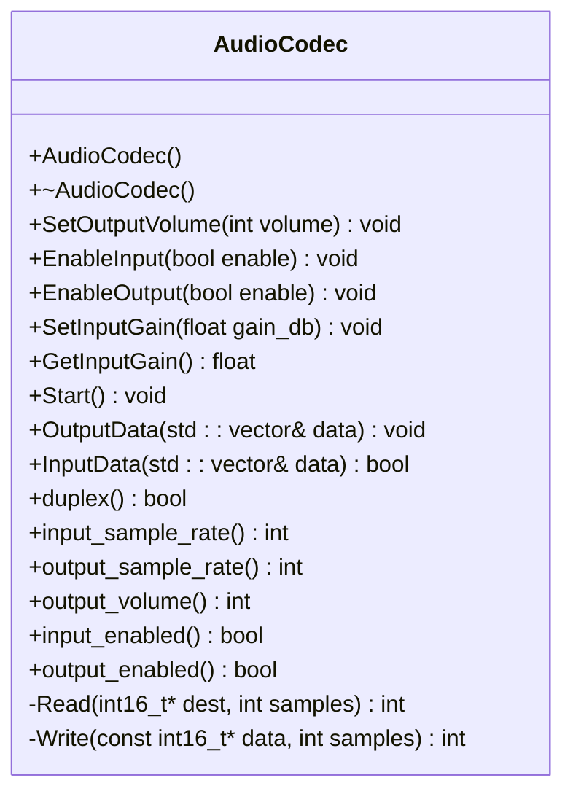
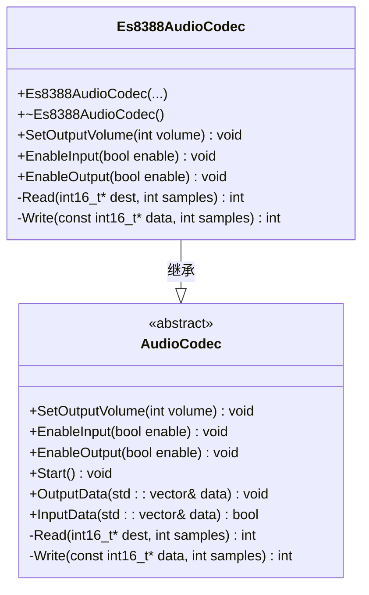
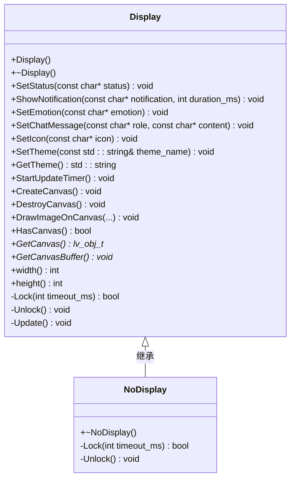
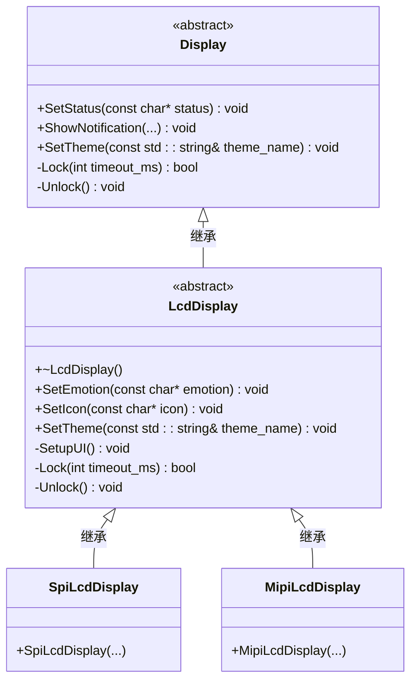
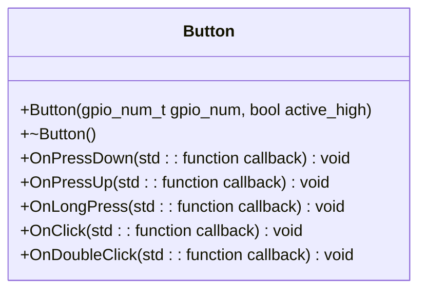
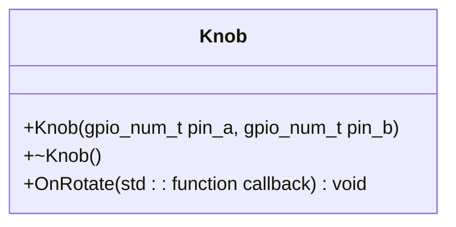
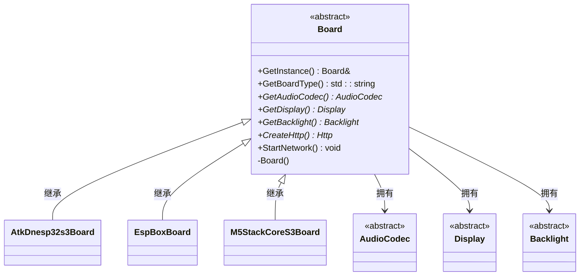

# 外设驱动接口

<cite>
**本文档引用的文件**  
- [audio_codec.h](file://main/audio_codecs/audio_codec.h)
- [es8388_audio_codec.h](file://main/audio_codecs/es8388_audio_codec.h)
- [display.h](file://main/display/display.h)
- [lcd_display.h](file://main/display/lcd_display.h)
- [button.h](file://main/boards/common/button.h)
- [knob.h](file://main/boards/common/knob.h)
- [board.h](file://main/boards/common/board.h)
</cite>

## 目录
1. [引言](#引言)
2. [核心外设驱动接口设计](#核心外设驱动接口设计)
3. [音频编解码器接口分析](#音频编解码器接口分析)
4. [显示设备接口分析](#显示设备接口分析)
5. [输入设备接口分析](#输入设备接口分析)
6. [硬件抽象层架构](#硬件抽象层架构)
7. [驱动开发模板与最佳实践](#驱动开发模板与最佳实践)

## 引言
本文件系统性地文档化了硬件抽象层（HAL）所提供的各类外设驱动接口，重点涵盖显示、音频、输入设备等核心外设的抽象设计。通过分析 `Display`、`AudioCodec`、`Button`、`Knob` 等基类的公共接口定义，阐述了其 `init()`、`read()`、`write()` 等方法的语义规范。文档深入探讨了接口设计如何在保证通用性的同时兼顾扩展性，以支持多种硬件变体。结合 `es8388_audio_codec.h` 和 `lcd_display.h` 等具体实现，展示了接口与具体驱动的继承关系，并提供了驱动开发的模板和最佳实践。

## 核心外设驱动接口设计
项目采用面向对象的C++设计模式，通过定义抽象基类来实现硬件抽象层。核心设计原则包括：
- **接口与实现分离**：基类定义公共接口，具体硬件实现通过继承完成。
- **多态性**：上层应用通过基类指针调用方法，实际执行具体硬件的实现。
- **可扩展性**：新增硬件只需继承基类并实现纯虚函数，无需修改上层逻辑。
- **资源管理**：利用RAII（Resource Acquisition Is Initialization）模式，在构造函数中初始化资源，在析构函数中释放。

主要外设接口包括 `AudioCodec`（音频）、`Display`（显示）、`Button`（按钮）和 `Knob`（旋钮），它们共同构成了系统的硬件交互基础。

## 音频编解码器接口分析

### AudioCodec 基类设计
`AudioCodec` 类是所有音频编解码器的抽象基类，定义了统一的控制和数据流接口。

**图示来源**  
- [audio_codec.h](file://main/audio_codecs/audio_codec.h#L13-L55)

**本节来源**  
- [audio_codec.h](file://main/audio_codecs/audio_codec.h#L13-L55)

#### 公共接口语义规范
- **`SetOutputVolume(int volume)`**：设置音频输出音量，参数范围通常为0-100。
- **`EnableInput(bool enable)` / `EnableOutput(bool enable)`**：启用或禁用音频输入/输出通道。
- **`Start()`**：启动音频编解码器，初始化I2S通道并开始数据流。
- **`OutputData(std::vector<int16_t>& data)`**：将音频数据写入输出缓冲区，由底层`Write`方法处理。
- **`InputData(std::vector<int16_t>& data)`**：从输入缓冲区读取音频数据，由底层`Read`方法实现。
- **`Read()` 和 `Write()`**：两个纯虚函数，是数据传输的核心，必须由子类实现，负责与硬件进行底层I2S通信。

### Es8388AudioCodec 具体实现
`Es8388AudioCodec` 类继承自 `AudioCodec`，实现了针对ES8388芯片的具体驱动。

**图示来源**  
- [audio_codec.h](file://main/audio_codecs/audio_codec.h#L13-L55)
- [es8388_audio_codec.h](file://main/audio_codecs/es8388_audio_codec.h#L9-L34)

**本节来源**  
- [es8388_audio_codec.h](file://main/audio_codecs/es8388_audio_codec.h#L9-L34)
- [es8388_audio_codec.cc](file://main/audio_codecs/es8388_audio_codec.cc#L6-L67)

#### 实现细节
- **构造函数**：接收I2C总线句柄、GPIO引脚、采样率等参数，初始化`data_if_`（I2S数据接口）、`ctrl_if_`（I2C控制接口）和`codec_if_`（编解码器接口）。
- **`CreateDuplexChannels`**：创建I2S全双工通道，支持同时进行录音和播放。
- **`SetOutputVolume`**：通过I2C命令向ES8388芯片写入音量寄存器。
- **`Read`/`Write`**：利用ESP-IDF的`esp_codec_dev_read`和`esp_codec_dev_write`函数，通过`input_dev_`和`output_dev_`句柄与硬件交互。

## 显示设备接口分析

### Display 基类设计
`Display` 类是所有显示设备的抽象基类，基于LVGL图形库构建。

**图示来源**  
- [display.h](file://main/display/display.h#L16-L76)

**本节来源**  
- [display.h](file://main/display/display.h#L16-L76)

#### 公共接口语义规范
- **`SetStatus` / `SetEmotion` / `SetIcon`**：更新界面上的状态、表情和图标。
- **`ShowNotification`**：显示一个临时通知，可设置持续时间。
- **`SetTheme`**：切换UI主题（如亮色/暗色）。
- **`CreateCanvas` / `DrawImageOnCanvas`**：创建离屏画布并绘制图像，用于复杂图形操作。
- **`Lock` / `Unlock`**：纯虚函数，用于实现线程安全的显示访问，防止并发绘制导致的屏幕撕裂。

### LcdDisplay 具体实现
`LcdDisplay` 类是LCD显示屏的基类，继承自 `Display`，并提供了多种具体类型（如SPI、MIPI）。

**图示来源**  
- [display.h](file://main/display/display.h#L16-L76)
- [lcd_display.h](file://main/display/lcd_display.h#L11-L43)

**本节来源**  
- [lcd_display.h](file://main/display/lcd_display.h#L11-L43)

#### 实现细节
- **构造函数**：接收LCD面板的I/O和面板句柄，以及字体配置。
- **`SetupUI`**：受保护的虚函数，用于初始化LVGL的UI组件（状态栏、内容区等）。
- **`Lock`/`Unlock`**：实现基于互斥锁的线程安全机制，确保同一时间只有一个任务可以更新UI。
- **`SetTheme`**：根据主题名称动态加载不同的颜色和字体方案。

## 输入设备接口分析

### Button 接口设计
`Button` 类封装了物理按钮的输入事件。

**图示来源**  
- [button.h](file://main/boards/common/button.h#L7-L30)

**本节来源**  
- [button.h](file://main/boards/common/button.h#L7-L30)

#### 事件回调机制
- **`OnPressDown`**：当按钮被按下时触发。
- **`OnPressUp`**：当按钮被释放时触发。
- **`OnLongPress`**：当按钮被长按（超过1秒）时触发。
- **`OnClick`**：当按钮被短按（50ms-1000ms）时触发。
- **`OnDoubleClick`**：当按钮在短时间内被连续点击两次时触发。
该设计利用了`iot_button`库，通过注册回调函数实现事件驱动的编程模型。

### Knob 接口设计
`Knob` 类用于处理旋转编码器输入。

**图示来源**  
- [knob.h](file://main/boards/common/knob.h#L8-L22)

**本节来源**  
- [knob.h](file://main/boards/common/knob.h#L8-L22)

#### 与Button的对比
- **输入类型**：`Button`是数字输入（开/关），`Knob`是模拟输入（旋转方向）。
- **事件类型**：`Button`关注按压状态和时长，`Knob`关注旋转方向（顺时针/逆时针）。
- **回调参数**：`Knob`的`OnRotate`回调接收一个`bool`参数，`true`表示顺时针旋转，`false`表示逆时针旋转。

## 硬件抽象层架构
`Board` 类是板级支持包（BSP）的基类，负责集成和管理所有外设驱动。

**图示来源**  
- [board.h](file://main/boards/common/board.h#L12-L55)

**本节来源**  
- [board.h](file://main/boards/common/board.h#L12-L55)

### 架构特点
- **单例模式**：通过`GetInstance()`方法提供全局唯一的`Board`实例。
- **工厂方法**：`GetAudioCodec()`、`GetDisplay()`等方法返回具体硬件的驱动实例。
- **硬件集成**：一个`Board`实例聚合了该开发板上的所有外设驱动，为上层应用提供统一的硬件访问入口。

## 驱动开发模板与最佳实践

### 驱动开发模板
开发一个新的外设驱动，应遵循以下步骤：
1.  **继承基类**：创建新类，继承相应的抽象基类（如`AudioCodec`或`Display`）。
2.  **实现构造函数**：在构造函数中接收硬件配置参数，并初始化底层硬件资源。
3.  **重写纯虚函数**：实现`Read`、`Write`、`Lock`、`Unlock`等纯虚函数。
4.  **重写虚函数**：根据需要重写`SetOutputVolume`、`SetTheme`等非纯虚函数以提供特定功能。
5.  **资源管理**：在析构函数中释放所有分配的资源（如内存、句柄）。

### 最佳实践
- **线程安全**：对于共享资源（如显示屏），必须使用`Lock`/`Unlock`机制或互斥锁。
- **错误处理**：在构造函数和关键方法中检查返回值，使用`ESP_ERROR_CHECK`或`assert`处理错误。
- **资源管理**：遵循RAII原则，确保资源在对象生命周期结束时被正确释放。
- **日志记录**：使用`ESP_LOGI`、`ESP_LOGE`等宏输出调试和错误信息。
- **配置灵活性**：通过构造函数参数或配置文件支持不同的硬件配置。