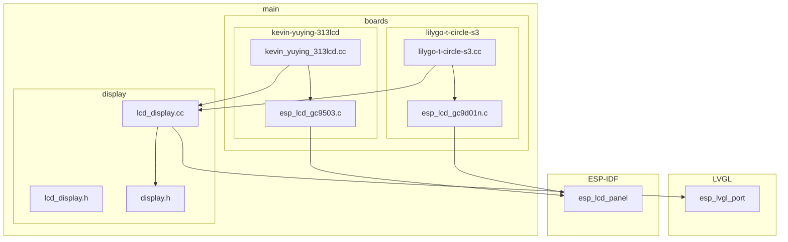
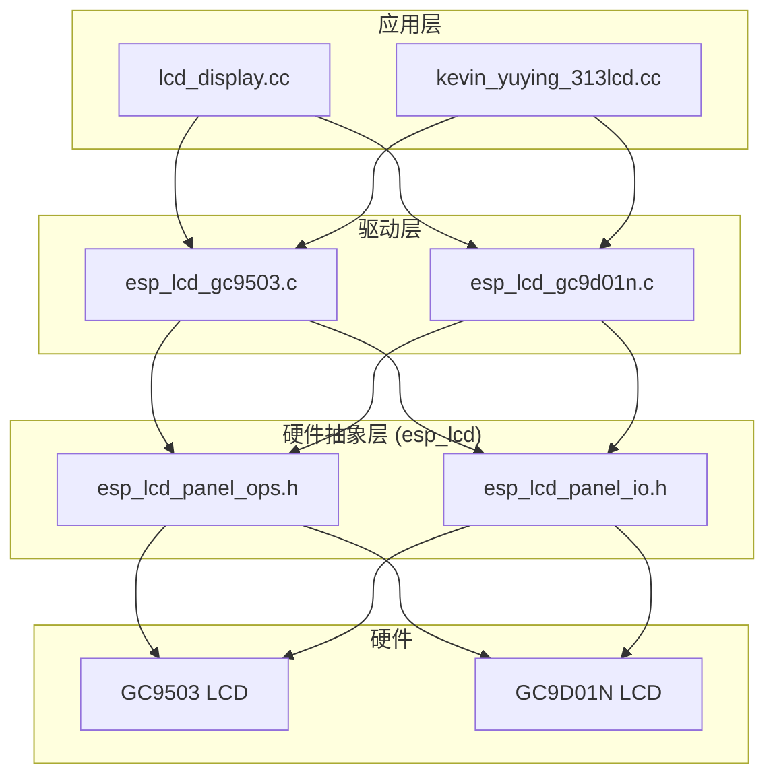
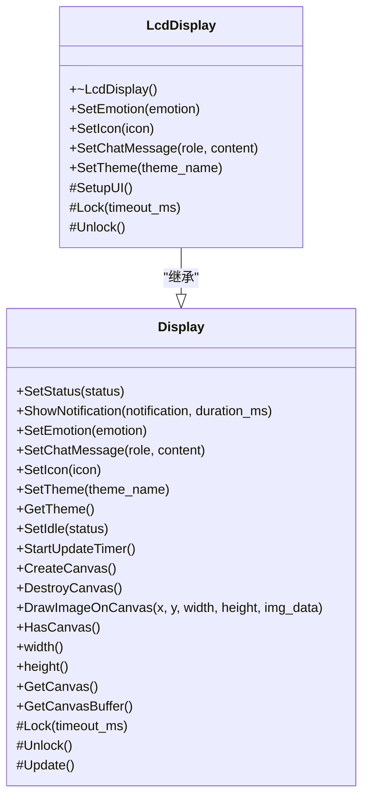
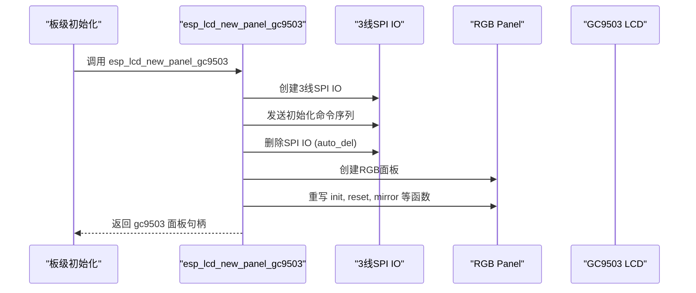
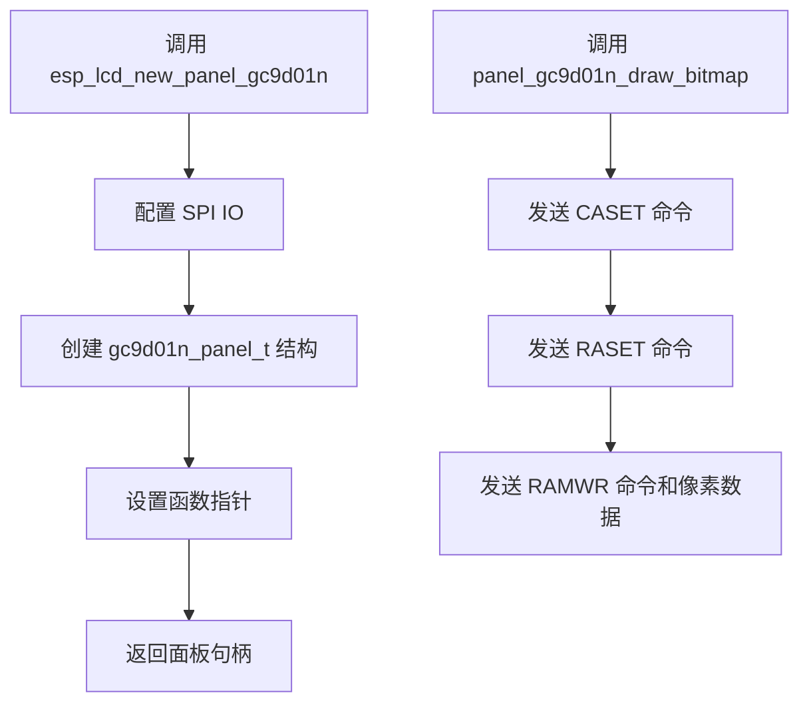
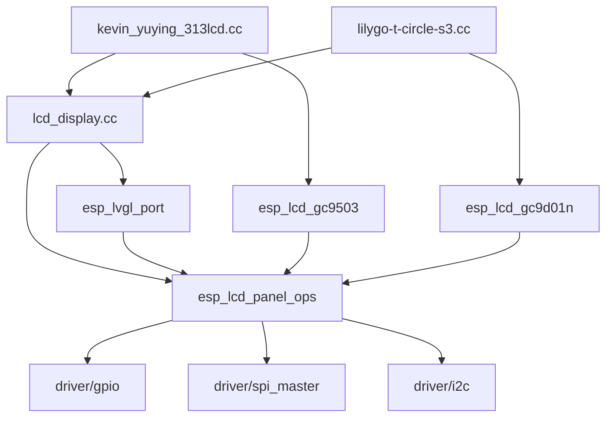

# LCD驱动实现

<cite>
**本文档引用的文件**   
- [lcd_display.h](file://main/display/lcd_display.h)
- [lcd_display.cc](file://main/display/lcd_display.cc)
- [esp_lcd_gc9503.c](file://main/boards/kevin-yuying-313lcd/esp_lcd_gc9503.c)
- [esp_lcd_gc9d01n.c](file://main/boards/lilygo-t-circle-s3/esp_lcd_gc9d01n.c)
- [kevin_yuying_313lcd.cc](file://main/boards/kevin-yuying-313lcd/kevin_yuying_313lcd.cc)
- [lilygo-t-circle-s3.cc](file://main/boards/lilygo-t-circle-s3/lilygo-t-circle-s3.cc)
- [display.h](file://main/display/display.h)
</cite>

## 目录
1. [引言](#引言)
2. [项目结构](#项目结构)
3. [核心组件](#核心组件)
4. [架构概述](#架构概述)
5. [详细组件分析](#详细组件分析)
6. [依赖分析](#依赖分析)
7. [性能考虑](#性能考虑)
8. [故障排除指南](#故障排除指南)
9. [结论](#结论)

## 引言
本文档深入分析了基于ESP32平台的LCD驱动实现机制。重点阐述了`lcd_display`类如何封装`esp_lcd`组件的初始化流程、时序配置和DMA刷新策略。通过分析`gc9503`和`gc9d01n`控制器的实际代码，详细说明了命令序列发送、显存映射、色彩格式转换（RGB565）等关键技术细节。文档还涵盖了多缓冲机制与LVGL图形库的集成方式，并提供了LCD驱动开发模板，包括引脚配置、电源时序控制、屏幕旋转支持等。最后，解释了如何通过Board系统动态加载对应LCD驱动实例，并处理不同分辨率面板的适配问题。

## 项目结构
项目的文件组织遵循功能模块化原则，LCD驱动相关的代码分散在`main`目录下的`boards`和`display`子目录中。`boards`目录包含了针对不同硬件开发板的特定实现，每个子目录对应一个具体的开发板型号，其中包含了该板卡特有的LCD控制器驱动（如`esp_lcd_gc9503.c`）和板级初始化代码（如`kevin_yuying_313lcd.cc`）。`display`目录则包含了与硬件无关的高层显示抽象，如`lcd_display.h`和`lcd_display.cc`，它们定义了统一的`Display`接口和基于LVGL的UI实现。

**图源**
- [main/boards/kevin-yuying-313lcd/esp_lcd_gc9503.c](file://main/boards/kevin-yuying-313lcd/esp_lcd_gc9503.c)
- [main/boards/lilygo-t-circle-s3/esp_lcd_gc9d01n.c](file://main/boards/lilygo-t-circle-s3/esp_lcd_gc9d01n.c)
- [main/boards/kevin-yuying-313lcd/kevin_yuying_313lcd.cc](file://main/boards/kevin-yuying-313lcd/kevin_yuying_313lcd.cc)
- [main/boards/lilygo-t-circle-s3/lilygo-t-circle-s3.cc](file://main/boards/lilygo-t-circle-s3/lilygo-t-circle-s3.cc)
- [main/display/lcd_display.cc](file://main/display/lcd_display.cc)
- [main/display/lcd_display.h](file://main/display/lcd_display.h)
- [main/display/display.h](file://main/display/display.h)

## 核心组件
本项目的核心组件是`LcdDisplay`类及其派生类，它们位于`main/display/lcd_display.h`中。`LcdDisplay`继承自`Display`基类，提供了一个统一的接口来控制LCD屏幕。它封装了`esp_lcd_panel_io_handle_t`和`esp_lcd_panel_handle_t`，这两个句柄分别代表了LCD面板的I/O接口和面板本身。`LcdDisplay`的派生类，如`RgbLcdDisplay`和`SpiLcdDisplay`，根据不同的物理接口（RGB并行或SPI）提供了具体的初始化和配置逻辑。这些类负责初始化LVGL库、配置显示驱动，并设置UI元素。

**本节来源**
- [main/display/lcd_display.h](file://main/display/lcd_display.h)
- [main/display/lcd_display.cc](file://main/display/lcd_display.cc)

## 架构概述
系统的整体架构分为三层：硬件抽象层（HAL）、驱动层和应用层。硬件抽象层由ESP-IDF的`esp_lcd`组件提供，它定义了与具体LCD控制器无关的通用接口。驱动层由`esp_lcd_gc9503.c`和`esp_lcd_gc9d01n.c`等文件实现，它们是`esp_lcd`组件的供应商特定驱动，负责发送初始化命令序列、处理时序和控制GPIO。应用层由`lcd_display.cc`和各个板级初始化文件（如`kevin_yuying_313lcd.cc`）构成，它们利用驱动层提供的句柄来创建和管理显示实例，并与LVGL图形库集成以渲染UI。

**图源**
- [main/display/lcd_display.cc](file://main/display/lcd_display.cc)
- [main/boards/kevin-yuying-313lcd/esp_lcd_gc9503.c](file://main/boards/kevin-yuying-313lcd/esp_lcd_gc9503.c)
- [main/boards/lilygo-t-circle-s3/esp_lcd_gc9d01n.c](file://main/boards/lilygo-t-circle-s3/esp_lcd_gc9d01n.c)
- [main/display/lcd_display.h](file://main/display/lcd_display.h)

## 详细组件分析

### LcdDisplay 类分析
`LcdDisplay`类是LCD显示功能的高层封装。它通过构造函数接收`esp_lcd`组件创建的`panel_io`和`panel`句柄，并在构造函数中完成LVGL的初始化和显示添加。`SetupUI`方法负责创建状态栏、内容区域等UI组件。`SetChatMessage`等方法则提供了向UI发送更新的接口。

**图源**
- [main/display/lcd_display.h](file://main/display/lcd_display.h)
- [main/display/lcd_display.cc](file://main/display/lcd_display.cc)

### GC9503 LCD 控制器驱动分析
`esp_lcd_gc9503.c`文件实现了针对GC9503控制器的驱动。该驱动的核心是`esp_lcd_new_panel_gc9503`函数，它首先配置一个3线SPI接口（用于发送初始化命令），然后创建一个RGB面板。初始化命令序列通过`panel_gc9503_send_init_cmds`函数发送，这些命令配置了控制器的显示模式、色彩格式等。驱动还重写了`init`、`reset`、`mirror`等函数，以在RGB面板初始化前后执行特定于GC9503的操作。

**图源**
- [main/boards/kevin-yuying-313lcd/esp_lcd_gc9503.c](file://main/boards/kevin-yuying-313lcd/esp_lcd_gc9503.c)
- [main/boards/kevin-yuying-313lcd/kevin_yuying_313lcd.cc](file://main/boards/kevin-yuying-313lcd/kevin_yuying_313lcd.cc)

### GC9D01N LCD 控制器驱动分析
`esp_lcd_gc9d01n.c`文件为GC9D01N控制器提供了驱动实现。与GC9503不同，GC9D01N通常通过SPI接口直接进行通信，因此其驱动直接使用`esp_lcd_panel_io_spi`。`esp_lcd_new_panel_gc9d01n`函数配置了SPI IO和面板参数，并设置了函数指针（如`draw_bitmap`、`mirror`）。`panel_gc9d01n_draw_bitmap`函数是关键，它通过SPI发送`CASET`和`RASET`命令来设置绘制区域，然后通过`RAMWR`命令发送像素数据。

**图源**
- [main/boards/lilygo-t-circle-s3/esp_lcd_gc9d01n.c](file://main/boards/lilygo-t-circle-s3/esp_lcd_gc9d01n.c)
- [main/boards/lilygo-t-circle-s3/lilygo-t-circle-s3.cc](file://main/boards/lilygo-t-circle-s3/lilygo-t-circle-s3.cc)

## 依赖分析
LCD驱动的实现依赖于多个ESP-IDF组件。最核心的是`esp_lcd`组件，它提供了面板I/O和操作的抽象。`esp_lvgl_port`组件是LVGL图形库与ESP-IDF的桥梁，负责将LVGL的绘图命令转换为对`esp_lcd`面板的调用。此外，驱动还依赖于`driver/gpio`和`driver/spi_master`等底层驱动来控制硬件引脚。板级代码则依赖于`wifi_board.h`等上层抽象来集成网络和音频功能。

**图源**
- [main/display/lcd_display.cc](file://main/display/lcd_display.cc)
- [main/boards/kevin-yuying-313lcd/esp_lcd_gc9503.c](file://main/boards/kevin-yuying-313lcd/esp_lcd_gc9503.c)
- [main/boards/lilygo-t-circle-s3/esp_lcd_gc9d01n.c](file://main/boards/lilygo-t-circle-s3/esp_lcd_gc9d01n.c)
- [main/boards/kevin-yuying-313lcd/kevin_yuying_313lcd.cc](file://main/boards/kevin-yuying-313lcd/kevin_yuying_313lcd.cc)
- [main/boards/lilygo-t-circle-s3/lilygo-t-circle-s3.cc](file://main/boards/lilygo-t-circle-s3/lilygo-t-circle-s3.cc)

## 性能考虑
LCD驱动的性能主要受制于物理接口的带宽。RGB并行接口（如GC9503）通常能提供更高的刷新率，因为它可以并行传输16位数据。而SPI接口（如GC9D01N）的带宽较低，刷新率也相对较低。为了优化性能，驱动使用了DMA（直接内存访问）来传输像素数据，避免了CPU的频繁中断。`RgbLcdDisplay`类还启用了双缓冲（`double_buffer = true`），这可以有效防止屏幕撕裂。此外，LVGL的脏矩形刷新机制也减少了不必要的像素更新。

## 故障排除指南
常见的LCD驱动问题包括屏幕不亮、显示花屏或无法初始化。首先检查硬件连接，特别是电源、复位（RST）和片选（CS）引脚。其次，确认`esp_lcd`组件的配置参数（如分辨率、时钟频率）与LCD面板规格书一致。对于初始化失败，应检查`vendor_specific_init_default`数组中的命令序列是否正确。如果使用3线SPI进行初始化（如GC9503），确保在`auto_del_panel_io`启用后，RGB面板的配置是正确的。最后，使用`ESP_LOGI`和`ESP_LOGE`日志来跟踪初始化流程，定位失败点。

**本节来源**
- [main/boards/kevin-yuying-313lcd/esp_lcd_gc9503.c](file://main/boards/kevin-yuying-313lcd/esp_lcd_gc9503.c)
- [main/boards/lilygo-t-circle-s3/esp_lcd_gc9d01n.c](file://main/boards/lilygo-t-circle-s3/esp_lcd_gc9d01n.c)
- [main/display/lcd_display.cc](file://main/display/lcd_display.cc)

## 结论
本文档详细分析了基于ESP-IDF的LCD驱动实现。通过`esp_lcd`组件的分层设计，实现了对不同LCD控制器（如GC9503和GC9D01N）的灵活支持。驱动代码通过3线SPI或标准SPI接口发送初始化命令，并利用RGB或SPI面板驱动来管理显存和刷新。`LcdDisplay`类成功地将底层驱动与LVGL图形库集成，为上层应用提供了简洁的UI更新接口。这种架构既保证了硬件兼容性，又提供了良好的可维护性和扩展性，为开发复杂的嵌入式GUI应用奠定了坚实的基础。