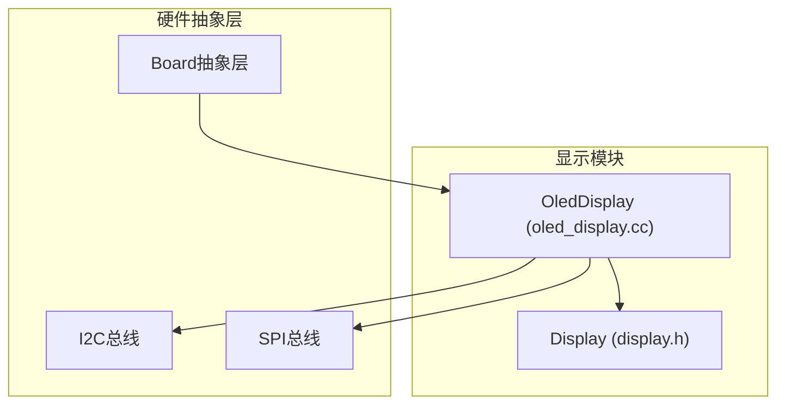
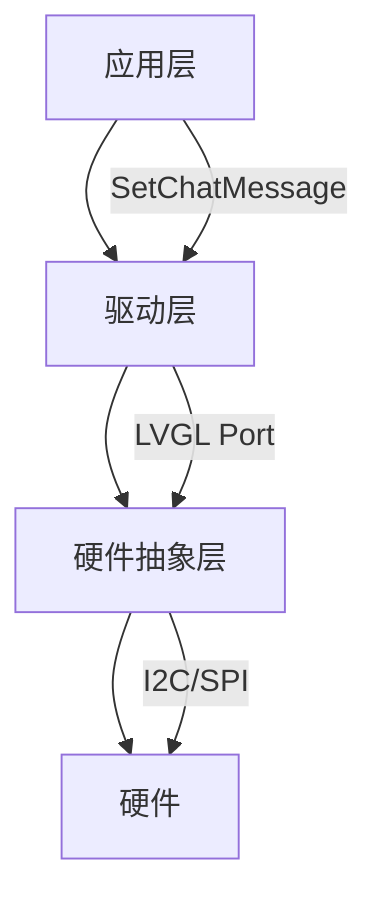
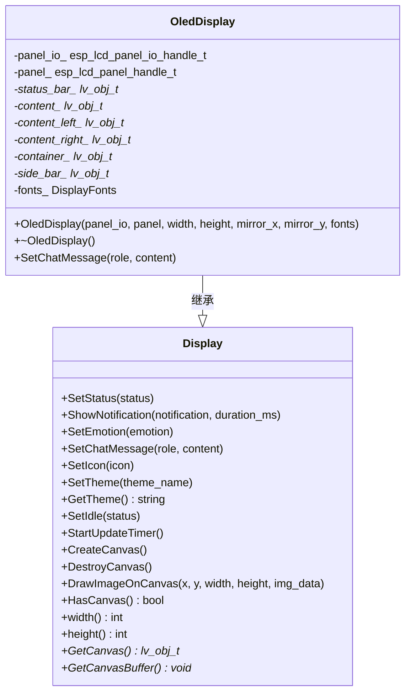
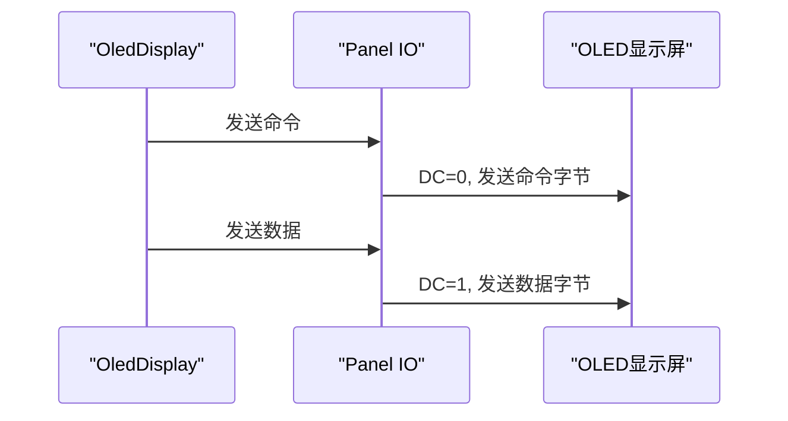
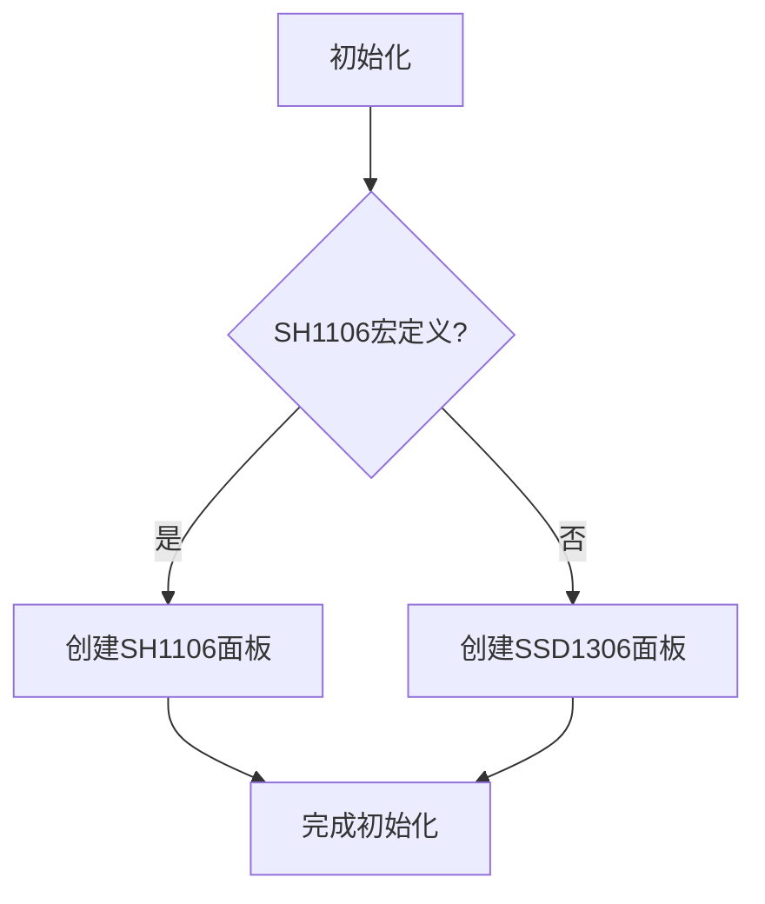
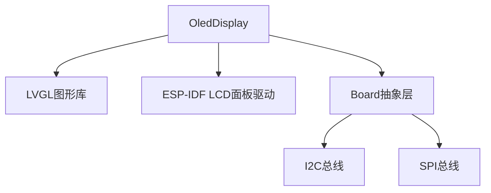

# OLED驱动实现

<cite>
**本文档引用的文件**   
- [oled_display.h](file://main/display/oled_display.h)
- [oled_display.cc](file://main/display/oled_display.cc)
- [display.h](file://main/display/display.h)
- [compact_wifi_board.cc](file://main/boards/bread-compact-wifi/compact_wifi_board.cc)
- [xingzhi-cube-0.96oled-wifi.cc](file://main/boards/xingzhi-cube-0.96oled-wifi/xingzhi-cube-0.96oled-wifi.cc)
- [esp_lcd_panel_sh1106.h](file://managed_components/tny-robotics__sh1106-esp-idf/include/esp_lcd_panel_sh1106.h)
</cite>

## 目录
1. [简介](#简介)
2. [项目结构](#项目结构)
3. [核心组件](#核心组件)
4. [架构概述](#架构概述)
5. [详细组件分析](#详细组件分析)
6. [依赖分析](#依赖分析)
7. [性能考虑](#性能考虑)
8. [故障排除指南](#故障排除指南)
9. [结论](#结论)

## 简介
本文档详细说明了OLED显示驱动的实现原理，重点分析了I2C/SPI通信协议下的命令与数据切换机制、页寻址模式（Page Addressing Mode）和显存刷新策略。文档对比了OLED与LCD在init()初始化序列、setBrightness()亮度控制、flush()刷新行为上的差异，并阐述了OLED特有的SSD1306/SH1106控制器兼容性处理。此外，文档还涵盖了OLED驱动的内存优化技术，如按页更新、局部刷新等，以降低功耗并提升响应速度。最后，文档提供了OLED驱动集成到Board抽象层的完整流程，包括设备检测、总线仲裁和错误恢复机制。

## 项目结构
本项目采用模块化设计，将显示功能独立为`display`模块，其中包含OLED和LCD两种显示技术的实现。OLED驱动的核心实现位于`main/display`目录下，主要由`oled_display.h`和`oled_display.cc`两个文件构成。`oled_display.h`定义了`OledDisplay`类的接口和成员变量，而`oled_display.cc`则实现了具体的初始化、UI设置和消息显示逻辑。OLED驱动依赖于LVGL图形库进行UI渲染，并通过ESP-IDF的LCD面板驱动框架与底层硬件通信。

**图源**
- [oled_display.h](file://main/display/oled_display.h)
- [oled_display.cc](file://main/display/oled_display.cc)

**章节源**
- [oled_display.h](file://main/display/oled_display.h)
- [oled_display.cc](file://main/display/oled_display.cc)

## 核心组件
OLED驱动的核心组件是`OledDisplay`类，它继承自`Display`基类，实现了OLED特有的显示功能。`OledDisplay`类通过`esp_lcd_panel_io_handle_t`和`esp_lcd_panel_handle_t`与底层LCD面板驱动框架交互，完成显示初始化、命令发送和数据传输。该类还集成了LVGL图形库，用于创建和管理UI元素，如状态栏、内容区域和标签。

**章节源**
- [oled_display.h](file://main/display/oled_display.h#L1-L37)
- [oled_display.cc](file://main/display/oled_display.cc#L0-L199)

## 架构概述
OLED驱动的架构分为三层：硬件抽象层、驱动层和应用层。硬件抽象层由Board类提供，负责管理I2C/SPI总线和GPIO引脚。驱动层由`OledDisplay`类实现，负责与ESP-IDF的LCD面板驱动框架交互，完成显示初始化和数据传输。应用层通过`Display`基类的接口与`OledDisplay`类交互，实现UI更新和状态显示。

**图源**
- [oled_display.h](file://main/display/oled_display.h)
- [oled_display.cc](file://main/display/oled_display.cc)

## 详细组件分析
### OledDisplay类分析
`OledDisplay`类是OLED驱动的核心，它通过继承`Display`基类，实现了OLED特有的显示功能。该类的构造函数接收LCD面板IO句柄、面板句柄、屏幕尺寸和字体等参数，并初始化LVGL图形库。`SetupUI_128x64`和`SetupUI_128x32`方法根据屏幕尺寸创建不同的UI布局。

#### 类图

**图源**
- [oled_display.h](file://main/display/oled_display.h#L1-L37)
- [display.h](file://main/display/display.h#L1-L112)

**章节源**
- [oled_display.h](file://main/display/oled_display.h#L1-L37)
- [oled_display.cc](file://main/display/oled_display.cc#L0-L199)

### 通信协议分析
OLED驱动支持I2C和SPI两种通信协议。在I2C模式下，通过`esp_lcd_panel_io_i2c_config_t`配置I2C总线参数，如设备地址、SCL速度和DC位偏移。在SPI模式下，通过`esp_lcd_panel_io_spi_config_t`配置SPI总线参数，如CS引脚、DC引脚和SPI模式。命令与数据的切换通过DC位实现，当DC位为低电平时发送命令，为高电平时发送数据。

**图源**
- [compact_wifi_board.cc](file://main/boards/bread-compact-wifi/compact_wifi_board.cc#L40-L192)
- [xingzhi-cube-0.96oled-wifi.cc](file://main/boards/xingzhi-cube-0.96oled-wifi/xingzhi-cube-0.96oled-wifi.cc#L0-L199)

**章节源**
- [compact_wifi_board.cc](file://main/boards/bread-compact-wifi/compact_wifi_board.cc#L40-L192)
- [xingzhi-cube-0.96oled-wifi.cc](file://main/boards/xingzhi-cube-0.96oled-wifi/xingzhi-cube-0.96oled-wifi.cc#L0-L199)

### 控制器兼容性分析
OLED驱动支持SSD1306和SH1106两种控制器。通过条件编译宏`SH1106`，可以在编译时选择使用哪种控制器。`esp_lcd_new_panel_ssd1306`和`esp_lcd_new_panel_sh1106`函数分别用于创建SSD1306和SH1106面板的驱动实例。两种控制器的初始化序列和命令集略有不同，但驱动框架提供了统一的API进行访问。

**图源**
- [compact_wifi_board.cc](file://main/boards/bread-compact-wifi/compact_wifi_board.cc#L40-L192)
- [esp_lcd_panel_sh1106.h](file://managed_components/tny-robotics__sh1106-esp-idf/include/esp_lcd_panel_sh1106.h#L0-L91)

**章节源**
- [compact_wifi_board.cc](file://main/boards/bread-compact-wifi/compact_wifi_board.cc#L40-L192)
- [esp_lcd_panel_sh1106.h](file://managed_components/tny-robotics__sh1106-esp-idf/include/esp_lcd_panel_sh1106.h#L0-L91)

## 依赖分析
OLED驱动依赖于多个组件，包括LVGL图形库、ESP-IDF的LCD面板驱动框架和Board抽象层。LVGL用于UI渲染，LCD面板驱动框架用于与底层硬件通信，Board抽象层用于管理I2C/SPI总线和GPIO引脚。这些依赖关系通过头文件包含和类继承实现。

**图源**
- [oled_display.h](file://main/display/oled_display.h)
- [oled_display.cc](file://main/display/oled_display.cc)

**章节源**
- [oled_display.h](file://main/display/oled_display.h)
- [oled_display.cc](file://main/display/oled_display.cc)

## 性能考虑
OLED驱动通过按页更新和局部刷新等技术优化性能。按页更新只刷新发生变化的页面，减少数据传输量。局部刷新只更新屏幕上的特定区域，避免全屏刷新带来的延迟。此外，驱动还使用LVGL的动画功能实现平滑的滚动字幕效果，提升用户体验。

## 故障排除指南
常见问题包括显示初始化失败、通信超时和UI更新延迟。初始化失败可能是由于I2C地址错误或复位引脚未正确连接。通信超时可能是由于总线速度过快或线路干扰。UI更新延迟可能是由于LVGL任务优先级过低或显存不足。建议检查硬件连接、调整总线速度和优化内存使用。

**章节源**
- [oled_display.cc](file://main/display/oled_display.cc#L0-L199)
- [compact_wifi_board.cc](file://main/boards/bread-compact-wifi/compact_wifi_board.cc#L40-L192)

## 结论
本文档详细分析了OLED显示驱动的实现原理，涵盖了通信协议、控制器兼容性、内存优化和集成流程等方面。通过模块化设计和分层架构，OLED驱动实现了良好的可维护性和可扩展性。未来可以进一步优化刷新策略，支持更多OLED控制器，并集成更多高级显示功能。