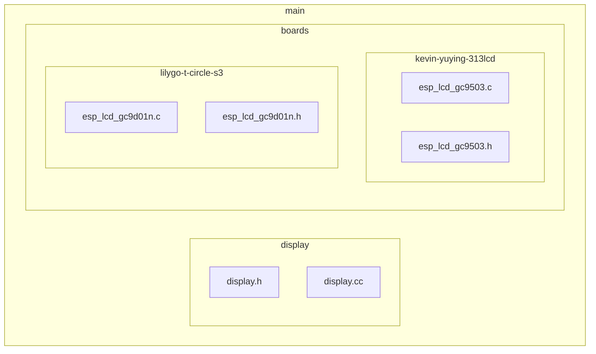
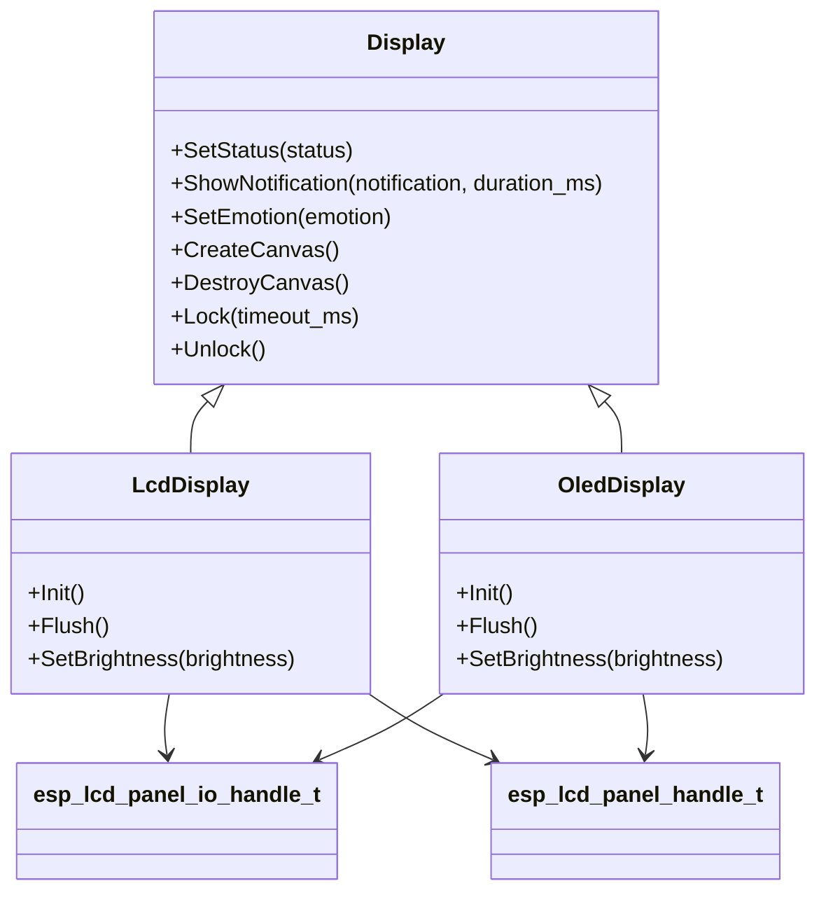
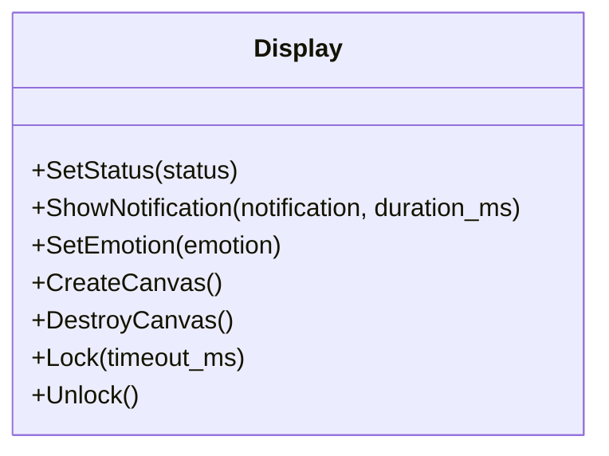
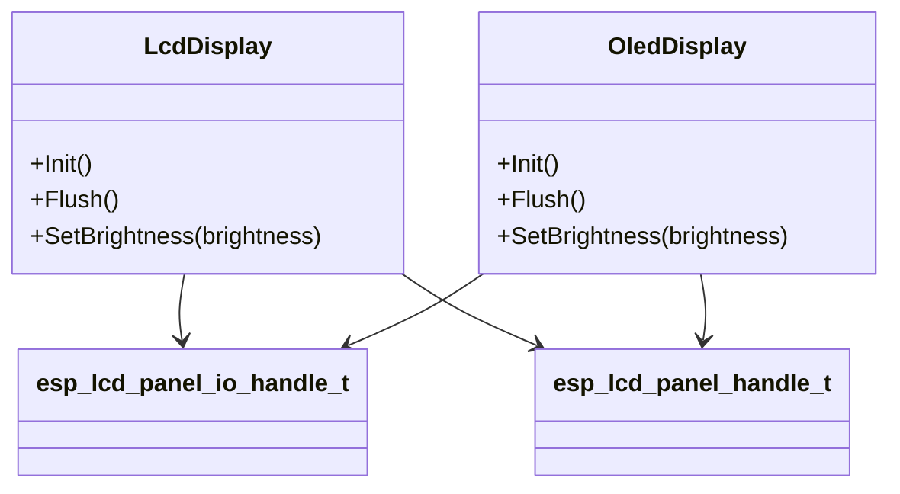
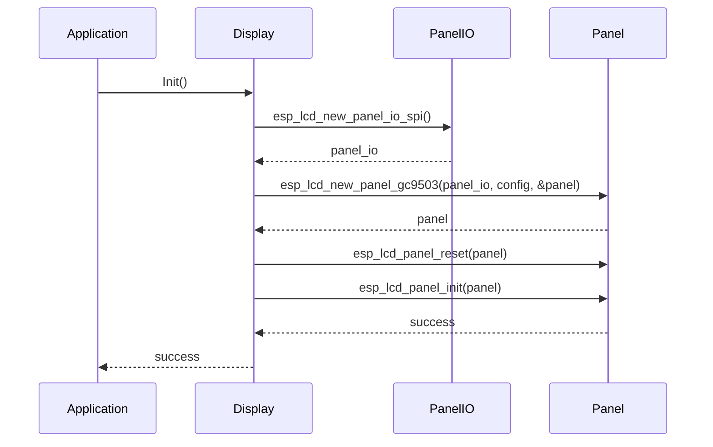
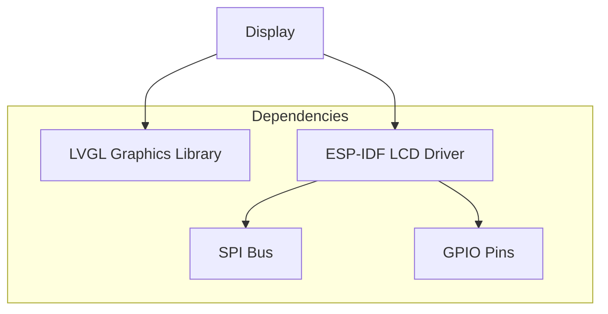

# 显示驱动接口

<cite>
**本文档引用的文件**   
- [display.h](file://main/display/display.h#L0-L112)
- [esp_lcd_gc9503.c](file://main/boards/kevin-yuying-313lcd/esp_lcd_gc9503.c#L0-L200)
- [esp_lcd_gc9d01n.c](file://main/boards/lilygo-t-circle-s3/esp_lcd_gc9d01n.c#L0-L200)
- [board.h](file://main/boards/common/board.h#L0-L55)
- [lilygo-t-circle-s3.cc](file://main/boards/lilygo-t-circle-s3/lilygo-t-circle-s3.cc#L159-L191)
- [kevin_box_board.cc](file://main/boards/kevin-box-1/kevin_box_board.cc#L79-L117)
</cite>

## 目录
1. [引言](#引言)
2. [项目结构](#项目结构)
3. [核心组件](#核心组件)
4. [架构概述](#架构概述)
5. [详细组件分析](#详细组件分析)
6. [依赖分析](#依赖分析)
7. [性能考虑](#性能考虑)
8. [故障排除指南](#故障排除指南)
9. [结论](#结论)

## 引言
本文档详细阐述了显示子系统的驱动接口设计，重点分析了Display基类的抽象方法（如init()、flush()、setBrightness()）的语义定义与调用时序。文档深入探讨了LCD与OLED具体实现类的差异化特性，包括刷新机制、显存管理、灰度/色彩支持等。通过分析esp_lcd_gc9503.h和esp_lcd_gc9d01n.h等具体LCD控制器驱动，说明了硬件适配层的实现模式。此外，文档还提供了显示驱动开发模板，涵盖初始化序列配置、DMA传输优化、多缓冲策略等关键技术点，并说明了如何通过工厂模式与Board系统集成。

## 项目结构
项目结构显示了显示驱动接口位于main/display/目录下，而具体的LCD控制器驱动实现位于各个开发板的特定目录中，如main/boards/kevin-yuying-313lcd/和main/boards/lilygo-t-circle-s3/。这种结构支持模块化和可重用性，允许不同开发板使用相同的显示驱动接口，同时实现特定的硬件适配。

**图示来源**
- [display.h](file://main/display/display.h#L0-L112)
- [esp_lcd_gc9503.c](file://main/boards/kevin-yuying-313lcd/esp_lcd_gc9503.c#L0-L200)
- [esp_lcd_gc9d01n.c](file://main/boards/lilygo-t-circle-s3/esp_lcd_gc9d01n.c#L0-L200)

**本节来源**
- [display.h](file://main/display/display.h#L0-L112)
- [esp_lcd_gc9503.c](file://main/boards/kevin-yuying-313lcd/esp_lcd_gc9503.c#L0-L200)
- [esp_lcd_gc9d01n.c](file://main/boards/lilygo-t-circle-s3/esp_lcd_gc9d01n.c#L0-L200)

## 核心组件
核心组件包括Display基类，它定义了所有显示设备的通用接口。Display基类提供了诸如SetStatus、ShowNotification、SetEmotion等方法，以及用于创建和销毁画布的CreateCanvas和DestroyCanvas方法。此外，Display基类还定义了用于锁定和解锁显示的Lock和Unlock方法，确保在多任务环境下的线程安全。

**本节来源**
- [display.h](file://main/display/display.h#L0-L112)

## 架构概述
系统架构采用分层设计，Display基类位于顶层，提供统一的接口。具体的显示实现类（如RgbLcdDisplay、MipiLcdDisplay等）继承自Display基类，并实现特定的硬件适配逻辑。硬件适配层通过esp_lcd_panel_io_handle_t和esp_lcd_panel_handle_t与底层硬件通信，实现初始化、刷新和控制功能。

**图示来源**
- [display.h](file://main/display/display.h#L0-L112)
- [esp_lcd_gc9503.c](file://main/boards/kevin-yuying-313lcd/esp_lcd_gc9503.c#L0-L200)
- [esp_lcd_gc9d01n.c](file://main/boards/lilygo-t-circle-s3/esp_lcd_gc9d01n.c#L0-L200)

## 详细组件分析

### Display基类分析
Display基类是所有显示设备的抽象基类，定义了通用的显示操作接口。其主要方法包括SetStatus用于设置状态信息，ShowNotification用于显示通知，SetEmotion用于设置情感图标，以及CreateCanvas和DestroyCanvas用于管理显示画布。Lock和Unlock方法用于确保在多任务环境下的线程安全。

**图示来源**
- [display.h](file://main/display/display.h#L0-L112)

**本节来源**
- [display.h](file://main/display/display.h#L0-L112)

### LCD与OLED实现类分析
LCD和OLED显示实现类继承自Display基类，并实现特定的硬件适配逻辑。LCD实现类（如RgbLcdDisplay）通常使用RGB接口与显示屏通信，支持高分辨率和丰富的色彩。OLED实现类（如Mcu8080LcdDisplay）则使用MCU8080接口，适用于低功耗和小尺寸显示屏。

**图示来源**
- [esp_lcd_gc9503.c](file://main/boards/kevin-yuying-313lcd/esp_lcd_gc9503.c#L0-L200)
- [esp_lcd_gc9d01n.c](file://main/boards/lilygo-t-circle-s3/esp_lcd_gc9d01n.c#L0-L200)

**本节来源**
- [esp_lcd_gc9503.c](file://main/boards/kevin-yuying-313lcd/esp_lcd_gc9503.c#L0-L200)
- [esp_lcd_gc9d01n.c](file://main/boards/lilygo-t-circle-s3/esp_lcd_gc9d01n.c#L0-L200)

### 硬件适配层分析
硬件适配层通过esp_lcd_panel_io_handle_t和esp_lcd_panel_handle_t与底层硬件通信。esp_lcd_new_panel_gc9503和esp_lcd_new_panel_gc9d01n函数用于创建特定LCD控制器的面板句柄。这些函数接收面板IO配置和设备配置，初始化LCD控制器，并返回面板句柄供上层使用。

**图示来源**
- [esp_lcd_gc9503.c](file://main/boards/kevin-yuying-313lcd/esp_lcd_gc9503.c#L0-L200)
- [esp_lcd_gc9d01n.c](file://main/boards/lilygo-t-circle-s3/esp_lcd_gc9d01n.c#L0-L200)

**本节来源**
- [esp_lcd_gc9503.c](file://main/boards/kevin-yuying-313lcd/esp_lcd_gc9503.c#L0-L200)
- [esp_lcd_gc9d01n.c](file://main/boards/lilygo-t-circle-s3/esp_lcd_gc9d01n.c#L0-L200)

## 依赖分析
显示驱动接口依赖于LVGL图形库进行UI渲染，依赖于ESP-IDF的LCD面板驱动库进行硬件通信。具体的LCD控制器驱动实现依赖于特定的开发板配置和硬件资源，如SPI总线、GPIO引脚等。

**图示来源**
- [display.h](file://main/display/display.h#L0-L112)
- [esp_lcd_gc9503.c](file://main/boards/kevin-yuying-313lcd/esp_lcd_gc9503.c#L0-L200)
- [esp_lcd_gc9d01n.c](file://main/boards/lilygo-t-circle-s3/esp_lcd_gc9d01n.c#L0-L200)

**本节来源**
- [display.h](file://main/display/display.h#L0-L112)
- [esp_lcd_gc9503.c](file://main/boards/kevin-yuying-313lcd/esp_lcd_gc9503.c#L0-L200)
- [esp_lcd_gc9d01n.c](file://main/boards/lilygo-t-circle-s3/esp_lcd_gc9d01n.c#L0-L200)

## 性能考虑
显示驱动的性能主要受刷新率、DMA传输效率和显存管理的影响。使用DMA传输可以显著提高数据传输效率，减少CPU占用。多缓冲策略可以避免显示刷新时的闪烁问题，提高用户体验。

## 故障排除指南
常见问题包括显示初始化失败、刷新异常和亮度控制失效。初始化失败通常与SPI配置或GPIO引脚冲突有关，刷新异常可能由DMA传输错误引起，亮度控制失效则可能与PWM配置或背光电路有关。

**本节来源**
- [esp_lcd_gc9503.c](file://main/boards/kevin-yuying-313lcd/esp_lcd_gc9503.c#L0-L200)
- [esp_lcd_gc9d01n.c](file://main/boards/lilygo-t-circle-s3/esp_lcd_gc9d01n.c#L0-L200)

## 结论
本文档详细分析了显示子系统的驱动接口设计，涵盖了Display基类的抽象方法、LCD与OLED实现类的差异化特性、硬件适配层的实现模式以及显示驱动开发模板。通过工厂模式与Board系统的集成，实现了显示驱动的模块化和可重用性，为开发高效、稳定的显示应用提供了坚实的基础。