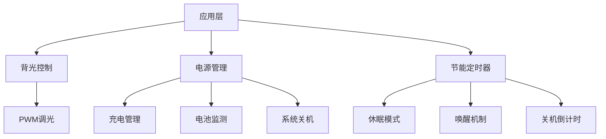
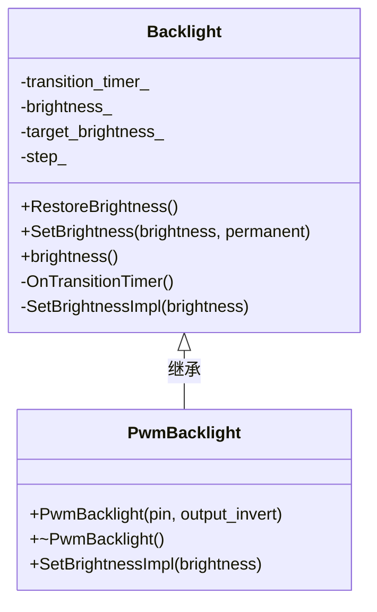
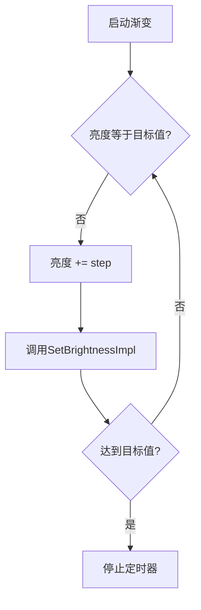
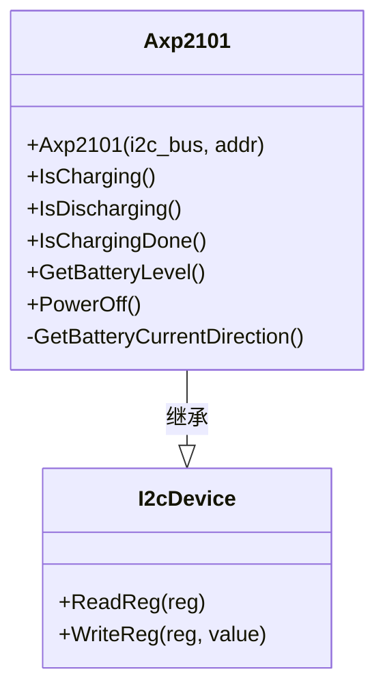
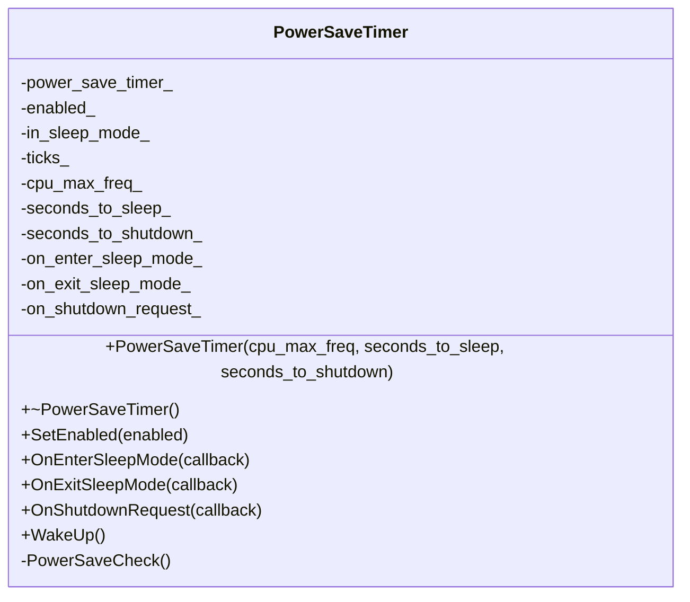

# 电源与背光控制驱动

<cite>
**本文档引用的文件**  
- [backlight.h](file://main/boards/common/backlight.h)
- [backlight.cc](file://main/boards/common/backlight.cc)
- [axp2101.h](file://main/boards/common/axp2101.h)
- [axp2101.cc](file://main/boards/common/axp2101.cc)
- [power_save_timer.h](file://main/boards/common/power_save_timer.h)
- [power_save_timer.cc](file://main/boards/common/power_save_timer.cc)
- [movecall_cuican_esp32s3.cc](file://main/boards/movecall-cuican-esp32s3/movecall_cuican_esp32s3.cc)
</cite>

## 目录

1. [引言](#引言)
2. [核心组件分析](#核心组件分析)
3. [背光控制驱动详解](#背光控制驱动详解)
4. [AXP2101电源管理芯片驱动](#axp2101电源管理芯片驱动)
5. [电源节能定时器机制](#电源节能定时器机制)
6. [板级电源协同管理](#板级电源协同管理)

## 引言

本文档深入分析嵌入式系统中的电源管理与背光控制驱动架构。重点阐述了背光亮度调节、系统级电源控制、低功耗模式切换以及多级电源域协同管理等关键技术的实现原理。通过解析`Backlight`、`Axp2101`和`PowerSaveTimer`等核心类的设计与实现，揭示了系统如何在保证功能的同时实现高效节能。

## 核心组件分析

系统电源管理由三大核心组件构成：背光控制驱动、AXP2101电源管理芯片驱动和电源节能定时器。这些组件通过分层设计和模块化接口，实现了硬件抽象、功能解耦和系统级协调。



**图示来源**  
- [backlight.h](file://main/boards/common/backlight.h)
- [axp2101.h](file://main/boards/common/axp2101.h)
- [power_save_timer.h](file://main/boards/common/power_save_timer.h)

**本节来源**  
- [backlight.h](file://main/boards/common/backlight.h)
- [axp2101.h](file://main/boards/common/axp2101.h)
- [power_save_timer.h](file://main/boards/common/power_save_timer.h)

## 背光控制驱动详解

### 背光接口设计

`Backlight`基类采用面向对象设计，提供统一的亮度控制接口，支持亮度渐变和持久化存储。



**图示来源**  
- [backlight.h](file://main/boards/common/backlight.h#L15-L35)

**本节来源**  
- [backlight.h](file://main/boards/common/backlight.h#L1-L35)

### setBrightness()方法实现

`setBrightness()`方法是背光控制的核心，负责设置目标亮度并启动渐变过程。

**方法参数**:
- **brightness**: 目标亮度值（0-100）
- **permanent**: 是否永久保存该亮度设置

**执行流程**:
1. 输入值校验，确保亮度在0-100范围内
2. 检查是否需要更新，避免重复操作
3. 若`permanent`为真，则通过`Settings`类将亮度值持久化存储
4. 设置目标亮度和变化步长
5. 启动渐变定时器（每5ms触发一次）

```cpp
void Backlight::SetBrightness(uint8_t brightness, bool permanent) {
    if (brightness > 100) {
        brightness = 100;
    }

    if (brightness_ == brightness) {
        return;
    }

    if (permanent) {
        Settings settings("display", true);
        settings.SetInt("brightness", brightness);
    }

    target_brightness_ = brightness;
    step_ = (target_brightness_ > brightness_) ? 1 : -1;

    if (transition_timer_ != nullptr) {
        esp_timer_start_periodic(transition_timer_, 5 * 1000);
    }
}
```

**本节来源**  
- [backlight.cc](file://main/boards/common/backlight.cc#L42-L65)

### enable()与disable()方法实现

在`Backlight`类的设计中，虽然没有显式命名的`enable()`和`disable()`方法，但其功能通过`SetBrightness()`方法实现：

- **启用背光**: 调用`SetBrightness()`设置一个大于0的亮度值
- **禁用背光**: 调用`SetBrightness()`设置亮度为0

这种设计简化了接口，通过单一方法实现多种状态控制。

### 调光策略分析

系统采用PWM（脉宽调制）作为主要调光策略，由`PwmBacklight`类具体实现。

**PWM配置参数**:
- **定时器模式**: 低速模式（LEDC_LOW_SPEED_MODE）
- **分辨率**: 10位（LEDC_TIMER_10_BIT）
- **频率**: 25kHz（防止电感啸叫）
- **通道**: LEDC_CHANNEL_0

```cpp
const ledc_timer_config_t backlight_timer = {
    .speed_mode = LEDC_LOW_SPEED_MODE,
    .duty_resolution = LEDC_TIMER_10_BIT,
    .timer_num = LEDC_TIMER_0,
    .freq_hz = 25000,
    .clk_cfg = LEDC_AUTO_CLK,
    .deconfigure = false
};
```

**亮度转换逻辑**:
- 将0-100的百分比亮度转换为0-1023的PWM占空比
- 转换公式: `duty_cycle = (1023 * brightness) / 100`

```cpp
void PwmBacklight::SetBrightnessImpl(uint8_t brightness) {
    uint32_t duty_cycle = (1023 * brightness) / 100;
    ledc_set_duty(LEDC_LOW_SPEED_MODE, LEDC_CHANNEL_0, duty_cycle);
    ledc_update_duty(LEDC_LOW_SPEED_MODE, LEDC_CHANNEL_0);
}
```

**本节来源**  
- [backlight.cc](file://main/boards/common/backlight.cc#L88-L120)

### 亮度渐变逻辑

系统通过`esp_timer`实现平滑的亮度渐变效果，避免亮度突变带来的视觉不适。

**渐变机制**:
- 使用`esp_timer`创建周期性定时器（每5ms触发）
- 每次触发时，亮度值按`step_`（+1或-1）递增或递减
- 当达到目标亮度时，自动停止定时器



**本节来源**  
- [backlight.cc](file://main/boards/common/backlight.cc#L67-L87)

## AXP2101电源管理芯片驱动

### 系统级电源控制

`Axp2101`类封装了对AXP2101电源管理芯片的I2C通信，提供系统级电源控制功能。



**图示来源**  
- [axp2101.h](file://main/boards/common/axp2101.h#L7-L18)

**本节来源**  
- [axp2101.h](file://main/boards/common/axp2101.h#L1-L19)

### LDO配置与充电管理

尽管当前接口未直接暴露LDO配置功能，但`Axp2101`芯片本身支持多路LDO输出，可用于为系统不同模块提供独立电源域。

**充电状态检测**:
- 通过读取寄存器0x01的第5-6位判断电流方向
- 电流方向值为1表示充电中，2表示放电中

```cpp
int Axp2101::GetBatteryCurrentDirection() {
    return (ReadReg(0x01) & 0b01100000) >> 5;
}

bool Axp2101::IsCharging() {
    return GetBatteryCurrentDirection() == 1;
}

bool Axp2101::IsDischarging() {
    return GetBatteryCurrentDirection() == 2;
}
```

**充电完成检测**:
- 检查寄存器0x01的低3位是否等于0b100

```cpp
bool Axp2101::IsChargingDone() {
    uint8_t value = ReadReg(0x01);
    return (value & 0b00000111) == 0b00000100;
}
```

**本节来源**  
- [axp2101.cc](file://main/boards/common/axp2101.cc#L10-L27)

### 电池电量获取

系统通过读取AXP2101芯片的专用寄存器获取电池电量百分比。

```cpp
int Axp2101::GetBatteryLevel() {
    return ReadReg(0xA4);
}
```

**关键点**:
- 直接读取寄存器0xA4的值作为电量百分比
- 该值范围为0-100，无需额外计算
- 实现简单高效，但依赖芯片内部的电量计量算法

**本节来源**  
- [axp2101.cc](file://main/boards/common/axp2101.cc#L29-L31)

### 低功耗模式与系统关机

`Axp2101`驱动提供了系统级关机功能，通过配置芯片寄存器实现。

```cpp
void Axp2101::PowerOff() {
    uint8_t value = ReadReg(0x10);
    value = value | 0x01;
    WriteReg(0x10, value);
}
```

**关机机制**:
- 读取控制寄存器0x10的当前值
- 将最低位置1，触发关机流程
- 芯片将逐步切断系统电源

**本节来源**  
- [axp2101.cc](file://main/boards/common/axp2101.cc#L33-L36)

## 电源节能定时器机制

### 外设休眠与唤醒时序协调

`PowerSaveTimer`类负责协调系统进入和退出低功耗模式的时序，确保外设状态正确保存和恢复。



**图示来源**  
- [power_save_timer.h](file://main/boards/common/power_save_timer.h#L7-L32)

**本节来源**  
- [power_save_timer.h](file://main/boards/common/power_save_timer.h#L1-L33)

### 系统级节能实现

`PowerSaveTimer`通过周期性检查和状态管理，实现系统级节能。

**核心逻辑**:
- 每秒递增计数器`ticks_`
- 当计数达到`seconds_to_sleep_`时，进入休眠模式
- 当计数达到`seconds_to_shutdown_`时，触发关机请求

```cpp
void PowerSaveTimer::PowerSaveCheck() {
    auto& app = Application::GetInstance();
    if (!in_sleep_mode_ && !app.CanEnterSleepMode()) {
        ticks_ = 0;
        return;
    }

    ticks_++;
    if (seconds_to_sleep_ != -1 && ticks_ >= seconds_to_sleep_) {
        if (!in_sleep_mode_) {
            in_sleep_mode_ = true;
            if (on_enter_sleep_mode_) {
                on_enter_sleep_mode_();
            }

            if (cpu_max_freq_ != -1) {
                esp_pm_config_t pm_config = {
                    .max_freq_mhz = cpu_max_freq_,
                    .min_freq_mhz = 40,
                    .light_sleep_enable = true,
                };
                esp_pm_configure(&pm_config);
            }
        }
    }
    if (seconds_to_shutdown_ != -1 && ticks_ >= seconds_to_shutdown_ && on_shutdown_request_) {
        on_shutdown_request_();
    }
}
```

**本节来源**  
- [power_save_timer.cc](file://main/boards/common/power_save_timer.cc#L58-L83)

### 休眠模式切换

系统通过`esp_pm_configure()`API动态调整CPU频率和启用轻度睡眠，实现功耗优化。

**进入休眠**:
- 设置CPU最大频率为`cpu_max_freq_`
- 设置CPU最小频率为40MHz
- 启用轻度睡眠模式

**退出休眠**:
- 恢复CPU最大和最小频率为`cpu_max_freq_`
- 禁用轻度睡眠模式

```cpp
// 进入休眠
esp_pm_config_t pm_config = {
    .max_freq_mhz = cpu_max_freq_,
    .min_freq_mhz = 40,
    .light_sleep_enable = true,
};

// 退出休眠
esp_pm_config_t pm_config = {
    .max_freq_mhz = cpu_max_freq_,
    .min_freq_mhz = cpu_max_freq_,
    .light_sleep_enable = false,
};
```

**本节来源**  
- [power_save_timer.cc](file://main/boards/common/power_save_timer.cc#L70-L75)
- [power_save_timer.cc](file://main/boards/common/power_save_timer.cc#L93-L98)

## 板级电源协同管理

### 多级电源域协同机制

以`movecall_cuican_esp32s3`板级配置为例，展示了多级电源域的协同管理。

```cpp
class MovecallCuicanESP32S3 : public WifiBoard {
public:
    MovecallCuicanESP32S3() : boot_button_(BOOT_BUTTON_GPIO) {  
        InitializeCodecI2c();
        InitializeSpi();
        InitializeGc9a01Display();
        InitializeButtons();
        InitializeIot();
        GetBacklight()->RestoreBrightness();
    }

    virtual Backlight* GetBacklight() override {
        static PwmBacklight backlight(DISPLAY_BACKLIGHT_PIN, DISPLAY_BACKLIGHT_OUTPUT_INVERT);
        return &backlight;
    }
};
```

**协同管理特点**:
- **硬件初始化顺序**: I2C → SPI → 显示 → 按钮 → 物联网 → 背光
- **背光初始化**: 在构造函数中调用`RestoreBrightness()`恢复上次的亮度设置
- **静态单例模式**: `GetBacklight()`返回静态`PwmBacklight`实例，确保全局唯一

**本节来源**  
- [movecall_cuican_esp32s3.cc](file://main/boards/movecall-cuican-esp32s3/movecall_cuican_esp32s3.cc#L94-L139)

### 硬件连接配置

通过分析多个板级配置文件，可以确定背光控制的硬件连接方式。

**典型配置**:
- **背光引脚**: `DISPLAY_BACKLIGHT_PIN`（如GPIO_NUM_16）
- **输出极性**: `DISPLAY_BACKLIGHT_OUTPUT_INVERT`（true/false）

这些配置通过预处理器宏定义在各板级`config.h`文件中，实现了硬件抽象。

**本节来源**  
- [movecall_cuican_esp32s3.cc](file://main/boards/movecall-cuican-esp32s3/movecall_cuican_esp32s3.cc#L0-L48)