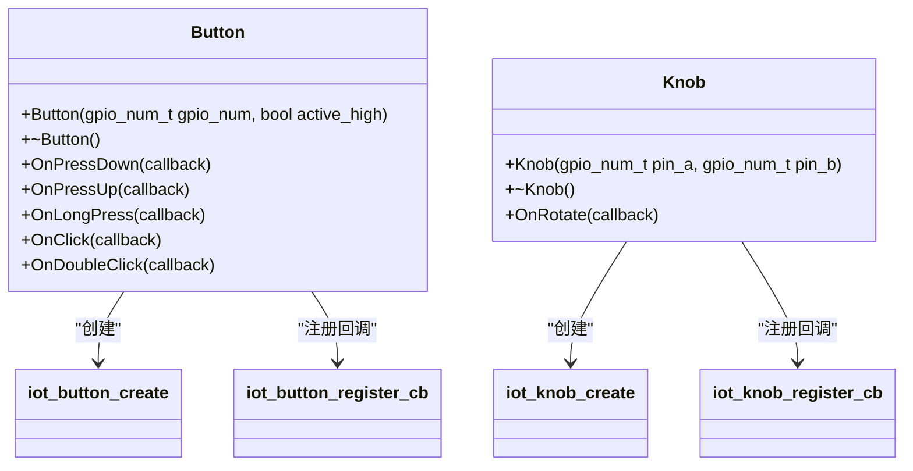

# 输入设备驱动

<cite>
**本文档引用的文件**  
- [button.h](file://main/boards/common/button.h)
- [button.cc](file://main/boards/common/button.cc)
- [knob.h](file://main/boards/common/knob.h)
- [knob.cc](file://main/boards/common/knob.cc)
- [magiclick_2p5_board.cc](file://main/boards/magiclick-2p5/magiclick_2p5_board.cc)
- [axp2101.h](file://main/boards/common/axp2101.h)
- [axp2101.cc](file://main/boards/common/axp2101.cc)
- [power_manager.h](file://main/boards/magiclick-2p5/power_manager.h)
</cite>

## 目录
1. [引言](#引言)
2. [核心输入设备基类设计](#核心输入设备基类设计)
3. [Button类API规范与实现](#button类api规范与实现)
4. [Knob类API规范与实现](#knob类api规范与实现)
5. [GPIO按键与I2C扩展输入对比](#gpio按键与i2c扩展输入对比)
6. [旋转编码器消抖与事件机制](#旋转编码器消抖与事件机制)
7. [板级输入配置实例分析](#板级输入配置实例分析)
8. [自定义输入设备开发模板](#自定义输入设备开发模板)

## 引言
本文档全面文档化输入设备驱动接口，重点描述Button和Knob基类的设计理念与API规范。分析GPIO按键与I2C扩展输入（如AXP2101管理的按键）的实现差异，说明旋转编码器的消抖算法与事件回调机制。结合magiclick_2p5_board.cc中的具体板级实现，展示输入事件如何通过Board系统上报至应用层，并提供自定义输入设备的开发模板。

## 核心输入设备基类设计

输入设备驱动采用面向对象设计模式，通过Button和Knob两个核心基类封装不同类型的输入设备。设计遵循单一职责原则，将硬件抽象、事件注册、回调分发等功能解耦，提供简洁的高层接口。



**图示来源**  
- [button.h](file://main/boards/common/button.h#L1-L33)
- [knob.h](file://main/boards/common/knob.h#L1-L24)

## Button类API规范与实现

### API行为定义
Button类提供多种按键事件的注册接口，支持短按、长按、单击、双击等常见交互模式。

**方法说明**：
- **OnPressDown**: 按键按下时触发
- **OnPressUp**: 按键释放时触发
- **OnLongPress**: 长按（默认1000ms）触发
- **OnClick**: 短按（默认50ms）触发
- **OnDoubleClick**: 双击事件触发

### 底层实现机制
Button类基于ESP-IDF的iot_button组件实现，通过`iot_button_create`创建按钮实例，并使用`iot_button_register_cb`注册各类事件回调。

```cpp
Button::Button(gpio_num_t gpio_num, bool active_high) : gpio_num_(gpio_num) {
    button_config_t button_config = {
        .type = BUTTON_TYPE_GPIO,
        .long_press_time = 1000,
        .short_press_time = 50,
        .gpio_button_config = {
            .gpio_num = gpio_num,
            .active_level = static_cast<uint8_t>(active_high ? 1 : 0)
        }
    };
    button_handle_ = iot_button_create(&button_config);
}
```

事件回调通过lambda函数包装，捕获this指针以调用成员函数，实现面向对象的事件处理。

**本节来源**  
- [button.h](file://main/boards/common/button.h#L1-L33)
- [button.cc](file://main/boards/common/button.cc#L1-L111)

## Knob类API规范与实现

### API行为定义
Knob类专为旋转编码器设计，提供旋转方向检测功能。

**方法说明**：
- **OnRotate**: 旋转事件回调，参数为布尔值表示方向（true为右旋/顺时针）

### 底层实现机制
Knob类基于iot_knob组件实现，通过`iot_knob_create`创建编码器实例，并注册左右旋转事件回调。

```cpp
Knob::Knob(gpio_num_t pin_a, gpio_num_t pin_b) {
    knob_config_t config = {
        .default_direction = 0,
        .gpio_encoder_a = static_cast<uint8_t>(pin_a),
        .gpio_encoder_b = static_cast<uint8_t>(pin_b),
    };
    knob_handle_ = iot_knob_create(&config);
    
    iot_knob_register_cb(knob_handle_, KNOB_LEFT, knob_callback, this);
    iot_knob_register_cb(knob_handle_, KNOB_RIGHT, knob_callback, this);
}
```

回调函数通过`iot_knob_get_event`获取事件类型，并调用用户注册的`on_rotate_`回调。

**本节来源**  
- [knob.h](file://main/boards/common/knob.h#L1-L24)
- [knob.cc](file://main/boards/common/knob.cc#L1-L51)

## GPIO按键与I2C扩展输入对比

### GPIO按键实现
GPIO按键直接连接ESP32的GPIO引脚，通过电平变化检测按键状态。magiclick_2p5板级实现中，三个物理按键分别连接不同GPIO：

```cpp
magiclick_2p5() :
    main_button_(MAIN_BUTTON_GPIO),
    left_button_(LEFT_BUTTON_GPIO), 
    right_button_(RIGHT_BUTTON_GPIO) {
    InitializeButtons();
}
```

### I2C扩展输入
AXP2101电源管理芯片通过I2C接口提供额外的输入能力。虽然当前代码中未直接使用AXP2101的按键功能，但其提供了电池状态检测等重要输入信号：

```cpp
class PowerManager {
    gpio_num_t charging_pin_ = CHARGING_PIN;
    // 通过GPIO检测充电状态
    bool IsCharging() {
        return gpio_get_level(charging_pin_) == 0;
    }
};
```

两种方式对比：
- **GPIO按键**：响应快、实现简单，但占用MCU引脚
- **I2C扩展**：节省引脚、可集成多种功能，但依赖I2C通信

**本节来源**  
- [magiclick_2p5_board.cc](file://main/boards/magiclick-2p5/magiclick_2p5_board.cc#L1-L312)
- [axp2101.cc](file://main/boards/common/axp2101.cc#L1-L37)
- [power_manager.h](file://main/boards/magiclick-2p5/power_manager.h#L1-L195)

## 旋转编码器消抖与事件机制

### 消抖算法
旋转编码器存在机械抖动问题，iot_knob组件内部实现了硬件消抖算法。通过监测A、B两相信号的相位关系，只有当信号稳定且符合预期序列时才判定为有效旋转。

### 事件回调机制
采用观察者模式实现事件分发：
1. 用户通过`OnRotate`注册回调函数
2. 底层驱动检测到旋转事件
3. 调用静态`knob_callback`函数
4. 通过`this`指针调用用户注册的`on_rotate_`回调

```cpp
void Knob::knob_callback(void* arg, void* data) {
    Knob* knob = static_cast<Knob*>(data);
    knob_event_t event = iot_knob_get_event(arg);
    
    if (knob->on_rotate_) {
        knob->on_rotate_(event == KNOB_RIGHT);
    }
}
```

该机制确保了线程安全和对象生命周期管理。

**本节来源**  
- [knob.cc](file://main/boards/common/knob.cc#L1-L51)

## 板级输入配置实例分析

以magiclick_2p5_board.cc为例，分析输入事件如何上报至应用层：

### 按键事件处理流程
1. **硬件初始化**：在构造函数中创建三个Button实例
2. **事件注册**：为每个按键注册相应的回调函数
3. **应用层交互**：按键事件直接调用Application单例

```cpp
main_button_.OnPressDown([this]() {
    power_save_timer_->WakeUp();
    Application::GetInstance().StartListening();
});
```

### 功能实现示例
- **主按键**：长按启动语音识别，短按重置WiFi配置
- **左右按键**：调节音量，长按静音或最大音量

该设计将硬件输入与应用逻辑解耦，通过回调函数实现灵活的事件处理。

**本节来源**  
- [magiclick_2p5_board.cc](file://main/boards/magiclick-2p5/magiclick_2p5_board.cc#L1-L312)

## 自定义输入设备开发模板

### 中断配置
对于需要实时响应的输入设备，建议使用中断方式：

```cpp
// 示例：自定义中断配置
gpio_config_t io_conf = {};
io_conf.intr_type = GPIO_INTR_NEGEDGE;
io_conf.mode = GPIO_MODE_INPUT;
io_conf.pin_bit_mask = (1ULL << pin);
gpio_config(&io_conf);
```

### 轮询策略
对于低频输入设备，可采用轮询策略以节省功耗：

```cpp
// 示例：轮询策略
void PollInput() {
    static int last_state = -1;
    int current_state = gpio_get_level(pin);
    if (current_state != last_state) {
        // 处理状态变化
        last_state = current_state;
    }
}
```

### 事件去重
为避免重复事件，可设置去抖动延时和状态锁：

```cpp
// 示例：事件去重
static bool event_pending = false;
static esp_timer_handle_t debounce_timer;

void InputCallback() {
    if (!event_pending) {
        event_pending = true;
        esp_timer_start_once(debounce_timer, 50000); // 50ms去抖
    }
}
```

### 完整开发模板
```cpp
class CustomInputDevice {
public:
    CustomInputDevice(gpio_num_t pin) : pin_(pin) {
        // 初始化GPIO
        gpio_reset_pin(pin);
        gpio_set_direction(pin, GPIO_MODE_INPUT);
        
        // 注册中断
        gpio_isr_handler_add(pin, InterruptHandler, this);
    }
    
    void OnEvent(std::function<void()> callback) {
        callback_ = callback;
    }
    
private:
    static void InterruptHandler(void* arg) {
        CustomInputDevice* dev = static_cast<CustomInputDevice*>(arg);
        if (dev->callback_) {
            dev->callback_();
        }
    }
    
    gpio_num_t pin_;
    std::function<void()> callback_;
};
```

**本节来源**  
- [button.cc](file://main/boards/common/button.cc#L1-L111)
- [knob.cc](file://main/boards/common/knob.cc#L1-L51)
- [magiclick_2p5_board.cc](file://main/boards/magiclick-2p5/magiclick_2p5_board.cc#L1-L312)