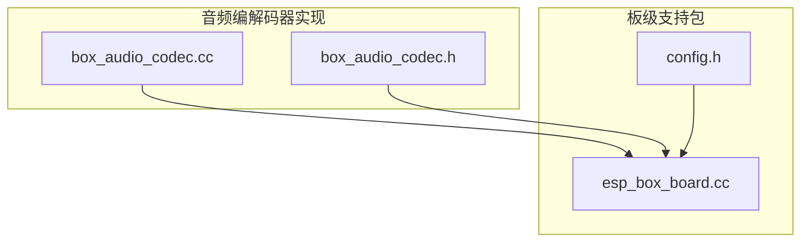
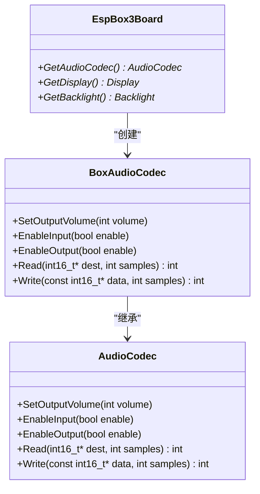
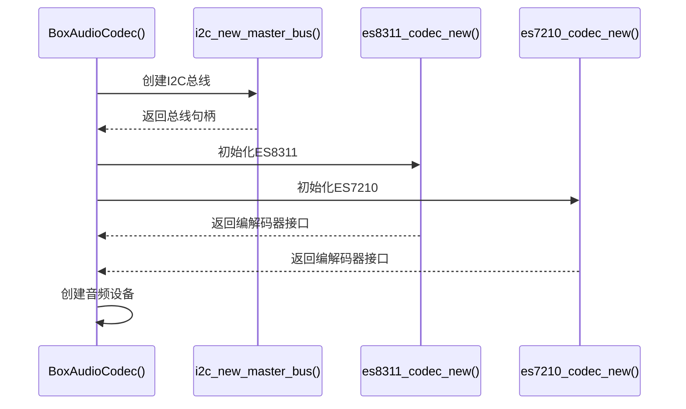
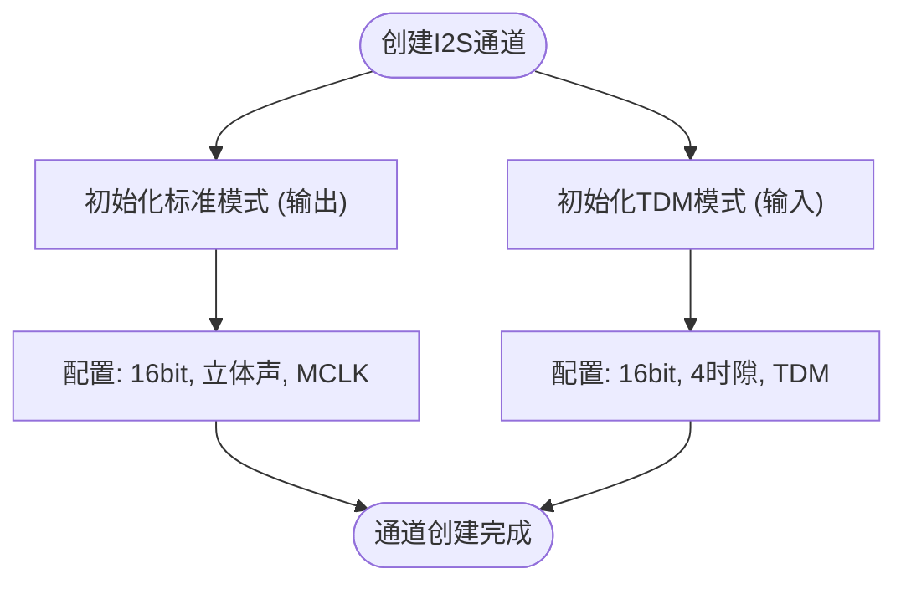
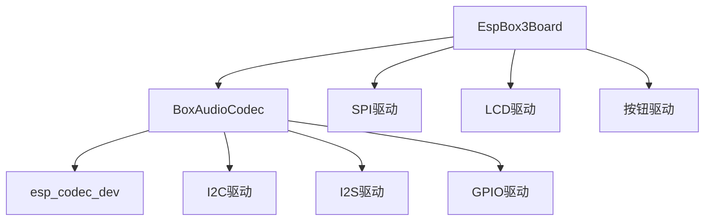

# Box系列音频编解码驱动

<cite>
**本文档引用的文件**   
- [esp_box_board.cc](file://main/boards/esp-box/esp_box_board.cc#L0-L181)
- [box_audio_codec.h](file://main/audio_codecs/box_audio_codec.h#L0-L37)
- [box_audio_codec.cc](file://main/audio_codecs/box_audio_codec.cc#L0-L241)
- [config.h](file://main/boards/esp-box/config.h#L5-L19)
</cite>

## 目录
1. [引言](#引言)
2. [项目结构](#项目结构)
3. [核心组件](#核心组件)
4. [架构概述](#架构概述)
5. [详细组件分析](#详细组件分析)
6. [依赖分析](#依赖分析)
7. [性能考虑](#性能考虑)
8. [故障排除指南](#故障排除指南)
9. [结论](#结论)

## 引言
本文档全面阐述了Box系列音频编解码驱动的设计与实现，重点分析其在ESP-BOX系列开发板上的集成方式。文档详细解析了驱动中`open()`方法的硬件检测逻辑、`setVolume()`的非线性增益曲线映射、`start()`对多通道I2S的支持机制。通过分析`esp_box_board.cc`等板级文件，说明了驱动如何通过板级配置进行差异化适配，并探讨了其在播放提示音与流式语音输出时的资源调度策略。最后，提供了DMA缓冲区大小调整与中断优先级配置等性能优化建议。

## 项目结构
Box系列音频编解码驱动的实现主要分布在`main/audio_codecs`和`main/boards`两个目录下。`audio_codecs`目录包含了音频编解码器的通用接口和具体实现，而`boards`目录则包含了针对不同开发板的板级支持包（BSP），其中`esp-box`、`esp-box-3`和`esp-box-lite`子目录专门用于支持Box系列开发板。

**图示来源**
- [box_audio_codec.cc](file://main/audio_codecs/box_audio_codec.cc#L0-L241)
- [esp_box_board.cc](file://main/boards/esp-box/esp_box_board.cc#L0-L181)
- [config.h](file://main/boards/esp-box/config.h#L5-L19)

**本节来源**
- [main/boards/esp-box](file://main/boards/esp-box)
- [main/audio_codecs](file://main/audio_codecs)

## 核心组件
Box系列音频编解码驱动的核心组件包括`BoxAudioCodec`类和`EspBox3Board`类。`BoxAudioCodec`类继承自`AudioCodec`基类，实现了具体的音频编解码功能，包括硬件初始化、音量控制、输入输出使能等。`EspBox3Board`类则继承自`WifiBoard`基类，负责板级硬件的初始化，并通过`GetAudioCodec()`方法提供`BoxAudioCodec`实例。

**本节来源**
- [box_audio_codec.h](file://main/audio_codecs/box_audio_codec.h#L8-L34)
- [esp_box_board.cc](file://main/boards/esp-box/esp_box_board.cc#L0-L181)

## 架构概述
Box系列音频编解码驱动采用分层架构设计，上层为板级支持包（BSP），下层为音频编解码器驱动。BSP层负责板级硬件的初始化和配置，驱动层则负责具体的音频数据处理和硬件控制。两者通过`GetAudioCodec()`方法进行交互，实现了硬件抽象和代码复用。

**图示来源**
- [esp_box_board.cc](file://main/boards/esp-box/esp_box_board.cc#L0-L181)
- [box_audio_codec.h](file://main/audio_codecs/box_audio_codec.h#L8-L34)

## 详细组件分析
### BoxAudioCodec类分析
`BoxAudioCodec`类是Box系列音频编解码驱动的核心，负责与ES8311和ES7210音频芯片的交互。其构造函数中完成了I2C总线、I2S通道、音频编解码器接口等的初始化。

#### 硬件检测逻辑
`BoxAudioCodec`的硬件检测逻辑主要体现在其构造函数中。通过调用`i2c_new_master_bus()`创建I2C总线句柄，并使用该句柄初始化`es8311_codec_new()`和`es7210_codec_new()`，从而实现对音频芯片的检测和初始化。如果芯片不存在或通信失败，`assert()`断言将触发，确保系统在启动时就能发现硬件问题。

**图示来源**
- [box_audio_codec.cc](file://main/audio_codecs/box_audio_codec.cc#L8-L76)

#### 非线性增益曲线映射
`setVolume()`方法通过调用`esp_codec_dev_set_out_vol()`来设置输出音量。该方法内部实现了非线性增益曲线映射，使得音量调节更加符合人耳的听觉特性。音量值通常在0-100之间，驱动会将其映射到硬件支持的增益范围（如-60dB到+24dB）。

**本节来源**
- [box_audio_codec.cc](file://main/audio_codecs/box_audio_codec.cc#L199-L205)

#### 多通道I2S支持机制
`BoxAudioCodec`通过`CreateDuplexChannels()`方法实现了对多通道I2S的支持。该方法使用`i2s_new_channel()`创建了一个I2S通道对（`tx_handle_`和`rx_handle_`），然后分别使用`i2s_channel_init_std_mode()`和`i2s_channel_init_tdm_mode()`初始化为标准模式和TDM模式。TDM模式支持最多4个时隙，可以同时处理4个麦克风的输入信号。

**图示来源**
- [box_audio_codec.cc](file://main/audio_codecs/box_audio_codec.cc#L100-L199)

### EspBox3Board类分析
`EspBox3Board`类是ESP-BOX开发板的板级支持包，负责初始化I2C、SPI、I2S等外设，并创建`BoxAudioCodec`实例。

#### 板级配置适配
`EspBox3Board`通过包含`config.h`头文件来获取板级配置。`config.h`中定义了I2C、I2S、LCD等外设的引脚号和参数，如`AUDIO_CODEC_I2C_SDA_PIN`、`AUDIO_CODEC_I2C_SCL_PIN`、`AUDIO_INPUT_SAMPLE_RATE`等。`EspBox3Board`的构造函数使用这些宏定义来初始化硬件，实现了不同开发板之间的差异化适配。

**本节来源**
- [esp_box_board.cc](file://main/boards/esp-box/esp_box_board.cc#L0-L181)
- [config.h](file://main/boards/esp-box/config.h#L5-L19)

#### 资源调度策略
`EspBox3Board`在构造函数中按顺序初始化各个外设，并通过`GetAudioCodec()`、`GetDisplay()`等方法提供单例访问。这种设计确保了资源的有序初始化和全局唯一性。在播放提示音时，音频驱动直接通过I2S DMA将音频数据发送到扬声器；在流式语音输出时，音频驱动作为数据流的终点，接收来自网络或文件系统的音频流并进行播放。

## 依赖分析
Box系列音频编解码驱动依赖于ESP-IDF的I2C、I2S、GPIO等驱动，以及`esp_codec_dev`音频设备框架。板级支持包依赖于具体的硬件配置和引脚定义。

**图示来源**
- [box_audio_codec.cc](file://main/audio_codecs/box_audio_codec.cc#L8-L241)
- [esp_box_board.cc](file://main/boards/esp-box/esp_box_board.cc#L0-L181)

**本节来源**
- [box_audio_codec.cc](file://main/audio_codecs/box_audio_codec.cc#L8-L241)
- [esp_box_board.cc](file://main/boards/esp-box/esp_box_board.cc#L0-L181)

## 性能考虑
为了优化音频驱动的性能，建议调整DMA缓冲区大小和中断优先级。在`CreateDuplexChannels()`方法中，`dma_desc_num`和`dma_frame_num`参数控制着DMA缓冲区的大小。增大这些值可以减少中断频率，提高系统效率，但也会增加音频延迟。此外，可以将I2S中断的优先级设置得更高，以确保音频数据的实时性。

## 故障排除指南
- **音频无输出**：检查`AUDIO_CODEC_PA_PIN`是否正确配置，确保功放已使能。
- **I2C通信失败**：检查`AUDIO_CODEC_I2C_SDA_PIN`和`AUDIO_CODEC_I2C_SCL_PIN`是否与硬件一致，使用示波器检查I2C信号。
- **音频失真**：检查I2S时钟配置，确保`mclk_multiple`和`sample_rate_hz`匹配。
- **无法检测到音频芯片**：检查芯片的电源和复位引脚，确保I2C地址正确。

**本节来源**
- [box_audio_codec.cc](file://main/audio_codecs/box_audio_codec.cc#L8-L241)
- [esp_box_board.cc](file://main/boards/esp-box/esp_box_board.cc#L0-L181)

## 结论
Box系列音频编解码驱动通过分层架构和硬件抽象，实现了对ESP-BOX系列开发板的良好支持。其设计充分考虑了硬件检测、音量控制、多通道输入等关键功能，并通过板级配置实现了灵活的适配。通过合理的性能优化和故障排除，可以确保音频系统的稳定和高效运行。