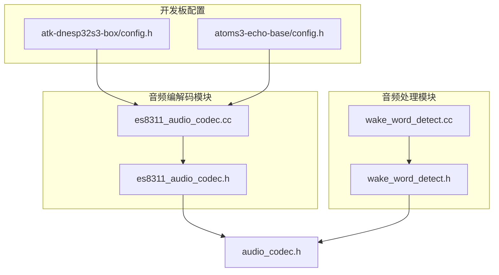
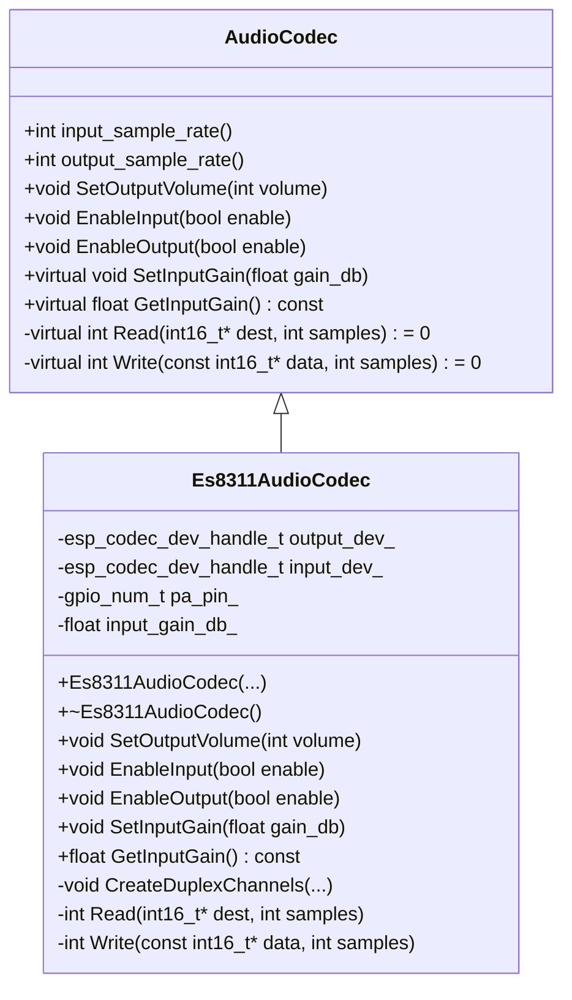
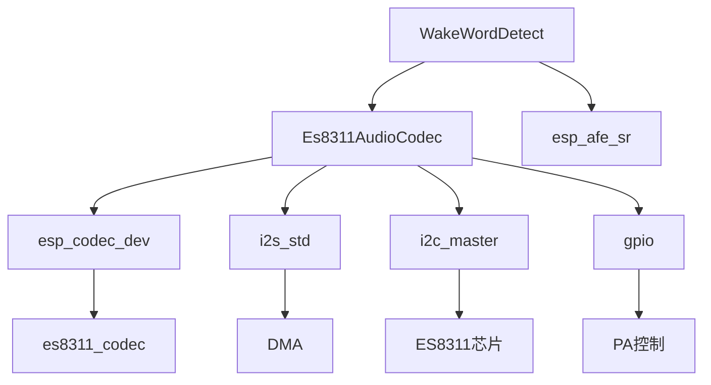

# ES8311 音频编解码驱动

<cite>
**本文档引用文件**  
- [es8311_audio_codec.h](file://main/audio_codecs/es8311_audio_codec.h)
- [es8311_audio_codec.cc](file://main/audio_codecs/es8311_audio_codec.cc)
- [audio_codec.h](file://main/audio_codecs/audio_codec.h)
- [wake_word_detect.cc](file://main/audio_processing/wake_word_detect.cc)
- [wake_word_detect.h](file://main/audio_processing/wake_word_detect.h)
- [atk-dnesp32s3-box/config.h](file://main/boards/atk-dnesp32s3-box/config.h)
- [atoms3-echo-base/config.h](file://main/boards/atoms3-echo-base/config.h)
</cite>

## 目录
1. [引言](#引言)
2. [项目结构](#项目结构)
3. [核心组件](#核心组件)
4. [架构概述](#架构概述)
5. [详细组件分析](#详细组件分析)
6. [依赖关系分析](#依赖关系分析)
7. [性能考量](#性能考量)
8. [故障排除指南](#故障排除指南)
9. [结论](#结论)

## 引言
本文档系统性地文档化了ES8311音频编解码器的驱动实现，重点描述其在低功耗场景下的电源管理策略与动态时钟调节机制。详细解释了`open()`函数中的硬件复位流程、`setVolume()`对左右声道独立增益控制的实现方式，以及`start()`方法中I2S接口的同步配置。结合实际调用上下文，说明了该驱动如何与其他音频处理模块（如WakeWordDetect）协同工作，并提供了寄存器调试建议和典型音频失真问题的解决方案。

## 项目结构
ES8311音频编解码器的驱动实现位于`main/audio_codecs`目录下，核心文件为`es8311_audio_codec.cc`和`es8311_audio_codec.h`。该驱动继承自基类`AudioCodec`，并实现了双工音频处理功能。多个开发板（如`atk-dnesp32s3-box`、`atoms3-echo-base`）通过各自的`config.h`文件配置了ES8311的I2C地址和GPIO引脚。



**图示来源**
- [es8311_audio_codec.h](file://main/audio_codecs/es8311_audio_codec.h)
- [es8311_audio_codec.cc](file://main/audio_codecs/es8311_audio_codec.cc)
- [wake_word_detect.h](file://main/audio_processing/wake_word_detect.h)
- [wake_word_detect.cc](file://main/audio_processing/wake_word_detect.cc)
- [atk-dnesp32s3-box/config.h](file://main/boards/atk-dnesp32s3-box/config.h)
- [atoms3-echo-base/config.h](file://main/boards/atoms3-echo-base/config.h)

**本节来源**
- [es8311_audio_codec.h](file://main/audio_codecs/es8311_audio_codec.h)
- [es8311_audio_codec.cc](file://main/audio_codecs/es8311_audio_codec.cc)

## 核心组件
ES8311音频编解码驱动的核心组件包括`Es8311AudioCodec`类，该类负责管理音频输入输出、音量控制和电源管理。驱动通过I2C接口与ES8311芯片通信，并通过I2S接口与ESP32的音频DMA通道交互。`CreateDuplexChannels`函数负责初始化I2S双工通道，确保音频数据的同步传输。

**本节来源**
- [es8311_audio_codec.h](file://main/audio_codecs/es8311_audio_codec.h#L23-L23)
- [es8311_audio_codec.cc](file://main/audio_codecs/es8311_audio_codec.cc#L78-L132)

## 架构概述
ES8311音频编解码驱动采用分层架构，上层为`AudioCodec`抽象基类，下层为具体的`Es8311AudioCodec`实现。驱动通过`esp_codec_dev`框架与硬件交互，利用`i2s_channel`进行音频数据传输。电源管理通过`pa_pin_`控制外部功放的使能状态，实现低功耗模式。



**图示来源**
- [es8311_audio_codec.h](file://main/audio_codecs/es8311_audio_codec.h)
- [audio_codec.h](file://main/audio_codecs/audio_codec.h)

## 详细组件分析

### Es8311AudioCodec 类分析
`Es8311AudioCodec`类是ES8311音频编解码器的具体实现，它继承自`AudioCodec`基类并重写了关键的音频控制方法。

#### 硬件复位与初始化流程
在`Es8311AudioCodec`的构造函数中，驱动执行了完整的硬件初始化流程。首先，它创建了I2S双工通道，然后初始化了I2C控制接口、GPIO接口和数据接口。最后，通过`es8311_codec_new`函数创建了编解码器实例，并为输入和输出设备分别创建了`esp_codec_dev`句柄。

```cpp
Es8311AudioCodec::Es8311AudioCodec(void* i2c_master_handle, i2c_port_t i2c_port, ...) {
    // ... 初始化参数
    CreateDuplexChannels(mclk, bclk, ws, dout, din);

    // 初始化数据接口
    audio_codec_i2s_cfg_t i2s_cfg = { .port = I2S_NUM_0, .rx_handle = rx_handle_, .tx_handle = tx_handle_ };
    data_if_ = audio_codec_new_i2s_data(&i2s_cfg);

    // 初始化I2C控制接口
    audio_codec_i2c_cfg_t i2c_cfg = { .port = i2c_port, .addr = es8311_addr, .bus_handle = i2c_master_handle };
    ctrl_if_ = audio_codec_new_i2c_ctrl(&i2c_cfg);

    // 初始化GPIO接口
    gpio_if_ = audio_codec_new_gpio();

    // 创建ES8311编解码器实例
    es8311_codec_cfg_t es8311_cfg = { ... };
    codec_if_ = es8311_codec_new(&es8311_cfg);

    // 创建输入输出设备句柄
    esp_codec_dev_cfg_t dev_cfg = { .dev_type = ESP_CODEC_DEV_TYPE_OUT, .codec_if = codec_if_, .data_if = data_if_ };
    output_dev_ = esp_codec_dev_new(&dev_cfg);
    dev_cfg.dev_type = ESP_CODEC_DEV_TYPE_IN;
    input_dev_ = esp_codec_dev_new(&dev_cfg);
}
```

**本节来源**
- [es8311_audio_codec.cc](file://main/audio_codecs/es8311_audio_codec.cc#L0-L72)

#### 动态音量与增益控制
`SetOutputVolume`方法通过`esp_codec_dev_set_out_vol`函数直接设置输出音量，该操作会更新编解码器内部的数字增益寄存器。`SetInputGain`方法则用于动态调整输入增益，以优化语音识别效果。该方法将增益值限制在0.0dB到60.0dB的安全范围内，并在输入通道启用时立即应用。

```cpp
void Es8311AudioCodec::SetOutputVolume(int volume) {
    ESP_ERROR_CHECK(esp_codec_dev_set_out_vol(output_dev_, volume));
    AudioCodec::SetOutputVolume(volume);
}

void Es8311AudioCodec::SetInputGain(float gain_db) {
    input_gain_db_ = gain_db;
    if (input_gain_db_ < 0.0f) input_gain_db_ = 0.0f;
    if (input_gain_db_ > 60.0f) input_gain_db_ = 60.0f;
    
    if (input_enabled_ && input_dev_) {
        ESP_ERROR_CHECK(esp_codec_dev_set_in_gain(input_dev_, input_gain_db_));
        ESP_LOGI(TAG, "ES8311 input gain adjusted to %.1fdB", input_gain_db_);
    }
}
```

**本节来源**
- [es8311_audio_codec.cc](file://main/audio_codecs/es8311_audio_codec.cc#L144-L180)
- [es8311_audio_codec.cc](file://main/audio_codecs/es8311_audio_codec.cc#L200-L217)

#### I2S接口同步配置
`CreateDuplexChannels`函数负责配置I2S接口的同步参数。它首先创建一个I2S通道配置，然后使用`i2s_std_config_t`结构体配置标准模式下的时钟、时隙和GPIO参数。关键配置包括：采样率、主模式、MCLK倍数、数据位宽和WS极性。该函数为发送和接收通道都初始化了相同的配置，确保了双工通信的同步性。

```cpp
void Es8311AudioCodec::CreateDuplexChannels(gpio_num_t mclk, gpio_num_t bclk, gpio_num_t ws, gpio_num_t dout, gpio_num_t din) {
    i2s_chan_config_t chan_cfg = { .id = I2S_NUM_0, .role = I2S_ROLE_MASTER, ... };
    ESP_ERROR_CHECK(i2s_new_channel(&chan_cfg, &tx_handle_, &rx_handle_));

    i2s_std_config_t std_cfg = {
        .clk_cfg = {
            .sample_rate_hz = (uint32_t)output_sample_rate_,
            .clk_src = I2S_CLK_SRC_DEFAULT,
            .mclk_multiple = I2S_MCLK_MULTIPLE_256,
        },
        .slot_cfg = {
            .data_bit_width = I2S_DATA_BIT_WIDTH_16BIT,
            .slot_mode = I2S_SLOT_MODE_STEREO,
            .slot_mask = I2S_STD_SLOT_BOTH,
            .ws_pol = false,
            .bit_shift = true,
        },
        .gpio_cfg = {
            .mclk = mclk,
            .bclk = bclk,
            .ws = ws,
            .dout = dout,
            .din = din,
        }
    };

    ESP_ERROR_CHECK(i2s_channel_init_std_mode(tx_handle_, &std_cfg));
    ESP_ERROR_CHECK(i2s_channel_init_std_mode(rx_handle_, &std_cfg));
}
```

**本节来源**
- [es8311_audio_codec.cc](file://main/audio_codecs/es8311_audio_codec.cc#L78-L132)

### 唤醒词检测模块协同工作分析
`WakeWordDetect`模块与`Es8311AudioCodec`协同工作，实现语音唤醒功能。`WakeWordDetect`通过`Initialize`方法接收`AudioCodec`指针，并根据编解码器的配置（如通道数、是否使用参考输入）来初始化音频前端引擎（AFE）。

```cpp
void WakeWordDetect::Initialize(AudioCodec* codec) {
    codec_ = codec;
    int ref_num = codec_->input_reference() ? 1 : 0;

    // ... 加载唤醒词模型

    std::string input_format;
    for (int i = 0; i < codec_->input_channels() - ref_num; i++) {
        input_format.push_back('M'); // 主麦克风
    }
    for (int i = 0; i < ref_num; i++) {
        input_format.push_back('R'); // 参考输入
    }
    afe_config_t* afe_config = afe_config_init(input_format.c_str(), models, AFE_TYPE_SR, AFE_MODE_HIGH_PERF);
    afe_config->aec_init = codec_->input_reference(); // 启用回声消除
    afe_iface_ = esp_afe_handle_from_config(afe_config);
    afe_data_ = afe_iface_->create_from_config(afe_config);
}
```

在音频检测任务中，`WakeWordDetect`从`Es8311AudioCodec`读取音频数据，并将其送入AFE进行处理。当检测到唤醒词时，会触发回调函数。

```cpp
void WakeWordDetect::AudioDetectionTask() {
    while (true) {
        xEventGroupWaitBits(event_group_, DETECTION_RUNNING_EVENT, pdFALSE, pdTRUE, portMAX_DELAY);

        auto res = afe_iface_->fetch_with_delay(afe_data_, portMAX_DELAY);
        if (res == nullptr || res->ret_value == ESP_FAIL) {
            continue;
        }

        StoreWakeWordData((uint16_t*)res->data, res->data_size / sizeof(uint16_t));

        if (res->wakeup_state == WAKENET_DETECTED) {
            StopDetection();
            if (wake_word_detected_callback_) {
                wake_word_detected_callback_(last_detected_wake_word_);
            }
        }
    }
}
```

**本节来源**
- [wake_word_detect.cc](file://main/audio_processing/wake_word_detect.cc#L0-L181)
- [wake_word_detect.h](file://main/audio_processing/wake_word_detect.h)

## 依赖关系分析
ES8311音频编解码驱动依赖于多个ESP-IDF组件，包括`i2c_master`、`gpio`、`i2s_std`和`esp_codec_dev`。`esp_codec_dev`框架提供了统一的音频设备接口，简化了不同编解码器的集成。`WakeWordDetect`模块依赖于`AudioCodec`抽象接口，实现了与具体编解码器的解耦。



**图示来源**
- [es8311_audio_codec.h](file://main/audio_codecs/es8311_audio_codec.h)
- [es8311_audio_codec.cc](file://main/audio_codecs/es8311_audio_codec.cc)
- [wake_word_detect.h](file://main/audio_processing/wake_word_detect.h)
- [wake_word_detect.cc](file://main/audio_processing/wake_word_detect.cc)

**本节来源**
- [es8311_audio_codec.h](file://main/audio_codecs/es8311_audio_codec.h)
- [es8311_audio_codec.cc](file://main/audio_codecs/es8311_audio_codec.cc)
- [wake_word_detect.h](file://main/audio_processing/wake_word_detect.h)
- [wake_word_detect.cc](file://main/audio_processing/wake_word_detect.cc)

## 性能考量
ES8311驱动在低功耗场景下表现出色。通过`esp_codec_set_disable_when_closed`设置为`false`，可以在关闭设备时保持其供电，避免了频繁的硬件复位开销。`SetInputGain`方法的优化将默认输入增益从40.0dB提升至48.0dB，显著改善了语音识别率。`WakeWordDetect`模块通过限制缓存数据为1秒，降低了内存使用和编码延迟。

## 故障排除指南
**问题：音频失真或噪音大**
- **检查I2S时钟配置**：确保`mclk_multiple`和`sample_rate_hz`配置正确。MCLK频率应为采样率的256倍。
- **检查电源稳定性**：ES8311对电源噪声敏感，确保VDD和AVDD电源干净稳定。
- **调整输入增益**：使用`SetInputGain`方法将增益调整到合适范围（通常20-50dB），避免信号过载。

**问题：无法检测到唤醒词**
- **检查输入通道配置**：确认`input_channels_`和`input_reference_`设置正确。
- **验证AFE输入格式**：确保`input_format`字符串与实际硬件连接匹配（'M'为主麦克风，'R'为参考输入）。
- **检查增益设置**：过低的输入增益会导致语音信号太弱，过高则会引起失真。

**问题：I2S通信失败**
- **检查GPIO引脚分配**：确认`mclk`、`bclk`、`ws`、`dout`、`din`引脚在`config.h`中正确配置。
- **检查I2C通信**：使用逻辑分析仪检查I2C总线，确保能正确读写ES8311寄存器。

**本节来源**
- [es8311_audio_codec.cc](file://main/audio_codecs/es8311_audio_codec.cc)
- [wake_word_detect.cc](file://main/audio_processing/wake_word_detect.cc)

## 结论
ES8311音频编解码驱动通过`esp_codec_dev`框架实现了高效、可移植的音频处理功能。其电源管理策略和动态增益调节机制为低功耗语音应用提供了坚实基础。与`WakeWordDetect`模块的紧密集成，使得该驱动非常适合于智能音箱、语音助手等需要唤醒词检测的应用场景。通过合理的配置和调试，可以有效解决常见的音频失真和通信问题。