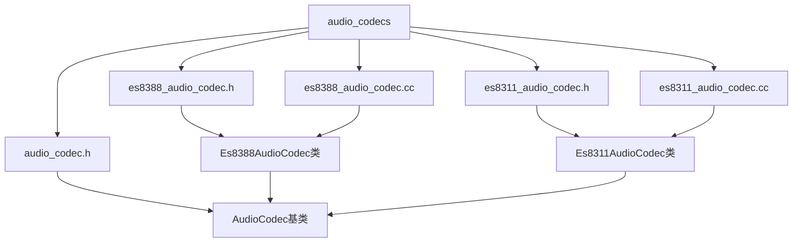
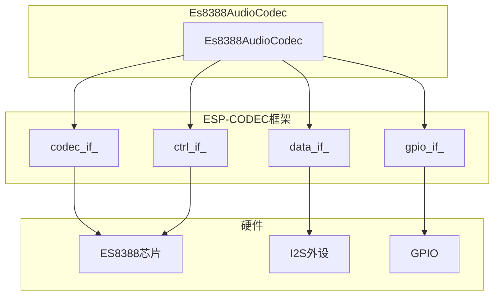
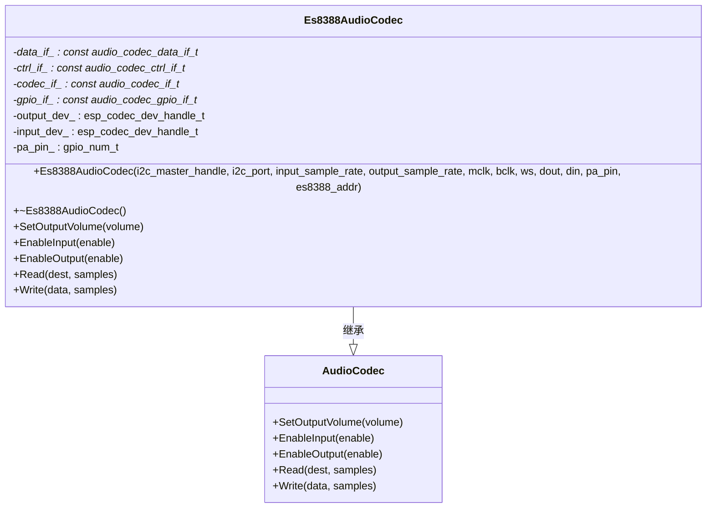
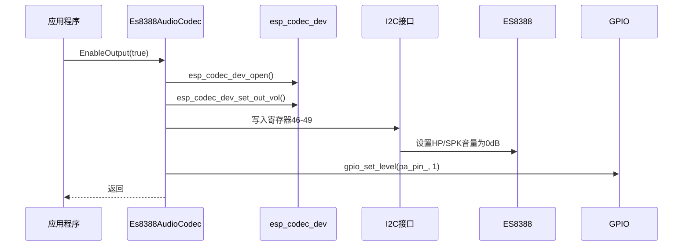
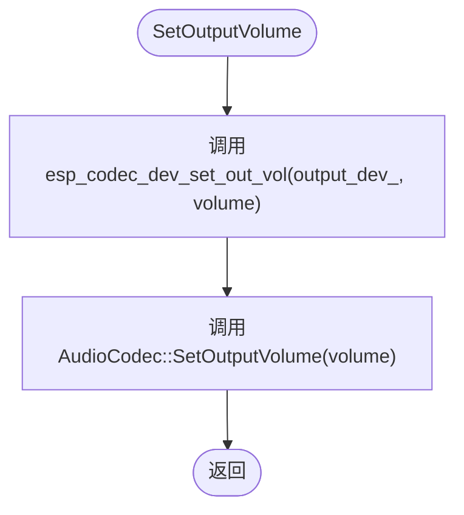
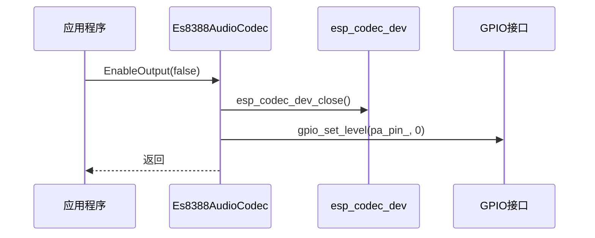
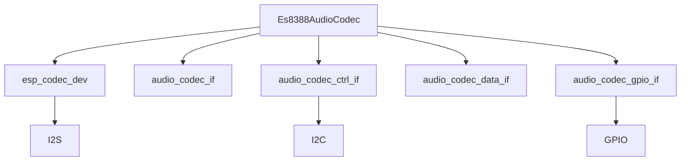

# ES8388 音频编解码驱动

<cite>
**本文档引用的文件**   
- [es8388_audio_codec.h](file://main/audio_codecs/es8388_audio_codec.h)
- [es8388_audio_codec.cc](file://main/audio_codecs/es8388_audio_codec.cc)
- [audio_codec.h](file://main/audio_codecs/audio_codec.h)
- [es8311_audio_codec.h](file://main/audio_codecs/es8311_audio_codec.h)
- [es8311_audio_codec.cc](file://main/audio_codecs/es8311_audio_codec.cc)
</cite>

## 目录
1. [引言](#引言)
2. [项目结构](#项目结构)
3. [核心组件](#核心组件)
4. [架构概述](#架构概述)
5. [详细组件分析](#详细组件分析)
6. [依赖分析](#依赖分析)
7. [性能考量](#性能考量)
8. [故障排除指南](#故障排除指南)
9. [结论](#结论)

## 引言
本文档深入解析ES8388音频编解码器的驱动实现，涵盖其I2C控制接口与I2S数据通路的初始化流程。详细说明驱动中`open()`、`setVolume()`、`start()`、`close()`等核心方法的具体实现逻辑，包括寄存器配置序列、采样率设置、增益调节机制及电源管理模式。结合代码实例展示如何通过I2C写入特定寄存器以启用ADC/DAC通道，并分析中断处理与线程安全策略。提供常见问题排查指南，如无声输出、杂音干扰等硬件级故障的定位方法。

## 项目结构
音频编解码器驱动位于`main/audio_codecs`目录下，采用模块化设计，通过继承基类`AudioCodec`实现不同硬件的适配。ES8388驱动文件为`es8388_audio_codec.cc`和`es8388_audio_codec.h`，依赖于ESP-IDF的I2C和I2S驱动框架。

**图示来源**
- [es8388_audio_codec.h](file://main/audio_codecs/es8388_audio_codec.h)
- [es8388_audio_codec.cc](file://main/audio_codecs/es8388_audio_codec.cc)
- [audio_codec.h](file://main/audio_codecs/audio_codec.h)
- [es8311_audio_codec.h](file://main/audio_codecs/es8311_audio_codec.h)
- [es8311_audio_codec.cc](file://main/audio_codecs/es8311_audio_codec.cc)

**本节来源**
- [es8388_audio_codec.h](file://main/audio_codecs/es8388_audio_codec.h)
- [es8388_audio_codec.cc](file://main/audio_codecs/es8388_audio_codec.cc)

## 核心组件
`Es8388AudioCodec`类是ES8388音频编解码器的核心实现，继承自`AudioCodec`基类。它通过I2C接口控制编解码器芯片，通过I2S接口传输音频数据。核心组件包括I2C控制接口、I2S数据接口、GPIO接口和编解码器设备句柄。

**本节来源**
- [es8388_audio_codec.h](file://main/audio_codecs/es8388_audio_codec.h#L15-L37)
- [es8388_audio_codec.cc](file://main/audio_codecs/es8388_audio_codec.cc#L6-L205)

## 架构概述
ES8388音频编解码驱动采用分层架构，上层为`Es8388AudioCodec`类，下层为ESP-CODEC设备驱动框架。`Es8388AudioCodec`类通过`audio_codec_if_t`、`audio_codec_ctrl_if_t`、`audio_codec_data_if_t`和`audio_codec_gpio_if_t`接口与底层硬件交互。

**图示来源**
- [es8388_audio_codec.h](file://main/audio_codecs/es8388_audio_codec.h#L15-L37)
- [es8388_audio_codec.cc](file://main/audio_codecs/es8388_audio_codec.cc#L6-L205)

## 详细组件分析
### Es8388AudioCodec类分析
`Es8388AudioCodec`类实现了音频编解码器的核心功能，包括音量设置、输入输出使能、数据读写等。

#### 构造函数分析
构造函数初始化I2C和I2S接口，创建双工通道，并初始化编解码器设备。

**图示来源**
- [es8388_audio_codec.h](file://main/audio_codecs/es8388_audio_codec.h#L15-L37)
- [es8388_audio_codec.cc](file://main/audio_codecs/es8388_audio_codec.cc#L6-L205)

**本节来源**
- [es8388_audio_codec.h](file://main/audio_codecs/es8388_audio_codec.h#L15-L37)
- [es8388_audio_codec.cc](file://main/audio_codecs/es8388_audio_codec.cc#L6-L205)

#### open()方法分析
`EnableOutput(true)`方法相当于`open()`操作，它打开输出设备，设置输出音量，并通过I2C写入寄存器将模拟输出音量设置为0dB（默认为-45dB），最后激活功放引脚。

**图示来源**
- [es8388_audio_codec.cc](file://main/audio_codecs/es8388_audio_codec.cc#L145-L170)

**本节来源**
- [es8388_audio_codec.cc](file://main/audio_codecs/es8388_audio_codec.cc#L145-L170)

#### setVolume()方法分析
`SetOutputVolume()`方法通过`esp_codec_dev_set_out_vol()`设置输出音量，并更新基类中的音量值。

**图示来源**
- [es8388_audio_codec.cc](file://main/audio_codecs/es8388_audio_codec.cc#L138-L143)

**本节来源**
- [es8388_audio_codec.cc](file://main/audio_codecs/es8388_audio_codec.cc#L138-L143)

#### start()方法分析
`Start()`方法在基类`AudioCodec`中实现，它通过调用`EnableOutput(true)`和`EnableInput(true)`来启动音频流。

**本节来源**
- [audio_codec.h](file://main/audio_codecs/audio_codec.h#L30-L31)

#### close()方法分析
`EnableOutput(false)`方法相当于`close()`操作，它关闭输出设备，并通过GPIO将功放引脚置为低电平。

**图示来源**
- [es8388_audio_codec.cc](file://main/audio_codecs/es8388_audio_codec.cc#L145-L170)

**本节来源**
- [es8388_audio_codec.cc](file://main/audio_codecs/es8388_audio_codec.cc#L145-L170)

## 依赖分析
`Es8388AudioCodec`依赖于ESP-CODEC设备驱动框架，包括`esp_codec_dev`、`audio_codec_if`、`audio_codec_ctrl_if`、`audio_codec_data_if`和`audio_codec_gpio_if`。这些接口封装了底层硬件操作，提供了统一的API。

**图示来源**
- [es8388_audio_codec.h](file://main/audio_codecs/es8388_audio_codec.h#L15-L37)
- [es8388_audio_codec.cc](file://main/audio_codecs/es8388_audio_codec.cc#L6-L205)

**本节来源**
- [es8388_audio_codec.h](file://main/audio_codecs/es8388_audio_codec.h#L15-L37)
- [es8388_audio_codec.cc](file://main/audio_codecs/es8388_audio_codec.cc#L6-L205)

## 性能考量
驱动采用DMA方式进行I2S数据传输，减少了CPU占用。I2S通道配置为6个DMA描述符和240帧，确保了音频流的连续性。双工模式下，输入和输出采样率必须相同。

## 故障排除指南
### 无声输出
1. 检查功放引脚`pa_pin_`是否正确配置并输出高电平。
2. 检查I2C通信是否正常，ES8388地址是否正确。
3. 检查I2S引脚配置（MCLK、BCLK、WS、DOUT）是否正确。
4. 检查模拟输出音量寄存器（46-49）是否已设置为0dB。

### 杂音干扰
1. 检查电源稳定性，确保模拟和数字电源分离。
2. 检查MCLK时钟质量，确保无抖动。
3. 检查PCB布局，确保模拟信号线远离数字信号线。

**本节来源**
- [es8388_audio_codec.cc](file://main/audio_codecs/es8388_audio_codec.cc#L155-L165)

## 结论
ES8388音频编解码驱动通过ESP-CODEC框架实现了对ES8388芯片的高效控制。驱动设计合理，代码结构清晰，易于维护和扩展。通过深入分析其初始化流程和核心方法实现，可以更好地理解和使用该驱动。