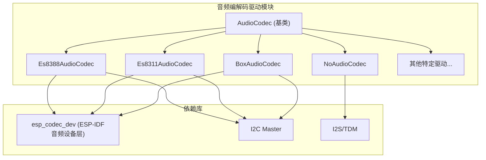
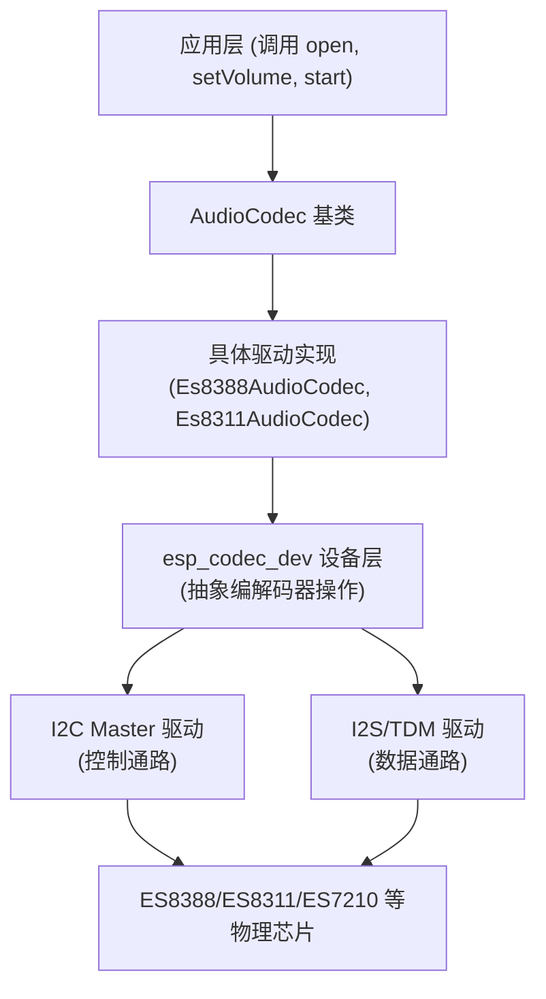
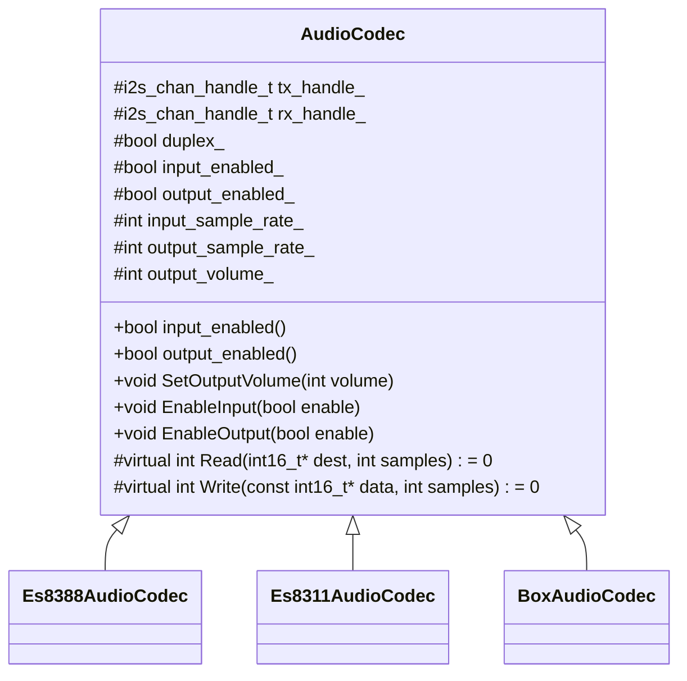
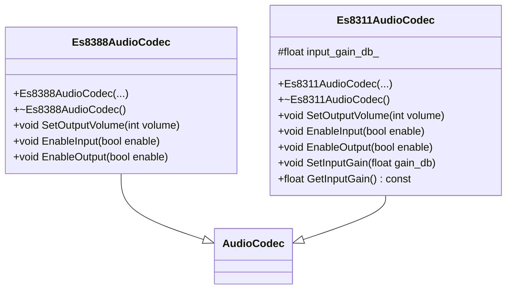
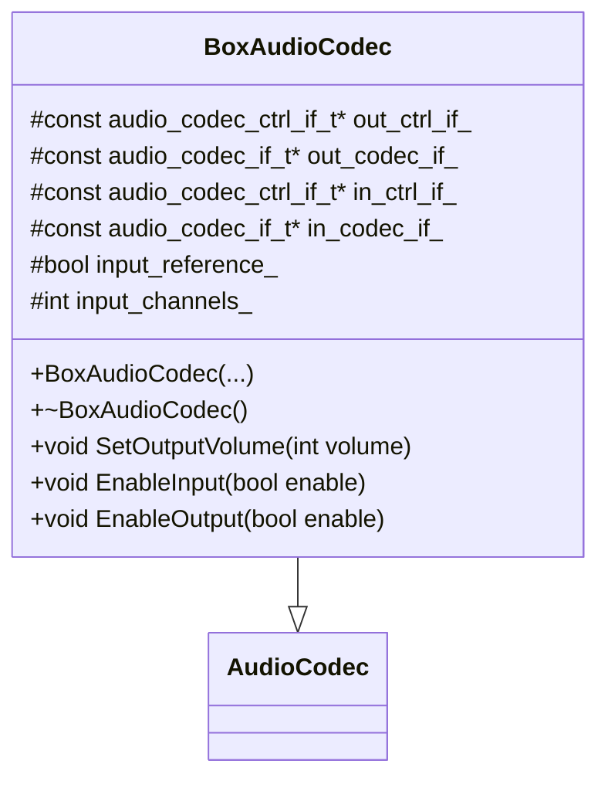
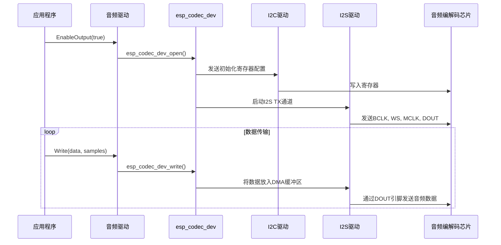
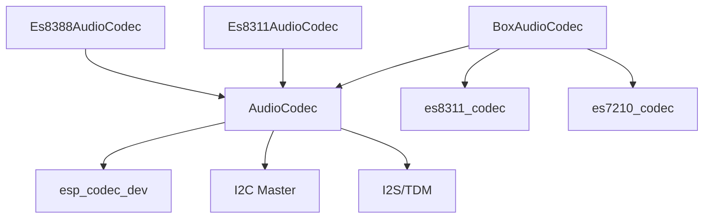

# 音频编解码驱动

<cite>
**本文档引用的文件**   
- [audio_codec.h](file://main/audio_codecs/audio_codec.h)
- [audio_codec.cc](file://main/audio_codecs/audio_codec.cc)
- [es8388_audio_codec.h](file://main/audio_codecs/es8388_audio_codec.h)
- [es8388_audio_codec.cc](file://main/audio_codecs/es8388_audio_codec.cc)
- [es8311_audio_codec.h](file://main/audio_codecs/es8311_audio_codec.h)
- [es8311_audio_codec.cc](file://main/audio_codecs/es8311_audio_codec.cc)
- [box_audio_codec.h](file://main/audio_codecs/box_audio_codec.h)
- [box_audio_codec.cc](file://main/audio_codecs/box_audio_codec.cc)
- [box_audio_codec_lite.h](file://main/boards/esp-box-lite/box_audio_codec_lite.h)
- [box_audio_codec_lite.cc](file://main/boards/esp-box-lite/box_audio_codec_lite.cc)
- [freertos_mutex.h](file://main/memory/freertos_mutex.h)
</cite>

## 目录
1. [引言](#引言)
2. [项目结构](#项目结构)
3. [核心组件](#核心组件)
4. [架构概述](#架构概述)
5. [详细组件分析](#详细组件分析)
6. [依赖分析](#依赖分析)
7. [性能考量](#性能考量)
8. [故障排除指南](#故障排除指南)
9. [结论](#结论)

## 引言
本文档系统性地文档化了音频编解码器驱动接口，深入解析了`AudioCodec`基类的设计规范，并对比分析了ES8388、ES8311、Box系列等不同编解码芯片的驱动实现差异。文档详细说明了驱动如何通过I2C控制与I2S数据通路协同工作，并提供了新音频芯片适配的通用指南，涵盖了寄存器映射、时钟配置、增益校准等关键步骤，同时强调了线程安全与中断处理的最佳实践。

## 项目结构
音频编解码驱动位于`main/audio_codecs`目录下，采用模块化设计，通过继承`AudioCodec`基类来实现不同硬件平台的驱动。该目录包含了核心的基类定义、针对特定芯片（如ES8388、ES8311）的驱动实现，以及为特定开发板（如Box系列）定制的复合驱动。这种结构清晰地分离了通用逻辑与硬件特定逻辑，便于维护和扩展。

**图示来源**
- [audio_codec.h](file://main/audio_codecs/audio_codec.h)
- [es8388_audio_codec.h](file://main/audio_codecs/es8388_audio_codec.h)
- [es8311_audio_codec.h](file://main/audio_codecs/es8311_audio_codec.h)
- [box_audio_codec.h](file://main/audio_codecs/box_audio_codec.h)

## 核心组件
核心组件是`AudioCodec`抽象基类，它定义了所有音频编解码驱动必须实现的统一接口。该类通过纯虚函数`Read`和`Write`强制子类实现数据读写逻辑，并提供了`open`、`setVolume`、`start`、`close`等方法的默认实现，这些方法通过调用`EnableInput`、`EnableOutput`和`SetOutputVolume`等受保护的虚函数来控制音频流的启停和音量。

**本节来源**
- [audio_codec.h](file://main/audio_codecs/audio_codec.h#L37-L57)
- [audio_codec.cc](file://main/audio_codecs/audio_codec.cc#L49-L66)

## 架构概述
整个音频驱动系统采用分层架构。顶层是`AudioCodec`基类，提供统一的API。中间层是具体的驱动实现（如`Es8388AudioCodec`），它们负责初始化特定的硬件并配置I2C和I2S接口。底层是ESP-IDF提供的`esp_codec_dev`设备层和`i2s`驱动，它们处理与硬件寄存器和DMA的直接交互。I2C用于发送控制命令和配置寄存器，而I2S则负责高速的音频数据传输。

**图示来源**
- [audio_codec.h](file://main/audio_codecs/audio_codec.h)
- [es8388_audio_codec.cc](file://main/audio_codecs/es8388_audio_codec.cc)
- [es8311_audio_codec.cc](file://main/audio_codecs/es8311_audio_codec.cc)
- [box_audio_codec.cc](file://main/audio_codecs/box_audio_codec.cc)

## 详细组件分析
本节将深入分析`AudioCodec`基类及其几个关键子类的实现细节。

### AudioCodec 基类分析
`AudioCodec`是一个抽象基类，它封装了音频驱动的通用状态和行为。它管理输入/输出的启用状态、采样率、音量等，并通过虚函数机制将硬件特定的操作委托给子类。

**图示来源**
- [audio_codec.h](file://main/audio_codecs/audio_codec.h#L37-L57)

### ES8388 与 ES8311 驱动差异分析
ES8388和ES8311是两种不同的音频编解码芯片，它们的驱动在初始化和配置上存在显著差异。

**ES8388 驱动特点**:
- **初始化**: 使用`es8388_codec_new`函数创建编解码器实例。
- **输出音量**: 在`EnableOutput`中，除了设置数字音量，还会通过I2C直接写入寄存器（46-49）将模拟输出音量设置为0dB，以克服默认-45dB的限制。
- **输入增益**: 固定设置为24.0dB，无动态调整功能。
- **I2S配置**: 使用标准的I2S配置，未使用TDM。

**ES8311 驱动特点**:
- **初始化**: 使用`es8311_codec_new`函数创建编解码器实例。
- **输入增益**: 实现了动态增益调整功能。引入了`input_gain_db_`成员变量（默认48.0dB），并提供了`SetInputGain`和`GetInputGain`方法，允许在运行时优化语音识别效果。
- **I2S配置**: 其`CreateDuplexChannels`方法中包含了针对`I2S_HW_VERSION_2`的条件编译，显示了对不同硬件版本的兼容性处理。

**图示来源**
- [es8388_audio_codec.h](file://main/audio_codecs/es8388_audio_codec.h)
- [es8388_audio_codec.cc](file://main/audio_codecs/es8388_audio_codec.cc)
- [es8311_audio_codec.h](file://main/audio_codecs/es8311_audio_codec.h)
- [es8311_audio_codec.cc](file://main/audio_codecs/es8311_audio_codec.cc)

### Box系列驱动分析
Box系列驱动（如`BoxAudioCodec`）代表了更复杂的架构，它使用了双芯片设计来实现高级功能，如回声消除。

- **双芯片架构**: 使用ES8311作为DAC（数模转换器）处理音频输出，同时使用ES7210作为ADC（模数转换器）处理音频输入。这允许独立优化输入和输出路径。
- **TDM配置**: 输入通道使用I2S的TDM（时分复用）模式，通过`i2s_channel_init_tdm_mode`配置，支持最多4个输入通道（`I2S_TDM_SLOT0`到`3`），这为多麦克风阵列提供了硬件支持。
- **回声消除**: `input_reference_`参数和`input_channels_`的计算（`input_reference_ ? 2 : 1`）表明，当启用参考输入时，系统会配置两个输入通道，其中一个可能用于接收扬声器播放的参考信号，以进行回声消除。
- **I2C总线**: 两个编解码芯片可能位于不同的I2C总线上（代码中`out_ctrl_if_`使用`i2c_port_t(1)`）。

**图示来源**
- [box_audio_codec.h](file://main/audio_codecs/box_audio_codec.h)
- [box_audio_codec.cc](file://main/audio_codecs/box_audio_codec.cc)

### I2C控制与I2S数据通路协同工作
驱动通过I2C和I2S两个独立的通路协同工作来管理音频编解码器。
- **I2C控制通路**: 负责发送配置命令。在构造函数中，通过`audio_codec_new_i2c_ctrl`创建I2C控制接口，然后使用`es8311_codec_new`或`es8388_codec_new`等函数，将I2C配置传递给`esp_codec_dev`层。后续的音量、增益设置也通过I2C完成。
- **I2S数据通路**: 负责传输音频数据。通过`audio_codec_new_i2s_data`创建数据接口，并在`CreateDuplexChannels`中配置I2S通道（`i2s_new_channel`）和时钟/时隙参数（`i2s_channel_init_std_mode`/`i2s_channel_init_tdm_mode`）。`Read`和`Write`方法最终调用`esp_codec_dev_read`和`esp_codec_dev_write`，通过I2S DMA进行数据传输。

**图示来源**
- [es8311_audio_codec.cc](file://main/audio_codecs/es8311_audio_codec.cc#L69-L106)
- [box_audio_codec.cc](file://main/audio_codecs/box_audio_codec.cc#L105-L147)

## 依赖分析
音频驱动模块依赖于ESP-IDF的核心组件，特别是`esp_codec_dev`、`i2c`和`i2s`驱动。`AudioCodec`基类是所有具体驱动的依赖核心。`BoxAudioCodec`等复杂驱动则依赖于多个具体的编解码器驱动（如ES8311和ES7210的驱动）。这种依赖关系确保了代码的模块化和可重用性。

**图示来源**
- [go.mod](file://main/audio_codecs/CMakeLists.txt)
- [audio_codec.h](file://main/audio_codecs/audio_codec.h)
- [box_audio_codec.cc](file://main/audio_codecs/box_audio_codec.cc)

## 性能考量
- **I2S配置**: `dma_desc_num`和`dma_frame_num`的设置（如6和240）影响DMA缓冲区的大小和中断频率，需要在延迟和CPU占用之间进行权衡。
- **双工模式**: `duplex_`标志控制是否同时启用输入和输出，影响资源占用。
- **TDM vs 标准I2S**: TDM模式支持更多通道，但配置更复杂，且`bclk_div`等参数需要精确计算以匹配采样率。

## 故障排除指南
- **无声音输出**: 检查`pa_pin`是否正确配置并被拉高，确认I2S引脚（BCLK, WS, DOUT）连接正确，检查`SetOutputVolume`是否被调用。
- **无法录音**: 确认麦克风硬件连接，检查I2S输入引脚（DIN），验证`EnableInput(true)`是否成功执行。
- **初始化失败**: 检查I2C地址和总线配置是否正确，使用逻辑分析仪确认I2C通信。
- **噪音或失真**: 检查MCLK时钟稳定性，确认I2S时钟配置（`sample_rate_hz`, `mclk_multiple`）与编解码器要求匹配。

**本节来源**
- [error_handling.h](file://main/error/error_handling.h)
- [es8388_audio_codec.cc](file://main/audio_codecs/es8388_audio_codec.cc)
- [es8311_audio_codec.cc](file://main/audio_codecs/es8311_audio_codec.cc)

## 结论
本文档详细解析了音频编解码驱动的架构和实现。`AudioCodec`基类提供了统一的接口，而具体的驱动（如ES8388、ES8311和Box系列）则通过继承和重写虚函数来适应不同的硬件需求。I2C和I2S的协同工作是驱动的核心机制。对于新芯片的适配，应遵循创建新的驱动类、实现`Read`/`Write`、配置I2C/I2S、并利用`esp_codec_dev`层的模式。在多线程环境中，应使用`FreeRTOSMutex`等工具确保线程安全。