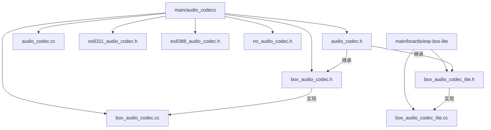
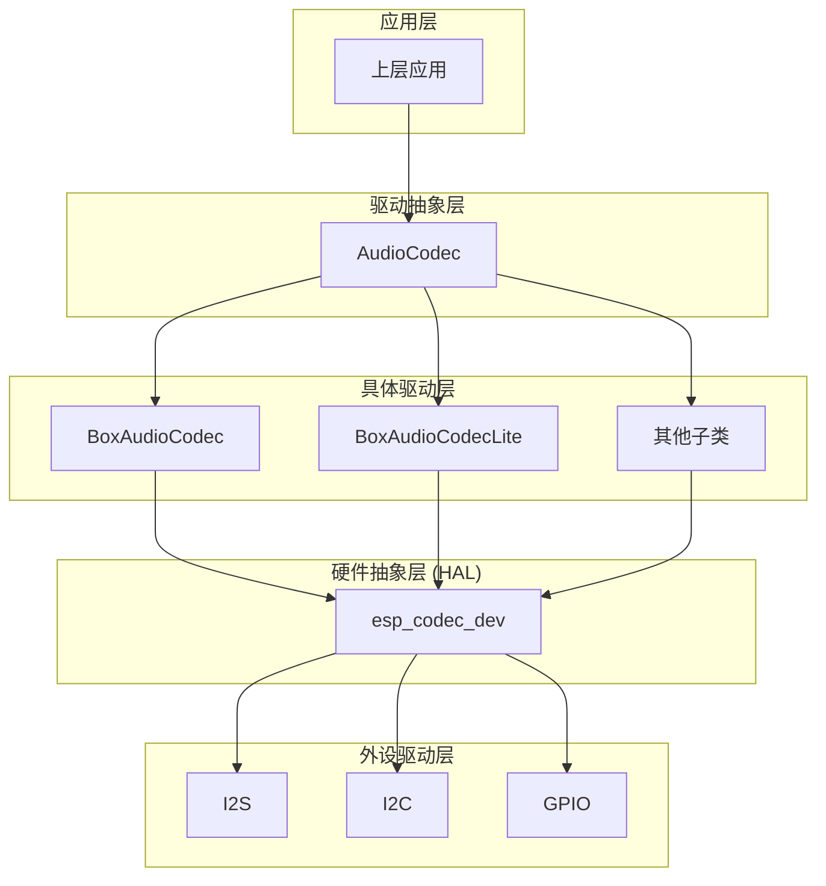
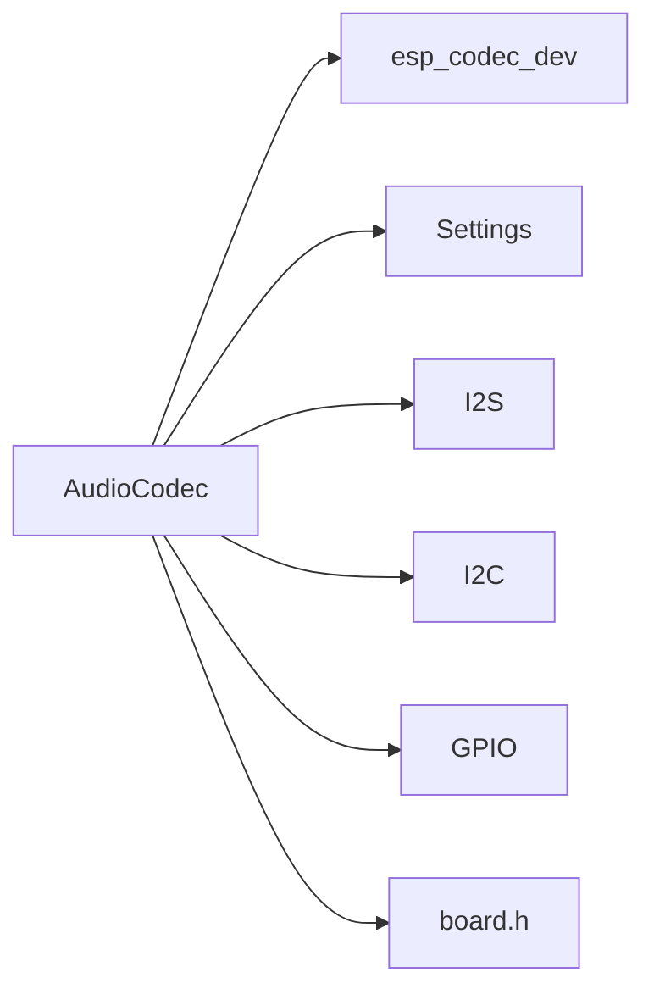

# 音频驱动基类与通用接口

<cite>
**本文档引用的文件**  
- [audio_codec.h](file://main/audio_codecs/audio_codec.h#L1-L59)
- [audio_codec.cc](file://main/audio_codecs/audio_codec.cc#L1-L68)
- [box_audio_codec.h](file://main/audio_codecs/box_audio_codec.h#L1-L38)
- [box_audio_codec.cc](file://main/audio_codecs/box_audio_codec.cc#L1-L242)
- [box_audio_codec_lite.h](file://main/boards/esp-box-lite/box_audio_codec_lite.h#L1-L42)
- [box_audio_codec_lite.cc](file://main/boards/esp-box-lite/box_audio_codec_lite.cc#L1-L272)
</cite>

## 目录
1. [引言](#引言)
2. [项目结构概览](#项目结构概览)
3. [核心组件分析](#核心组件分析)
4. [架构总览](#架构总览)
5. [详细组件分析](#详细组件分析)
6. [依赖关系分析](#依赖关系分析)
7. [性能与线程安全考量](#性能与线程安全考量)
8. [新编解码器开发指南](#新编解码器开发指南)
9. [结论](#结论)

## 引言

本技术文档深入剖析了 `AudioCodec` 抽象基类的设计理念、接口规范及其在嵌入式音频系统中的核心作用。该基类为多种硬件音频编解码器（如 ES8311、ES8156 等）提供了统一的软件调用接口，通过面向对象的继承与多态机制，实现了硬件抽象与驱动解耦。文档将详细解释 `open()`、`setVolume()`、`start()`、`close()` 等关键方法的契约定义、默认行为及在具体子类（如 `BoxAudioCodec`）中的重写策略。同时，本文档将为开发者提供一份详尽的新编解码器驱动开发指南，涵盖初始化序列、错误处理、资源管理等关键环节，确保驱动的线程安全与异常鲁棒性。

## 项目结构概览

音频编解码器相关的代码主要位于 `main/audio_codecs/` 目录下，该目录包含了抽象基类和多个通用硬件的驱动实现。此外，特定开发板的专用编解码器驱动则分散在 `main/boards/` 目录下的各个子目录中，例如 `esp-box-lite` 板的 `box_audio_codec_lite`。这种组织方式体现了“通用驱动”与“板级专用驱动”分离的设计思想。



**图示来源**
- [audio_codec.h](file://main/audio_codecs/audio_codec.h#L1-L59)
- [box_audio_codec.h](file://main/audio_codecs/box_audio_codec.h#L1-L38)
- [box_audio_codec_lite.h](file://main/boards/esp-box-lite/box_audio_codec_lite.h#L1-L42)

## 核心组件分析

`AudioCodec` 是整个音频驱动体系的核心抽象基类。它定义了一套完整的接口，用于控制音频数据的输入（采集）和输出（播放）。该类通过纯虚函数 `Read()` 和 `Write()` 强制子类实现底层硬件的数据读写逻辑，而将更高层次的控制逻辑（如音量设置、启停控制）封装在非虚或虚函数中，提供默认实现或供子类重写。

**本节来源**
- [audio_codec.h](file://main/audio_codecs/audio_codec.h#L13-L55)
- [audio_codec.cc](file://main/audio_codecs/audio_codec.cc#L10-L67)

## 架构总览

系统采用分层架构，`AudioCodec` 基类位于上层，提供统一的 API。其下是具体的编解码器驱动子类，如 `BoxAudioCodec` 和 `BoxAudioCodecLite`，它们负责与 ESP-IDF 的 `esp_codec_dev` 框架和 I2S 外设进行交互。最底层是硬件抽象层（HAL），由 `esp_codec_dev` 库提供，它进一步封装了 I2C 控制、GPIO 操作和 I2S 数据传输。



**图示来源**
- [audio_codec.h](file://main/audio_codecs/audio_codec.h#L13-L55)
- [box_audio_codec.cc](file://main/audio_codecs/box_audio_codec.cc#L1-L242)
- [box_audio_codec_lite.cc](file://main/boards/esp-box-lite/box_audio_codec_lite.cc#L1-L272)

## 详细组件分析

### AudioCodec 抽象基类分析

`AudioCodec` 类的设计体现了面向对象的封装、继承和多态原则。其公共接口定义了外部如何与音频系统交互。

#### 类结构与接口契约

```mermaid
classDiagram
class AudioCodec {
+AudioCodec()
+~AudioCodec()
+SetOutputVolume(int volume)
+EnableInput(bool enable)
+EnableOutput(bool enable)
+SetInputGain(float gain_db)
+GetInputGain() float
+Start()
+OutputData(std : : vector<int16_t>& data)
+InputData(std : : vector<int16_t>& data)
+duplex() bool
+input_reference() bool
+input_sample_rate() int
+output_sample_rate() int
+input_channels() int
+output_channels() int
+output_volume() int
+input_enabled() bool
+output_enabled() bool
-Read(int16_t* dest, int samples) int
-Write(const int16_t* data, int samples) int
}
class BoxAudioCodec {
+BoxAudioCodec(...)
+~BoxAudioCodec()
+SetOutputVolume(int volume)
+EnableInput(bool enable)
+EnableOutput(bool enable)
-Read(int16_t* dest, int samples) int
-Write(const int16_t* data, int samples) int
-CreateDuplexChannels(...)
}
class BoxAudioCodecLite {
+BoxAudioCodecLite(...)
+~BoxAudioCodecLite()
+SetOutputVolume(int volume)
+EnableInput(bool enable)
+EnableOutput(bool enable)
-Read(int16_t* dest, int samples) int
-Write(const int16_t* data, int samples) int
-CreateDuplexChannels(...)
}
AudioCodec <|-- BoxAudioCodec : "继承"
AudioCodec <|-- BoxAudioCodecLite : "继承"
AudioCodec : "纯虚函数 : Read, Write"
```

**图示来源**
- [audio_codec.h](file://main/audio_codecs/audio_codec.h#L13-L55)
- [box_audio_codec.h](file://main/audio_codecs/box_audio_codec.h#L1-L38)
- [box_audio_codec_lite.h](file://main/boards/esp-box-lite/box_audio_codec_lite.h#L1-L42)

#### 关键方法契约与默认行为

- **`Start()`**: 该方法是音频系统的启动入口。其契约定义为：从持久化存储（`Settings`）加载音量配置，启用 I2S 通道，并调用 `EnableInput(true)` 和 `EnableOutput(true)` 来激活输入输出。此方法在基类中提供了完整的实现，子类通常无需重写。
- **`SetOutputVolume(int volume)`**: 该方法用于设置输出音量。其契约包括更新内部状态 `output_volume_`、记录日志、将音量值持久化到 `Settings`，并触发硬件音量更新。在基类中，它仅更新软件状态。子类（如 `BoxAudioCodec`）必须重写此方法，以通过 `esp_codec_dev_set_out_vol()` 将音量设置传递给硬件。
- **`EnableInput(bool enable)` / `EnableOutput(bool enable)`**: 这两个方法用于动态启用或禁用音频通道。其契约是幂等的（即重复调用相同参数无副作用），并记录状态变化。基类实现仅更新内部标志 `input_enabled_` 和 `output_enabled_`。子类必须重写这些方法，在 `enable` 为 `true` 时调用 `esp_codec_dev_open()` 打开设备，在 `enable` 为 `false` 时调用 `esp_codec_dev_close()` 关闭设备。
- **`OutputData(std::vector<int16_t>& data)` / `InputData(std::vector<int16_t>& data)`**: 这些是应用层与驱动交互的主要数据通道。`OutputData` 负责将音频数据发送到硬件，其内部调用纯虚函数 `Write()`。`InputData` 负责从硬件读取音频数据，其内部调用纯虚函数 `Read()`。它们将 `std::vector` 的抽象数据类型转换为底层驱动所需的原始指针和样本数。
- **`Read(int16_t* dest, int samples)` / `Write(const int16_t* data, int samples)`**: 这两个纯虚函数是驱动实现的核心。它们定义了与硬件进行原始数据交换的契约。子类必须提供具体实现，通常通过调用 `esp_codec_dev_read()` 和 `esp_codec_dev_write()` 来完成。`BoxAudioCodec` 的实现中，`Read` 和 `Write` 方法会检查 `input_enabled_` 和 `output_enabled_` 状态，以确保在通道关闭时不进行无效的硬件调用。

**本节来源**
- [audio_codec.h](file://main/audio_codecs/audio_codec.h#L13-L55)
- [audio_codec.cc](file://main/audio_codecs/audio_codec.cc#L49-L66)
- [box_audio_codec.cc](file://main/audio_codecs/box_audio_codec.cc#L181-L241)

### BoxAudioCodec 子类分析

`BoxAudioCodec` 是 `AudioCodec` 的一个具体实现，专为使用 ES8311 DAC 和 ES7210 ADC 的开发板设计。

#### 初始化与资源管理

`BoxAudioCodec` 的构造函数负责初始化所有硬件接口。它创建 I2S 双工通道（使用 `CreateDuplexChannels`），并为 I2C 控制、GPIO 和数据接口创建句柄。随后，它使用这些句柄来初始化 ES8311 和 ES7210 编解码器设备，并创建 `esp_codec_dev` 句柄 `output_dev_` 和 `input_dev_`。析构函数 `~BoxAudioCodec()` 则负责按正确顺序释放所有资源，包括关闭和删除设备句柄、删除接口句柄等，防止资源泄漏。

#### 重写策略与扩展机制

`BoxAudioCodec` 通过重写基类的虚函数来扩展功能：
- **`SetOutputVolume`**: 在调用基类方法更新软件状态前，先通过 `esp_codec_dev_set_out_vol()` 更新硬件音量。
- **`EnableInput` / `EnableOutput`**: 在调用基类方法前，根据 `enable` 参数执行 `esp_codec_dev_open()` 或 `esp_codec_dev_close()` 操作，实现了硬件层面的启停控制。
- **`Read` / `Write`**: 提供了具体的硬件数据读写实现，调用 `esp_codec_dev_read()` 和 `esp_codec_dev_write()`。

**本节来源**
- [box_audio_codec.h](file://main/audio_codecs/box_audio_codec.h#L1-L38)
- [box_audio_codec.cc](file://main/audio_codecs/box_audio_codec.cc#L1-L242)

### BoxAudioCodecLite 子类分析

`BoxAudioCodecLite` 是为 `esp-box-lite` 开发板设计的轻量级实现，使用 ES8156 DAC 和 ES7243E ADC。

#### 特性与差异

与 `BoxAudioCodec` 相比，`BoxAudioCodecLite` 的主要差异在于：
- **回声消除支持**: 当 `input_reference_` 为 `true` 时，它会分配一个 `ref_buffer_` 用于存储参考音频数据，这是实现回声消除（AEC）的关键。
- **输入通道数**: `input_channels_` 被设置为 `2 + input_reference_`，以适应多麦克风阵列。
- **麦克风增益**: 在 `EnableInput` 中，显式调用 `esp_codec_dev_set_in_gain()` 将输入增益设置为 37.5，以解决收音过小的问题，这是一个针对特定硬件的优化。

**本节来源**
- [box_audio_codec_lite.h](file://main/boards/esp-box-lite/box_audio_codec_lite.h#L1-L42)
- [box_audio_codec_lite.cc](file://main/boards/esp-box-lite/box_audio_codec_lite.cc#L1-L272)

## 依赖关系分析

`AudioCodec` 及其子类依赖于多个关键组件：
- **`esp_codec_dev` 框架**: 这是与硬件交互的核心依赖，提供了统一的设备管理、音量控制和数据读写接口。
- **`Settings` 类**: 用于持久化存储和读取音频配置，如音量。
- **ESP-IDF 外设驱动**: 依赖 `i2s`、`i2c` 和 `gpio` 驱动来配置和操作底层硬件。
- **`board.h`**: 依赖板级定义，如 GPIO 编号和 I2C 地址。



**图示来源**
- [audio_codec.cc](file://main/audio_codecs/audio_codec.cc#L1-L68)
- [box_audio_codec.cc](file://main/audio_codecs/box_audio_codec.cc#L1-L242)

## 性能与线程安全考量

- **性能**: 数据读写操作 (`Read`/`Write`) 在中断服务程序（ISR）或高优先级任务中执行，因此其实现必须高效，避免阻塞。使用 `ESP_ERROR_CHECK_WITHOUT_ABORT` 可以防止因单次读写失败而导致整个系统崩溃。
- **线程安全**: `AudioCodec` 的公共方法（如 `SetOutputVolume`, `EnableInput`）内部通过检查状态标志来避免重复操作，这在单线程或受保护的多线程环境中是安全的。然而，如果多个线程可能同时调用这些方法，建议在更高层（如应用逻辑）使用互斥锁（Mutex）来保护对 `AudioCodec` 实例的访问。`esp_codec_dev` 库本身通常提供线程安全的API。

## 新编解码器开发指南

要为新硬件开发编解码器驱动，请遵循以下步骤：

1.  **创建子类**: 创建一个新类，继承自 `AudioCodec`。
2.  **实现构造函数与析构函数**: 在构造函数中初始化所有硬件资源（I2S通道、I2C句柄、编解码器设备等）。在析构函数中，按与构造相反的顺序安全地释放所有资源。
3.  **重写纯虚函数**: 必须实现 `Read()` 和 `Write()` 方法，使用 `esp_codec_dev_read()` 和 `esp_codec_dev_write()` 或直接的硬件寄存器操作来完成数据传输。
4.  **重写控制函数**: 重写 `SetOutputVolume()`、`EnableInput()` 和 `EnableOutput()`。在这些方法中，除了调用 `AudioCodec::` 的基类实现外，还必须执行相应的硬件操作（如设置音量、打开/关闭设备）。
5.  **处理错误**: 在所有可能失败的硬件操作后使用 `ESP_ERROR_CHECK` 或 `ESP_ERROR_CHECK_WITHOUT_ABORT` 进行错误检查。对于关键初始化操作，使用前者；对于数据读写等可能偶尔失败的操作，使用后者。
6.  **确保线程安全**: 如果驱动可能在多线程环境下使用，考虑在公共方法中添加互斥锁，或在文档中明确说明其线程安全模型。
7.  **持久化配置**: 遵循 `Start()` 方法的模式，从 `Settings` 加载配置，并在配置变更时将其保存。

## 结论

`AudioCodec` 抽象基类成功地为多样化的音频硬件提供了一个稳定、统一的软件接口。通过精心设计的虚函数契约和默认行为，它简化了上层应用的开发，同时允许子类通过重写来实现特定硬件的复杂功能。`BoxAudioCodec` 和 `BoxAudioCodecLite` 等子类展示了如何利用该基类构建高效、可维护的驱动程序。该设计模式不仅提高了代码的复用性，也为未来支持新硬件提供了清晰的扩展路径。