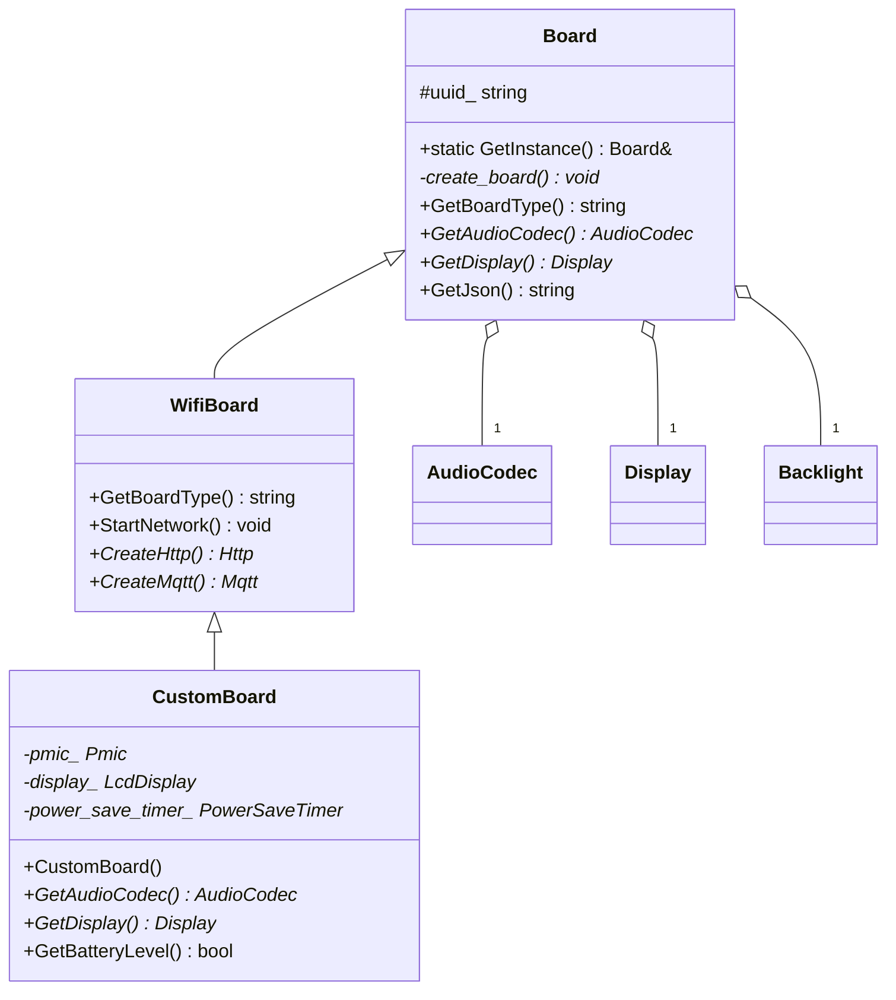
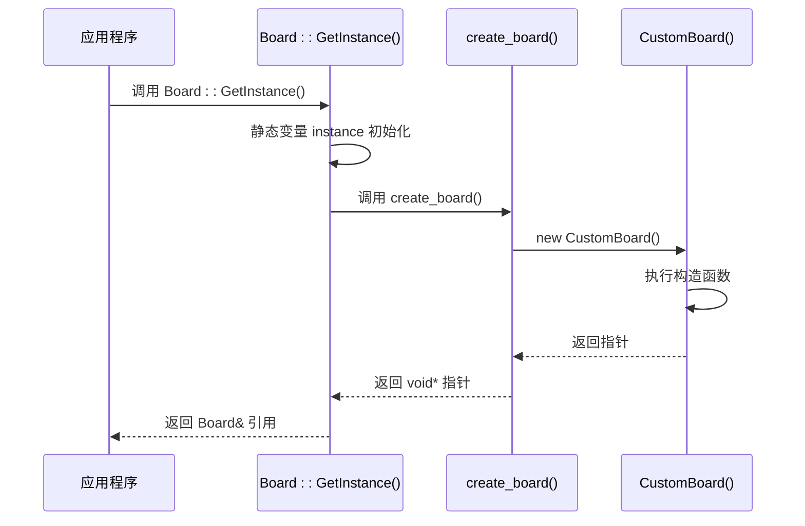

# 开发板工厂模式

<cite>
**本文档引用的文件**   
- [board.h](file://main/boards/common/board.h)
- [board.cc](file://main/boards/common/board.cc)
- [wifi_board.h](file://main/boards/common/wifi_board.h)
- [wifi_board.cc](file://main/boards/common/wifi_board.cc)
- [esp32-s3-touch-lcd-3.5.cc](file://main/boards/esp32-s3-touch-lcd-3.5/esp32-s3-touch-lcd-3.5.cc)
- [CMakeLists.txt](file://main/CMakeLists.txt)
</cite>

## 目录
1. [引言](#引言)
2. [核心机制解析](#核心机制解析)
3. [宏定义与代码生成](#宏定义与代码生成)
4. [开发板实例化流程](#开发板实例化流程)
5. [具体开发板实现分析](#具体开发板实现分析)
6. [设计优势与扩展性](#设计优势与扩展性)
7. [构建系统集成](#构建系统集成)
8. [常见问题与排查](#常见问题与排查)

## 引言
本文档深入解析了基于 `DECLARE_BOARD` 宏实现的开发板工厂模式机制。该设计模式允许在不修改核心框架代码的情况下，动态地注册和创建不同类型的开发板实例。通过分析宏定义的展开过程、单例模式的实现以及构建系统的集成，本文将详细阐述这一机制如何实现硬件抽象与低耦合的扩展。

## 核心机制解析

### 工厂模式与单例模式的结合
该系统的核心是将工厂模式与单例模式相结合。`Board` 类本身是一个单例，通过 `GetInstance()` 静态方法全局访问。然而，其内部的实例化过程则由一个工厂函数 `create_board()` 完成。这种设计将“获取实例”与“创建实例”的逻辑分离，为动态创建不同类型的开发板对象提供了可能。



**图示来源**
- [board.h](file://main/boards/common/board.h#L1-L55)
- [wifi_board.h](file://main/boards/common/wifi_board.h#L1-L26)
- [esp32-s3-touch-lcd-3.5.cc](file://main/boards/esp32-s3-touch-lcd-3.5/esp32-s3-touch-lcd-3.5.cc#L96-L295)

**中文来源**
- [board.h](file://main/boards/common/board.h#L1-L55)
- [wifi_board.h](file://main/boards/common/wifi_board.h#L1-L26)
- [esp32-s3-touch-lcd-3.5.cc](file://main/boards/esp32-s3-touch-lcd-3.5/esp32-s3-touch-lcd-3.5.cc#L96-L295)

### Board 类的单例实现
`Board` 类的 `GetInstance()` 方法是整个机制的入口点。其定义如下：

```cpp
static Board& GetInstance() {
    static Board* instance = static_cast<Board*>(create_board());
    return *instance;
}
```

此方法利用 C++ 的静态局部变量特性，确保 `instance` 只被初始化一次。关键在于 `create_board()` 函数的调用。该函数的定义并非在 `board.h` 或 `board.cc` 中显式编写，而是由 `DECLARE_BOARD` 宏在具体的开发板实现文件中生成。

**中文来源**
- [board.h](file://main/boards/common/board.h#L25-L30)

## 宏定义与代码生成

### DECLARE_BOARD 宏的定义与作用
`DECLARE_BOARD` 宏是实现动态注册的核心。其定义位于 `board.h` 文件中：

```cpp
#define DECLARE_BOARD(BOARD_CLASS_NAME) \
void* create_board() { \
    return new BOARD_CLASS_NAME(); \
}
```

这个宏的作用是：
1.  **声明一个全局函数**：`void* create_board()`。该函数的签名与 `Board::GetInstance()` 中调用的函数完全匹配。
2.  **生成创建逻辑**：函数体中直接 `new` 一个指定的开发板类（`BOARD_CLASS_NAME`）的实例，并返回其指针。
3.  **链接时覆盖**：由于 `create_board` 函数没有被声明为 `inline` 或 `static`，它是一个具有外部链接的全局函数。在链接阶段，只有**一个** `create_board` 的定义会被保留。这个定义来自于当前编译的、使用了 `DECLARE_BOARD` 宏的那个开发板 `.cc` 文件。

**中文来源**
- [board.h](file://main/boards/common/board.h#L50-L54)

## 开发板实例化流程

### 实例化时序图
从应用程序启动到获取具体开发板实例的完整流程如下：



**图示来源**
- [board.h](file://main/boards/common/board.h#L25-L30)
- [esp32-s3-touch-lcd-3.5.cc](file://main/boards/esp32-s3-touch-lcd-3.5/esp32-s3-touch-lcd-3.5.cc#L294)

**中文来源**
- [board.h](file://main/boards/common/board.h#L25-L30)
- [esp32-s3-touch-lcd-3.5.cc](file://main/boards/esp32-s3-touch-lcd-3.5/esp32-s3-touch-lcd-3.5.cc#L294)

### UUID 生成与持久化
`Board` 的构造函数负责生成或加载设备的唯一标识符（UUID）。它首先尝试从 NVS（非易失性存储）中读取 `Client-Id`，如果存在则直接使用；否则，会从 `Settings`（可能基于文件或NVS）中读取 `uuid`，若仍不存在，则调用 `GenerateUuid()` 生成一个符合 UUID v4 标准的随机字符串，并将其保存以供下次使用。

**中文来源**
- [board.cc](file://main/boards/common/board.cc#L10-L40)

## 具体开发板实现分析

### esp32-s3-touch-lcd-3.5 开发板
以 `esp32-s3-touch-lcd-3.5` 开发板为例，其核心实现位于 `esp32-s3-touch-lcd-3.5.cc` 文件中。

#### 类继承与初始化
该开发板通过定义一个 `CustomBoard` 类来实现，该类继承自 `WifiBoard`（`WifiBoard` 又继承自 `Board`）。`CustomBoard` 的构造函数集中了所有硬件的初始化逻辑：
- **电源管理**：通过 `InitializeAxp2101()` 初始化 AXP2101 PMIC 芯片。
- **I2C 总线**：通过 `InitializeI2c()` 初始化用于连接音频编解码器和 I/O 扩展器的 I2C 总线。
- **SPI 总线**：通过 `InitializeSpi()` 初始化用于驱动 LCD 屏幕的 QSPI 总线。
- **显示屏**：通过 `InitializeLcdDisplay()` 配置 LCD 面板 IO 和驱动芯片（ST7796），并创建 `SpiLcdDisplay` 对象。
- **音频编解码器**：通过重写 `GetAudioCodec()` 方法，返回一个静态的 `Es8311AudioCodec` 对象。
- **背光控制**：通过重写 `GetBacklight()` 方法，返回一个静态的 `PwmBacklight` 对象。

**中文来源**
- [esp32-s3-touch-lcd-3.5.cc](file://main/boards/esp32-s3-touch-lcd-3.5/esp32-s3-touch-lcd-3.5.cc#L96-L295)

#### 工厂注册
在 `CustomBoard` 类定义的末尾，通过 `DECLARE_BOARD(CustomBoard);` 宏调用，生成了 `create_board()` 函数的具体实现。当此文件被编译并链接到最终的固件中时，这个 `create_board()` 函数就会成为全局唯一的定义。

```cpp
DECLARE_BOARD(CustomBoard);
```

**中文来源**
- [esp32-s3-touch-lcd-3.5.cc](file://main/boards/esp32-s3-touch-lcd-3.5/esp32-s3-touch-lcd-3.5.cc#L294)

## 设计优势与扩展性

### 低耦合与高内聚
该设计模式的最大优势在于实现了**低耦合**。核心框架（`Board` 类）与具体的硬件实现（如 `CustomBoard`）完全解耦。框架只定义接口，不关心具体实现。新增一个开发板，只需：
1.  在 `boards/` 目录下创建一个新文件夹。
2.  编写一个继承自 `Board` 或其子类的 C++ 类。
3.  在该类的 `.cc` 文件末尾调用 `DECLARE_BOARD(YourBoardClass);`。

整个过程无需修改 `board.h`、`board.cc` 或任何其他核心文件，极大地降低了引入错误的风险。

### 与 DECLARE_THING 宏的对比
系统中还存在类似的 `DECLARE_THING` 宏，用于注册物联网设备（如灯、电池）。两者的设计思想一致，都是基于工厂模式。但实现方式不同：
- `DECLARE_BOARD` 利用**链接时符号覆盖**，在编译时确定唯一的开发板类型。
- `DECLARE_THING` 利用**运行时注册表**（`thing_creators` 映射表），在运行时动态注册和创建多种设备类型。

这种差异源于它们的使用场景：系统在启动时只需要一个开发板实例，而可以同时存在多个不同类型的物联网设备。

**中文来源**
- [iot/thing.h](file://main/iot/thing.h#L288-L299)
- [iot/thing.cc](file://main/iot/thing.cc#L5-L15)

## 构建系统集成

### 编译时开发板选择
`DECLARE_BOARD` 宏的机制与构建系统（CMake）紧密配合。`CMakeLists.txt` 文件根据 Kconfig 配置的 `CONFIG_BOARD_TYPE_*` 选项，通过一系列 `if-elseif` 语句确定 `BOARD_TYPE` 变量的值。

```cmake
if(CONFIG_BOARD_TYPE_ESP32S3_Touch_LCD_3_5)
    set(BOARD_TYPE "esp32-s3-touch-lcd-3.5")
endif()
```

随后，构建系统会将 `BOARD_TYPE` 定义为一个预处理器宏，并将 `${BOARD_TYPE}` 目录下的所有 `.cc` 文件加入编译列表。

```cmake
target_compile_definitions(${COMPONENT_LIB} PRIVATE BOARD_TYPE=\"${BOARD_TYPE}\" ...)
file(GLOB BOARD_SOURCES ${CMAKE_CURRENT_SOURCE_DIR}/boards/${BOARD_TYPE}/*.cc)
```

这确保了只有目标开发板的源文件（包含其 `DECLARE_BOARD` 宏）被编译和链接，从而保证了 `create_board` 函数的唯一性。

**中文来源**
- [CMakeLists.txt](file://main/CMakeLists.txt#L45-L80)

## 常见问题与排查

### 符号未定义错误
如果在链接时出现 `undefined reference to 'create_board()'` 错误，通常意味着：
1.  **缺少宏调用**：检查目标开发板的 `.cc` 文件末尾是否遗漏了 `DECLARE_BOARD(YourClass);`。
2.  **文件未编译**：检查 `CMakeLists.txt` 是否正确地将该开发板的 `.cc` 文件包含在 `SOURCES` 列表中。确认 `BOARD_TYPE` 变量的值与文件夹名称完全匹配。

### 注册失败或创建错误实例
如果程序创建了错误的开发板实例，可能的原因是：
1.  **多个 DECLARE_BOARD 宏**：检查项目中是否意外地编译了多个包含 `DECLARE_BOARD` 宏的 `.cc` 文件。这会导致链接器报错或行为未定义。
2.  **BOARD_TYPE 配置错误**：检查 Kconfig 配置，确保 `CONFIG_BOARD_TYPE_*` 选项与预期的开发板匹配。