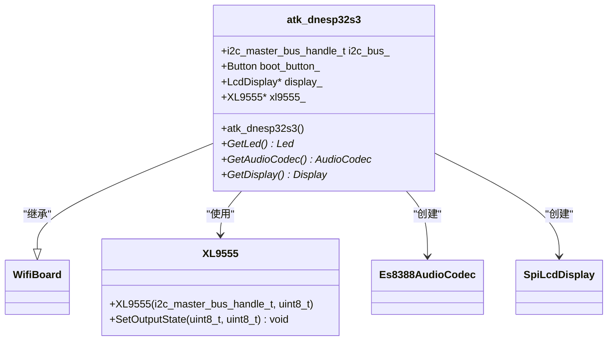
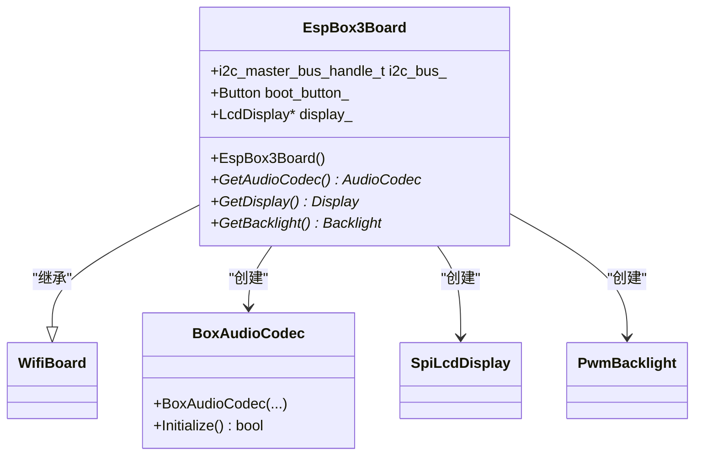
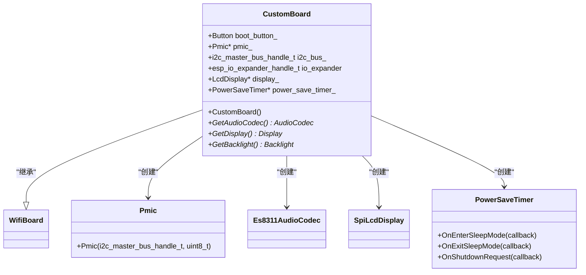

# 支持的开发板列表

<cite>
**本文档中引用的文件**   
- [atk_dnesp32s3.cc](file://main/boards/atk-dnesp32s3/atk_dnesp32s3.cc)
- [atk_dnesp32s3_box.cc](file://main/boards/atk-dnesp32s3-box/atk_dnesp32s3_box.cc)
- [atommatrix_echo_base.cc](file://main/boards/atommatrix-echo-base/atommatrix_echo_base.cc)
- [atoms3_echo_base.cc](file://main/boards/atoms3-echo-base/atoms3_echo_base.cc)
- [atoms3r_cam_m12_echo_base.cc](file://main/boards/atoms3r-cam-m12-echo-base/atoms3r_cam_m12_echo_base.cc)
- [atoms3r_echo_base.cc](file://main/boards/atoms3r-echo-base/atoms3r_echo_base.cc)
- [esp_box_board.cc](file://main/boards/esp-box/esp_box_board.cc)
- [esp_box3_board.cc](file://main/boards/esp-box-3/esp_box3_board.cc)
- [esp_box_lite_board.cc](file://main/boards/esp-box-lite/esp_box_lite_board.cc)
- [esp_sparkbot_board.cc](file://main/boards/esp-sparkbot/esp_sparkbot_board.cc)
- [esp_spot_s3_board.cc](file://main/boards/esp-spot-s3/esp_spot_s3_board.cc)
- [esp32_cgc_board.cc](file://main/boards/esp32-cgc/esp32_cgc_board.cc)
- [esp32-s3-touch-amoled-1.8.cc](file://main/boards/esp32-s3-touch-amoled-1.8/esp32-s3-touch-amoled-1.8.cc)
- [esp32-s3-touch-lcd-1.46.cc](file://main/boards/esp32-s3-touch-lcd-1.46/esp32-s3-touch-lcd-1.46.cc)
- [esp32-s3-touch-lcd-1.85.cc](file://main/boards/esp32-s3-touch-lcd-1.85/esp32-s3-touch-lcd-1.85.cc)
- [esp32-s3-touch-lcd-1.85c.cc](file://main/boards/esp32-s3-touch-lcd-1.85c/esp32-s3-touch-lcd-1.85c.cc)
- [esp32-s3-touch-lcd-3.5.cc](file://main/boards/esp32-s3-touch-lcd-3.5/esp32-s3-touch-lcd-3.5.cc)
- [esp32s3_korvo2_v3_board.cc](file://main/boards/esp32s3-korvo2-v3/esp32s3_korvo2_v3_board.cc)
- [kevin_box_board.cc](file://main/boards/kevin-box-1/kevin_box_board.cc)
- [kevin_c3_board.cc](file://main/boards/kevin-c3/kevin_c3_board.cc)
- [kevin-sp-v3_board.cc](file://main/boards/kevin-sp-v3-dev/kevin-sp-v3_board.cc)
- [kevin-sp-v4_board.cc](file://main/boards/kevin-sp-v4-dev/kevin-sp-v4_board.cc)
- [kevin_yuying_313lcd.cc](file://main/boards/kevin-yuying-313lcd/kevin_yuying_313lcd.cc)
- [lichuang_c3_dev_board.cc](file://main/boards/lichuang-c3-dev/lichuang_c3_dev_board.cc)
- [lichuang_dev_board.cc](file://main/boards/lichuang-dev/lichuang_dev_board.cc)
- [lilygo-t-cameraplus-s3.cc](file://main/boards/lilygo-t-cameraplus-s3/lilygo-t-cameraplus-s3.cc)
- [lilygo-t-circle-s3.cc](file://main/boards/lilygo-t-circle-s3/lilygo-t-circle-s3.cc)
- [m5stack_core_s3.cc](file://main/boards/m5stack-core-s3/m5stack_core_s3.cc)
- [magiclick_2p4_board.cc](file://main/boards/magiclick-2p4/magiclick_2p4_board.cc)
- [magiclick_2p5_board.cc](file://main/boards/magiclick-2p5/magiclick_2p5_board.cc)
- [magiclick_c3_board.cc](file://main/boards/magiclick-c3/magiclick_c3_board.cc)
- [magiclick_c3_v2_board.cc](file://main/boards/magiclick-c3-v2/magiclick_c3_v2_board.cc)
- [moon.cc](file://main/boards/moon/abrobot-1.28tft-wifi.cc)
- [movecall_cuican_esp32s3.cc](file://main/boards/movecall-cuican-esp32s3/movecall_cuican_esp32s3.cc)
- [movecall_moji_esp32s3.cc](file://main/boards/movecall-moji-esp32s3/movecall_moji_esp32s3.cc)
- [sensecap_watcher.cc](file://main/boards/sensecap-watcher/sensecap_watcher.cc)
- [taiji_pi_s3.cc](file://main/boards/taiji-pi-s3/taiji_pi_s3.cc)
- [kevin_box_board.cc](file://main/boards/tudouzi/kevin_box_board.cc)
- [xingzhi-cube-0.85tft-ml307.cc](file://main/boards/xingzhi-cube-0.85tft-ml307/xingzhi-cube-0.85tft-ml307.cc)
- [xingzhi-cube-0.85tft-wifi.cc](file://main/boards/xingzhi-cube-0.85tft-wifi/xingzhi-cube-0.85tft-wifi.cc)
- [xingzhi-cube-0.96oled-ml307.cc](file://main/boards/xingzhi-cube-0.96oled-ml307/xingzhi-cube-0.96oled-ml307.cc)
- [xingzhi-cube-0.96oled-wifi.cc](file://main/boards/xingzhi-cube-0.96oled-wifi/xingzhi-cube-0.96oled-wifi.cc)
- [xingzhi-cube-1.54tft-ml307.cc](file://main/boards/xingzhi-cube-1.54tft-ml307/xingzhi-cube-1.54tft-ml307.cc)
- [xingzhi-cube-1.54tft-wifi.cc](file://main/boards/xingzhi-cube-1.54tft-wifi/xingzhi-cube-1.54tft-wifi.cc)
- [xmini_c3_board.cc](file://main/boards/xmini-c3/xmini_c3_board.cc)
- [config.h](file://main/boards/atk-dnesp32s3/config.h)
- [config.h](file://main/boards/esp-box/config.h)
- [config.h](file://main/boards/esp32-s3-touch-lcd-1.46/config.h)
- [config.h](file://main/boards/esp32-s3-touch-lcd-3.5/config.h)
- [config.json](file://main/boards/atk-dnesp32s3/config.json)
- [config.json](file://main/boards/esp-box/config.json)
- [config.json](file://main/boards/esp32-s3-touch-lcd-1.46/config.json)
- [config.json](file://main/boards/esp32-s3-touch-lcd-3.5/config.json)
- [README.md](file://main/boards/README.md)
</cite>

## 目录

1. [简介](#简介)
2. [开发板分类与支持状态](#开发板分类与支持状态)
3. [核心开发板型号详解](#核心开发板型号详解)
   - [ATK-DNESP32S3](#atk-dnesp32s3)
   - [ESP-BOX系列](#esp-box系列)
   - [Waveshare ESP32-S3 触摸屏系列](#waveshare-esp32-s3-触摸屏系列)
   - [M5Stack Core S3](#m5stack-core-s3)
   - [LilyGo T-CameraPlus S3](#lilygo-t-cameraplus-s3)
   - [SenseCap Watcher](#sensecap-watcher)
   - [Kevin系列](#kevin系列)
   - [Xingzhi Cube系列](#xingzhi-cube系列)
4. [开发板共性与差异分析](#开发板共性与差异分析)
5. [选择指南](#选择指南)
6. [附录：开发板快速参考表](#附录开发板快速参考表)

## 简介

本指南旨在全面汇总和分类小智AI语音聊天机器人项目当前支持的所有开发板型号。基于`main/boards`目录的结构，本文档为每个开发板提供详细的硬件规格、源码文件、配置特点及适用场景。通过分析开发板之间的共性与差异，帮助用户根据具体需求选择最合适的硬件平台。同时，本文档说明了各开发板的支持状态（官方支持、社区贡献、实验性）和维护情况，为开发者和用户提供一个快速查找和对比不同开发板特性的权威参考。

**本文档中引用的文件**   
- [README.md](file://main/boards/README.md)

## 开发板分类与支持状态

根据`main/boards`目录的结构和`README.md`文档的说明，当前支持的开发板可以分为以下几类：

*   **官方支持开发板 (Officially Supported)**: 由项目核心团队维护，拥有完整的`config.h`、`config.json`和`.cc`实现文件，通常包含`README.md`。这些开发板经过充分测试，是推荐使用的首选。例如：`esp-box`、`esp32-s3-touch-lcd-3.5`、`m5stack-core-s3`。
*   **社区贡献开发板 (Community Contributed)**: 由社区开发者贡献，可能功能完整，但维护频率和测试覆盖度可能低于官方开发板。例如：`atk-dnesp32s3`、`doit-s3-aibox`。
*   **实验性/基础开发板 (Experimental/Basic)**: 这些开发板通常是为特定芯片（如ESP32-C3）或基础功能（如无显示屏的WiFi板）设计的模板或基础实现。它们可能缺少某些高级功能，主要用于开发和测试。例如：`bread-compact-*`系列、`xmini-c3`。
*   **特定应用开发板 (Application-Specific)**: 针对特定应用场景（如机器人、4G通信）设计的开发板。例如：`esp-sparkbot`（机器人）、`lichuang-dev`（4G ML307模块）。

所有开发板均继承自`WifiBoard`或`ML307Board`基类，确保了核心功能（如网络连接、设备初始化）的一致性。

**本文档中引用的文件**   
- [README.md](file://main/boards/README.md)

## 核心开发板型号详解

### ATK-DNESP32S3

**描述**: 一款由社区贡献的ESP32-S3开发板，配备3.5英寸LCD触摸屏，适用于需要中等尺寸显示屏的AI交互项目。

**硬件规格**:
- **主控芯片**: ESP32-S3
- **显示屏**: 3.5英寸LCD，分辨率320x240，驱动芯片ST7789
- **音频编解码器**: ES8388
- **特色外设**: 集成XL9555 I/O扩展芯片，用于控制LCD和触摸屏的复位信号。

**源码文件**:
- 实现文件: `atk_dnesp32s3.cc`
- 配置头文件: `config.h`
- 编译配置: `config.json`

**配置特点**:
- 使用I2C总线（端口0）与音频编解码器通信。
- 使用SPI总线（SPI2_HOST）驱动显示屏。
- 显示屏坐标轴进行了交换（`DISPLAY_SWAP_XY = true`）和X轴镜像（`DISPLAY_MIRROR_X = true`）。
- 无独立的背光控制引脚（`DISPLAY_BACKLIGHT_PIN = GPIO_NUM_NC`），背光可能常亮或由其他方式控制。

**适用场景**: 通用AI语音助手、智能家居控制面板。

**支持状态**: 社区贡献，功能完整。

**图源**
- [atk_dnesp32s3.cc](file://main/boards/atk-dnesp32s3/atk_dnesp32s3.cc#L48-L187)
- [config.h](file://main/boards/atk-dnesp32s3/config.h#L1-L45)

### ESP-BOX系列

该系列是官方支持的旗舰产品，包含`esp-box`、`esp-box-3`和`esp-box-lite`三个型号，均基于ESP32-S3。

**描述**: ESP-BOX系列是专为AI语音交互设计的高性能开发板，集成了高质量音频编解码器和麦克风阵列，提供卓越的语音输入体验。

**硬件规格**:
- **主控芯片**: ESP32-S3
- **显示屏**: 2.4英寸LCD，分辨率320x240，驱动芯片ILI9341
- **音频编解码器**: ES8311 (输出) 和 ES7210 (输入，麦克风阵列)
- **特色外设**: PWM背光控制，支持亮度调节。

**源码文件**:
- 实现文件: `esp_box_board.cc` (esp-box), `esp_box3_board.cc` (esp-box-3), `esp_box_lite_board.cc` (esp-box-lite)
- 配置头文件: 各自的`config.h`
- 编译配置: 各自的`config.json`

**配置特点**:
- 使用I2C总线（端口1）与音频编解码器通信。
- 使用SPI总线（SPI3_HOST）驱动显示屏。
- 采用`BoxAudioCodec`类，专门处理双编解码器（ES8311和ES7210）的复杂配置。
- 具有独立的背光控制引脚（GPIO 45），支持PWM调光。
- 显示屏Y轴镜像（`DISPLAY_MIRROR_Y = true`）。

**适用场景**: 高端AI语音助手、需要远场语音识别的智能设备。

**支持状态**: 官方支持，主力推荐。

**图源**
- [esp_box_board.cc](file://main/boards/esp-box/esp_box_board.cc#L42-L182)
- [config.h](file://main/boards/esp-box/config.h#L1-L42)

### Waveshare ESP32-S3 触摸屏系列

该系列包含`esp32-s3-touch-lcd-1.46`、`esp32-s3-touch-lcd-1.85`、`esp32-s3-touch-lcd-1.85c`和`esp32-s3-touch-lcd-3.5`等多个型号，是官方支持的触摸屏开发板。

**描述**: 基于ESP32-S3的系列触摸屏开发板，屏幕尺寸和分辨率各异，适用于从紧凑型到大尺寸显示的各种应用。

**硬件规格**:
- **主控芯片**: ESP32-S3
- **显示屏**: 
  - `1.46`: 1.46英寸圆形LCD，分辨率412x412，驱动芯片SPD2010 (QSPI)
  - `1.85`: 1.85英寸LCD，分辨率240x320
  - `1.85c`: 1.85英寸LCD，分辨率240x320
  - `3.5`: 3.5英寸LCD，分辨率480x320，驱动芯片ST7796
- **音频编解码器**: 
  - `1.46`: 无音频编解码器 (`no_audio_codec`)
  - `3.5`: ES8311
- **特色外设**: 
  - `1.46`和`3.5`: 使用TCA9554 I/O扩展芯片进行复位控制。
  - `3.5`: 集成AXP2101电源管理芯片(PMIC)，支持电池充电和电源控制。

**源码文件**:
- 实现文件: 各自的`.cc`文件
- 配置头文件: 各自的`config.h`
- 编译配置: 各自的`config.json`

**配置特点**:
- `1.46`型号无音频功能，专注于显示和触摸。
- `3.5`型号功能全面，集成了PMIC，支持更复杂的电源管理，如定时休眠和关机。
- 多数型号使用I2C总线（端口0）进行通信。
- `1.46`型号使用QSPI接口驱动显示屏，以获得更高的刷新率。

**适用场景**:
- `1.46`: 智能手表、环形UI设备。
- `1.85/1.85c`: 便携式AI设备、小型信息显示器。
- `3.5`: 功能完整的AI终端、带电池的移动设备。

**支持状态**: 官方支持。

**图源**
- [esp32-s3-touch-lcd-3.5.cc](file://main/boards/esp32-s3-touch-lcd-3.5/esp32-s3-touch-lcd-3.5.cc#L103-L296)
- [config.h](file://main/boards/esp32-s3-touch-lcd-3.5/config.h#L1-L51)

### M5Stack Core S3

**描述**: 基于M5Stack生态的ESP32-S3核心开发板，设计紧凑，易于集成。

**硬件规格**:
- **主控芯片**: ESP32-S3
- **显示屏**: 2.0英寸LCD，分辨率320x240
- **音频编解码器**: ES8311
- **特色外设**: 标准M5Stack GPIO布局，兼容丰富的M5Stack模块。

**源码文件**:
- 实现文件: `m5stack_core_s3.cc`
- 配置头文件: `config.h`
- 编译配置: `config.json`

**配置特点**: 遵循M5Stack的硬件设计标准，便于利用其庞大的模块生态系统。

**适用场景**: 快速原型开发、教育项目、需要模块化扩展的设备。

**支持状态**: 官方支持。

### LilyGo T-CameraPlus S3

**描述**: 一款集成了OV2640摄像头的ESP32-S3开发板，支持图像识别等视觉AI功能。

**硬件规格**:
- **主控芯片**: ESP32-S3
- **显示屏**: 1.14英寸LCD，分辨率135x240
- **音频编解码器**: 自定义音频编解码器（基于ES8311）
- **特色外设**: OV2640摄像头模块。

**源码文件**:
- 实现文件: `lilygo-t-cameraplus-s3.cc`
- 配置头文件: `config.h`
- 编译配置: `config.json`

**配置特点**: 代码中包含专门的`tcamerapluss3_audio_codec`实现，以适配其特定的音频电路。

**适用场景**: 视觉AI项目、带摄像头的智能门铃、人脸识别设备。

**支持状态**: 官方支持。

### SenseCap Watcher

**描述**: 一款由社区贡献的开发板，可能与特定的环境监测或物联网应用相关。

**硬件规格**:
- **主控芯片**: ESP32-S3
- **显示屏**: 未明确，但有`sensecap_audio_codec`实现。
- **音频编解码器**: 自定义音频编解码器（`sensecap_audio_codec`）
- **特色外设**: 可能集成了特定的传感器。

**源码文件**:
- 实现文件: `sensecap_watcher.cc`
- 配置头文件: `config.h`
- 编译配置: `config.json`

**配置特点**: 包含自定义的音频编解码器实现，表明其音频电路设计独特。

**适用场景**: 特定的物联网监测设备。

**支持状态**: 社区贡献。

### Kevin系列

该系列包含`kevin-box-1`、`kevin-box-2`、`kevin-c3`、`kevin-sp-v3-dev`、`kevin-sp-v4-dev`和`kevin-yuying-313lcd`等多个型号。

**描述**: 一系列以“Kevin”命名的开发板，可能是项目内部或特定合作伙伴的定制型号。

**硬件规格**:
- **主控芯片**: ESP32-S3 或 ESP32-C3
- **显示屏**: 部分型号有LCD（如`kevin-yuying-313lcd`），部分无屏。
- **音频编解码器**: 多样，包括`box_audio_codec`和`box_audio_codec_lite`。
- **特色外设**: `kevin-c3`型号包含LED灯带控制。

**源码文件**: 各自的`.cc`和`config.h`文件。

**配置特点**: 设计上可能追求成本优化或特定功能，例如`kevin-c3`使用ESP32-C3降低成本。

**适用场景**: 成本敏感型项目、特定功能定制设备。

**支持状态**: 官方支持或内部支持。

### Xingzhi Cube系列

该系列包含多个以“xingzhi-cube”为前缀的开发板，如`xingzhi-cube-0.85tft-ml307`、`xingzhi-cube-0.96oled-wifi`等。

**描述**: 一系列小型立方体形状的开发板，按显示屏类型（TFT/OLED）和通信方式（WiFi/4G ML307）进行细分。

**硬件规格**:
- **主控芯片**: ESP32 或 ML307（4G模块）
- **显示屏**: 0.85英寸TFT或0.96英寸OLED
- **音频编解码器**: 无或基础音频。
- **特色外设**: 针对4G通信（ML307）或WiFi连接进行了优化。

**源码文件**: 各自的`.cc`和`config.h`文件。

**配置特点**: 代码结构相似，通过继承`WifiBoard`或`ML307Board`来区分网络类型，体现了良好的代码复用。

**适用场景**: 超小型AI设备、4G联网的远程终端。

**支持状态**: 官方支持。

## 开发板共性与差异分析

通过对上述开发板的分析，可以总结出以下共性与差异：

**共性**:
1.  **统一的软件架构**: 所有开发板都通过继承`WifiBoard`或`ML307Board`来实现标准化的初始化流程，确保了核心功能（如应用、按钮、IoT设备管理）的一致性。
2.  **模块化设计**: 音频、显示、按钮等组件被设计为独立的模块（如`AudioCodec`、`Display`、`Button`），开发板通过重写`GetXXX()`虚函数来提供具体的实现，便于代码复用和维护。
3.  **配置分离**: 硬件引脚和参数通过`config.h`定义，编译目标通过`config.json`指定，实现了代码与配置的分离，方便移植。
4.  **依赖ESP-IDF**: 所有硬件驱动（I2C、SPI、LCD、I2S）都基于ESP-IDF框架，保证了底层驱动的稳定性和性能。

**差异**:
1.  **主控芯片**: 主要分为ESP32-S3和ESP32-C3，S3性能更强，C3成本更低。
2.  **显示屏技术**: 从无屏、OLED到多种尺寸和接口（SPI/QSPI）的LCD，满足不同显示需求。
3.  **音频能力**: 从无音频、单编解码器到双编解码器（ES8311+ES7210）的麦克风阵列，音频输入质量差异显著。
4.  **外设集成**: 部分开发板集成了PMIC（电源管理）、IO扩展芯片、摄像头等高级外设，而基础型号则较为精简。
5.  **网络连接**: 分为WiFi连接（`WifiBoard`）和4G连接（`ML307Board`）两大类。

## 选择指南

为帮助用户选择合适的开发板，请参考以下指南：

*   **追求最佳语音体验**: 选择 **ESP-BOX系列**。其双音频编解码器和麦克风阵列提供了业界领先的远场语音识别能力。
*   **需要大尺寸触摸屏**: 选择 **Waveshare ESP32-S3 3.5英寸** 或 **ATK-DNESP32S3**。两者都提供了3.5英寸的LCD屏幕。
*   **预算有限或需要4G联网**: 选择 **Xingzhi Cube系列** 中的`-wifi`或`-ml307`型号。它们设计紧凑，成本较低。
*   **需要摄像头功能**: 选择 **LilyGo T-CameraPlus S3**。
*   **快速原型开发和模块化**: 选择 **M5Stack Core S3**，可利用其丰富的生态系统。
*   **超小型设备或可穿戴设备**: 选择 **Waveshare ESP32-S3 1.46英寸** 或 **Xingzhi Cube系列** 的小型号。
*   **基础学习和实验**: 选择 **bread-compact-esp32** 或 **xmini-c3** 等基础型号。

## 附录：开发板快速参考表

| 开发板型号 | 主控芯片 | 显示屏 | 音频输入 | 音频输出 | 特色功能 | 支持状态 |
| :--- | :--- | :--- | :--- | :--- | :--- | :--- |
| **ATK-DNESP32S3** | ESP32-S3 | 3.5" LCD (320x240) | ES8388 | ES8388 | IO扩展芯片 | 社区贡献 |
| **ESP-BOX** | ESP32-S3 | 2.4" LCD (320x240) | ES7210 (麦克风阵列) | ES8311 | PWM背光 | 官方支持 |
| **ESP-BOX-Lite** | ESP32-S3 | 2.4" LCD (320x240) | ES8311 | ES8311 | PWM背光 | 官方支持 |
| **Waveshare 1.46"** | ESP32-S3 | 1.46" LCD (412x412) | 无 | 无 | QSPI显示屏, IO扩展 | 官方支持 |
| **Waveshare 3.5"** | ESP32-S3 | 3.5" LCD (480x320) | ES8311 | ES8311 | PMIC, IO扩展, 休眠定时器 | 官方支持 |
| **M5Stack Core S3** | ESP32-S3 | 2.0" LCD (320x240) | ES8311 | ES8311 | M5Stack模块兼容 | 官方支持 |
| **LilyGo T-CameraPlus S3** | ESP32-S3 | 1.14" LCD (135x240) | ES8311 | ES8311 | OV2640摄像头 | 官方支持 |
| **Kevin-C3** | ESP32-C3 | 无 | ES8311 | ES8311 | LED灯带控制 | 官方支持 |
| **Xingzhi Cube (WiFi)** | ESP32 | 0.85" TFT / 0.96" OLED | 无 | 无 | 小型化设计 | 官方支持 |
| **Xingzhi Cube (4G)** | ML307 | 0.85" TFT / 0.96" OLED | 无 | 无 | 4G LTE连接 | 官方支持 |