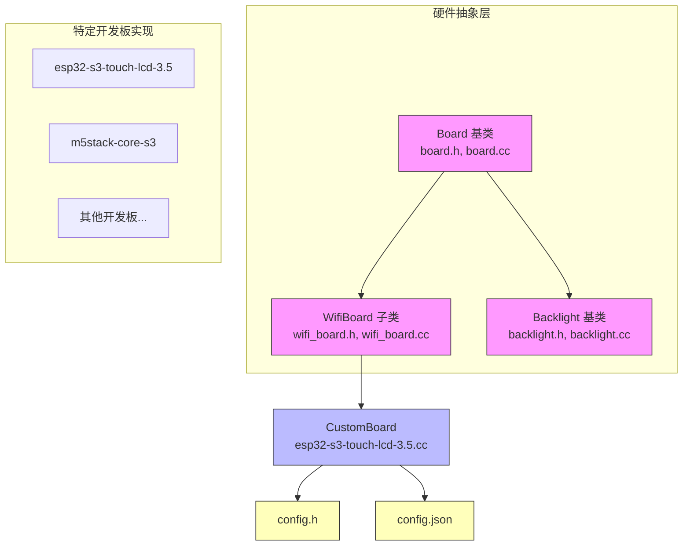
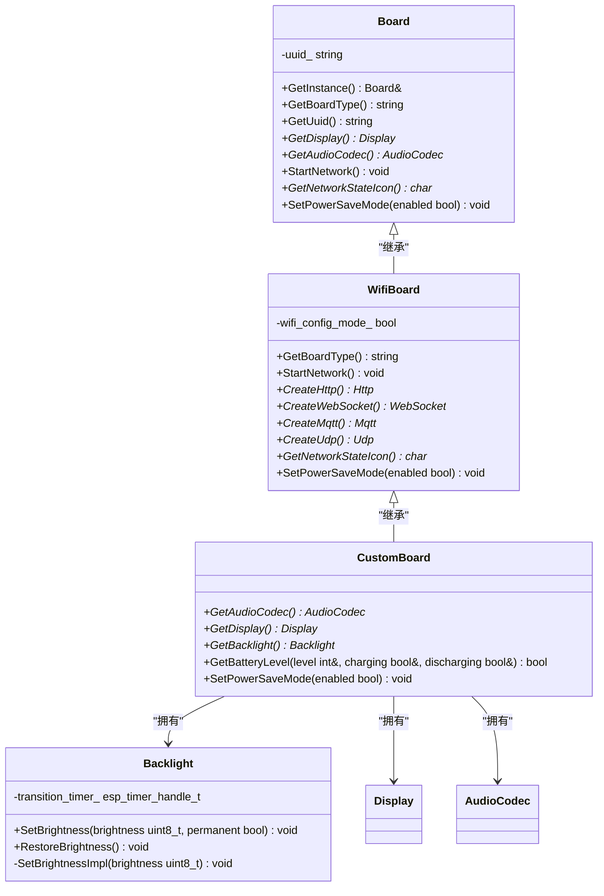
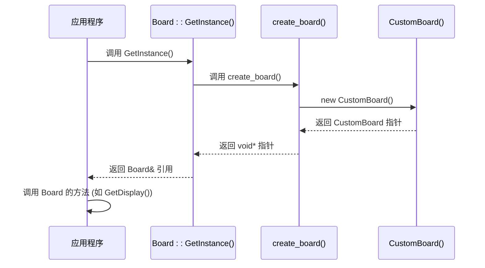
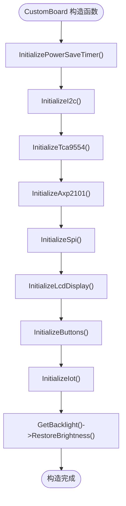
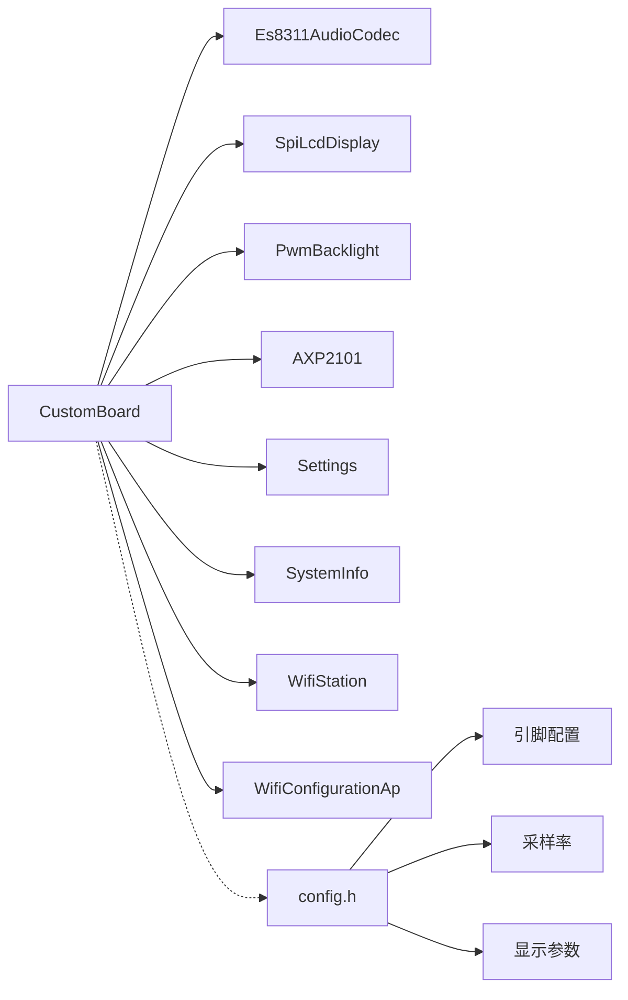

# 硬件抽象层

<cite>
**本文档引用的文件**   
- [board.h](file://main/boards/common/board.h)
- [board.cc](file://main/boards/common/board.cc)
- [wifi_board.h](file://main/boards/common/wifi_board.h)
- [wifi_board.cc](file://main/boards/common/wifi_board.cc)
- [backlight.h](file://main/boards/common/backlight.h)
- [backlight.cc](file://main/boards/common/backlight.cc)
- [esp32-s3-touch-lcd-3.5.cc](file://main/boards/esp32-s3-touch-lcd-3.5/esp32-s3-touch-lcd-3.5.cc)
- [config.h](file://main/boards/esp32-s3-touch-lcd-3.5/config.h)
- [config.json](file://main/boards/esp32-s3-touch-lcd-3.5/config.json)
- [abrobot-1.28tft-wifi.cc](file://main/boards/moon/abrobot-1.28tft-wifi.cc) - *在提交8c2116a7中更新*
- [moon/abrobot-1.28tft-wifi.cc](file://main/boards/moon/abrobot-1.28tft-wifi.cc) - *在提交9c7849cd中更新*
- [moon/abrobot-1.28tft-wifi.cc](file://main/boards/moon/abrobot-1.28tft-wifi.cc) - *在提交1f4ca6d5中更新*
</cite>

## 更新摘要
**已做更改**   
- 更新了“架构概述”和“详细组件分析”部分，以反映`WifiBoard`类中增强的WiFi连接超时处理和状态检查逻辑。
- 在“详细组件分析”中新增了关于MQTT服务在省电模式下安全管理的说明。
- 更新了“依赖分析”部分，以包含地理位置信息获取和缓存机制。
- 所有文件引用均已更新，以反映最近的代码变更。

## 目录
1. [引言](#引言)
2. [项目结构](#项目结构)
3. [核心组件](#核心组件)
4. [架构概述](#架构概述)
5. [详细组件分析](#详细组件分析)
6. [依赖分析](#依赖分析)
7. [性能考虑](#性能考虑)
8. [故障排除指南](#故障排除指南)
9. [结论](#结论)

## 引言
本文档旨在深入分析一个嵌入式系统的硬件抽象层（HAL），重点是`Board`类的设计与实现。该系统通过一个精心设计的继承和工厂模式，实现了对多种不同硬件开发板的统一管理和抽象。`Board`基类定义了一套标准接口，用于访问显示、音频、网络等核心外设。通过`DECLARE_BOARD`宏和`create_board`函数，系统能够在编译时或运行时动态创建特定于开发板的实例。文档将详细阐述其架构、核心类的功能、硬件配置机制，并以`esp32-s3-touch-lcd-3.5`开发板为例，展示这一抽象层的实际应用。

## 项目结构
项目采用基于功能和硬件平台的混合目录结构。核心的硬件抽象层代码位于`main/boards/common`目录下，其中`board.h`和`board.cc`定义了`Board`基类。针对不同硬件平台的特定实现则分散在`main/boards`下的各个子目录中，如`esp32-s3-touch-lcd-3.5`、`m5stack-core-s3`等。每个开发板目录都包含其专属的`config.h`和`config.json`配置文件，以及一个继承自`Board`或其子类的`.cc`实现文件。这种结构清晰地分离了通用逻辑与硬件特定代码，便于维护和扩展。

**图示来源**
- [board.h](file://main/boards/common/board.h)
- [wifi_board.h](file://main/boards/common/wifi_board.h)
- [backlight.h](file://main/boards/common/backlight.h)
- [esp32-s3-touch-lcd-3.5.cc](file://main/boards/esp32-s3-touch-lcd-3.5/esp32-s3-touch-lcd-3.5.cc)
- [config.h](file://main/boards/esp32-s3-touch-lcd-3.5/config.h)
- [config.json](file://main/boards/esp32-s3-touch-lcd-3.5/config.json)

**本节来源**
- [main/boards/common](file://main/boards/common)
- [main/boards](file://main/boards)

## 核心组件
硬件抽象层的核心是`Board`类，它作为一个单例，通过纯虚函数和工厂模式为上层应用提供统一的硬件访问接口。`WifiBoard`类作为`Board`的子类，为所有基于Wi-Fi的开发板提供了通用的网络功能实现。`Backlight`类则专门负责管理显示屏的背光亮度。这些组件共同构成了系统与底层硬件交互的基石。

**本节来源**
- [board.h](file://main/boards/common/board.h#L14-L48)
- [wifi_board.h](file://main/boards/common/wifi_board.h#L5-L23)
- [backlight.h](file://main/boards/common/backlight.h#L9-L26)

## 架构概述
系统的硬件抽象架构采用经典的继承和单例模式。`Board`是所有开发板的抽象基类，定义了`GetDisplay()`、`GetAudioCodec()`等必须实现的接口。`WifiBoard`继承自`Board`，并实现了Wi-Fi相关的网络功能，如`StartNetwork()`和`CreateHttp()`。特定的开发板（如`CustomBoard`）再继承`WifiBoard`，并根据其硬件特性提供最终的实现。`GetInstance()`方法利用`create_board()`工厂函数来创建具体的开发板实例，实现了运行时的多态性。

**图示来源**
- [board.h](file://main/boards/common/board.h#L14-L48)
- [wifi_board.h](file://main/boards/common/wifi_board.h#L5-L23)
- [esp32-s3-touch-lcd-3.5.cc](file://main/boards/esp32-s3-touch-lcd-3.5/esp32-s3-touch-lcd-3.5.cc#L150-L290)

**本节来源**
- [board.h](file://main/boards/common/board.h)
- [wifi_board.h](file://main/boards/common/wifi_board.h)

## 详细组件分析
本节将深入分析硬件抽象层中的关键组件，包括`Board`基类、`WifiBoard`子类、`Backlight`控制器以及一个具体的开发板实现`CustomBoard`。

### Board 基类分析
`Board`类是整个硬件抽象层的基石。它被设计为一个单例，通过`GetInstance()`静态方法访问。该方法调用`create_board()`函数，该函数由`DECLARE_BOARD`宏在具体开发板的实现文件中定义，从而实现了工厂模式。`Board`类禁用了拷贝构造和赋值操作，确保了单例的唯一性。它定义了一系列纯虚函数，强制所有子类必须提供具体实现，例如`GetBoardType()`和`GetAudioCodec()`。同时，它也提供了一些默认实现或可选重写的虚函数，如`GetDisplay()`返回一个`NoDisplay`实例，`GetBatteryLevel()`默认返回`false`。

**图示来源**
- [board.h](file://main/boards/common/board.h#L14-L48)
- [board.cc](file://main/boards/common/board.cc#L13-L33)

**本节来源**
- [board.h](file://main/boards/common/board.h#L14-L48)
- [board.cc](file://main/boards/common/board.cc#L13-L33)

### WifiBoard 子类分析
`WifiBoard`类继承自`Board`，为所有支持Wi-Fi的设备提供了通用的网络栈实现。它重写了`StartNetwork()`方法，该方法首先检查是否需要进入Wi-Fi配置模式（通过`wifi_config_mode_`标志）。如果需要，则调用`EnterWifiConfigMode()`启动一个Wi-Fi热点，等待用户通过网页或声波进行配网。如果不需要，则尝试连接已配置的Wi-Fi网络，若在60秒内连接失败，也会自动进入配置模式。**根据最近的代码变更，该超时逻辑已被优化，并增强了对WiFi连接状态的检查，以提升系统稳定性**。此外，`WifiBoard`还实现了`CreateHttp()`、`CreateWebSocket()`等方法，返回ESP-IDF提供的具体网络协议栈实例。

**本节来源**
- [wifi_board.h](file://main/boards/common/wifi_board.h#L5-L23)
- [wifi_board.cc](file://main/boards/common/wifi_board.cc#L30-L232)

### Backlight 背光控制器分析
`Backlight`类提供了一个抽象接口来控制显示屏的背光亮度。它通过`SetBrightness()`方法设置目标亮度，并启动一个渐变定时器，以平滑的方式从当前亮度过渡到目标亮度。具体的硬件操作（如PWM占空比设置）由子类通过实现`SetBrightnessImpl()`纯虚函数来完成。`RestoreBrightness()`方法用于恢复到之前的亮度设置。这种设计将亮度控制的逻辑与底层硬件驱动分离。

**本节来源**
- [backlight.h](file://main/boards/common/backlight.h#L9-L26)
- [backlight.cc](file://main/boards/common/backlight.cc#L9-L22)

### esp32-s3-touch-lcd-3.5 开发板实现分析
`esp32-s3-touch-lcd-3.5`开发板的实现通过`CustomBoard`类来完成。该类继承自`WifiBoard`，并重写了多个虚函数以适配其特定的硬件。

在构造函数中，`CustomBoard`依次初始化了电源管理芯片（AXP2101）、I2C总线、TCA9554 IO扩展器、SPI总线、LCD显示屏、按钮和物联网设备。其`GetAudioCodec()`方法返回一个`Es8311AudioCodec`实例，`GetDisplay()`返回一个`SpiLcdDisplay`实例，`GetBacklight()`返回一个`PwmBacklight`实例。特别地，`GetBatteryLevel()`方法通过`pmic_`对象查询AXP2101芯片来获取电池电量和充放电状态，并据此启用或禁用省电定时器。

**图示来源**
- [esp32-s3-touch-lcd-3.5.cc](file://main/boards/esp32-s3-touch-lcd-3.5/esp32-s3-touch-lcd-3.5.cc#L150-L290)

**本节来源**
- [esp32-s3-touch-lcd-3.5.cc](file://main/boards/esp32-s3-touch-lcd-3.5/esp32-s3-touch-lcd-3.5.cc#L150-L290)
- [config.h](file://main/boards/esp32-s3-touch-lcd-3.5/config.h)
- [config.json](file://main/boards/esp32-s3-touch-lcd-3.5/config.json)

## 依赖分析
`Board`基类依赖于`SystemInfo`和`Settings`等系统服务来获取设备信息和持久化存储UUID。`WifiBoard`依赖于`WifiStation`、`WifiConfigurationAp`等Wi-Fi管理组件。`CustomBoard`则直接依赖于`Es8311AudioCodec`、`SpiLcdDisplay`、`PwmBacklight`等具体的硬件驱动类，以及`Axp2101`电源管理芯片的驱动。`config.h`文件通过宏定义为这些驱动提供了具体的引脚和参数配置，是连接抽象层与物理硬件的关键。**值得注意的是，`moon`开发板的实现还引入了对地理位置信息获取和缓存的依赖，以支持时区转换功能**。

**图示来源**
- [esp32-s3-touch-lcd-3.5.cc](file://main/boards/esp32-s3-touch-lcd-3.5/esp32-s3-touch-lcd-3.5.cc)
- [config.h](file://main/boards/esp32-s3-touch-lcd-3.5/config.h)

**本节来源**
- [esp32-s3-touch-lcd-3.5.cc](file://main/boards/esp32-s3-touch-lcd-3.5/esp32-s3-touch-lcd-3.5.cc)
- [config.h](file://main/boards/esp32-s3-touch-lcd-3.5/config.h)

## 性能考虑
硬件抽象层的设计对性能有重要影响。单例模式确保了`Board`实例的唯一性，避免了重复创建的开销。工厂模式虽然引入了一层间接调用，但其发生在应用启动时，对运行时性能影响极小。背光的渐变控制通过定时器实现，避免了亮度突变对用户体验的影响，但会占用少量CPU资源。网络连接的超时设置（60秒）平衡了用户体验和资源消耗。使用`config.h`进行编译时配置，可以生成高度优化的代码，避免了运行时解析JSON配置文件的开销。**最近的优化还减少了音频等待时间并调整了任务堆栈大小，以进一步提升内存使用效率**。

## 故障排除指南
*   **设备无法启动或卡在启动画面**：检查`board.h`中的`GetInstance()`方法是否正确调用了`create_board()`。确保`DECLARE_BOARD`宏在开发板的`.cc`文件中被正确定义。
*   **Wi-Fi无法连接**：检查`config.h`中的GPIO引脚定义是否与硬件匹配。确认`WifiBoard::StartNetwork()`中的超时时间是否合理。查看日志中是否有`force_ap`被设置的记录。**增强的日志输出有助于调试WiFi连接问题**。
*   **显示屏无输出**：验证`InitializeSpi()`和`InitializeLcdDisplay()`中的SPI引脚（`MOSI`, `MISO`, `CLK`, `CS`, `DC`）配置是否正确。检查LCD初始化命令序列是否适用于所使用的屏幕型号。
*   **背光不工作**：确认`GetBacklight()`返回的`PwmBacklight`实例所使用的GPIO引脚（`DISPLAY_BACKLIGHT_PIN`）是正确的，并且该引脚支持PWM功能。
*   **UUID生成异常**：检查`Board`的构造函数中，`SystemInfo::GetClientId()`和`Settings`的读取逻辑是否正常工作。
*   **MQTT服务在省电模式下异常**：检查`WifiBoard`的`StartNetwork()`和`ResetWifiConfiguration()`方法，确保在进入和退出省电模式时，MQTT服务能够被安全地关闭和重新启动。

**本节来源**
- [board.cc](file://main/boards/common/board.cc#L13-L33)
- [wifi_board.cc](file://main/boards/common/wifi_board.cc#L30-L232)
- [esp32-s3-touch-lcd-3.5.cc](file://main/boards/esp32-s3-touch-lcd-3.5/esp32-s3-touch-lcd-3.5.cc#L150-L290)

## 结论
本文档详细分析了该嵌入式系统的硬件抽象层架构。通过`Board`基类、`DECLARE_BOARD`工厂宏和分层的继承结构，系统成功地将上层应用逻辑与底层硬件细节解耦。`config.h`和`config.json`文件提供了灵活的硬件配置机制。以`esp32-s3-touch-lcd-3.5`开发板为例，展示了如何通过继承和重写虚函数来实现特定硬件的支持。这种设计模式极大地提高了代码的可维护性、可扩展性和可移植性，使得为新硬件平台添加支持变得简单而高效。**最近的代码变更进一步增强了系统的稳定性，通过优化WiFi连接超时处理、增加地理位置信息支持以及改进省电模式下的MQTT服务管理，提升了整体的用户体验和可靠性**。