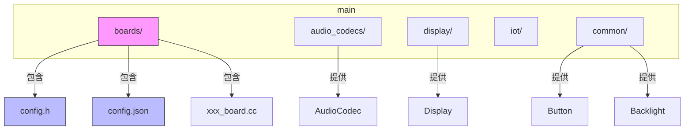
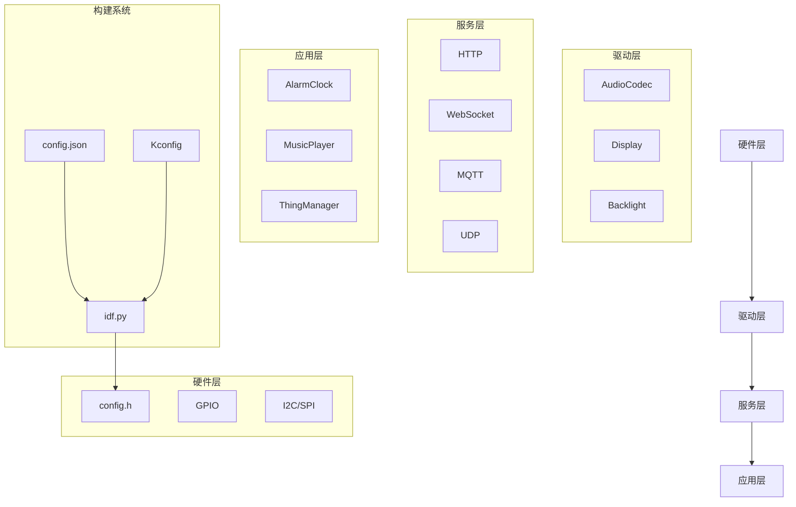
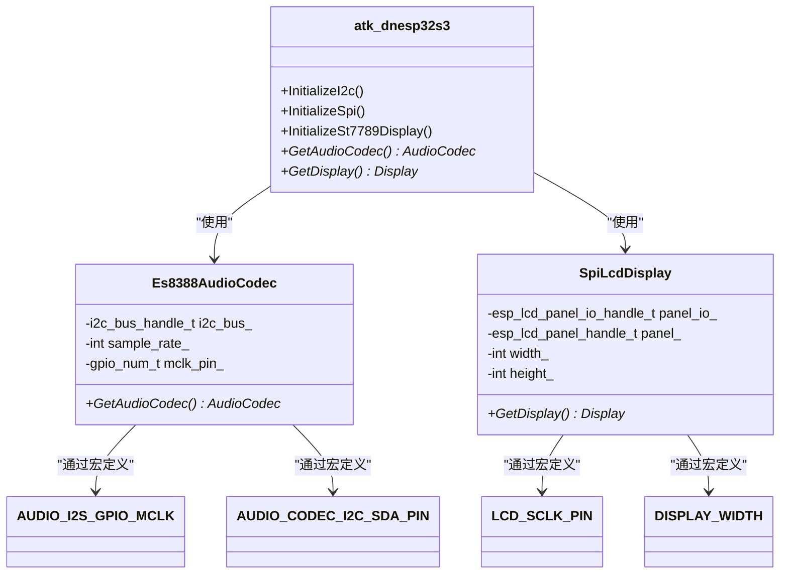
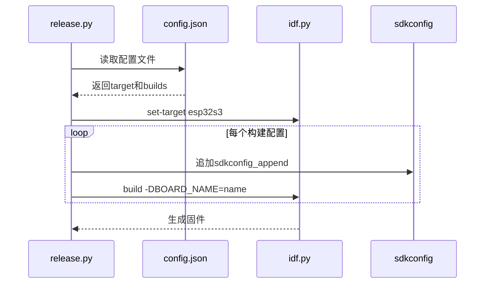
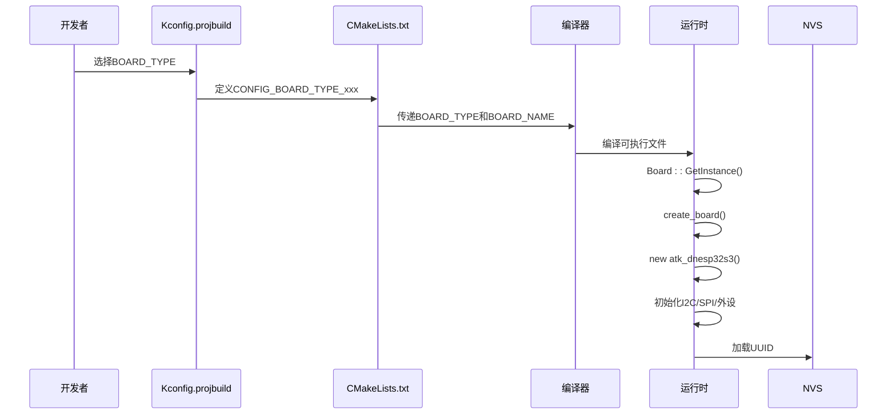
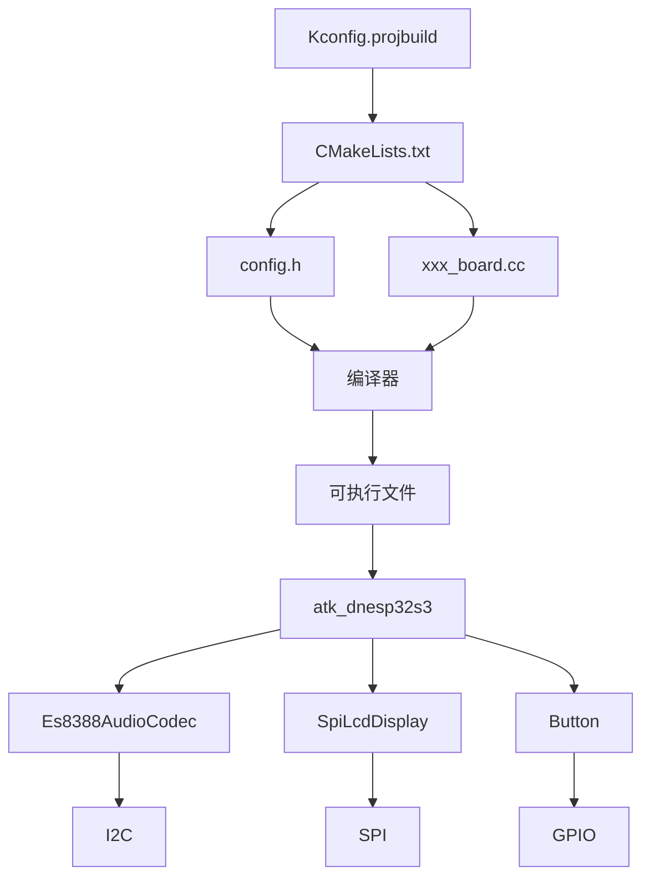

# 硬件配置系统

<cite>
**本文档引用的文件**   
- [config.h](file://main/boards/atk-dnesp32s3/config.h)
- [config.json](file://main/boards/atk-dnesp32s3/config.json)
- [board.h](file://main/boards/common/board.h)
- [board.cc](file://main/boards/common/board.cc)
- [atk_dnesp32s3.cc](file://main/boards/atk-dnesp32s3/atk_dnesp32s3.cc)
- [Kconfig.projbuild](file://main/Kconfig.projbuild)
- [CMakeLists.txt](file://main/CMakeLists.txt)
- [release.py](file://scripts/release.py)
</cite>

## 目录
1. [引言](#引言)
2. [项目结构](#项目结构)
3. [核心组件](#核心组件)
4. [架构概述](#架构概述)
5. [详细组件分析](#详细组件分析)
6. [依赖分析](#依赖分析)
7. [性能考虑](#性能考虑)
8. [故障排除指南](#故障排除指南)
9. [结论](#结论)

## 引言
本项目是一个基于ESP32系列芯片的智能硬件平台，其核心设计思想是通过分层配置机制实现硬件抽象与软件功能的解耦。系统采用`config.h`和`config.json`双配置文件体系，分别处理编译时和运行时的配置需求。这种设计使得同一套代码库能够灵活适配多种硬件开发板，同时保持配置的清晰性和可维护性。`config.h`头文件定义了硬件相关的编译时常量，如GPIO引脚号、外设地址等，而`config.json`则提供了构建系统所需的元数据，如目标芯片型号和构建配置。通过Kconfig和CMake的协同工作，系统实现了条件编译和动态配置加载，为开发者提供了强大的硬件抽象能力。

## 项目结构
项目采用功能模块化的目录结构，将不同类型的组件分离到独立的子目录中。`main`目录是项目的核心，其中`boards`子目录包含了所有支持的开发板配置，每个开发板都有独立的`config.h`和`config.json`文件。`common`目录存放跨平台的通用组件，如按钮、背光控制等。音频处理、显示驱动、物联网功能等核心模块也被组织成独立的子系统。这种结构使得添加新开发板变得非常简单：只需在`boards`目录下创建新的子目录，定义相应的配置文件和板级实现即可。构建系统通过`Kconfig.projbuild`中的`BOARD_TYPE`选项来选择目标开发板，确保了构建过程的灵活性和可配置性。

**图示来源**
- [main/boards/](file://main/boards/)

**本节来源**
- [main/boards/](file://main/boards/)

## 核心组件
系统的核心是板级抽象层（Board Abstraction Layer），它通过`Board`基类和`DECLARE_BOARD`宏实现了单例模式和工厂模式的结合。`Board`类定义了所有开发板必须实现的接口，如获取音频编解码器、显示设备、网络服务等。每个具体的开发板都继承自`Board`类，并在其实现文件中通过`DECLARE_BOARD`宏注册自身。系统启动时，`GetInstance()`方法会调用`create_board()`函数来创建具体板级实例。这种设计模式确保了系统中只有一个板级配置实例，既节省了内存，又保证了配置的一致性。`Board`类还负责生成设备的唯一标识符（UUID），该标识符优先使用NVS中存储的Client-Id，若不存在则生成新的UUID并持久化存储。

**本节来源**
- [board.h](file://main/boards/common/board.h#L1-L57)
- [board.cc](file://main/boards/common/board.cc#L1-L168)

## 架构概述
系统的整体架构遵循分层设计原则，从底层硬件到上层应用形成了清晰的依赖关系。最底层是硬件抽象层，由`config.h`中的宏定义和`Board`类的具体实现组成。中间层是各种设备驱动和功能模块，如音频编解码、显示控制、网络通信等。最上层是应用逻辑，如闹钟、音乐播放器等物联网设备。构建系统位于架构之外，负责将源代码和配置文件编译成最终的固件。`config.json`文件中的`target`字段决定了编译目标，而`builds`数组则定义了具体的构建配置。通过`idf.py`构建工具，系统能够根据选择的`BOARD_TYPE`自动包含相应的配置文件，并生成带有正确宏定义的可执行文件。

**图示来源**
- [config.h](file://main/boards/atk-dnesp32s3/config.h)
- [config.json](file://main/boards/atk-dnesp32s3/config.json)
- [board.h](file://main/boards/common/board.h)

## 详细组件分析

### config.h配置头文件分析
`config.h`文件是硬件配置的核心，它通过C/C++宏定义为编译器提供编译时常量。这些宏定义涵盖了系统所需的几乎所有硬件参数，包括音频子系统的I2S引脚配置（如`AUDIO_I2S_GPIO_MCLK`、`AUDIO_I2S_GPIO_WS`）、音频编解码芯片的I2C地址和引脚（如`AUDIO_CODEC_I2C_SDA_PIN`）、显示屏的SPI引脚和分辨率（如`LCD_SCLK_PIN`、`DISPLAY_WIDTH`）以及按钮和LED的GPIO引脚（如`BOOT_BUTTON_GPIO`）。这些宏定义在编译时被直接替换为具体的数值，因此不会占用运行时内存，且访问速度最快。更重要的是，它们为上层代码提供了统一的硬件接口，使得驱动程序可以独立于具体的硬件布局进行开发。

#### config.h使用示例

**图示来源**
- [config.h](file://main/boards/atk-dnesp32s3/config.h)
- [atk_dnesp32s3.cc](file://main/boards/atk-dnesp32s3/atk_dnesp32s3.cc)

**本节来源**
- [config.h](file://main/boards/atk-dnesp32s3/config.h)
- [atk_dnesp32s3.cc](file://main/boards/atk-dnesp32s3/atk_dnesp32s3.cc)

### config.json配置文件分析
`config.json`文件是构建系统的配置文件，它为`idf.py`构建工具提供元数据。该文件包含两个主要字段：`target`指定了目标芯片型号（如`esp32s3`），这决定了编译器和工具链的选择；`builds`数组定义了一个或多个具体的构建配置，每个配置包含`name`（构建名称）和可选的`sdkconfig_append`（SDK配置追加项）。在`scripts/release.py`脚本中，系统会读取`config.json`文件，根据`target`调用`idf.py set-target`命令设置构建目标，并将`sdkconfig_append`中的配置项追加到`sdkconfig`文件中。这种机制使得不同的开发板可以共享相同的代码库，同时拥有独立的构建配置。

#### config.json处理流程

**图示来源**
- [config.json](file://main/boards/atk-dnesp32s3/config.json)
- [release.py](file://scripts/release.py#L71-L107)

**本节来源**
- [config.json](file://main/boards/atk-dnesp32s3/config.json)
- [release.py](file://scripts/release.py)

### 板级配置加载流程
板级配置的加载是一个从构建系统到运行时的完整链条。首先，在开发阶段，开发者通过`Kconfig.projbuild`中的菜单选择`BOARD_TYPE`，这会在编译时定义相应的宏（如`CONFIG_BOARD_TYPE_ATK_DNESP32S3`）。然后，构建系统根据`CMakeLists.txt`中的逻辑，将`BOARD_TYPE`和`BOARD_NAME`作为编译宏传递给编译器。在运行时，`Board::GetInstance()`方法通过`create_board()`函数工厂创建具体的板级实例。该实例在构造函数中初始化所有硬件外设，如I2C总线、SPI总线、按钮、显示屏和音频编解码器。最后，`Board`基类的构造函数会尝试从NVS或Settings中加载设备的UUID，确保设备身份的持久化。

#### 配置加载序列图

**图示来源**
- [Kconfig.projbuild](file://main/Kconfig.projbuild)
- [CMakeLists.txt](file://main/CMakeLists.txt#L234-L256)
- [board.h](file://main/boards/common/board.h#L40-L48)
- [board.cc](file://main/boards/common/board.cc#L13-L33)

**本节来源**
- [Kconfig.projbuild](file://main/Kconfig.projbuild)
- [CMakeLists.txt](file://main/CMakeLists.txt)
- [board.h](file://main/boards/common/board.h)
- [board.cc](file://main/boards/common/board.cc)

## 依赖分析
系统的依赖关系清晰地分为编译时依赖和运行时依赖。编译时依赖主要由构建系统管理，`Kconfig.projbuild`文件定义了所有可用的`BOARD_TYPE`，`CMakeLists.txt`根据选择的类型包含相应的配置和源文件。`config.json`文件通过`scripts/release.py`脚本与构建系统集成，确保了构建配置的正确性。运行时依赖则体现在板级实现中，如`atk_dnesp32s3`类依赖于`Es8388AudioCodec`、`LcdDisplay`等具体驱动类。`Board`基类通过纯虚函数定义了接口契约，确保了所有派生类都实现了必要的功能。这种分层依赖管理使得系统具有良好的模块化和可扩展性，新增开发板只需实现相应的驱动和配置，无需修改核心框架。

**图示来源**
- [Kconfig.projbuild](file://main/Kconfig.projbuild)
- [CMakeLists.txt](file://main/CMakeLists.txt)
- [config.h](file://main/boards/atk-dnesp32s3/config.h)
- [atk_dnesp32s3.cc](file://main/boards/atk-dnesp32s3/atk_dnesp32s3.cc)

**本节来源**
- [Kconfig.projbuild](file://main/Kconfig.projbuild)
- [CMakeLists.txt](file://main/CMakeLists.txt)
- [config.h](file://main/boards/atk-dnesp32s3/config.h)
- [atk_dnesp32s3.cc](file://main/boards/atk-dnesp32s3/atk_dnesp32s3.cc)

## 性能考虑
系统的配置机制在性能方面进行了精心设计。`config.h`中的宏定义在编译时被求值，避免了运行时的查找开销，这对于频繁访问的硬件引脚配置至关重要。UUID的生成和存储采用了懒加载策略，只有在首次需要时才生成并持久化，减少了启动时的计算负担。`Board`类的单例模式确保了全局配置的唯一性，避免了重复创建和内存浪费。条件编译配置（如`CONFIG_USE_WECHAT_MESSAGE_STYLE`）使得不使用的功能模块完全不会被编译进固件，最大限度地节省了Flash和RAM空间。对于资源受限的嵌入式系统，这种静态配置和条件编译的组合是优化性能和资源使用的关键。

## 故障排除指南
配置系统常见的问题及解决方案：

1.  **编译错误：找不到config.h**
    - **原因**：未正确设置`BOARD_TYPE`，导致编译器无法找到对应的`config.h`。
    - **解决方案**：检查`Kconfig.projbuild`中的`BOARD_TYPE`选择，并确保`CMakeLists.txt`中包含了正确的路径。

2.  **运行时硬件初始化失败**
    - **原因**：`config.h`中的引脚定义与实际硬件不符。
    - **解决方案**：仔细核对开发板原理图，确认GPIO引脚号的正确性，并检查`atk_xxx.cc`文件中的初始化代码。

3.  **构建系统忽略config.json**
    - **原因**：`scripts/release.py`脚本未正确读取`config.json`文件。
    - **解决方案**：确认`config.json`文件路径正确，并检查`release.py`中`config_path`的构造逻辑。

4.  **设备UUID重复**
    - **原因**：NVS或Settings中的UUID被清除或损坏。
    - **解决方案**：检查`board.cc`中`GenerateUuid()`的实现，确保硬件随机数生成器正常工作，并验证持久化存储的可靠性。

5.  **显示屏显示异常**
    - **原因**：`config.h`中的显示屏参数（如分辨率、镜像设置）配置错误。
    - **解决方案**：根据显示屏型号核对`DISPLAY_WIDTH`、`DISPLAY_HEIGHT`、`DISPLAY_MIRROR_X/Y`等宏定义，并在`InitializeSt7789Display()`函数中验证初始化序列。

**本节来源**
- [board.h](file://main/boards/common/board.h)
- [board.cc](file://main/boards/common/board.cc)
- [config.h](file://main/boards/atk-dnesp32s3/config.h)
- [atk_dnesp32s3.cc](file://main/boards/atk-dnesp32s3/atk_dnesp32s3.cc)

## 结论
本硬件配置系统通过`config.h`和`config.json`的协同工作，以及Kconfig、CMake和C++宏的有机结合，实现了一个灵活、高效且易于维护的板级支持包（BSP）架构。`config.h`提供了编译时的硬件抽象，`config.json`服务于构建系统的自动化，而`Board`类则在运行时将这些配置整合成统一的接口。这种分层配置策略不仅简化了多硬件平台的适配工作，还为系统的可扩展性和可维护性奠定了坚实的基础。未来可以考虑将部分运行时可变的配置（如设备名称、网络设置）也纳入JSON配置文件，并通过文件系统动态加载，以进一步提升系统的灵活性。