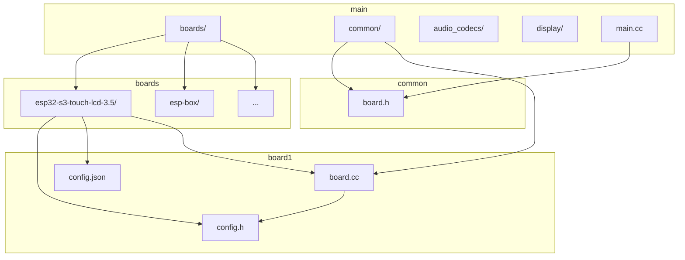
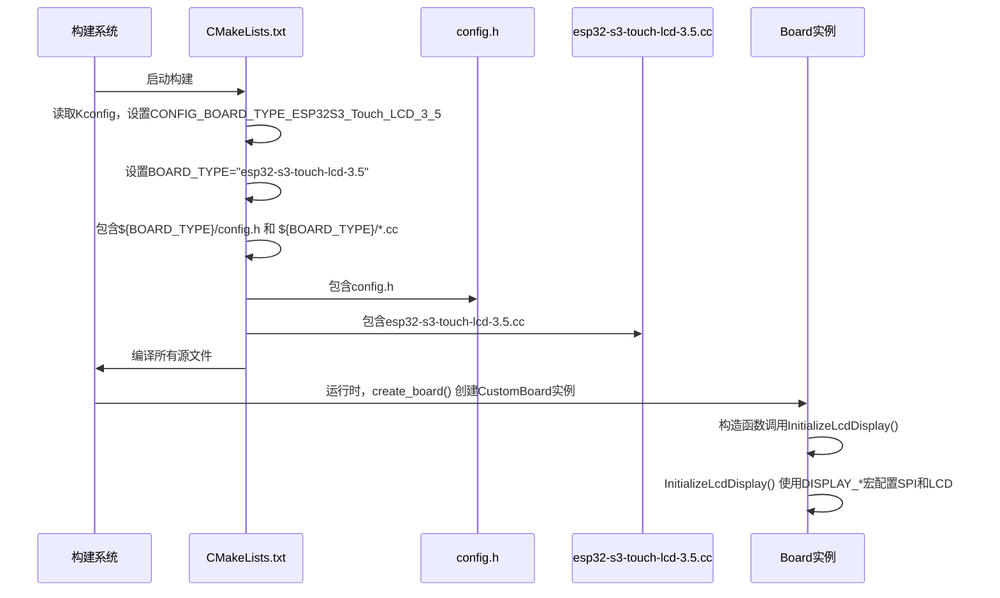
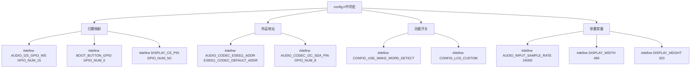
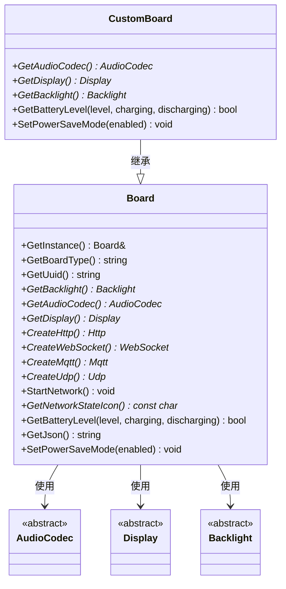
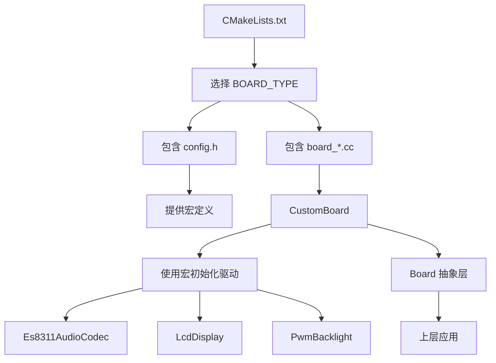

# 编译时配置

<cite>
**本文档中引用的文件**  
- [config.h](file://main/boards/esp32-s3-touch-lcd-3.5/config.h)
- [esp32-s3-touch-lcd-3.5.cc](file://main/boards/esp32-s3-touch-lcd-3.5/esp32-s3-touch-lcd-3.5.cc)
- [board.h](file://main/boards/common/board.h)
- [CMakeLists.txt](file://main/CMakeLists.txt)
- [config.json](file://main/boards/esp32-s3-touch-lcd-3.5/config.json)
</cite>

## 目录
1. [引言](#引言)
2. [项目结构](#项目结构)
3. [核心组件](#核心组件)
4. [架构概述](#架构概述)
5. [详细组件分析](#详细组件分析)
6. [依赖分析](#依赖分析)
7. [性能考虑](#性能考虑)
8. [故障排除指南](#故障排除指南)
9. [结论](#结论)

## 引言
本文档深入解析基于C/C++宏定义的编译时配置机制，重点说明`config.h`头文件如何通过`#define`定义引脚映射、外设地址、功能开关等编译时常量。阐述这些宏如何被Board抽象层和驱动代码引用，实现硬件无关的代码设计。结合`esp32-s3-touch-lcd-3.5`开发板展示典型配置项的定义方式，并解释如何通过CMake或Kconfig实现条件编译，例如启用/禁用特定外设驱动。提供常见配置错误（如引脚号冲突、宏未定义）的排查方法。

## 项目结构
项目采用模块化设计，`main/boards`目录下为不同开发板的专用配置和实现。每个开发板子目录包含`config.h`（硬件配置）、`config.json`（构建配置）和`.cc`文件（板级实现）。`main/boards/common`目录存放所有开发板共享的抽象层代码（如`board.h`）。主应用程序的源文件和资源位于`main`目录的其他子目录中。



**图示来源**
- [config.h](file://main/boards/esp32-s3-touch-lcd-3.5/config.h)
- [board.h](file://main/boards/common/board.h)
- [esp32-s3-touch-lcd-3.5.cc](file://main/boards/esp32-s3-touch-lcd-3.5/esp32-s3-touch-lcd-3.5.cc)

**本节来源**
- [main/boards](file://main/boards)

## 核心组件
核心组件是`config.h`头文件和`board.h`抽象层。`config.h`通过宏定义将硬件细节（如引脚号、外设地址）转换为编译时常量。`board.h`定义了`Board`抽象基类，其具体实现（如`CustomBoard`）通过`DECLARE_BOARD`宏在运行时被创建。驱动代码（如`GetAudioCodec()`）通过引用`config.h`中的宏来初始化硬件，实现了硬件无关的代码设计。

**本节来源**
- [config.h](file://main/boards/esp32-s3-touch-lcd-3.5/config.h)
- [board.h](file://main/boards/common/board.h)
- [esp32-s3-touch-lcd-3.5.cc](file://main/boards/esp32-s3-touch-lcd-3.5/esp32-s3-touch-lcd-3.5.cc)

## 架构概述
系统采用板级支持包（BSP）架构。编译时，通过CMake根据Kconfig选择的`CONFIG_BOARD_TYPE_*`变量确定`BOARD_TYPE`，并包含对应开发板的`config.h`和`.cc`文件。运行时，`create_board()`函数（由`DECLARE_BOARD`宏生成）创建特定板级的`Board`实例。该实例的成员函数（如`GetDisplay()`）使用`config.h`中的宏来配置和初始化具体的硬件外设。



**图示来源**
- [CMakeLists.txt](file://main/CMakeLists.txt)
- [config.h](file://main/boards/esp32-s3-touch-lcd-3.5/config.h)
- [esp32-s3-touch-lcd-3.5.cc](file://main/boards/esp32-s3-touch-lcd-3.5/esp32-s3-touch-lcd-3.5.cc)

## 详细组件分析
### config.h 配置文件分析
`config.h`是编译时配置的核心，它使用C/C++预处理器宏来定义所有硬件相关的常量。

#### 宏定义类型


**图示来源**
- [config.h](file://main/boards/esp32-s3-touch-lcd-3.5/config.h)

#### 典型配置项（以esp32-s3-touch-lcd-3.5为例）
- **音频配置**:
  - `AUDIO_INPUT_SAMPLE_RATE` / `AUDIO_OUTPUT_SAMPLE_RATE`: 定义I2S音频流的采样率。
  - `AUDIO_I2S_GPIO_*`: 定义I2S总线的MCLK, WS, BCLK, DIN, DOUT引脚。
  - `AUDIO_CODEC_I2C_*`: 定义与音频编解码器通信的I2C总线引脚。
  - `AUDIO_CODEC_ES8311_ADDR`: 定义ES8311编解码芯片的I2C地址。
- **显示配置**:
  - `DISPLAY_WIDTH` / `DISPLAY_HEIGHT`: 定义屏幕分辨率。
  - `DISPLAY_MIRROR_X` / `DISPLAY_SWAP_XY`: 定义屏幕坐标变换。
  - `DISPLAY_SPI_*` / `DISPLAY_DC_PIN` / `DISPLAY_RST_PIN`: 定义SPI通信和控制引脚。
  - `DISPLAY_BACKLIGHT_PIN`: 定义背光控制引脚。
- **按钮配置**:
  - `BOOT_BUTTON_GPIO`: 定义启动/复位按钮的GPIO引脚。

**本节来源**
- [config.h](file://main/boards/esp32-s3-touch-lcd-3.5/config.h)

### 板级抽象层 (Board Abstraction Layer)
`board.h`定义了`Board`抽象基类，为上层应用提供统一的硬件访问接口。

#### 类图


**图示来源**
- [board.h](file://main/boards/common/board.h)
- [esp32-s3-touch-lcd-3.5.cc](file://main/boards/esp32-s3-touch-lcd-3.5/esp32-s3-touch-lcd-3.5.cc)

#### 实现机制
`CustomBoard`类继承自`Board`，并重写其虚函数。在重写函数中，通过`#include "config.h"`引入宏定义，并使用这些宏来构造具体的硬件驱动对象。例如，`GetAudioCodec()`函数使用`AUDIO_I2S_GPIO_*`等宏来初始化`Es8311AudioCodec`对象。

```c++
// esp32-s3-touch-lcd-3.5.cc 片段
#include "config.h" // 引入宏定义

virtual AudioCodec* GetAudioCodec() override {
    static Es8311AudioCodec audio_codec(
        i2c_bus_, I2C_NUM_0,
        AUDIO_INPUT_SAMPLE_RATE, AUDIO_OUTPUT_SAMPLE_RATE, // 使用宏
        AUDIO_I2S_GPIO_MCLK, AUDIO_I2S_GPIO_BCLK, // 使用宏
        AUDIO_I2S_GPIO_WS, AUDIO_I2S_GPIO_DOUT, AUDIO_I2S_GPIO_DIN,
        AUDIO_CODEC_PA_PIN, AUDIO_CODEC_ES8311_ADDR // 使用宏
    );
    return &audio_codec;
}
```

**本节来源**
- [board.h](file://main/boards/common/board.h)
- [esp32-s3-touch-lcd-3.5.cc](file://main/boards/esp32-s3-touch-lcd-3.5/esp32-s3-touch-lcd-3.5.cc)

### 条件编译机制
项目通过Kconfig和CMakeLists.txt实现条件编译，以启用或禁用特定功能。

#### CMakeLists.txt 中的条件编译
`main/CMakeLists.txt`文件根据Kconfig生成的`CONFIG_*`宏来决定编译哪些源文件。

```cmake
# main/CMakeLists.txt 片段
if(CONFIG_USE_AUDIO_PROCESSOR)
    list(APPEND SOURCES "audio_processing/audio_processor.cc")
endif()
if(CONFIG_USE_WAKE_WORD_DETECT)
    list(APPEND SOURCES "audio_processing/wake_word_detect.cc")
endif()
if(CONFIG_IDF_TARGET_ESP32)
    # ESP32芯片不支持某些功能，移除相关文件
    list(REMOVE_ITEM SOURCES "audio_codecs/box_audio_codec.cc")
endif()
```
此机制允许在编译时根据目标芯片和功能需求，动态地包含或排除代码模块。

#### Kconfig 配置体系
虽然项目根目录下未找到主Kconfig文件，但`managed_components`目录下存在多个组件的Kconfig文件。这表明项目可能依赖于ESP-IDF的Kconfig系统。`config.json`文件中的`"sdkconfig_append"`字段也暗示了与Kconfig的集成，用于在构建时追加SDK配置。

**本节来源**
- [CMakeLists.txt](file://main/CMakeLists.txt)
- [config.json](file://main/boards/esp32-s3-touch-lcd-3.5/config.json)

## 依赖分析
系统的依赖关系清晰。`main`应用程序依赖于`Board`抽象层。`Board`的具体实现（如`CustomBoard`）依赖于`config.h`中的宏和具体的驱动实现（如`Es8311AudioCodec`）。`config.h`本身不依赖其他文件，它只是定义常量。CMake构建系统是最高层的依赖管理器，它根据Kconfig的选择来解析和链接所有依赖。



**图示来源**
- [CMakeLists.txt](file://main/CMakeLists.txt)
- [config.h](file://main/boards/esp32-s3-touch-lcd-3.5/config.h)
- [esp32-s3-touch-lcd-3.5.cc](file://main/boards/esp32-s3-touch-lcd-3.5/esp32-s3-touch-lcd-3.5.cc)

**本节来源**
- [CMakeLists.txt](file://main/CMakeLists.txt)

## 性能考虑
编译时配置机制对运行时性能无任何影响，因为所有宏在编译阶段就被替换为常量。这避免了运行时查找和分支判断的开销。使用`static`关键字在`GetAudioCodec()`等函数中创建单例对象，确保了硬件驱动的唯一性和高效访问。通过条件编译排除未使用的代码，可以有效减小最终固件的体积。

## 故障排除指南
### 常见配置错误
1.  **引脚号冲突**: 不同外设配置了同一个GPIO引脚。例如，将`DISPLAY_MOSI_PIN`和`AUDIO_I2S_GPIO_DIN`都设置为`GPIO_NUM_1`。这会导致硬件冲突。
    *   **排查方法**: 检查`config.h`中所有`GPIO_*`宏的定义，确保没有重复的引脚号。参考开发板原理图进行核对。
2.  **宏未定义**: 在代码中引用了`config.h`中未定义的宏。
    *   **排查方法**: 确保`#include "config.h"`在使用宏之前被正确包含。检查宏的拼写是否正确。
3.  **条件编译失效**: 期望的功能未被编译进去。
    *   **排查方法**: 检查`CMakeLists.txt`中的`if(CONFIG_...)`条件是否与Kconfig中的设置匹配。确认`sdkconfig`文件中相应的`CONFIG_*`宏已被正确设置。
4.  **BOARD_TYPE 选择错误**: CMake选择了错误的开发板配置。
    *   **排查方法**: 检查`CMakeLists.txt`中`if(CONFIG_BOARD_TYPE_*)`的逻辑，确保与构建时传递的配置一致。检查`config.json`中的`"name"`字段。

**本节来源**
- [config.h](file://main/boards/esp32-s3-touch-lcd-3.5/config.h)
- [CMakeLists.txt](file://main/CMakeLists.txt)

## 结论
该项目通过`config.h`宏定义、`board.h`抽象层和CMake条件编译三者结合，构建了一个高效、灵活且可维护的编译时配置系统。`config.h`将硬件细节与业务逻辑分离，`board.h`提供了统一的硬件访问接口，而CMake则实现了构建时的模块化选择。这种设计模式使得项目能够轻松支持多种硬件平台，同时保持核心代码的简洁和可移植性。