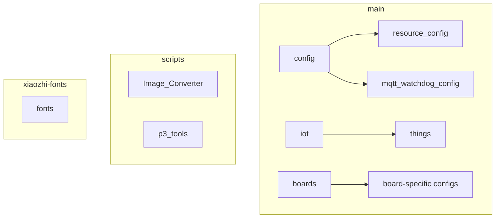
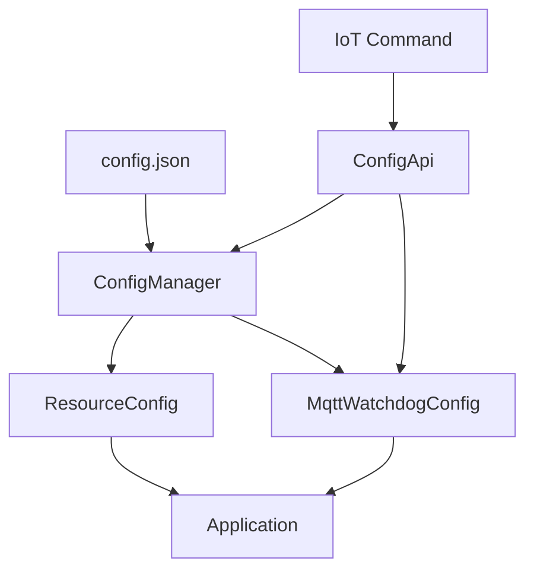
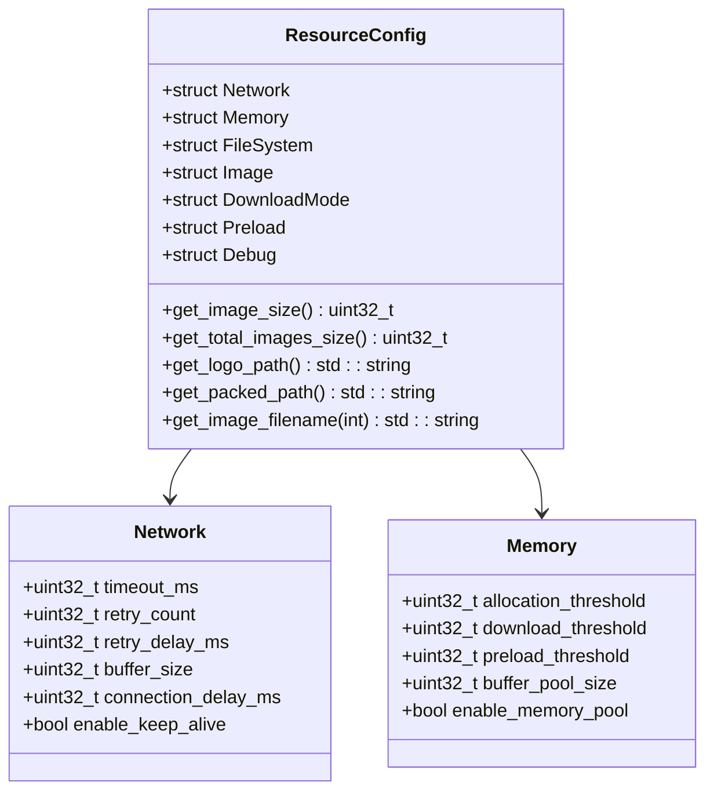
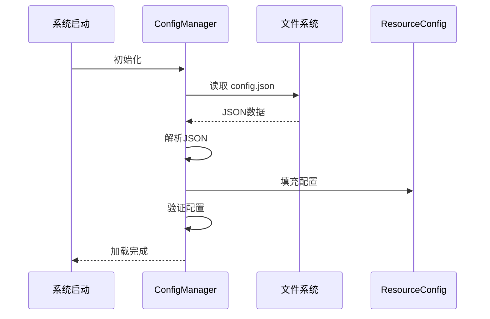
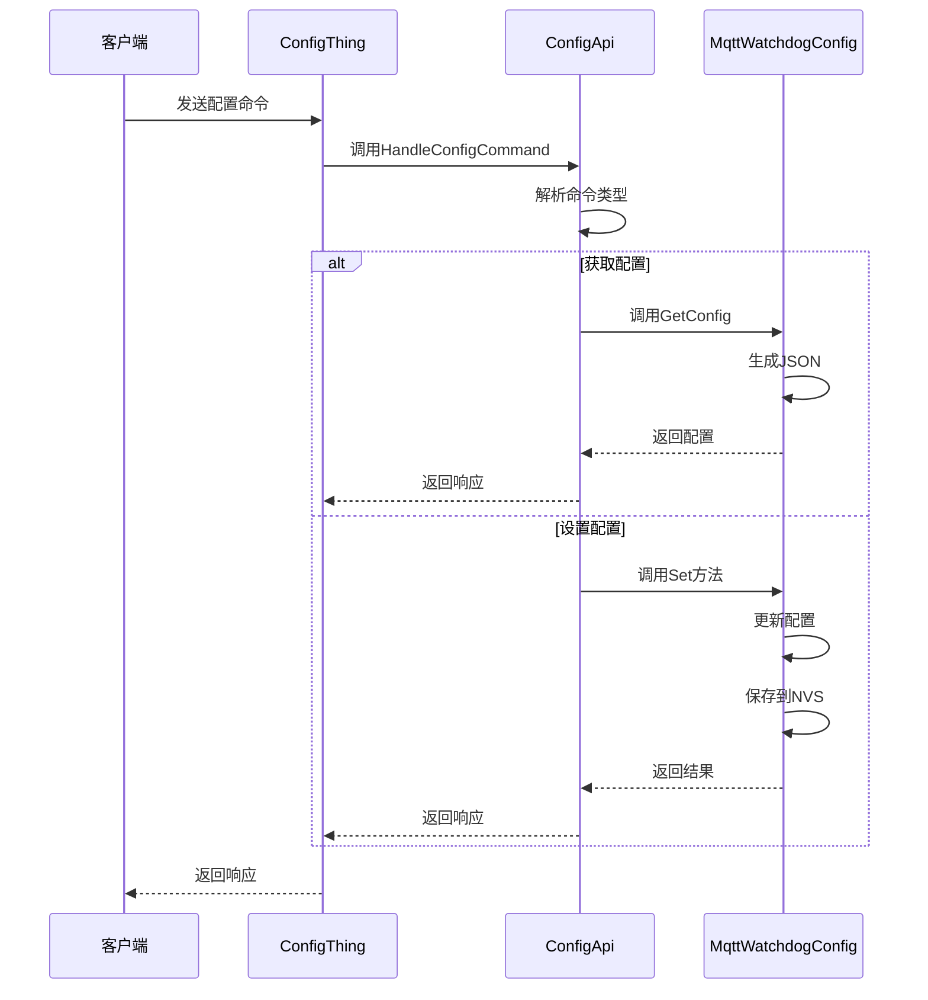
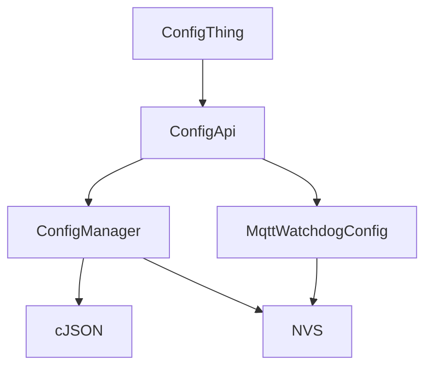

# 运行时配置

<cite>
**本文档引用的文件**  
- [resource_config.h](file://main/config/resource_config.h#L10-L271)
- [resource_config.cc](file://main/config/resource_config.cc#L44-L91)
- [config_api.h](file://main/config/config_api.h#L0-L173)
- [config_api.cc](file://main/config/config_api.cc#L0-L199)
- [mqtt_watchdog_config.h](file://main/config/mqtt_watchdog_config.h#L0-L239)
- [mqtt_watchdog_config.cc](file://main/config/mqtt_watchdog_config.cc#L0-L199)
- [config_thing.cc](file://main/iot/things/config_thing.cc#L0-L199)
</cite>

## 目录
1. [引言](#引言)
2. [项目结构](#项目结构)
3. [核心组件](#核心组件)
4. [架构概述](#架构概述)
5. [详细组件分析](#详细组件分析)
6. [依赖分析](#依赖分析)
7. [性能考虑](#性能考虑)
8. [故障排除指南](#故障排除指南)
9. [结论](#结论)

## 引言
本文档详细说明了基于JSON文件的运行时配置系统，涵盖`config.json`文件的结构设计、字段含义及加载流程。系统通过解析JSON配置文件动态设置设备名称、网络参数和功能开关等。配置系统结合编译时宏定义，确保配置一致性。文档还提供了配置文件语法规范、验证机制、错误处理策略，以及配置更新与热重载的实践建议。

## 项目结构
项目结构清晰，主要分为`main`、`scripts`和`xiaozhi-fonts`三个目录。`main`目录包含核心功能模块，如`boards`（板级支持）、`config`（配置管理）、`iot`（物联网功能）等。`scripts`目录包含工具脚本，`xiaozhi-fonts`目录包含字体资源。配置系统主要位于`main/config`目录下。

**图示来源**  
- [main/config/resource_config.h](file://main/config/resource_config.h#L10-L271)
- [main/iot/things/config_thing.cc](file://main/iot/things/config_thing.cc#L0-L199)

## 核心组件
运行时配置系统的核心组件包括`ResourceConfig`结构体、`ConfigManager`类、`ConfigApi`类和`MqttWatchdogConfig`类。这些组件共同实现了配置的加载、解析、验证、持久化和远程管理功能。

**组件来源**  
- [resource_config.h](file://main/config/resource_config.h#L10-L271)
- [config_api.h](file://main/config/config_api.h#L0-L173)
- [mqtt_watchdog_config.h](file://main/config/mqtt_watchdog_config.h#L0-L239)

## 架构概述
配置系统采用分层架构，包括配置文件层、解析层、管理层和应用层。`config.json`文件存储配置数据，`ConfigManager`负责解析和验证，`ConfigApi`提供外部接口，`MqttWatchdogConfig`处理MQTT和看门狗配置。

**图示来源**  
- [config_api.cc](file://main/config/config_api.cc#L0-L199)
- [resource_config.cc](file://main/config/resource_config.cc#L44-L91)

## 详细组件分析

### ResourceConfig 结构体分析
`ResourceConfig`结构体定义了资源配置的完整数据模型，包含网络、内存、文件系统、图片处理等多个子配置。

**图示来源**  
- [resource_config.h](file://main/config/resource_config.h#L10-L271)

### 配置加载流程分析
系统启动时，`ConfigManager`从文件系统加载`config.json`，解析JSON数据并填充`ResourceConfig`结构体。

**图示来源**  
- [resource_config.cc](file://main/config/resource_config.cc#L44-L91)

### 远程配置管理分析
通过IoT命令，系统支持远程获取、设置和重置配置，实现动态配置管理。

**图示来源**  
- [config_api.cc](file://main/config/config_api.cc#L0-L199)
- [config_thing.cc](file://main/iot/things/config_thing.cc#L0-L199)

## 依赖分析
配置系统依赖于cJSON库进行JSON解析，NVS（非易失性存储）进行配置持久化，以及IoT框架进行远程管理。各组件之间通过清晰的接口进行交互，降低了耦合度。

**图示来源**  
- [config_api.h](file://main/config/config_api.h#L0-L173)
- [mqtt_watchdog_config.h](file://main/config/mqtt_watchdog_config.h#L0-L239)

## 性能考虑
配置系统在设计时考虑了性能因素。使用内存池减少内存分配开销，合理设置缓冲区大小以平衡内存使用和下载效率。配置验证在加载时进行，避免运行时重复验证。

## 故障排除指南
常见配置问题包括JSON语法错误、字段值超出范围、文件系统挂载失败等。系统提供详细的日志输出，帮助定位问题。建议使用`ExportConfig`导出当前配置进行比对。

**组件来源**  
- [resource_config.cc](file://main/config/resource_config.cc#L120-L153)
- [mqtt_watchdog_config.cc](file://main/config/mqtt_watchdog_config.cc#L0-L199)

## 结论
本文档全面分析了基于JSON的运行时配置系统，涵盖了配置结构、加载流程、远程管理等多个方面。系统设计合理，功能完整，为设备的动态配置提供了可靠支持。