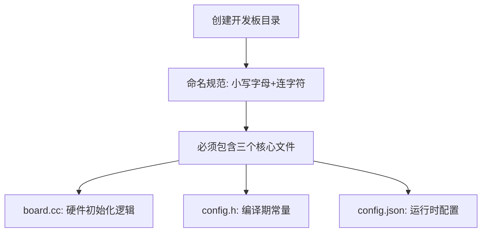
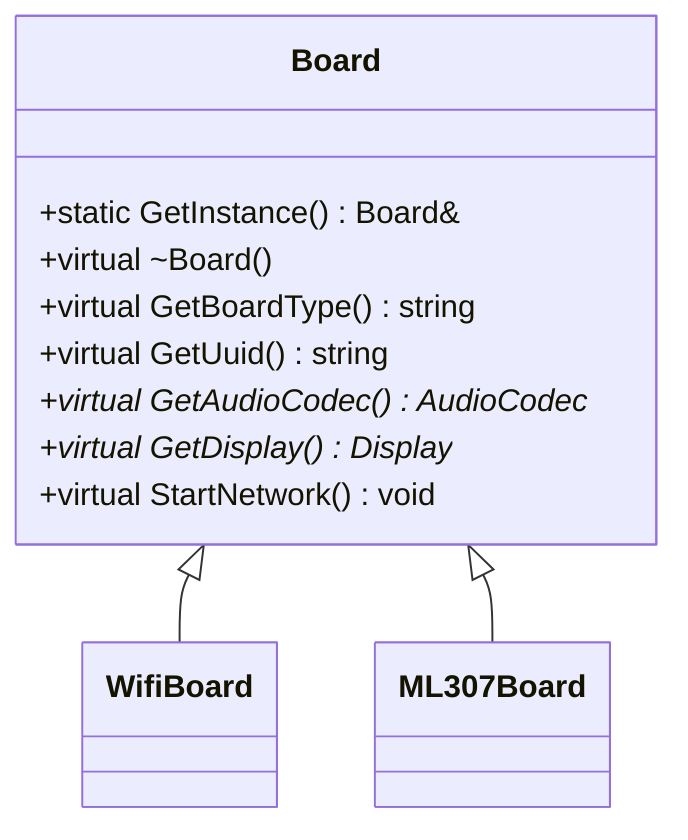
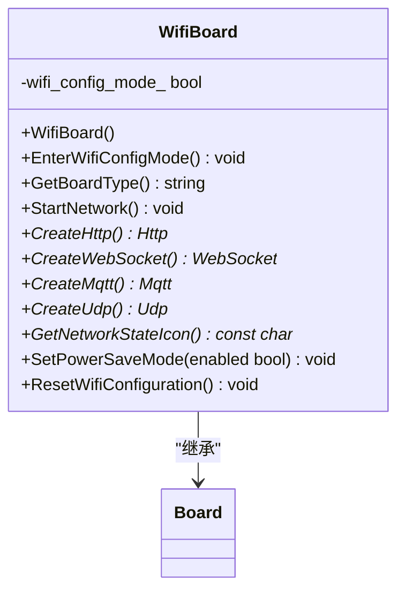
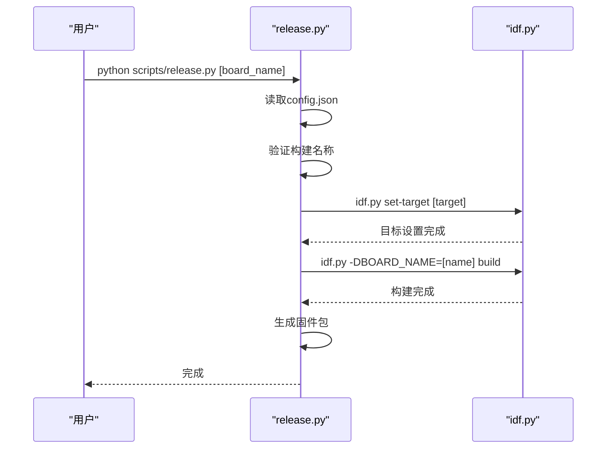

# 创建开发板目录

<cite>
**本文档中引用的文件**   
- [main/boards/README.md](file://main/boards/README.md)
- [main/boards/esp32-s3-touch-lcd-1.85/config.h](file://main/boards/esp32-s3-touch-lcd-1.85/config.h)
- [main/boards/esp32-s3-touch-lcd-1.85/config.json](file://main/boards/esp32-s3-touch-lcd-1.85/config.json)
- [main/boards/esp32-s3-touch-lcd-1.85/esp32-s3-touch-lcd-1.85.cc](file://main/boards/esp32-s3-touch-lcd-1.85/esp32-s3-touch-lcd-1.85.cc)
- [main/boards/common/board.h](file://main/boards/common/board.h)
- [main/boards/common/wifi_board.h](file://main/boards/common/wifi_board.h)
- [main/CMakeLists.txt](file://main/CMakeLists.txt)
- [scripts/release.py](file://scripts/release.py)
</cite>

## 目录

1. [创建开发板目录](#创建开发板目录)
2. [开发板目录结构](#开发板目录结构)
3. [开发板配置文件](#开发板配置文件)
4. [开发板初始化代码](#开发板初始化代码)
5. [基类与接口](#基类与接口)
6. [编译与构建系统](#编译与构建系统)

## 开发板目录结构

在 `main/boards` 目录下创建新的开发板专属文件夹时，必须遵循小写字母加连字符的命名规范（如 `new-board-name`）。这种命名方式确保了文件路径的兼容性和一致性。项目中已存在多个遵循此规范的开发板目录，例如 `esp32-s3-touch-lcd-1.85` 和 `bread-compact-esp32`。

每个开发板目录必须包含三个核心文件：`board.cc`、`config.h` 和 `config.json`。这些文件共同定义了开发板的硬件初始化逻辑、编译期常量和运行时配置参数。



**图示来源**
- [main/boards/README.md](file://main/boards/README.md#L0-L28)

**本节来源**
- [main/boards/README.md](file://main/boards/README.md#L0-L28)

## 开发板配置文件

### config.h

`config.h` 文件用于定义开发板的硬件配置，包括音频采样率、I2S引脚配置、I2C引脚配置、按钮和LED引脚配置以及显示屏参数等编译期常量。该文件使用标准的C预处理器宏定义来声明这些配置项。

以 `esp32-s3-touch-lcd-1.85` 开发板为例，其 `config.h` 文件定义了以下关键配置：

- **音频配置**：定义了输入和输出采样率
- **GPIO引脚配置**：为启动按钮、电源按钮、I2C总线和显示屏分配了具体的GPIO引脚
- **显示屏配置**：设置了分辨率（360x360）、镜像和坐标交换等显示参数
- **QSPI LCD配置**：为QSPI接口的LCD定义了时钟、数据线和控制引脚

```c
// 示例：esp32-s3-touch-lcd-1.85/config.h 中的部分定义
#define AUDIO_INPUT_SAMPLE_RATE  16000
#define AUDIO_OUTPUT_SAMPLE_RATE 24000
#define BOOT_BUTTON_GPIO        GPIO_NUM_0
#define DISPLAY_WIDTH           360
#define DISPLAY_HEIGHT          360
#define QSPI_PIN_NUM_LCD_PCLK   GPIO_NUM_40
```

**本节来源**
- [main/boards/esp32-s3-touch-lcd-1.85/config.h](file://main/boards/esp32-s3-touch-lcd-1.85/config.h#L0-L70)

### config.json

`config.json` 文件存储开发板的运行时配置参数，主要用于编译系统识别目标芯片和构建选项。该文件采用JSON格式，包含两个主要字段：

- **target**：指定目标芯片型号，如 `esp32s3`
- **builds**：构建配置数组，每个构建项包含：
  - **name**：开发板名称，必须与目录名一致
  - **sdkconfig_append**：额外的SDK配置选项

```json
{
    "target": "esp32s3",
    "builds": [
        {
            "name": "esp32-s3-touch-lcd-1.85",
            "sdkconfig_append": []
        }
    ]
}
```

**本节来源**
- [main/boards/esp32-s3-touch-lcd-1.85/config.json](file://main/boards/esp32-s3-touch-lcd-1.85/config.json#L0-L9)

## 开发板初始化代码

`board.cc` 文件是开发板的核心实现文件，负责硬件初始化逻辑。开发者需要创建一个继承自 `WifiBoard` 或 `ML307Board` 的类，并实现必要的初始化函数和虚函数重写。

以 `esp32-s3-touch-lcd-1.85.cc` 为例，其主要结构包括：

1. **头文件包含**：引入必要的组件头文件
2. **类定义**：继承自 `WifiBoard`
3. **初始化函数**：实现I2C、SPI、显示屏等硬件组件的初始化
4. **虚函数重写**：实现 `GetAudioCodec()`、`GetDisplay()` 等接口
5. **板级实例注册**：使用 `DECLARE_BOARD` 宏注册开发板实例

```cpp
class Esp32S3TouchLcd185Board : public WifiBoard {
private:
    // 成员变量声明
    i2c_master_bus_handle_t codec_i2c_bus_;
    Button boot_button_;
    LcdDisplay* display_;

    // 初始化函数
    void InitializeI2c();
    void InitializeSpi();
    void InitializeDisplay();
    void InitializeButtons();

public:
    // 虚函数重写
    virtual AudioCodec* GetAudioCodec() override;
    virtual Display* GetDisplay() override;
    virtual void StartNetwork() override;
};

// 注册开发板实例
DECLARE_BOARD(Esp32S3TouchLcd185Board)
```

**本节来源**
- [main/boards/esp32-s3-touch-lcd-1.85/esp32-s3-touch-lcd-1.85.cc](file://main/boards/esp32-s3-touch-lcd-1.85/esp32-s3-touch-lcd-1.85.cc#L0-L200)

## 基类与接口

### Board 基类

`Board` 是所有开发板的基类，定义了通用接口和功能。它是一个抽象基类，包含纯虚函数和虚函数，确保所有派生类实现必要的功能。

关键成员包括：
- **GetInstance()**：单例模式获取板级实例
- **GetBoardType()**：获取开发板类型
- **GetUuid()**：获取设备唯一标识
- **GetAudioCodec()**：获取音频编解码器实例
- **GetDisplay()**：获取显示设备实例
- **StartNetwork()**：启动网络连接



**图示来源**
- [main/boards/common/board.h](file://main/boards/common/board.h#L0-L57)

**本节来源**
- [main/boards/common/board.h](file://main/boards/common/board.h#L0-L57)

### WifiBoard 基类

`WifiBoard` 继承自 `Board`，为支持WiFi功能的开发板提供特定实现。它处理WiFi配置模式、网络状态图标和电源管理等功能。



**图示来源**
- [main/boards/common/wifi_board.h](file://main/boards/common/wifi_board.h#L0-L27)

**本节来源**
- [main/boards/common/wifi_board.h](file://main/boards/common/wifi_board.h#L0-L27)

## 编译与构建系统

### 开发板注册机制

系统使用 `DECLARE_BOARD` 宏来注册开发板实例。该宏定义了一个全局的 `create_board()` 函数，返回新创建的开发板实例。这是实现开发板单例模式的关键机制。

```c
#define DECLARE_BOARD(BOARD_CLASS_NAME) \
void* create_board() { \
    return new BOARD_CLASS_NAME(); \
}
```

当 `Board::GetInstance()` 被调用时，它会通过 `create_board()` 工厂函数创建具体的开发板实例。

### 构建脚本

`scripts/release.py` 脚本负责编译和打包固件。它读取 `config.json` 文件中的配置，并根据开发板类型执行构建过程。

关键逻辑包括：
- 验证构建名称必须以开发板类型开头
- 设置目标芯片型号
- 追加SDK配置选项
- 使用 `idf.py` 执行构建命令
- 生成版本化的固件包



**图示来源**
- [scripts/release.py](file://scripts/release.py#L71-L134)
- [main/CMakeLists.txt](file://main/CMakeLists.txt#L129-L159)

**本节来源**
- [scripts/release.py](file://scripts/release.py#L71-L134)
- [main/CMakeLists.txt](file://main/CMakeLists.txt#L129-L159)