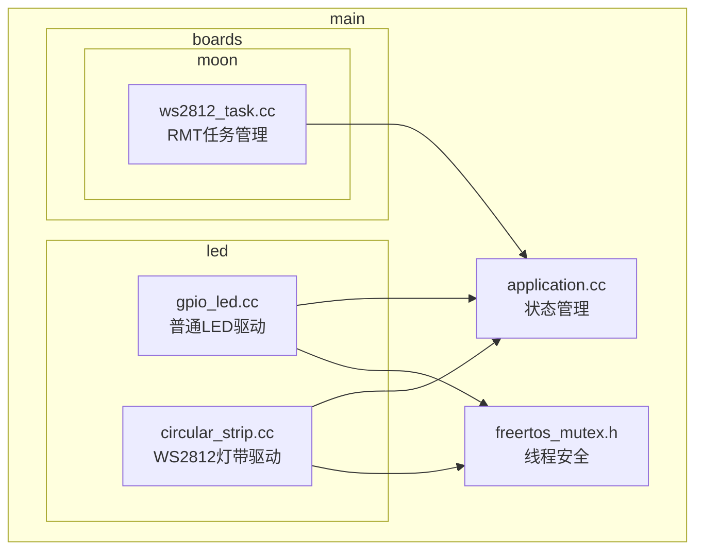
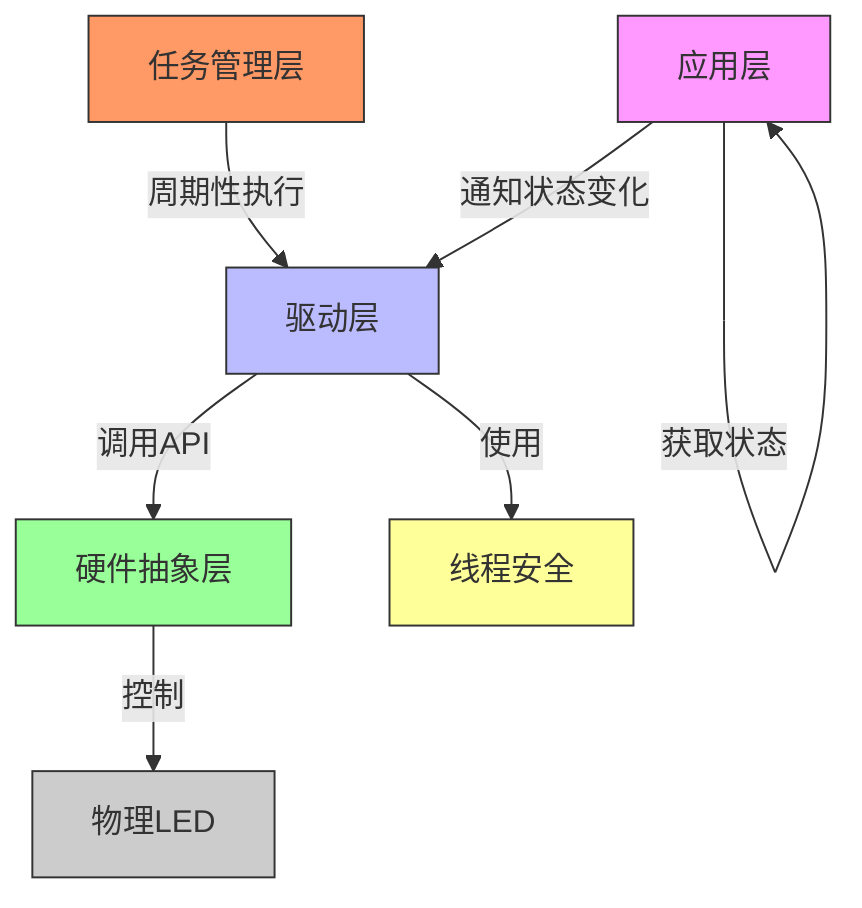
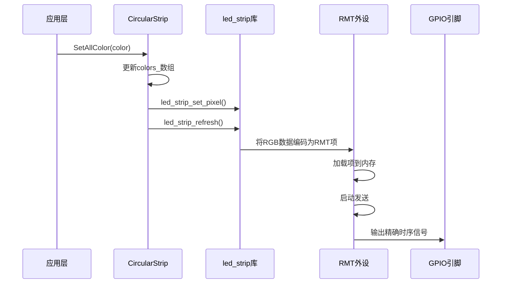
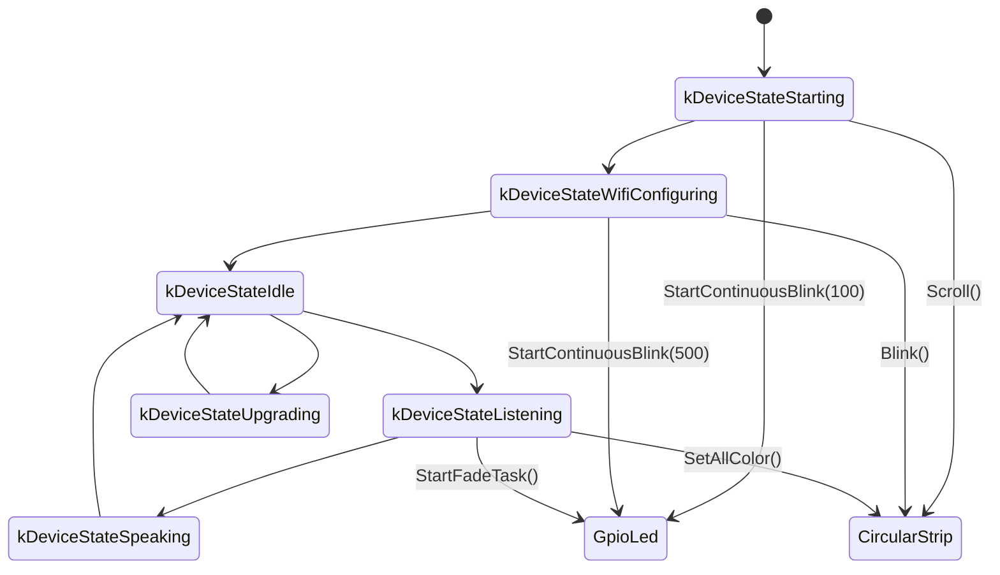
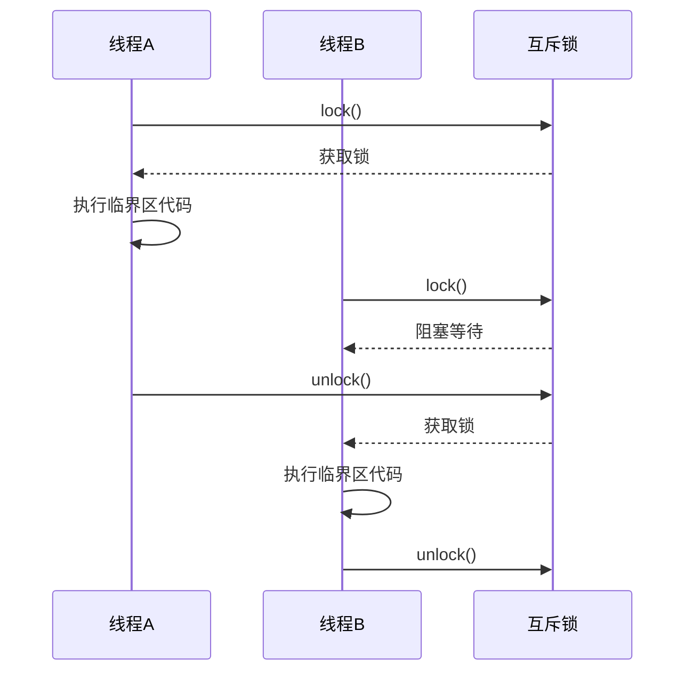
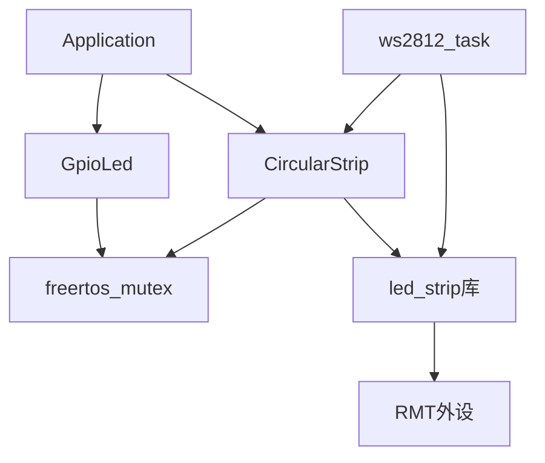

# 实现LED驱动

<cite>
**本文档中引用的文件**  
- [gpio_led.cc](file://main/led/gpio_led.cc)
- [gpio_led.h](file://main/led/gpio_led.h)
- [circular_strip.cc](file://main/led/circular_strip.cc)
- [circular_strip.h](file://main/led/circular_strip.h)
- [ws2812_task.cc](file://main/boards/moon/ws2812_task.cc)
- [ws2812_task.h](file://main/boards/moon/ws2812_task.h)
- [freertos_mutex.h](file://main/memory/freertos_mutex.h)
</cite>

## 目录
1. [引言](#引言)
2. [项目结构](#项目结构)
3. [核心组件](#核心组件)
4. [架构概述](#架构概述)
5. [详细组件分析](#详细组件分析)
6. [依赖分析](#依赖分析)
7. [性能考虑](#性能考虑)
8. [故障排除指南](#故障排除指南)
9. [结论](#结论)

## 引言
本文档详细介绍了在ESP32平台上实现普通LED与WS2812可编程灯带驱动的技术差异。重点分析了两种LED控制方式的底层机制：一种是基于GPIO高低电平和PWM调光的传统控制方法，另一种是利用RMT外设精确生成WS2812协议时序的高级控制方法。文档还阐述了如何通过FreeRTOS任务管理灯效更新频率，确保主循环不被阻塞，并说明了LED驱动如何与UI系统联动以响应语音交互状态变化。此外，文档强调了使用`freertos_mutex.h`实现线程安全访问的重要性，并提供了针对LED不亮、颜色错乱、灯带闪烁等常见问题的调试指南。

## 项目结构
项目采用模块化设计，将不同功能的代码组织在独立的目录中。LED驱动相关代码主要分布在`main/led`和`main/boards/moon`目录下。`main/led`目录包含通用的LED驱动实现，如`gpio_led.cc`用于普通LED控制，`circular_strip.cc`用于WS2812灯带控制。`main/boards/moon`目录则包含特定于“moon”开发板的WS2812任务实现`ws2812_task.cc`。这种结构提高了代码的可维护性和可复用性。



**图示来源**
- [gpio_led.cc](file://main/led/gpio_led.cc)
- [circular_strip.cc](file://main/led/circular_strip.cc)
- [ws2812_task.cc](file://main/boards/moon/ws2812_task.cc)
- [freertos_mutex.h](file://main/memory/freertos_mutex.h)

**本节来源**
- [main/led/gpio_led.cc](file://main/led/gpio_led.cc)
- [main/led/circular_strip.cc](file://main/led/circular_strip.cc)
- [main/boards/moon/ws2812_task.cc](file://main/boards/moon/ws2812_task.cc)

## 核心组件
本项目的核心组件包括普通LED驱动`GpioLed`、可编程灯带驱动`CircularStrip`以及基于RMT外设的WS2812任务`ws2812_task`。`GpioLed`类利用ESP32的LEDC（LED PWM控制器）外设实现精确的PWM调光和呼吸灯效果。`CircularStrip`类则使用ESP-IDF提供的`led_strip`库，通过RMT（远程控制）外设生成符合WS2812时序要求的信号。`ws2812_task`是一个独立的FreeRTOS任务，负责周期性地更新灯带状态，避免阻塞主循环。这些组件通过`Application`单例获取设备状态，并在`OnStateChanged`方法中响应状态变化，实现与UI系统的联动。

**本节来源**
- [gpio_led.cc](file://main/led/gpio_led.cc#L1-L247)
- [circular_strip.cc](file://main/led/circular_strip.cc#L1-L232)
- [ws2812_task.cc](file://main/boards/moon/ws2812_task.cc#L1-L1509)

## 架构概述
系统架构分为硬件抽象层、驱动层、任务管理层和应用层。硬件抽象层由ESP-IDF提供，包括GPIO、LEDC和RMT等外设驱动。驱动层封装了对这些外设的直接操作，向上提供简洁的API。`GpioLed`和`CircularStrip`类属于这一层。任务管理层负责调度和执行周期性任务，`ws2812_task`在此层运行。应用层通过`Application`类管理全局状态，并通知驱动层进行相应的LED状态更新。整个架构通过`freertos_mutex.h`提供的互斥锁保证多线程环境下的数据安全。



**图示来源**
- [gpio_led.cc](file://main/led/gpio_led.cc)
- [circular_strip.cc](file://main/led/circular_strip.cc)
- [ws2812_task.cc](file://main/boards/moon/ws2812_task.cc)
- [freertos_mutex.h](file://main/memory/freertos_mutex.h)

## 详细组件分析

### 普通LED驱动分析
`GpioLed`类实现了对单个普通LED的控制。它使用ESP32的LEDC外设来生成PWM信号，从而实现亮度调节。在构造函数中，首先配置LEDC定时器，设置分辨率为13位（0-8191），频率为4000Hz。然后配置LEDC通道，将其与指定的GPIO引脚关联。`SetBrightness`方法将0-100的百分比亮度转换为LEDC的占空比值。`TurnOn`和`TurnOff`方法通过`ledc_set_duty`和`ledc_update_duty`函数直接设置占空比。为了实现呼吸灯效果，代码注册了一个`FadeCallback`回调函数，当LEDC的渐变（fade）过程结束时，该函数会被调用，从而启动下一个渐变过程，形成连续的呼吸效果。

```mermaid
classDiagram
class GpioLed {
+GpioLed(gpio_num_t gpio)
+~GpioLed()
+TurnOn()
+TurnOff()
+SetBrightness(uint8_t brightness)
+Blink(int times, int interval_ms)
+StartFadeTask()
+OnStateChanged()
-StartBlinkTask(int times, int interval_ms)
-OnBlinkTimer()
-OnFadeEnd()
-static FadeCallback()
-mutex_ std : : mutex
-ledc_channel_ ledc_channel_config_t
-ledc_initialized_ bool
-duty_ uint32_t
-blink_timer_ esp_timer_handle_t
-fade_up_ bool
}
GpioLed --> "uses" ledc_channel_config_t : 配置LEDC通道
GpioLed --> "uses" esp_timer_handle_t : 定时器控制闪烁
callback(FadeCallback) .> GpioLed : 回调触发
callback(FadeCallback) : ledc_cb_param_t *param, void *user_arg
```

**图示来源**
- [gpio_led.cc](file://main/led/gpio_led.cc#L1-L247)
- [gpio_led.h](file://main/led/gpio_led.h#L1-L46)

**本节来源**
- [gpio_led.cc](file://main/led/gpio_led.cc#L1-L247)
- [gpio_led.h](file://main/led/gpio_led.h#L1-L46)

### WS2812可编程灯带驱动分析
`CircularStrip`类用于控制WS2812可编程灯带。与普通LED不同，WS2812需要精确的时序信号来传输RGB数据。该类使用ESP-IDF的`led_strip`库，该库底层利用RMT外设来生成符合WS2812协议的波形。在构造函数中，`led_strip_new_rmt_device`函数被调用，它接受`led_strip_config_t`和`led_strip_rmt_config_t`两个配置结构体。RMT的分辨率被设置为10MHz，这足以精确生成WS2812要求的50μs周期信号。`SetAllColor`和`SetSingleColor`方法用于设置灯珠颜色，`led_strip_set_pixel`和`led_strip_refresh`函数负责将颜色数据写入RMT内存并触发传输。为了实现动态灯效，代码使用`esp_timer`创建了一个周期性定时器`strip_timer_`，通过`StartStripTask`方法启动，该定时器会周期性地调用用户提供的回调函数来更新灯带状态。

```mermaid
classDiagram
class CircularStrip {
+CircularStrip(gpio_num_t gpio, uint8_t max_leds)
+~CircularStrip()
+SetAllColor(StripColor color)
+SetSingleColor(uint8_t index, StripColor color)
+Blink(StripColor color, int interval_ms)
+Breathe(StripColor low, StripColor high, int interval_ms)
+Scroll(StripColor low, StripColor high, int length, int interval_ms)
+SetBrightness(uint8_t default_brightness, uint8_t low_brightness)
+OnStateChanged()
-StartStripTask(int interval_ms, std : : function<void()> cb)
-mutex_ std : : mutex
-led_strip_ led_strip_handle_t
-max_leds_ int
-colors_ std : : vector<StripColor>
-strip_timer_ esp_timer_handle_t
-strip_callback_ std : : function<void()>
}
class StripColor {
+uint8_t red
+uint8_t green
+uint8_t blue
}
CircularStrip --> "has" StripColor : 颜色数组
CircularStrip --> "uses" led_strip_handle_t : RMT设备句柄
CircularStrip --> "uses" esp_timer_handle_t : 定时器控制灯效
```

**图示来源**
- [circular_strip.cc](file://main/led/circular_strip.cc#L1-L232)
- [circular_strip.h](file://main/led/circular_strip.h#L1-L50)

**本节来源**
- [circular_strip.cc](file://main/led/circular_strip.cc#L1-L232)
- [circular_strip.h](file://main/led/circular_strip.h#L1-L50)

### 基于RMT外设的WS2812协议时序生成机制
WS2812协议要求一个50μs的周期来传输一个比特。`1`比特由一个0.8μs的高电平和0.45μs的低电平组成，`0`比特由一个0.4μs的高电平和0.85μs的低电平组成。`led_strip`库通过RMT外设精确地生成这些波形。RMT外设可以将一个比特的波形编码为一个或多个“项”（item），每个项定义了电平和持续时间。通过将RMT的分辨率设置为10MHz（每个计数100ns），可以精确地表示0.4μs（4个计数）、0.8μs（8个计数）等时间。当调用`led_strip_refresh`时，`led_strip`库会将RGB数据转换为一系列RMT项，并将其加载到RMT通道的内存中，然后启动RMT发送，从而在GPIO引脚上输出符合协议的信号。



**图示来源**
- [circular_strip.cc](file://main/led/circular_strip.cc#L1-L232)
- [ws2812_task.cc](file://main/boards/moon/ws2812_task.cc#L1-L1509)

**本节来源**
- [circular_strip.cc](file://main/led/circular_strip.cc#L1-L232)
- [ws2812_task.cc](file://main/boards/moon/ws2812_task.cc#L1-L1509)

### FreeRTOS任务管理灯效更新
为了确保灯效动画的流畅执行而不阻塞主循环，系统使用了FreeRTOS任务。`ws2812_task.cc`中的`ws2812_task`函数是一个独立的任务，它在一个无限循环中根据当前模式（`current_mode`）调用不同的动画函数，如`run_rainbow_animation`或`run_color_chase_animation`。每个动画函数内部会计算当前帧的颜色，并调用`led_strip_set_pixel`和`led_strip_refresh`来更新灯带。任务通过`vTaskDelay(pdMS_TO_TICKS(10))`进行短暂延时，防止CPU占用过高。这种方式将耗时的灯效计算和更新操作从主循环中剥离，保证了系统的响应性。

```mermaid
flowchart TD
A[ws2812_task任务启动] --> B{检查current_mode}
B --> |WS2812_MODE_RAINBOW| C[执行run_rainbow_animation]
B --> |WS2812_MODE_COLOR_CHASE| D[执行run_color_chase_animation]
B --> |其他模式| E[执行相应动画]
C --> F[计算彩虹颜色]
D --> G[计算追逐颜色]
E --> H[计算相应颜色]
F --> I[调用led_strip_set_pixel]
G --> I
H --> I
I --> J[调用led_strip_refresh]
J --> K[vTaskDelay(10ms)]
K --> B
```

**图示来源**
- [ws2812_task.cc](file://main/boards/moon/ws2812_task.cc#L1-L1509)

**本节来源**
- [ws2812_task.cc](file://main/boards/moon/ws2812_task.cc#L1-L1509)

### LED驱动与UI系统联动
LED驱动通过`OnStateChanged`方法与UI系统联动。该方法在`Application`单例的状态发生变化时被调用。`Application`类维护一个`device_state`变量，表示设备的当前状态，如`kDeviceStateStarting`（启动中）、`kDeviceStateListening`（收听中）等。在`OnStateChanged`的`switch`语句中，根据不同的状态执行相应的LED操作。例如，当设备处于`kDeviceStateStarting`状态时，`GpioLed`会以100ms的间隔持续闪烁，而`CircularStrip`则会执行一个滚动动画。这种设计将LED的视觉反馈与设备的逻辑状态紧密耦合，为用户提供直观的交互体验。



**图示来源**
- [gpio_led.cc](file://main/led/gpio_led.cc#L201-L246)
- [circular_strip.cc](file://main/led/circular_strip.cc#L153-L194)

**本节来源**
- [gpio_led.cc](file://main/led/gpio_led.cc#L201-L246)
- [circular_strip.cc](file://main/led/circular_strip.cc#L153-L194)

### 线程安全访问机制
由于LED驱动可能被多个任务或中断服务程序访问（例如，主循环调用`TurnOn`，而定时器任务在执行`OnBlinkTimer`），因此必须保证线程安全。本项目通过`freertos_mutex.h`中的`FreeRTOSMutex`类来实现。`FreeRTOSMutex`是一个对FreeRTOS互斥信号量的C++封装，它提供了`lock()`和`unlock()`方法。在`GpioLed`和`CircularStrip`的每个公共方法中，都使用了`std::lock_guard<std::mutex>`（在`freertos_mutex.h`中定义为`lock_guard<FreeRTOSMutex>`）来自动管理锁的获取和释放。当一个线程进入临界区时，它会获取互斥锁，阻止其他线程进入，直到它退出临界区并释放锁。这确保了对共享资源（如`duty_`、`colors_`数组、`led_strip_`句柄）的访问是原子的，防止了数据竞争。



**图示来源**
- [freertos_mutex.h](file://main/memory/freertos_mutex.h#L1-L113)
- [gpio_led.cc](file://main/led/gpio_led.cc#L122-L167)
- [circular_strip.cc](file://main/led/circular_strip.cc#L37-L79)

**本节来源**
- [freertos_mutex.h](file://main/memory/freertos_mutex.h#L1-L113)
- [gpio_led.cc](file://main/led/gpio_led.cc#L122-L167)
- [circular_strip.cc](file://main/led/circular_strip.cc#L37-L79)

## 依赖分析
系统的主要依赖关系如下：`GpioLed`和`CircularStrip`类都依赖于`Application`类来获取设备状态，这形成了从驱动层到应用层的依赖。它们都依赖于`freertos_mutex.h`来保证线程安全。`CircularStrip`类依赖于ESP-IDF的`led_strip`库，该库又依赖于RMT外设。`ws2812_task`任务依赖于`led_strip`库和`CircularStrip`类的状态。整个系统没有循环依赖，依赖关系清晰，符合分层架构的设计原则。



**图示来源**
- [application.cc](file://main/application.cc)
- [gpio_led.cc](file://main/led/gpio_led.cc)
- [circular_strip.cc](file://main/led/circular_strip.cc)
- [freertos_mutex.h](file://main/memory/freertos_mutex.h)
- [ws2812_task.cc](file://main/boards/moon/ws2812_task.cc)

**本节来源**
- [application.cc](file://main/application.cc)
- [gpio_led.cc](file://main/led/gpio_led.cc)
- [circular_strip.cc](file://main/led/circular_strip.cc)
- [freertos_mutex.h](file://main/memory/freertos_mutex.h)
- [ws2812_task.cc](file://main/boards/moon/ws2812_task.cc)

## 性能考虑
在性能方面，普通LED的PWM控制由硬件外设（LEDC）完成，对CPU的占用极低。而WS2812灯带的控制则相对耗时，因为每次刷新都需要通过RMT外设发送大量数据（每个灯珠24比特）。`ws2812_task`任务中的`vTaskDelay(10)`确保了CPU不会被完全占用。使用`esp_timer`而非`vTaskDelay`来实现灯效动画（如`CircularStrip`中的`strip_timer_`）可以避免创建额外的任务，节省内存和调度开销。线程安全机制使用FreeRTOS原生的互斥信号量，具有较低的开销和良好的实时性。总体而言，系统在保证功能完整性的前提下，对性能和资源进行了合理的权衡。

## 故障排除指南
### LED不亮
- **电源问题**：检查电源是否能提供足够的电流。WS2812灯带在全亮时功耗较大，需确保电源容量充足。
- **接线错误**：确认GPIO引脚连接正确，VCC和GND没有接反。
- **代码配置**：检查`led_strip_config_t`中的`strip_gpio_num`是否与硬件连接的引脚一致。

### 颜色错乱
- **像素格式错误**：WS2812通常使用GRB格式，而非RGB。检查`led_strip_config_t`中的`led_pixel_format`是否设置为`LED_PIXEL_FORMAT_GRB`。
- **时序问题**：确保RMT分辨率设置正确（10MHz）。过低的分辨率会导致时序偏差，从而引起颜色错误。

### 灯带闪烁
- **信号完整性差**：长距离传输时，信号容易受到干扰。建议在数据线靠近控制器端加一个300-500欧姆的串联电阻，并在灯带的VCC和GND之间加一个1000μF的电容。
- **RMT通道冲突**：检查是否其他外设占用了同一个RMT通道。确保每个RMT通道只被一个设备使用。
- **电源波动**：当多个灯珠同时变亮时，瞬时电流需求大，可能导致电压下降。使用独立的、大容量的电源为灯带供电。

**本节来源**
- [circular_strip.cc](file://main/led/circular_strip.cc)
- [ws2812_task.cc](file://main/boards/moon/ws2812_task.cc)

## 结论
本文档深入分析了ESP32平台上普通LED与WS2812可编程灯带的驱动实现。普通LED通过LEDC外设实现高效的PWM调光，而WS2812灯带则利用RMT外设精确生成复杂的时序信号。系统通过FreeRTOS任务和定时器有效管理灯效更新，避免阻塞主循环。LED驱动与`Application`状态机紧密集成，实现了动态的视觉反馈。通过`freertos_mutex.h`提供的互斥锁，确保了多线程环境下的数据安全。该设计在功能、性能和可维护性之间取得了良好的平衡，为嵌入式LED控制提供了一个可靠的解决方案。