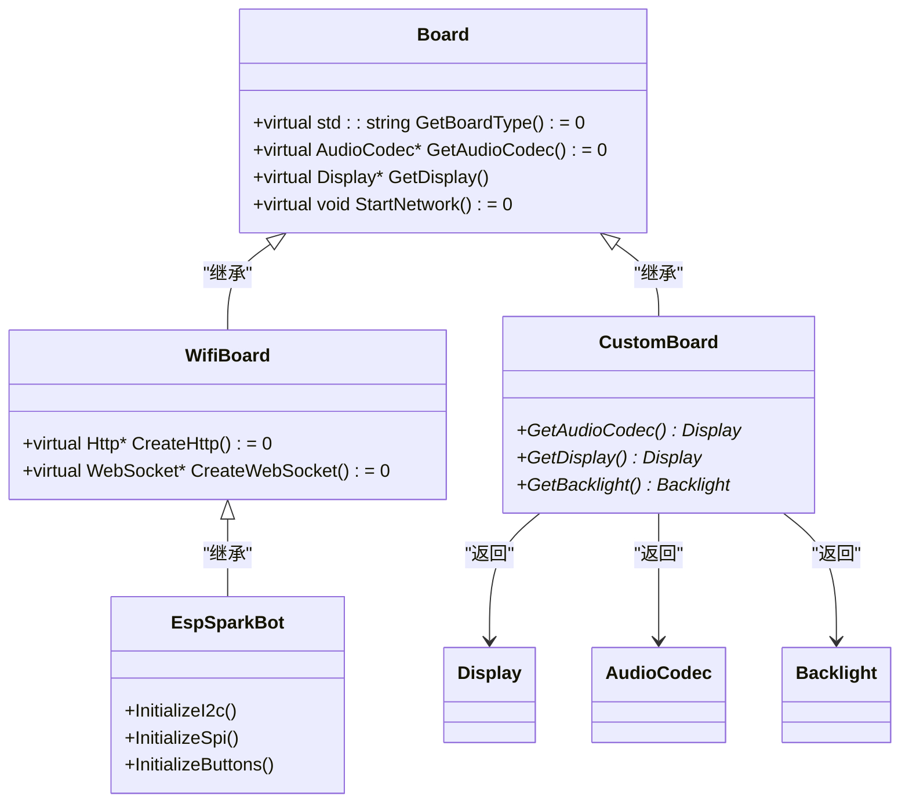

# 实现外设驱动

<cite>
**本文档引用的文件**  
- [main/boards/common/board.h](file://main/boards/common/board.h#L1-L57)
- [main/display/display.h](file://main/display/display.h#L0-L112)
- [main/audio_codecs/audio_codec.h](file://main/audio_codecs/audio_codec.h#L0-L58)
- [main/boards/common/button.cc](file://main/boards/common/button.cc#L44-L110)
- [main/boards/common/knob.cc](file://main/boards/common/knob.cc#L0-L51)
- [main/led/circular_strip.cc](file://main/led/circular_strip.cc#L0-L41)
- [main/led/circular_strip.h](file://main/led/circular_strip.h#L0-L50)
- [main/boards/kevin-yuying-313lcd/esp_lcd_gc9503.c](file://main/boards/kevin-yuying-313lcd/esp_lcd_gc9503.c)
- [main/boards/lilygo-t-circle-s3/esp_lcd_gc9d01n.c](file://main/boards/lilygo-t-circle-s3/esp_lcd_gc9d01n.c)
- [main/boards/lilygo-t-circle-s3/lilygo-t-circle-s3.cc](file://main/boards/lilygo-t-circle-s3/lilygo-t-circle-s3.cc#L123-L163)
- [main/boards/sensecap-watcher/sensecap_watcher.cc](file://main/boards/sensecap-watcher/sensecap_watcher.cc#L214-L269)
- [main/boards/esp32-s3-touch-lcd-1.85/esp32-s3-touch-lcd-1.85.cc](file://main/boards/esp32-s3-touch-lcd-1.85/esp32-s3-touch-lcd-1.85.cc#L641-L663)
- [main/boards/esp-sparkbot/esp_sparkbot_board.cc](file://main/boards/esp-sparkbot/esp_sparkbot_board.cc#L36-L77)
- [main/boards/moon/ws2812_task.cc](file://main/boards/moon/ws2812_task.cc#L0-L37)
</cite>

## 目录

1. [引言](#引言)  
2. [外设驱动架构概览](#外设驱动架构概览)  
3. [显示系统驱动实现](#显示系统驱动实现)  
4. [音频系统驱动实现](#音频系统驱动实现)  
5. [输入设备驱动实现](#输入设备驱动实现)  
6. [LED控制驱动实现](#led控制驱动实现)  
7. [通用组件复用策略](#通用组件复用策略)  
8. [总结](#总结)

## 引言

本文档详细阐述了在ESP32嵌入式项目中如何实现各类外设驱动，并将其集成到Board实例中的方法。文档涵盖显示、音频、输入设备和LED控制四大核心外设模块，重点说明驱动开发与集成的技术细节，并强调通过复用`common`目录中的通用组件来保持代码一致性与可维护性。

**本文档引用的文件**  
- [main/boards/common/board.h](file://main/boards/common/board.h#L1-L57)
- [main/display/display.h](file://main/display/display.h#L0-L112)

## 外设驱动架构概览

整个外设驱动系统基于面向对象的设计模式，以`Board`类为核心，通过虚函数接口实现多态性，允许不同硬件平台的开发板继承并实现其特定的外设驱动。`Board`类定义了获取各类外设实例的抽象方法，如`GetDisplay()`、`GetAudioCodec()`等，这些方法在具体板级实现中被重写以返回对应的驱动对象。



**图示来源**  
- [main/boards/common/board.h](file://main/boards/common/board.h#L1-L57)
- [main/boards/esp-sparkbot/esp_sparkbot_board.cc](file://main/boards/esp-sparkbot/esp_sparkbot_board.cc#L36-L77)
- [main/boards/esp32-s3-touch-lcd-1.85/esp32-s3-touch-lcd-1.85.cc](file://main/boards/esp32-s3-touch-lcd-1.85/esp32-s3-touch-lcd-1.85.cc#L641-L663)

**本节来源**  
- [main/boards/common/board.h](file://main/boards/common/board.h#L1-L57)

## 显示系统驱动实现

显示系统通过`Display`基类提供统一接口，所有具体显示驱动（如LCD、OLED）均需继承此类并实现其纯虚函数`Lock()`和`Unlock()`，以确保线程安全的显示访问。

### 屏幕控制器驱动选择与开发

对于不同型号的屏幕控制器（如GC9503、GC9D01N），项目采用专用驱动文件进行支持。例如：
- **GC9503驱动**：位于`main/boards/kevin-yuying-313lcd/esp_lcd_gc9503.c`，实现了针对该控制器的初始化、命令发送和数据写入逻辑。
- **GC9D01N驱动**：位于`main/boards/lilygo-t-circle-s3/esp_lcd_gc9d01n.c`，提供了适配圆形TFT屏幕的特定配置。

这些驱动通常基于ESP-IDF的`esp_lcd_panel`框架进行封装，通过SPI接口与屏幕通信。

### 挂载到Board实例

在具体板级代码中，通过重写`GetDisplay()`方法将初始化好的显示驱动实例挂载到`Board`。例如，在`lilygo-t-circle-s3.cc`中：

```cpp
void InitGc9d01nDisplay() {
    ESP_LOGI(TAG, "Init GC9D01N");
    esp_lcd_panel_io_handle_t panel_io = nullptr;
    // ... 初始化SPI和IO ...
    esp_lcd_new_panel_gc9d01n(panel_io, &panel_config, &panel_handle);
    display_ = new LcdDisplay(panel_handle, width, height);
}

virtual Display* GetDisplay() override {
    return display_;
}
```

此过程通常在板级类的构造函数或初始化函数中完成，确保`Board::GetInstance().GetDisplay()`能正确返回有效的显示对象。

**本节来源**  
- [main/display/display.h](file://main/display/display.h#L0-L112)
- [main/boards/lilygo-t-circle-s3/lilygo-t-circle-s3.cc](file://main/boards/lilygo-t-circle-s3/lilygo-t-circle-s3.cc#L123-L163)
- [main/boards/kevin-yuying-313lcd/esp_lcd_gc9503.c](file://main/boards/kevin-yuying-313lcd/esp_lcd_gc9503.c)
- [main/boards/lilygo-t-circle-s3/esp_lcd_gc9d01n.c](file://main/boards/lilygo-t-circle-s3/esp_lcd_gc9d01n.c)

## 音频系统驱动实现

音频系统以`AudioCodec`为基类，定义了音频输入/输出的核心接口，包括音量控制、启停控制和数据读写。

### 音频编解码芯片适配

针对不同的音频编解码芯片（如ES8311、ES8388），项目通过继承`AudioCodec`并实现`Read()`和`Write()`方法来完成适配。例如：
- `es8311_audio_codec.cc` 和 `es8388_audio_codec.cc` 分别实现了对ES8311和ES8388芯片的I2C配置和I2S数据流控制。
- 对于集成在ESP32上的简易音频功能，使用`NoAudioCodec`系列类，直接通过GPIO和I2S外设进行PDM或标准I2S通信。

### I2S接口初始化

在板级实现中，需正确配置I2S接口的时钟（BCLK）、帧同步（LRCK）、数据输入/输出（DIN/DOUT）等引脚。例如，在`esp32-s3-touch-lcd-1.85.cc`中：

```cpp
virtual AudioCodec* GetAudioCodec() override {
    static NoAudioCodecSimplex audio_codec(
        AUDIO_INPUT_SAMPLE_RATE, AUDIO_OUTPUT_SAMPLE_RATE,
        AUDIO_I2S_SPK_GPIO_BCLK, AUDIO_I2S_SPK_GPIO_LRCK, 
        AUDIO_I2S_SPK_GPIO_DOUT, I2S_STD_SLOT_BOTH,
        AUDIO_I2S_MIC_GPIO_SCK, AUDIO_I2S_MIC_GPIO_WS, 
        AUDIO_I2S_MIC_GPIO_DIN, I2S_STD_SLOT_RIGHT
    );
    return &audio_codec;
}
```

该代码创建了一个单工音频编解码器实例，配置了扬声器和麦克风的I2S参数。

```mermaid
classDiagram
class AudioCodec {
+virtual void SetOutputVolume(int volume)
+virtual void EnableInput(bool enable)
+virtual void EnableOutput(bool enable)
+void OutputData(std : : vector<int16_t>& data)
+bool InputData(std : : vector<int16_t>& data)
+virtual int Read(int16_t* dest, int samples) = 0
+virtual int Write(const int16_t* data, int samples) = 0
}
class BoxAudioCodec {
+EnableInput(bool enable)
+EnableOutput(bool enable)
+Read(int16_t* dest, int samples)
+Write(const int16_t* data, int samples)
}
class NoAudioCodecSimplex {
+Read(int16_t* dest, int samples)
+Write(const int16_t* data, int samples)
}
class ES8311AudioCodec {
+Initialize()
+Configure()
}
AudioCodec <|-- BoxAudioCodec : "继承"
AudioCodec <|-- NoAudioCodecSimplex : "继承"
AudioCodec <|-- ES8311AudioCodec : "继承"
BoxAudioCodec --> "esp_codec_dev" : "使用"
ES8311AudioCodec --> "I2C" : "配置"
NoAudioCodecSimplex --> "I2S" : "直接驱动"
```

**图示来源**  
- [main/audio_codecs/audio_codec.h](file://main/audio_codecs/audio_codec.h#L0-L58)
- [main/audio_codecs/box_audio_codec.cc](file://main/audio_codecs/box_audio_codec.cc#L181-L241)
- [main/audio_codecs/no_audio_codec.h](file://main/audio_codecs/no_audio_codec.h#L0-L39)

**本节来源**  
- [main/audio_codecs/audio_codec.h](file://main/audio_codecs/audio_codec.h#L0-L58)
- [main/boards/esp32-s3-touch-lcd-1.85/esp32-s3-touch-lcd-1.85.cc](file://main/boards/esp32-s3-touch-lcd-1.85/esp32-s3-touch-lcd-1.85.cc#L641-L663)

## 输入设备驱动实现

输入设备（如按键、旋钮）通过`common`目录下的通用组件进行封装，提供事件回调机制。

### 按键事件处理

`Button`类封装了按键的硬件抽象，支持单击、双击、长按等多种事件。通过`OnClick()`、`OnDoubleClick()`等方法注册回调函数。其内部使用`iot_button`库处理中断和去抖。

```cpp
void Button::OnClick(std::function<void()> callback) {
    on_click_ = callback;
    iot_button_register_cb(button_handle_, BUTTON_SINGLE_CLICK, [](void* handle, void* usr_data) {
        Button* button = static_cast<Button*>(usr_data);
        if (button->on_click_) {
            button->on_click_();
        }
    }, this);
}
```

### 旋钮事件处理

`Knob`类用于旋转编码器，通过`OnRotate()`方法注册回调，区分顺时针和逆时针旋转。

```cpp
void Knob::OnRotate(std::function<void(bool)> callback) {
    on_rotate_ = callback;
}

void Knob::knob_callback(void* arg, void* data) {
    Knob* knob = static_cast<Knob*>(data);
    knob_event_t event = iot_knob_get_event(arg);
    if (knob->on_rotate_) {
        knob->on_rotate_(event == KNOB_RIGHT); // true为顺时针
    }
}
```

在板级代码中，如`sensecap_watcher.cc`，可以这样使用：

```cpp
knob_->OnRotate([this](bool clockwise) {
    OnKnobRotate(clockwise);
});
```

**本节来源**  
- [main/boards/common/button.cc](file://main/boards/common/button.cc#L44-L110)
- [main/boards/common/knob.cc](file://main/boards/common/knob.cc#L0-L51)
- [main/boards/sensecap-watcher/sensecap_watcher.cc](file://main/boards/sensecap-watcher/sensecap_watcher.cc#L214-L269)

## LED控制驱动实现

LED控制分为GPIO控制的普通LED和WS2812智能灯带两种方式。

### GPIO LED驱动

对于简单的GPIO LED，可通过直接控制GPIO电平实现开关。项目中可能使用`gpio_led.cc`等文件进行封装。

### WS2812灯带驱动

WS2812灯带通过单线协议控制，项目使用`CircularStrip`类进行封装。该类基于ESP-IDF的`led_strip`库，支持多种动画效果。

```cpp
CircularStrip::CircularStrip(gpio_num_t gpio, uint8_t max_leds) {
    led_strip_config_t strip_config = {};
    strip_config.strip_gpio_num = gpio;
    strip_config.max_leds = max_leds_;
    strip_config.led_pixel_format = LED_PIXEL_FORMAT_GRB;
    strip_config.led_model = LED_MODEL_WS2812;

    led_strip_rmt_config_t rmt_config = {};
    rmt_config.resolution_hz = 10 * 1000 * 1000; // 10MHz

    ESP_ERROR_CHECK(led_strip_new_rmt_device(&strip_config, &rmt_config, &led_strip_));
}
```

在`moon`板级中，`ws2812_task.cc`实现了丰富的动画模式，如呼吸、彩虹、追逐等。

```mermaid
classDiagram
class Led {
+virtual void OnStateChanged()
}
class CircularStrip {
+CircularStrip(gpio_num_t gpio, uint8_t max_leds)
+SetAllColor(StripColor color)
+Blink(StripColor color, int interval_ms)
+Breathe(StripColor low, StripColor high, int interval_ms)
+Scroll(StripColor low, StripColor high, int length, int interval_ms)
}
class StripColor {
+uint8_t red
+uint8_t green
+uint8_t blue
}
Led <|-- CircularStrip : "继承"
CircularStrip --> StripColor : "使用"
CircularStrip --> "led_strip" : "RMT驱动"
```

**图示来源**  
- [main/led/circular_strip.h](file://main/led/circular_strip.h#L0-L50)
- [main/led/circular_strip.cc](file://main/led/circular_strip.cc#L0-L41)
- [main/boards/moon/ws2812_task.cc](file://main/boards/moon/ws2812_task.cc#L0-L37)

**本节来源**  
- [main/led/circular_strip.cc](file://main/led/circular_strip.cc#L0-L41)
- [main/led/circular_strip.h](file://main/led/circular_strip.h#L0-L50)
- [main/boards/moon/ws2812_task.cc](file://main/boards/moon/ws2812_task.cc#L0-L37)

## 通用组件复用策略

项目强调代码复用，`main/boards/common`目录下提供了大量通用组件：
- `button.cc/h`：按键事件处理
- `knob.cc/h`：旋钮事件处理
- `backlight.cc/h`：背光控制
- `i2c_device.cc/h`：I2C设备管理

所有板级实现应优先使用这些通用组件，避免重复造轮子，从而保证代码的一致性和可维护性。例如，无论是`sensecap-watcher`还是`lilygo-t-circle-s3`，都复用了相同的`Knob`类来处理旋钮输入。

**本节来源**  
- [main/boards/common/button.cc](file://main/boards/common/button.cc#L44-L110)
- [main/boards/common/knob.cc](file://main/boards/common/knob.cc#L0-L51)
- [main/boards/common/backlight.h](file://main/boards/common/backlight.h)
- [main/boards/common/i2c_device.h](file://main/boards/common/i2c_device.h)

## 总结

本文档系统地阐述了在ESP32项目中实现外设驱动的方法。通过继承`Board`基类并重写其虚函数，可以将显示、音频、输入和LED等外设驱动集成到系统中。项目通过`common`目录的通用组件实现了高度的代码复用，确保了不同硬件平台间的一致性。开发者在为新硬件开发驱动时，应遵循此架构，优先复用现有组件，以提高开发效率和代码质量。