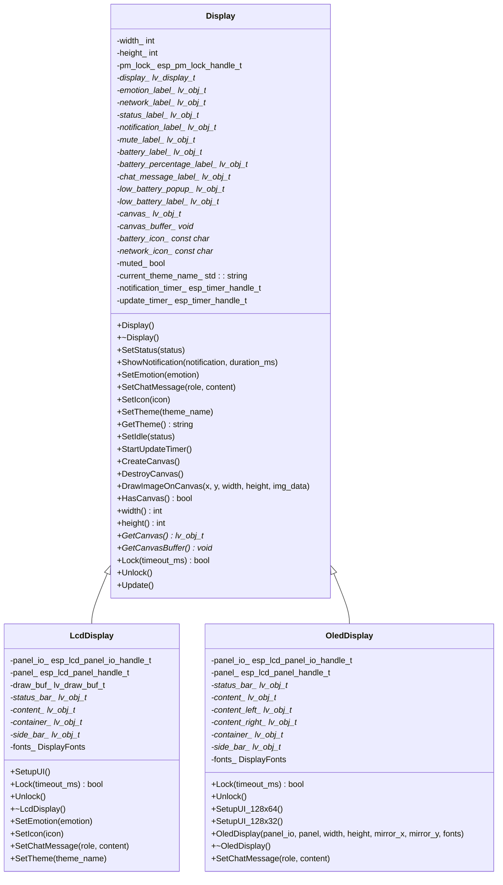
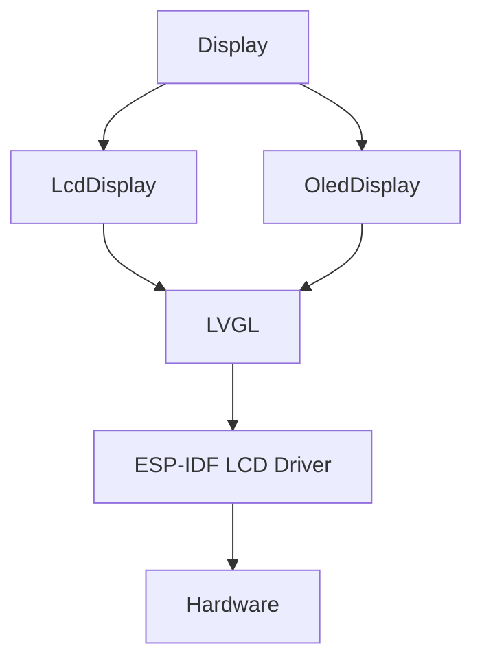

# 实现显示驱动

<cite>
**本文档引用的文件**   
- [display.h](file://main/display/display.h)
- [display.cc](file://main/display/display.cc)
- [lcd_display.h](file://main/display/lcd_display.h)
- [lcd_display.cc](file://main/display/lcd_display.cc)
- [oled_display.h](file://main/display/oled_display.h)
- [oled_display.cc](file://main/display/oled_display.cc)
- [board.h](file://main/boards/common/board.h)
- [board.cc](file://main/boards/common/board.cc)
- [esp_lcd_gc9503.h](file://main/boards/kevin-yuying-313lcd/esp_lcd_gc9503.h)
- [esp_lcd_gc9d01n.h](file://main/boards/lilygo-t-circle-s3/esp_lcd_gc9d01n.h)
- [xingzhi-cube-0.96oled-ml307.cc](file://main/boards/xingzhi-cube-0.96oled-ml307/xingzhi-cube-0.96oled-ml307.cc)
- [xingzhi-cube-0.96oled-wifi.cc](file://main/boards/xingzhi-cube-0.96oled-wifi/xingzhi-cube-0.96oled-wifi.cc)
</cite>

## 目录
1. [引言](#引言)
2. [项目结构](#项目结构)
3. [核心组件](#核心组件)
4. [架构概述](#架构概述)
5. [详细组件分析](#详细组件分析)
6. [依赖分析](#依赖分析)
7. [性能考虑](#性能考虑)
8. [故障排除指南](#故障排除指南)
9. [结论](#结论)

## 引言
本文档详细说明了如何为不同型号的显示屏（如GC9503、GC9D01N等）实现LCD和OLED驱动。文档解释了`lcd_display.cc`和`oled_display.cc`中的初始化流程、接口抽象设计以及与LVGL图形库的集成方式。描述了`display.h`中定义的Display基类如何通过虚函数实现多态支持，使具体驱动可被Board实例统一管理。结合代码示例展示了如何注册显示设备、配置分辨率、刷新率及DMA传输参数。指出了在添加新屏幕驱动时应继承Display类并重写init()、flush()等关键方法，并确保时序配置符合硬件规格。提供了常见问题排查建议，如花屏、无显示、刷新闪烁等现象的可能原因及解决方案。

## 项目结构
该项目的结构清晰，主要分为以下几个部分：
- `main`：包含应用程序的主要逻辑和资源。
- `scripts`：包含各种脚本工具，用于图像转换、音频处理等。
- `xiaozhi-fonts`：包含字体资源和生成工具。

`main`目录下的`display`子目录包含了显示驱动的核心代码，包括`display.h`、`lcd_display.cc`、`oled_display.cc`等文件。这些文件共同实现了对不同显示屏的支持。

## 核心组件

### 显示基类 (Display)
`Display`类是所有显示驱动的基类，定义了通用的接口和属性。它通过虚函数实现了多态性，允许不同的显示驱动继承并重写特定的方法。

```cpp
class Display {
public:
    Display();
    virtual ~Display();

    virtual void SetStatus(const char* status);
    virtual void ShowNotification(const char* notification, int duration_ms = 3000);
    virtual void ShowNotification(const std::string &notification, int duration_ms = 3000);
    virtual void SetEmotion(const char* emotion);
    virtual void SetChatMessage(const char* role, const char* content);
    virtual void SetIcon(const char* icon);
    virtual void SetTheme(const std::string& theme_name);
    virtual std::string GetTheme() { return current_theme_name_; }
    virtual void SetIdle(bool status){};
    
    virtual void StartUpdateTimer();
    
    virtual void CreateCanvas();
    virtual void DestroyCanvas();
    virtual void DrawImageOnCanvas(int x, int y, int width, int height, const uint8_t* img_data);
    virtual bool HasCanvas() { return canvas_ != nullptr; }

    inline int width() const { return width_; }
    inline int height() const { return height_; }

    virtual lv_obj_t* GetCanvas() { return canvas_; }
    virtual void* GetCanvasBuffer() { return canvas_buffer_; }

protected:
    int width_ = 0;
    int height_ = 0;
    
    esp_pm_lock_handle_t pm_lock_ = nullptr;
    lv_display_t *display_ = nullptr;

    lv_obj_t *emotion_label_ = nullptr;
    lv_obj_t *network_label_ = nullptr;
    lv_obj_t *status_label_ = nullptr;
    lv_obj_t *notification_label_ = nullptr;
    lv_obj_t *mute_label_ = nullptr;
    lv_obj_t *battery_label_ = nullptr;        // 电池状态标签
    lv_obj_t *battery_percentage_label_ = nullptr;  // 电池百分比标签
    lv_obj_t* chat_message_label_ = nullptr;
    lv_obj_t* low_battery_popup_ = nullptr;
    lv_obj_t* low_battery_label_ = nullptr;
    lv_obj_t* canvas_ = nullptr;
    void* canvas_buffer_ = nullptr;
    const char* battery_icon_ = nullptr;
    const char* network_icon_ = nullptr;
    bool muted_ = false;
    std::string current_theme_name_;

    esp_timer_handle_t notification_timer_ = nullptr;
    esp_timer_handle_t update_timer_ = nullptr;

    friend class DisplayLockGuard;
    virtual bool Lock(int timeout_ms = 0) = 0;
    virtual void Unlock() = 0;

    virtual void Update();
};
```

### LCD显示驱动 (LcdDisplay)
`LcdDisplay`类继承自`Display`类，提供了LCD显示驱动的具体实现。它定义了`SetupUI`方法，用于设置用户界面，并重写了`Lock`和`Unlock`方法以实现线程安全。

```cpp
class LcdDisplay : public Display {
protected:
    esp_lcd_panel_io_handle_t panel_io_ = nullptr;
    esp_lcd_panel_handle_t panel_ = nullptr;
    
    lv_draw_buf_t draw_buf_;
    lv_obj_t* status_bar_ = nullptr;
    lv_obj_t* content_ = nullptr;
    lv_obj_t* container_ = nullptr;
    lv_obj_t* side_bar_ = nullptr;

    DisplayFonts fonts_;

    virtual void SetupUI();
    virtual bool Lock(int timeout_ms = 0) override;
    virtual void Unlock() override;

protected:
    // 添加protected构造函数
    LcdDisplay(esp_lcd_panel_io_handle_t panel_io, esp_lcd_panel_handle_t panel, DisplayFonts fonts)
        : panel_io_(panel_io), panel_(panel), fonts_(fonts) {}
    
public:
    ~LcdDisplay();
    virtual void SetEmotion(const char* emotion) override;
    virtual void SetIcon(const char* icon) override;
#if CONFIG_USE_WECHAT_MESSAGE_STYLE
    virtual void SetChatMessage(const char* role, const char* content) override; 
#endif  

    // Add theme switching function
    virtual void SetTheme(const std::string& theme_name) override;
};
```

### OLED显示驱动 (OledDisplay)
`OledDisplay`类同样继承自`Display`类，提供了OLED显示驱动的具体实现。它定义了`SetupUI_128x64`和`SetupUI_128x32`方法，用于设置不同分辨率的用户界面，并重写了`Lock`和`Unlock`方法以实现线程安全。

```cpp
class OledDisplay : public Display {
private:
    esp_lcd_panel_io_handle_t panel_io_ = nullptr;
    esp_lcd_panel_handle_t panel_ = nullptr;

    lv_obj_t* status_bar_ = nullptr;
    lv_obj_t* content_ = nullptr;
    lv_obj_t* content_left_ = nullptr;
    lv_obj_t* content_right_ = nullptr;
    lv_obj_t* container_ = nullptr;
    lv_obj_t* side_bar_ = nullptr;

    DisplayFonts fonts_;

    virtual bool Lock(int timeout_ms = 0) override;
    virtual void Unlock() override;

    void SetupUI_128x64();
    void SetupUI_128x32();

public:
    OledDisplay(esp_lcd_panel_io_handle_t panel_io, esp_lcd_panel_handle_t panel, int width, int height, bool mirror_x, bool mirror_y,
                DisplayFonts fonts);
    ~OledDisplay();

    virtual void SetChatMessage(const char* role, const char* content) override;
};
```

## 架构概述
整个显示驱动系统采用了面向对象的设计模式，通过继承和多态性实现了对不同显示屏的支持。`Display`基类定义了通用的接口，而具体的显示驱动类（如`LcdDisplay`和`OledDisplay`）则继承自`Display`类并重写特定的方法。



**图示来源**
- [display.h](file://main/display/display.h)
- [lcd_display.h](file://main/display/lcd_display.h)
- [oled_display.h](file://main/display/oled_display.h)

## 详细组件分析

### LCD显示驱动初始化流程
`SpiLcdDisplay`类的构造函数中，首先初始化了LVGL库，然后配置了显示参数，最后添加了显示设备。

```cpp
SpiLcdDisplay::SpiLcdDisplay(esp_lcd_panel_io_handle_t panel_io, esp_lcd_panel_handle_t panel,
                           int width, int height, int offset_x, int offset_y, bool mirror_x, bool mirror_y, bool swap_xy,
                           DisplayFonts fonts)
    : LcdDisplay(panel_io, panel, fonts) {
    width_ = width;
    height_ = height;

    // draw white
    std::vector<uint16_t> buffer(width_, 0xFFFF);
    for (int y = 0; y < height_; y++) {
        esp_lcd_panel_draw_bitmap(panel_, 0, y, width_, y + 1, buffer.data());
    }

    // Set the display to on
    ESP_LOGI(TAG, "Turning display on");
    ESP_ERROR_CHECK(esp_lcd_panel_disp_on_off(panel_, true));

    ESP_LOGI(TAG, "Initialize LVGL library");
    lv_init();

    ESP_LOGI(TAG, "Initialize LVGL port");
    lvgl_port_cfg_t port_cfg = ESP_LVGL_PORT_INIT_CONFIG();
    port_cfg.task_priority = 1;
    port_cfg.timer_period_ms = 50;
    lvgl_port_init(&port_cfg);

    ESP_LOGI(TAG, "Adding LCD screen");
    const lvgl_port_display_cfg_t display_cfg = {
        .io_handle = panel_io_,
        .panel_handle = panel_,
        .control_handle = nullptr,
        .buffer_size = static_cast<uint32_t>(width_ * 10),
        .double_buffer = false,
        .trans_size = 0,
        .hres = static_cast<uint32_t>(width_),
        .vres = static_cast<uint32_t>(height_),
        .monochrome = false,
        .rotation = {
            .swap_xy = swap_xy,
            .mirror_x = mirror_x,
            .mirror_y = mirror_y,
        },
        .color_format = LV_COLOR_FORMAT_RGB565,
        .flags = {
            .buff_dma = 1,
            .buff_spiram = 0,
            .sw_rotate = 0,
            .swap_bytes = 1,
            .full_refresh = 0,
            .direct_mode = 0,
        },
    };

    display_ = lvgl_port_add_disp(&display_cfg);
    if (display_ == nullptr) {
        ESP_LOGE(TAG, "Failed to add display");
        return;
    }

    if (offset_x != 0 || offset_y != 0) {
        lv_display_set_offset(display_, offset_x, offset_y);
    }

    // Update the theme
    if (current_theme_name_ == "dark") {
        current_theme = DARK_THEME;
    } else if (current_theme_name_ == "light") {
        current_theme = LIGHT_THEME;
    }

#if CONFIG_BOARD_TYPE_ESP32S3_Touch_LCD_1_46A
#else
    SetupUI();
#endif
}
```

### OLED显示驱动初始化流程
`OledDisplay`类的构造函数中，同样初始化了LVGL库，配置了显示参数，并根据分辨率调用了相应的UI设置方法。

```cpp
OledDisplay::OledDisplay(esp_lcd_panel_io_handle_t panel_io, esp_lcd_panel_handle_t panel,
    int width, int height, bool mirror_x, bool mirror_y, DisplayFonts fonts)
    : panel_io_(panel_io), panel_(panel), fonts_(fonts) {
    width_ = width;
    height_ = height;

    ESP_LOGI(TAG, "Initialize LVGL");
    lvgl_port_cfg_t port_cfg = ESP_LVGL_PORT_INIT_CONFIG();
    port_cfg.task_priority = 1;
    port_cfg.timer_period_ms = 50;
    lvgl_port_init(&port_cfg);

    ESP_LOGI(TAG, "Adding LCD screen");
    const lvgl_port_display_cfg_t display_cfg = {
        .io_handle = panel_io_,
        .panel_handle = panel_,
        .control_handle = nullptr,
        .buffer_size = static_cast<uint32_t>(width_ * height_),
        .double_buffer = false,
        .trans_size = 0,
        .hres = static_cast<uint32_t>(width_),
        .vres = static_cast<uint32_t>(height_),
        .monochrome = true,
        .rotation = {
            .swap_xy = false,
            .mirror_x = mirror_x,
            .mirror_y = mirror_y,
        },
        .flags = {
            .buff_dma = 1,
            .buff_spiram = 0,
            .sw_rotate = 0,
            .full_refresh = 0,
            .direct_mode = 0,
        },
    };

    display_ = lvgl_port_add_disp(&display_cfg);
    if (display_ == nullptr) {
        ESP_LOGE(TAG, "Failed to add display");
        return;
    }

    if (height_ == 64) {
        SetupUI_128x64();
    } else {
        SetupUI_128x32();
    }
}
```

### 与LVGL图形库的集成
显示驱动通过`lvgl_port_add_disp`函数将显示设备添加到LVGL系统中。这个函数接收一个`lvgl_port_display_cfg_t`结构体，其中包含了显示设备的各种配置参数。

```cpp
const lvgl_port_display_cfg_t display_cfg = {
    .io_handle = panel_io_,
    .panel_handle = panel_,
    .control_handle = nullptr,
    .buffer_size = static_cast<uint32_t>(width_ * 10),
    .double_buffer = false,
    .trans_size = 0,
    .hres = static_cast<uint32_t>(width_),
    .vres = static_cast<uint32_t>(height_),
    .monochrome = false,
    .rotation = {
        .swap_xy = swap_xy,
        .mirror_x = mirror_x,
        .mirror_y = mirror_y,
    },
    .color_format = LV_COLOR_FORMAT_RGB565,
    .flags = {
        .buff_dma = 1,
        .buff_spiram = 0,
        .sw_rotate = 0,
        .swap_bytes = 1,
        .full_refresh = 0,
        .direct_mode = 0,
    },
};

display_ = lvgl_port_add_disp(&display_cfg);
```

### 多态支持
`Display`基类通过虚函数实现了多态性，允许不同的显示驱动继承并重写特定的方法。例如，`Lock`和`Unlock`方法在`LcdDisplay`和`OledDisplay`中都有不同的实现。

```cpp
virtual bool Lock(int timeout_ms = 0) = 0;
virtual void Unlock() = 0;
```

### 显示设备注册
在具体的开发板初始化代码中，通过`new`关键字创建具体的显示驱动实例，并将其赋值给`display_`成员变量。

```cpp
display_ = new OledDisplay(panel_io_, panel_, DISPLAY_WIDTH, DISPLAY_HEIGHT, DISPLAY_MIRROR_X, DISPLAY_MIRROR_Y,
    {&font_puhui_14_1, &font_awesome_14_1});
```

### 分辨率、刷新率及DMA传输参数配置
在`lvgl_port_display_cfg_t`结构体中，可以通过设置`hres`、`vres`、`buffer_size`等字段来配置分辨率、刷新率及DMA传输参数。

```cpp
const lvgl_port_display_cfg_t display_cfg = {
    .hres = static_cast<uint32_t>(width_),
    .vres = static_cast<uint32_t>(height_),
    .buffer_size = static_cast<uint32_t>(width_ * 10),
    .flags = {
        .buff_dma = 1,
    },
};
```

### 添加新屏幕驱动
在添加新屏幕驱动时，应继承`Display`类并重写`init()`、`flush()`等关键方法，并确保时序配置符合硬件规格。

```cpp
class NewDisplay : public Display {
public:
    NewDisplay(esp_lcd_panel_io_handle_t panel_io, esp_lcd_panel_handle_t panel, int width, int height, bool mirror_x, bool mirror_y,
                DisplayFonts fonts);
    ~NewDisplay();

    virtual void SetChatMessage(const char* role, const char* content) override;
    virtual bool Lock(int timeout_ms = 0) override;
    virtual void Unlock() override;
};
```

### 常见问题排查
- **花屏**：检查时序配置是否正确，确保SPI/I2C时钟频率在允许范围内。
- **无显示**：确认电源和背光是否正常，检查初始化代码是否有错误。
- **刷新闪烁**：调整刷新率和缓冲区大小，确保DMA传输稳定。

## 依赖分析
显示驱动系统依赖于ESP-IDF的LCD面板驱动层和LVGL图形库。通过`esp_lcd_panel_io_handle_t`和`esp_lcd_panel_handle_t`与硬件交互，通过`lvgl_port_add_disp`与LVGL系统集成。



**图示来源**
- [display.h](file://main/display/display.h)
- [lcd_display.h](file://main/display/lcd_display.h)
- [oled_display.h](file://main/display/oled_display.h)

## 性能考虑
- **内存使用**：合理配置缓冲区大小，避免内存浪费。
- **刷新率**：根据应用需求调整刷新率，平衡性能和功耗。
- **DMA传输**：启用DMA传输以提高数据传输效率。

## 故障排除指南
- **花屏**：检查时序配置，确保SPI/I2C时钟频率正确。
- **无显示**：确认电源和背光正常，检查初始化代码。
- **刷新闪烁**：调整刷新率和缓冲区大小，确保DMA传输稳定。

## 结论
本文档详细介绍了如何为不同型号的显示屏实现LCD和OLED驱动，包括初始化流程、接口抽象设计、与LVGL图形库的集成方式、多态支持、显示设备注册、参数配置、添加新驱动的方法以及常见问题排查。通过这些内容，开发者可以更好地理解和实现显示驱动，确保系统的稳定性和性能。