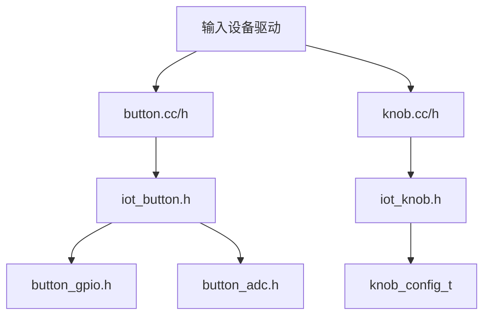
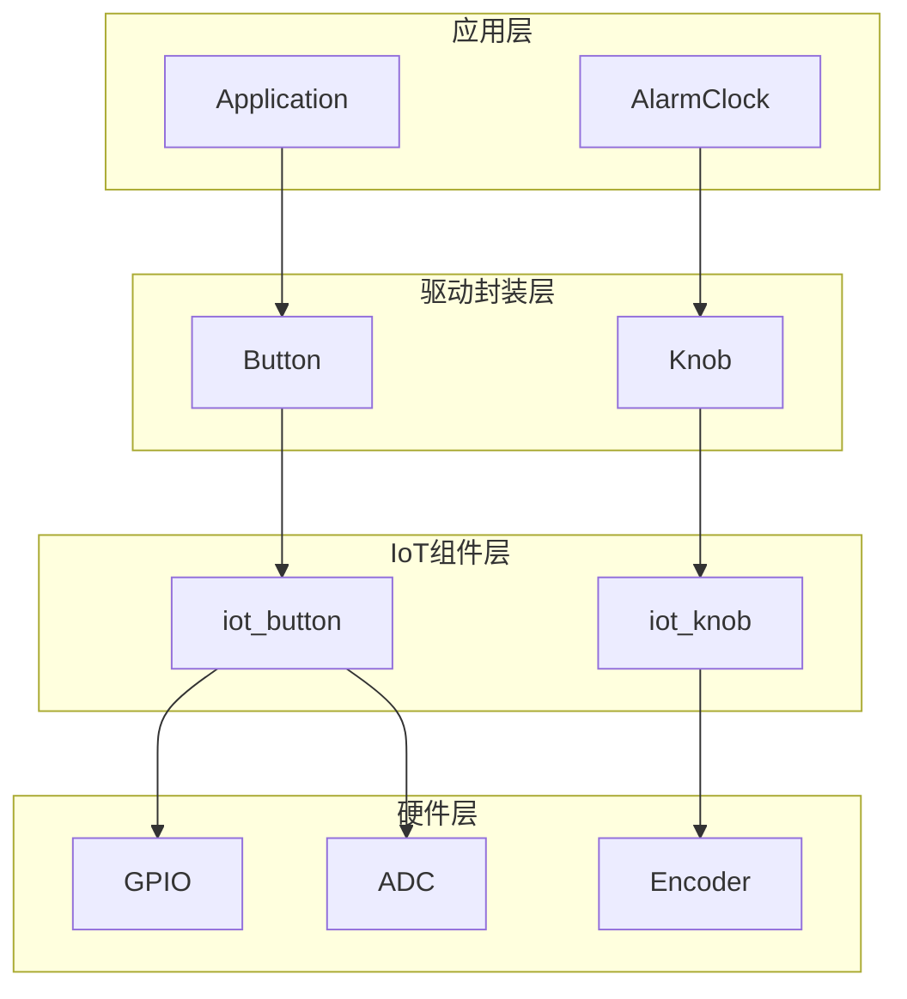
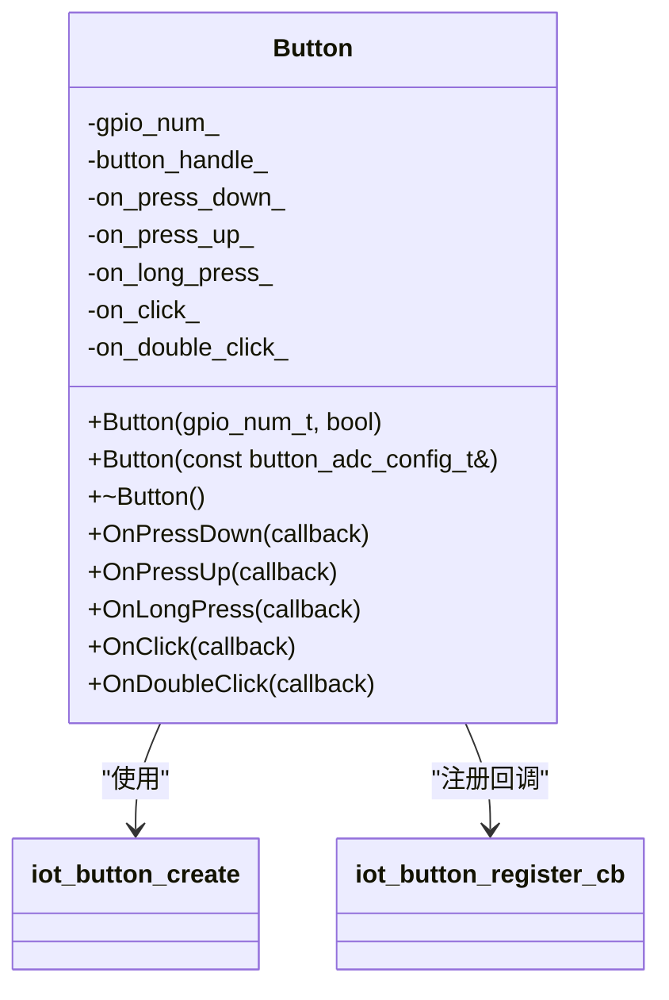
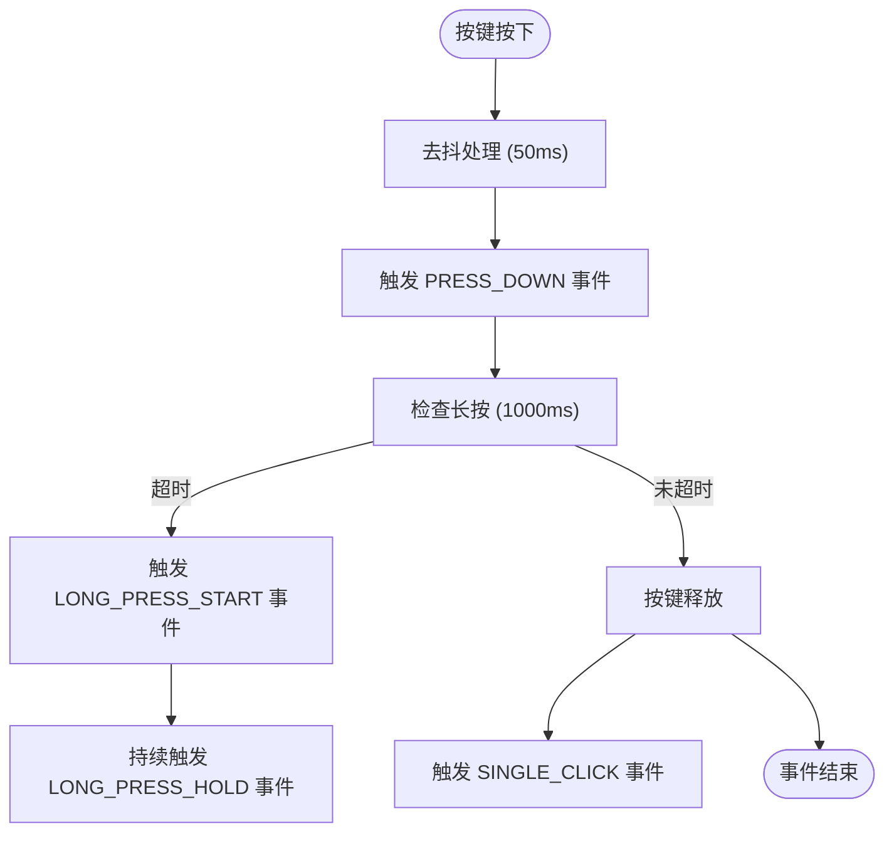
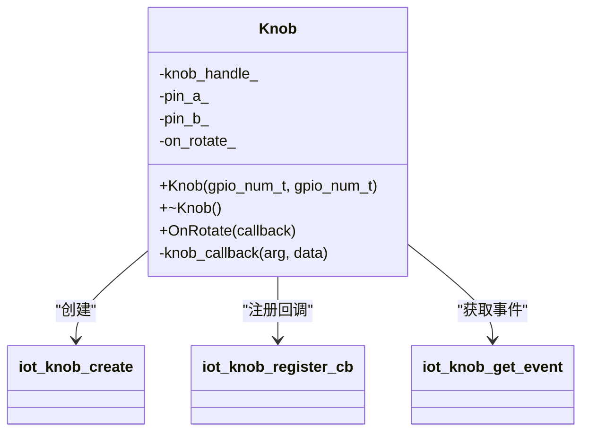
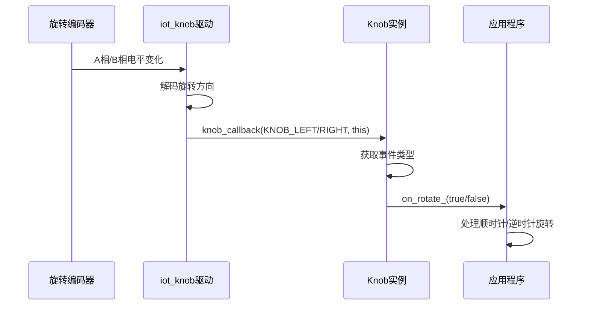
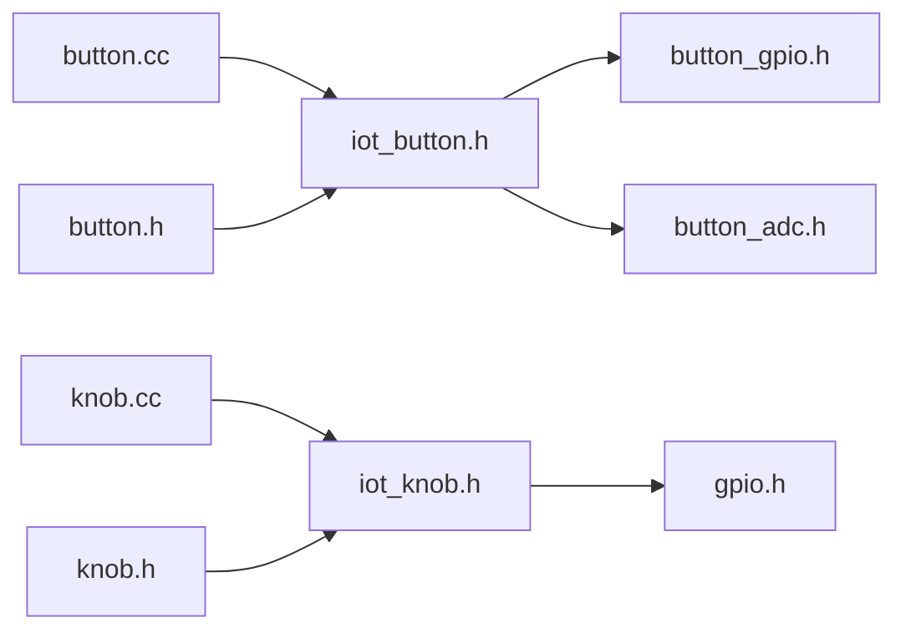

# 实现输入设备驱动

<cite>
**本文档引用的文件**  
- [button.cc](file://main/boards/common/button.cc)
- [button.h](file://main/boards/common/button.h)
- [knob.cc](file://main/boards/common/knob.cc)
- [knob.h](file://main/boards/common/knob.h)
- [iot_button.h](file://managed_components/espressif__button/include/iot_button.h)
- [iot_knob.h](file://managed_components/espressif__knob/include/iot_knob.h)
- [button_gpio.h](file://managed_components/espressif__button/include/button_gpio.h)
</cite>

## 目录
1. [引言](#引言)
2. [项目结构](#项目结构)
3. [核心组件](#核心组件)
4. [架构概览](#架构概览)
5. [详细组件分析](#详细组件分析)
6. [依赖关系分析](#依赖关系分析)
7. [性能考量](#性能考量)
8. [故障排查指南](#故障排查指南)
9. [结论](#结论)

## 引言
本文档系统讲解了在ESP32平台上实现按键与旋钮等输入外设的驱动开发方法。重点分析了基于GPIO中断的按键检测机制和通过ADC读取旋转编码器或电位器值的旋钮驱动实现。文档详细描述了事件回调注册机制，以及如何在新硬件上集成这些输入设备，并提供了常见问题的优化建议。

## 项目结构
输入设备驱动位于`main/boards/common/`目录下，主要包括`button.cc`、`button.h`、`knob.cc`和`knob.h`四个核心文件。这些驱动依赖于ESP-IDF的IoT组件库，具体为`espressif__button`和`espressif__knob`两个管理组件，它们提供了底层的硬件抽象和事件处理机制。

**图示来源**
- [button.cc](file://main/boards/common/button.cc)
- [knob.cc](file://main/boards/common/knob.cc)
- [iot_button.h](file://managed_components/espressif__button/include/iot_button.h)
- [iot_knob.h](file://managed_components/espressif__knob/include/iot_knob.h)

**本节来源**
- [main/boards/common/button.cc](file://main/boards/common/button.cc)
- [main/boards/common/knob.cc](file://main/boards/common/knob.cc)

## 核心组件
本系统的核心输入组件包括按键（Button）和旋钮（Knob）两个类，它们分别封装了GPIO和旋转编码器的硬件交互逻辑。按键类支持短按、长按、单击、双击等多种事件，旋钮类则专注于旋转方向的检测。两个组件均采用回调机制，允许上层应用注册事件处理器，实现了松耦合的设计。

**本节来源**
- [button.h](file://main/boards/common/button.h#L1-L33)
- [knob.h](file://main/boards/common/knob.h#L1-L24)

## 架构概览
整个输入系统采用分层架构设计，上层为C++封装类，中层为ESP-IDF的IoT组件API，底层为硬件驱动。这种设计使得上层应用无需关心底层硬件细节，只需通过简单的接口即可实现复杂的输入交互。

**图示来源**
- [button.cc](file://main/boards/common/button.cc)
- [knob.cc](file://main/boards/common/knob.cc)
- [iot_button.h](file://managed_components/espressif__button/include/iot_button.h)
- [iot_knob.h](file://managed_components/espressif__knob/include/iot_knob.h)

## 详细组件分析

### 按键组件分析
按键类（Button）提供了两种构造方式：基于GPIO和基于ADC。GPIO方式通过中断检测电平变化，ADC方式则通过模拟信号读取多个按键状态。

#### 类结构图

**图示来源**
- [button.h](file://main/boards/common/button.h#L1-L33)
- [button.cc](file://main/boards/common/button.cc#L1-L111)

#### 按键事件处理流程

**图示来源**
- [iot_button.h](file://managed_components/espressif__button/include/iot_button.h#L50-L100)
- [button.cc](file://main/boards/common/button.cc#L50-L100)

**本节来源**
- [button.cc](file://main/boards/common/button.cc#L1-L111)
- [iot_button.h](file://managed_components/espressif__button/include/iot_button.h)

### 旋钮组件分析
旋钮类（Knob）专门用于处理旋转编码器的输入，通过检测A、B两相的相位差来判断旋转方向。

#### 类结构图

**图示来源**
- [knob.h](file://main/boards/common/knob.h#L1-L24)
- [knob.cc](file://main/boards/common/knob.cc#L1-L51)

#### 旋钮事件处理流程

**图示来源**
- [knob.cc](file://main/boards/common/knob.cc#L1-L51)
- [iot_knob.h](file://managed_components/espressif__knob/include/iot_knob.h)

**本节来源**
- [knob.cc](file://main/boards/common/knob.cc#L1-L51)
- [knob.h](file://main/boards/common/knob.h#L1-L24)

## 依赖关系分析
输入驱动组件依赖于ESP-IDF的IoT组件库，形成了清晰的依赖链。`button.cc`和`knob.cc`直接依赖于`iot_button.h`和`iot_knob.h`，而这些头文件又依赖于底层的GPIO和ADC驱动。

**图示来源**
- [button.cc](file://main/boards/common/button.cc)
- [knob.cc](file://main/boards/common/knob.cc)
- [iot_button.h](file://managed_components/espressif__button/include/iot_button.h)
- [iot_knob.h](file://managed_components/espressif__knob/include/iot_knob.h)

**本节来源**
- [button.cc](file://main/boards/common/button.cc)
- [knob.cc](file://main/boards/common/knob.cc)

## 性能考量
- **中断延迟**：GPIO按键使用中断方式，响应速度快，但需注意中断服务程序的执行时间。
- **ADC采样频率**：ADC按键的响应速度受采样频率影响，需在功耗和响应速度间权衡。
- **回调函数执行时间**：所有事件处理都在回调函数中执行，应避免在回调中进行耗时操作。
- **内存占用**：每个按键和旋钮实例都会占用一定的内存，大量设备时需注意内存管理。

## 故障排查指南
### 常见问题及解决方案

| 问题现象 | 可能原因 | 解决方案 |
|---------|---------|---------|
| 按键误触发 | 去抖时间设置过短 | 增加`short_press_time`参数值 |
| 旋钮响应迟钝 | 中断优先级过低 | 提高GPIO中断优先级 |
| 长按事件不触发 | `long_press_time`设置过长 | 调整为合适的长按时间（默认1000ms） |
| ADC按键识别错误 | 参考电压不稳定 | 检查电源稳定性，增加滤波电容 |
| 旋钮方向判断错误 | A/B相接线反接 | 交换A、B相接线或修改`default_direction`配置 |

**本节来源**
- [button.cc](file://main/boards/common/button.cc#L20-L30)
- [knob.cc](file://main/boards/common/knob.cc#L10-L20)
- [iot_button.h](file://managed_components/espressif__button/include/iot_button.h)
- [iot_knob.h](file://managed_components/espressif__knob/include/iot_knob.h)

## 结论
本文档详细分析了ESP32平台上按键与旋钮输入设备的驱动实现。通过封装底层的IoT组件API，提供了简洁易用的C++接口。按键驱动支持多种事件类型，旋钮驱动专注于旋转方向检测，两者均采用回调机制实现事件分发。在新硬件上集成时，只需配置相应的GPIO引脚，设置中断优先级，并注册事件处理器即可。对于性能敏感的应用，建议优化中断处理和回调函数的执行效率。