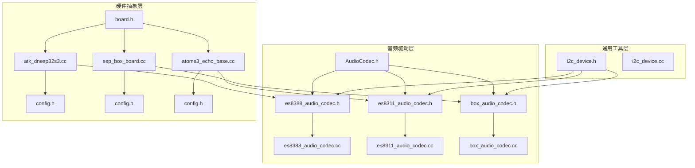
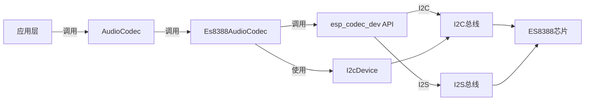
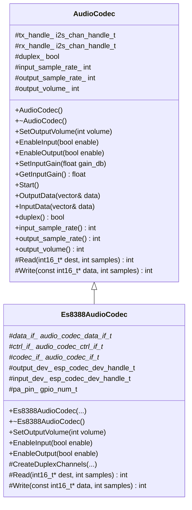
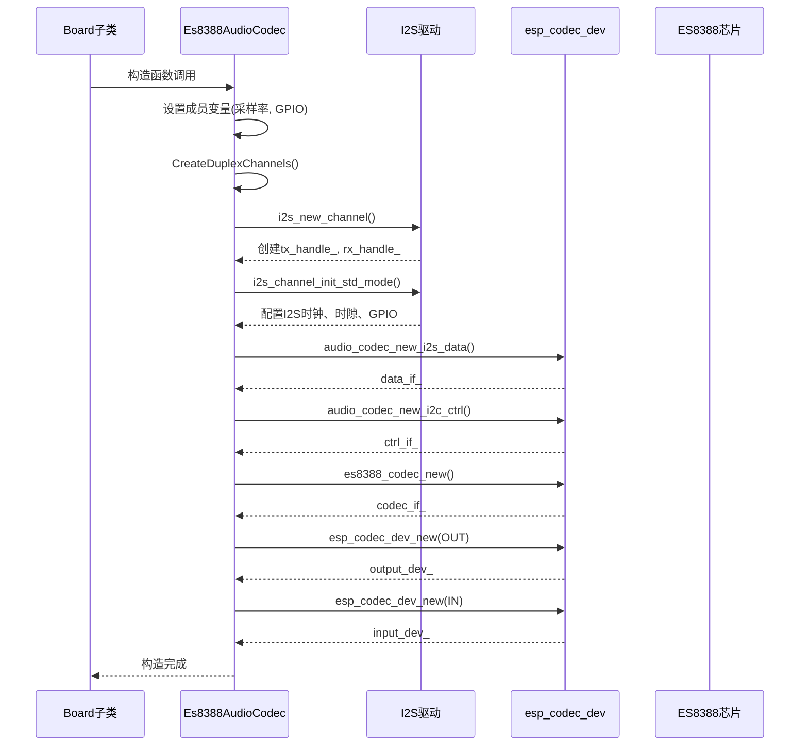
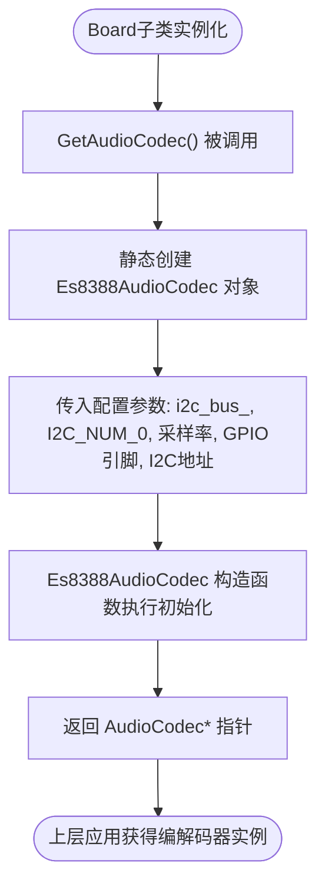
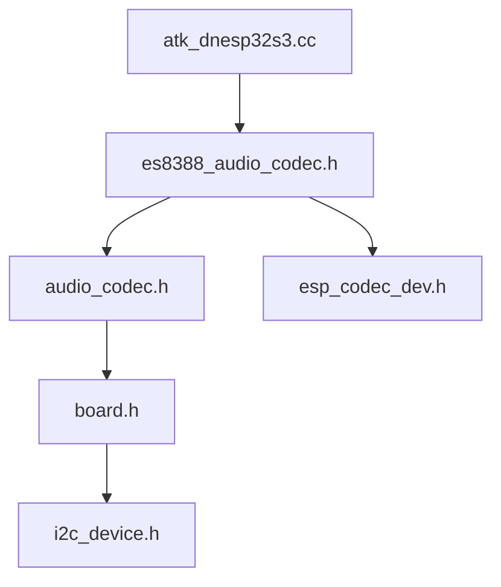

# 实现音频编解码驱动

<cite>
**本文档引用的文件**   
- [audio_codec.h](file://main/audio_codecs/audio_codec.h)
- [audio_codec.cc](file://main/audio_codecs/audio_codec.cc)
- [es8388_audio_codec.h](file://main/audio_codecs/es8388_audio_codec.h)
- [es8388_audio_codec.cc](file://main/audio_codecs/es8388_audio_codec.cc)
- [i2c_device.h](file://main/boards/common/i2c_device.h)
- [board.h](file://main/boards/common/board.h)
- [atk_dnesp32s3.cc](file://main/boards/atk-dnesp32s3/atk_dnesp32s3.cc)
- [config.h](file://main/boards/atk-dnesp32s3/config.h)
</cite>

## 目录
1. [引言](#引言)
2. [项目结构](#项目结构)
3. [核心组件](#核心组件)
4. [架构概述](#架构概述)
5. [详细组件分析](#详细组件分析)
6. [依赖分析](#依赖分析)
7. [性能考虑](#性能考虑)
8. [故障排除指南](#故障排除指南)
9. [结论](#结论)

## 引言
本文档深入解析音频编解码芯片（如ES8388、ES8311）在嵌入式系统中的驱动实现机制。重点阐述了`AudioCodec`抽象接口如何通过面向对象设计支持多种硬件适配，以及各派生类如何利用I2C总线配置寄存器、通过I2S协议建立音频数据通路。文档结合`es8388_audio_codec.cc`中的具体代码，详细说明了采样率设置、声道配置、增益调节等关键参数的初始化流程。同时，描述了在`Board`子类中如何实例化对应的`AudioCodec`对象并将其绑定至I2S外设。文档还强调了驱动代码如何复用`common`目录中的`i2c_device.h`进行I2C通信封装，从而提升代码的一致性和可维护性。最后，提供了一套针对音频输出无声、杂音、失真等常见问题的典型排查路径，包括检查MCLK同步、I2S引脚映射、电源稳定性等关键环节。

## 项目结构
项目采用模块化分层架构，将音频功能相关的代码集中管理。`audio_codecs`目录存放所有音频编解码器的驱动实现，包括抽象基类和具体硬件的派生类。`boards`目录下的各个子目录代表不同的开发板型号，每个开发板通过继承`Board`基类来定义其特有的硬件资源，如显示屏、音频编解码器等。`common`目录提供了跨平台的通用功能封装，如I2C设备通信和基础板级功能。

**图源**
- [audio_codec.h](file://main/audio_codecs/audio_codec.h)
- [es8388_audio_codec.h](file://main/audio_codecs/es8388_audio_codec.h)
- [es8311_audio_codec.h](file://main/audio_codecs/es8311_audio_codec.h)
- [board.h](file://main/boards/common/board.h)
- [i2c_device.h](file://main/boards/common/i2c_device.h)

**本节来源**
- [main/audio_codecs](file://main/audio_codecs)
- [main/boards](file://main/boards)

## 核心组件
本系统的核心是`AudioCodec`抽象基类，它定义了所有音频编解码器必须实现的统一接口。该类通过纯虚函数`Read`和`Write`强制派生类提供具体的音频数据读写逻辑，同时封装了I2S通道句柄、采样率、声道数等通用状态。`Es8388AudioCodec`作为`AudioCodec`的具体实现，负责与ES8388芯片通信。它利用`esp_codec_dev`系列API初始化I2C控制接口、I2S数据接口，并通过`CreateDuplexChannels`方法配置I2S主模式下的全双工通道。`Board`基类通过`GetAudioCodec()`虚函数为上层应用提供获取音频编解码器实例的多态入口。

**本节来源**
- [audio_codec.h](file://main/audio_codecs/audio_codec.h#L13-L55)
- [es8388_audio_codec.h](file://main/audio_codecs/es8388_audio_codec.h#L0-L36)
- [board.h](file://main/boards/common/board.h#L12-L56)

## 架构概述
系统采用分层架构，上层应用通过`Board::GetInstance().GetAudioCodec()`获取一个`AudioCodec`指针，无需关心底层具体是哪种编解码器。`AudioCodec`基类提供`OutputData`和`InputData`等高级API，这些API内部调用由派生类实现的`Write`和`Read`方法。`Es8388AudioCodec`在初始化时，会创建I2S全双工通道，并利用`esp_codec_dev`框架建立与ES8388芯片的I2C控制连接和I2S数据连接。所有I2C通信都通过`i2c_device.h`中定义的`I2cDevice`类进行封装，确保了通信的可靠性和代码的复用性。

**图源**
- [audio_codec.h](file://main/audio_codecs/audio_codec.h)
- [es8388_audio_codec.cc](file://main/audio_codecs/es8388_audio_codec.cc)
- [i2c_device.h](file://main/boards/common/i2c_device.h)

## 详细组件分析
### AudioCodec 抽象接口分析
`AudioCodec`类是整个音频驱动体系的核心，它定义了一个清晰的抽象接口，使得上层应用可以独立于具体的硬件实现。

**图源**
- [audio_codec.h](file://main/audio_codecs/audio_codec.h#L13-L55)
- [es8388_audio_codec.h](file://main/audio_codecs/es8388_audio_codec.h#L0-L36)

**本节来源**
- [audio_codec.h](file://main/audio_codecs/audio_codec.h#L13-L55)
- [es8388_audio_codec.h](file://main/audio_codecs/es8388_audio_codec.h#L0-L36)

### Es8388AudioCodec 初始化流程分析
`Es8388AudioCodec`的构造函数是其功能实现的关键，它完成了从硬件资源到软件对象的完整绑定。

**图源**
- [es8388_audio_codec.cc](file://main/audio_codecs/es8388_audio_codec.cc#L6-L104)

**本节来源**
- [es8388_audio_codec.cc](file://main/audio_codecs/es8388_audio_codec.cc#L6-L104)

### Board 与 AudioCodec 绑定分析
`Board`基类通过虚函数`GetAudioCodec()`为系统提供音频编解码器实例，具体的绑定发生在各个开发板的实现中。

**图源**
- [atk_dnesp32s3.cc](file://main/boards/atk-dnesp32s3/atk_dnesp32s3.cc#L164-L186)
- [es8388_audio_codec.h](file://main/audio_codecs/es8388_audio_codec.h#L0-L36)

**本节来源**
- [atk_dnesp32s3.cc](file://main/boards/atk-dnesp32s3/atk_dnesp32s3.cc#L164-L186)
- [config.h](file://main/boards/atk-dnesp32s3/config.h#L0-L44)

## 依赖分析
系统各组件间存在清晰的依赖关系。`Es8388AudioCodec`直接依赖于`esp_codec_dev`框架提供的API来操作硬件，同时也依赖于`i2c_device.h`中定义的I2C通信基础类。`Board`的实现类则依赖于具体的`AudioCodec`派生类。这种依赖关系通过头文件包含和链接实现。

**图源**
- [atk_dnesp32s3.cc](file://main/boards/atk-dnesp32s3/atk_dnesp32s3.cc)
- [es8388_audio_codec.h](file://main/audio_codecs/es8388_audio_codec.h)
- [audio_codec.h](file://main/audio_codecs/audio_codec.h)
- [board.h](file://main/boards/common/board.h)
- [i2c_device.h](file://main/boards/common/i2c_device.h)

**本节来源**
- [atk_dnesp32s3.cc](file://main/boards/atk-dnesp32s3/atk_dnesp32s3.cc)
- [es8388_audio_codec.h](file://main/audio_codecs/es8388_audio_codec.h)
- [board.h](file://main/boards/common/board.h)

## 性能考虑
音频驱动的性能主要受I2S配置和DMA效率影响。`Es8388AudioCodec`将I2S配置为`I2S_ROLE_MASTER`主模式，确保了时钟的稳定性。`dma_desc_num`和`dma_frame_num`的设置（分别为6和240）平衡了内存占用和中断频率。使用`esp_codec_dev`框架可以有效利用硬件加速，减少CPU在数据搬运上的开销。选择合适的`mclk_multiple`（如`I2S_MCLK_MULTIPLE_256`）对于生成精确的音频采样时钟至关重要，能有效避免音频失真或抖动。

## 故障排除指南
当遇到音频问题时，应遵循以下排查路径：

1.  **无声输出**:
    *   检查`pa_pin_`（功放使能引脚）电平是否正确（`EnableOutput`中会设置）。
    *   确认`output_dev_`是否已通过`esp_codec_dev_open`成功打开。
    *   检查I2S `dout`引脚是否有信号输出（可用示波器）。
    *   验证`SetOutputVolume`是否已调用且音量值非零。

2.  **杂音或失真**:
    *   **检查MCLK同步**: 确保`mclk`引脚连接正确，且`mclk_multiple`配置与采样率匹配。MCLK不稳定是导致失真的常见原因。
    *   **检查I2S引脚映射**: 确认`bclk`、`ws`、`dout`/`din`引脚在代码和硬件上完全匹配。
    *   **电源稳定性**: 音频芯片对电源噪声敏感，检查VDD、AVDD等电源引脚的滤波电容是否齐全，电源纹波是否过大。
    *   **采样率匹配**: 确保`input_sample_rate_`和`output_sample_rate_`在双工模式下相等（`assert`检查）。

3.  **无输入数据**:
    *   检查`din`引脚连接和麦克风供电。
    *   确认`input_dev_`已通过`EnableInput(true)`成功打开。
    *   检查`SetInputGain`设置的增益值是否过低。

**本节来源**
- [es8388_audio_codec.cc](file://main/audio_codecs/es8388_audio_codec.cc)
- [atk_dnesp32s3.cc](file://main/boards/atk-dnesp32s3/atk_dnesp32s3.cc)
- [config.h](file://main/boards/atk-dnesp32s3/config.h)

## 结论
本文档详细解析了基于`AudioCodec`抽象接口的音频驱动实现。通过继承和多态，系统实现了对不同音频编解码芯片（如ES8388）的良好支持。驱动利用`esp_codec_dev`框架和`i2c_device`封装，高效地完成了I2C寄存器配置和I2S音频通路的建立。开发板通过`Board`基类的`GetAudioCodec()`方法实例化并绑定具体的编解码器对象，实现了硬件抽象。理解MCLK同步、I2S引脚配置和电源设计是确保音频功能稳定可靠的关键。该设计模式清晰、可扩展，为系统的音频功能提供了坚实的基础。