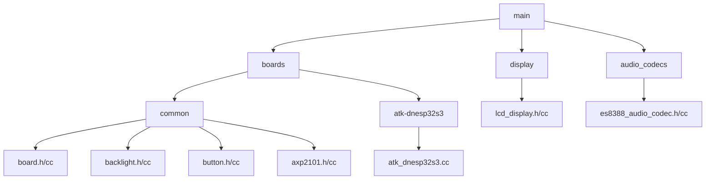
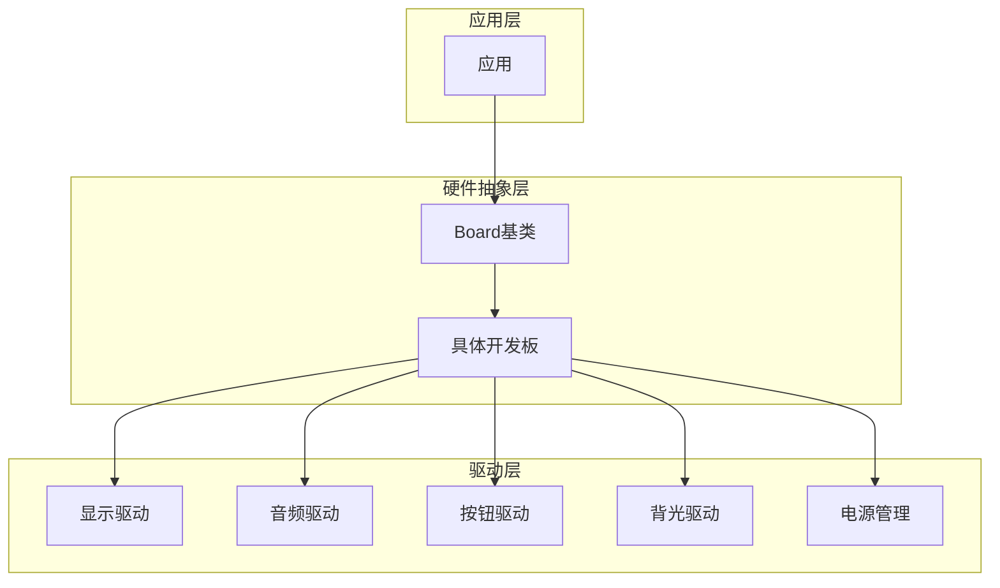
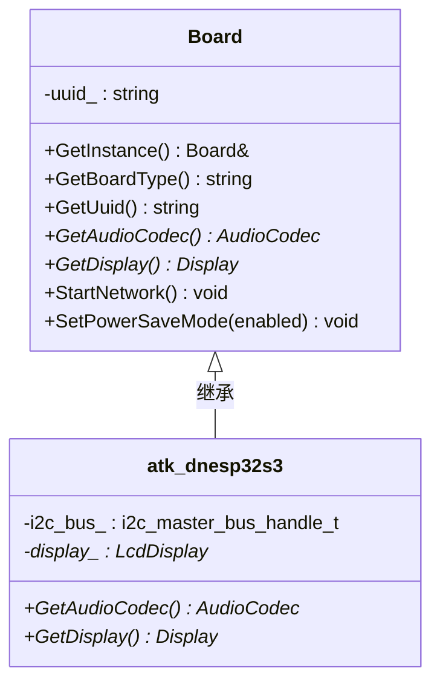
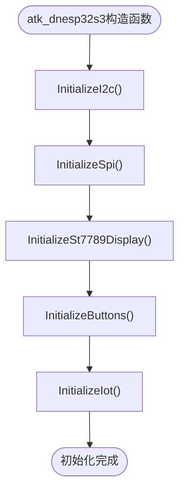
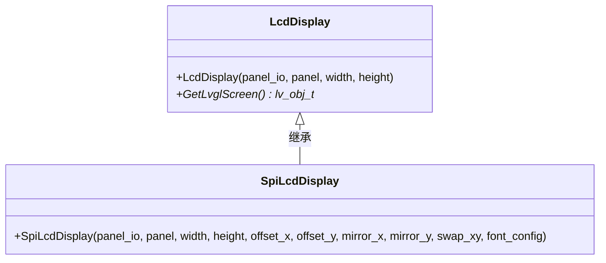
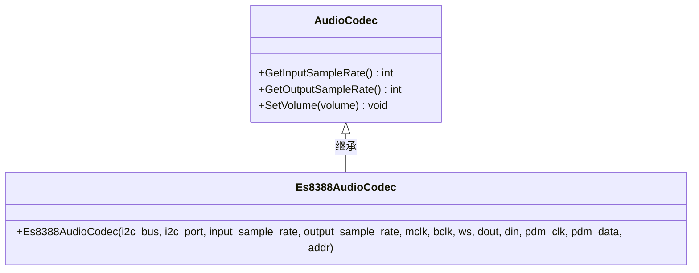
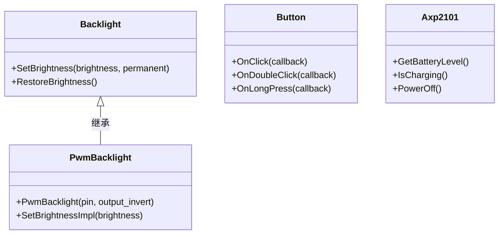
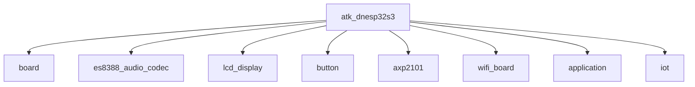

# 实现开发板初始化

<cite>
**本文档引用的文件**  
- [board.h](file://main/boards/common/board.h)
- [board.cc](file://main/boards/common/board.cc)
- [atk_dnesp32s3.cc](file://main/boards/atk-dnesp32s3/atk_dnesp32s3.cc)
- [backlight.h](file://main/boards/common/backlight.h)
- [backlight.cc](file://main/boards/common/backlight.cc)
- [button.h](file://main/boards/common/button.h)
- [button.cc](file://main/boards/common/button.cc)
- [axp2101.h](file://main/boards/common/axp2101.h)
- [axp2101.cc](file://main/boards/common/axp2101.cc)
- [es8388_audio_codec.h](file://main/audio_codecs/es8388_audio_codec.h)
- [es8388_audio_codec.cc](file://main/audio_codecs/es8388_audio_codec.cc)
- [lcd_display.h](file://main/display/lcd_display.h)
- [lcd_display.cc](file://main/display/lcd_display.cc)
</cite>

## 目录

1. [引言](#引言)
2. [项目结构](#项目结构)
3. [核心组件](#核心组件)
4. [架构概述](#架构概述)
5. [详细组件分析](#详细组件分析)
6. [依赖关系分析](#依赖关系分析)
7. [性能考虑](#性能考虑)
8. [故障排除指南](#故障排除指南)
9. [结论](#结论)

## 引言

本文档深入讲解如何在新创建的 `board.cc` 文件中实现开发板的初始化逻辑。重点阐述继承 `Board` 基类的方法重写，包括 `init()`、`initDisplay()`、`initAudio()` 等关键接口的实现细节。说明如何根据硬件原理图配置 GPIO 引脚、I2C/SPI 总线、电源管理芯片（如 AXP2101）等外设。提供代码示例展示 `display_bus`、`display`、`audio_codec` 等成员变量的实例化过程。解释如何调用 `common` 目录下的通用驱动（如 `backlight.cc`、`button.cc`）来构建完整的硬件抽象层。强调错误处理机制，确保初始化失败时能返回正确的错误码。

## 项目结构

本项目采用模块化设计，将不同功能划分为独立的目录。核心硬件抽象层位于 `main/boards` 目录下，其中 `common` 子目录包含通用的基类和驱动实现，而其他子目录则对应具体的开发板型号。

**图示来源**
- [board.h](file://main/boards/common/board.h)
- [atk_dnesp32s3.cc](file://main/boards/atk-dnesp32s3/atk_dnesp32s3.cc)

**本节来源**
- [board.h](file://main/boards/common/board.h)
- [atk_dnesp32s3.cc](file://main/boards/atk-dnesp32s3/atk_dnesp32s3.cc)

## 核心组件

`Board` 基类是整个硬件抽象层的核心，它定义了所有开发板必须实现的接口。通过单例模式 `GetInstance()` 提供全局访问点，并通过纯虚函数强制子类实现特定功能。

**本节来源**
- [board.h](file://main/boards/common/board.h)
- [board.cc](file://main/boards/common/board.cc)

## 架构概述

系统采用分层架构，上层应用通过 `Board` 接口与底层硬件交互，而具体的硬件操作则由各个驱动模块完成。

**图示来源**
- [board.h](file://main/boards/common/board.h)
- [atk_dnesp32s3.cc](file://main/boards/atk-dnesp32s3/atk_dnesp32s3.cc)

## 详细组件分析

### Board基类分析

`Board` 基类采用抽象基类模式，为所有开发板提供统一的接口。

**图示来源**
- [board.h](file://main/boards/common/board.h)
- [atk_dnesp32s3.cc](file://main/boards/atk-dnesp32s3/atk_dnesp32s3.cc)

**本节来源**
- [board.h](file://main/boards/common/board.h)
- [atk_dnesp32s3.cc](file://main/boards/atk-dnesp32s3/atk_dnesp32s3.cc)

### 初始化流程分析

开发板的初始化在具体开发板类的构造函数中完成，遵循特定的顺序。

**图示来源**
- [atk_dnesp32s3.cc](file://main/boards/atk-dnesp32s3/atk_dnesp32s3.cc)

**本节来源**
- [atk_dnesp32s3.cc](file://main/boards/atk-dnesp32s3/atk_dnesp32s3.cc)

### 显示子系统分析

显示子系统通过SPI总线与ST7789驱动芯片通信，并使用LVGL进行图形渲染。

**图示来源**
- [lcd_display.h](file://main/display/lcd_display.h)
- [atk_dnesp32s3.cc](file://main/boards/atk-dnesp32s3/atk_dnesp32s3.cc)

**本节来源**
- [lcd_display.h](file://main/display/lcd_display.h)
- [atk_dnesp32s3.cc](file://main/boards/atk-dnesp32s3/atk_dnesp32s3.cc)

### 音频子系统分析

音频子系统通过I2C总线配置ES8388编解码器，并通过I2S接口传输音频数据。

**图示来源**
- [es8388_audio_codec.h](file://main/audio_codecs/es8388_audio_codec.h)
- [atk_dnesp32s3.cc](file://main/boards/atk-dnesp32s3/atk_dnesp32s3.cc)

**本节来源**
- [es8388_audio_codec.h](file://main/audio_codecs/es8388_audio_codec.h)
- [atk_dnesp32s3.cc](file://main/boards/atk-dnesp32s3/atk_dnesp32s3.cc)

### 外设驱动分析

通用外设驱动被封装在 `common` 目录下，供所有开发板复用。

**图示来源**
- [backlight.h](file://main/boards/common/backlight.h)
- [button.h](file://main/boards/common/button.h)
- [axp2101.h](file://main/boards/common/axp2101.h)

**本节来源**
- [backlight.h](file://main/boards/common/backlight.h)
- [button.h](file://main/boards/common/button.h)
- [axp2101.h](file://main/boards/common/axp2101.h)

## 依赖关系分析

**图示来源**
- [atk_dnesp32s3.cc](file://main/boards/atk-dnesp32s3/atk_dnesp32s3.cc)

**本节来源**
- [atk_dnesp32s3.cc](file://main/boards/atk-dnesp32s3/atk_dnesp32s3.cc)

## 性能考虑

- **初始化顺序**：I2C和SPI总线的初始化顺序至关重要，必须先初始化I2C以配置电源和I/O扩展器，再初始化SPI以驱动显示屏。
- **内存管理**：关键驱动对象（如 `display_`、`audio_codec`）作为成员变量在堆上分配，确保其生命周期与开发板对象一致。
- **错误处理**：使用 `ESP_ERROR_CHECK` 宏进行关键API调用的错误检查，确保硬件初始化失败时能及时发现。

## 故障排除指南

- **显示屏无显示**：检查SPI总线引脚配置、电源使能信号（通过XL9555控制）和背光亮度设置。
- **音频无输出**：验证I2C通信是否正常、ES8388编解码器地址是否正确、I2S引脚配置是否匹配原理图。
- **按钮无响应**：确认GPIO中断配置正确、按钮回调函数已正确注册。
- **UUID生成失败**：检查NVS分区是否正常、`Settings` 类能否正确读写持久化存储。

**本节来源**
- [board.cc](file://main/boards/common/board.cc)
- [atk_dnesp32s3.cc](file://main/boards/atk-dnesp32s3/atk_dnesp32s3.cc)
- [backlight.cc](file://main/boards/common/backlight.cc)

## 结论

通过继承 `Board` 基类并重写其虚函数，可以为特定开发板实现完整的硬件初始化逻辑。该设计模式实现了硬件抽象与具体实现的分离，提高了代码的可维护性和可扩展性。利用 `common` 目录下的通用驱动，可以有效减少重复代码，确保不同开发板之间的一致性。严格的错误处理机制和清晰的初始化流程保证了系统的稳定性和可靠性。