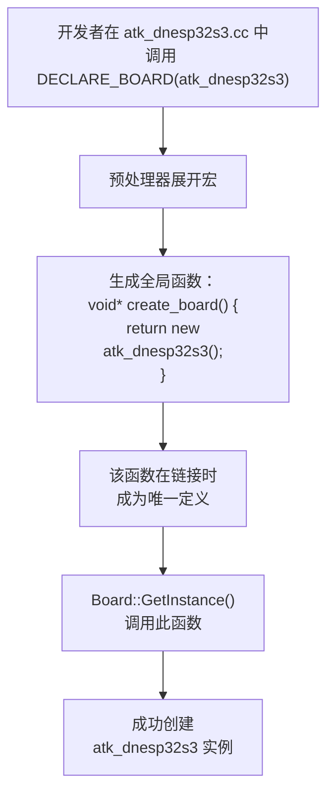

# 注册开发板宏

<cite>
**本文档引用的文件**  
- [board.h](file://main/boards/common/board.h)
- [board.cc](file://main/boards/common/board.cc)
- [atk_dnesp32s3.cc](file://main/boards/atk-dnesp32s3/atk_dnesp32s3.cc)
- [esp_box_board.cc](file://main/boards/esp-box/esp_box_board.cc)
- [config.h](file://main/boards/atk-dnesp32s3/config.h)
- [config.json](file://main/boards/atk-dnesp32s3/config.json)
</cite>

## 目录
1. [概述](#概述)
2. [DECLARE_BOARD宏的工作机制](#declare_board宏的工作机制)
3. [开发板注册流程详解](#开发板注册流程详解)
4. [宏的展开与工厂函数](#宏的展开与工厂函数)
5. [Board::GetInstance()的单例模式](#boardgetinstance的单例模式)
6. [BOARD_NAME宏的来源与作用](#board_name宏的来源与作用)
7. [配置文件与代码的匹配要求](#配置文件与代码的匹配要求)
8. [常见错误与调试建议](#常见错误与调试建议)

## 概述
本节重点解析`DECLARE_BOARD`宏在开发板注册过程中的核心作用。该宏是整个系统实现硬件抽象与动态实例化的核心机制，通过巧妙的C++宏定义和链接时符号解析，实现了开发板的自动注册与创建。开发者无需手动修改工厂代码，只需在各自的开发板实现文件末尾正确使用该宏，即可将新开发板无缝集成到系统中。

## DECLARE_BOARD宏的工作机制

`DECLARE_BOARD`宏是实现开发板动态注册的关键。其定义位于`main/boards/common/board.h`文件中，通过宏定义创建一个全局的`create_board()`函数，该函数负责实例化具体的开发板类。

**宏定义分析**：
```c++
#define DECLARE_BOARD(BOARD_CLASS_NAME) \
void* create_board() { \
    return new BOARD_CLASS_NAME(); \
}
```

该宏接受一个参数`BOARD_CLASS_NAME`，即具体开发板的C++类名。当在某个开发板的`.cc`文件中调用`DECLARE_BOARD(YourBoardClass)`时，预处理器会将其展开为一个返回`new YourBoardClass()`的`create_board()`函数。

这种设计利用了C++链接器的“一个定义规则”（One Definition Rule, ODR）。由于每个开发板的`.cc`文件都会包含`board.h`并调用`DECLARE_BOARD`宏，但只有**一个**`.cc`文件会被编译进最终的可执行文件（由构建系统根据目标开发板决定），因此在整个程序中只会存在一个`create_board()`函数的定义，避免了链接冲突。

**Section sources**
- [board.h](file://main/boards/common/board.h#L50-L54)

## 开发板注册流程详解

开发板的注册和实例化是一个在程序启动时自动完成的过程，其核心流程如下：

1.  **构建系统选择**：构建系统（如CMake）根据项目配置，决定将哪一个开发板的`.cc`文件编译进最终的固件。例如，如果目标是`atk-dnesp32s3`，则`atk_dnesp32s3.cc`会被编译，而其他开发板的实现文件则被忽略。

2.  **宏展开生成工厂函数**：在被选中的`atk_dnesp32s3.cc`文件末尾，`DECLARE_BOARD(atk_dnesp32s3);`宏被展开，生成如下代码：
    ```c++
    void* create_board() {
        return new atk_dnesp32s3();
    }
    ```
    这个`create_board()`函数现在是全局可见的，并且其具体实现与`atk_dnesp32s3`类绑定。

3.  **单例模式获取实例**：在程序的任何地方，当需要获取当前开发板的实例时，都会调用`Board::GetInstance()`。

4.  **动态创建与返回**：`GetInstance()`内部调用`create_board()`，由于链接时只存在一个`create_board()`的定义（即由当前开发板生成的那个），因此会正确地创建并返回`atk_dnesp32s3`类的实例。

这个流程实现了“一次编写，多处编译”的设计模式，使得核心框架代码完全独立于具体的硬件实现。

**Section sources**
- [atk_dnesp32s3.cc](file://main/boards/atk-dnesp32s3/atk_dnesp32s3.cc#L185-L186)
- [board.h](file://main/boards/common/board.h#L30-L34)

## 宏的展开与工厂函数

`DECLARE_BOARD`宏本质上是一个**代码生成器**，它在编译时为每个开发板动态生成一个专用的工厂函数。

**代码生成过程**：


**Diagram sources**
- [board.h](file://main/boards/common/board.h#L50-L54)
- [atk_dnesp32s3.cc](file://main/boards/atk-dnesp32s3/atk_dnesp32s3.cc#L185-L186)

此机制的优势在于：
- **零运行时开销**：没有虚函数表查找或复杂的注册表遍历，`create_board()`是一个直接的函数调用。
- **类型安全**：宏参数是C++类名，编译器会进行类型检查。
- **易于扩展**：添加新开发板只需创建新类并调用宏，无需修改任何核心框架代码。

## Board::GetInstance()的单例模式

`Board`类通过`GetInstance()`方法实现了单例模式，确保在整个应用程序生命周期中，每个开发板实例只有一个。

```c++
static Board& GetInstance() {
    static Board* instance = static_cast<Board*>(create_board());
    return *instance;
}
```

**关键点分析**：
1.  **静态指针**：`instance`是一个静态指针，其生命周期贯穿整个程序。
2.  **延迟初始化**：指针的初始化发生在第一次调用`GetInstance()`时。
3.  **调用工厂函数**：初始化时，它调用`create_board()`这个由`DECLARE_BOARD`宏生成的函数。
4.  **返回引用**：最后返回的是指针解引用后的引用，符合单例模式的常见用法。

这种设计将单例的“获取”逻辑与“创建”逻辑分离。`GetInstance()`负责单例的生命周期管理，而`create_board()`负责具体的对象创建，两者通过宏机制在编译时绑定。

**Section sources**
- [board.h](file://main/boards/common/board.h#L30-L34)

## BOARD_NAME宏的来源与作用

虽然在`board.h`和`config.h`中未直接找到`BOARD_NAME`的定义，但其值来源于开发板的`config.json`文件，并通过构建系统在编译时注入。

**分析过程**：
1.  在`atk_dnesp32s3`的`config.json`中，`"name"`字段的值为`"atk-dnesp32s3"`。
    ```json
    {
        "target": "esp32s3",
        "builds": [
            {
                "name": "atk-dnesp32s3",
                "sdkconfig_append": []
            }
        ]
    }
    ```
2.  构建系统（如CMake或idf.py）在编译`atk_dnesp32s3.cc`时，会将`config.json`中的`name`字段作为预处理器宏`BOARD_NAME`传递给编译器。例如，编译命令可能包含`-D BOARD_NAME=\"atk-dnesp32s3\"`。
3.  因此，在`board.cc`等文件中使用的`BOARD_NAME`，其实际值就是`config.json`中定义的开发板名称。

**BOARD_NAME的作用**：
- **日志标识**：在日志中打印当前开发板的SKU信息（`ESP_LOGI(TAG, "UUID=%s SKU=%s", ...)`）。
- **HTTP请求头**：作为User-Agent的一部分，用于服务器识别设备类型。
- **MQTT消息**：在通知消息中包含设备名称，便于用户识别。

**Section sources**
- [config.json](file://main/boards/atk-dnesp32s3/config.json#L4-L6)
- [board.cc](file://main/boards/common/board.cc#L32)

## 配置文件与代码的匹配要求

为了确保系统正常工作，`config.json`中的`name`字段、`DECLARE_BOARD`宏的参数以及实际的C++类名必须保持一致。

**匹配规则**：
- **`config.json`中的`name`**：定义了开发板的逻辑名称，如`"atk-dnesp32s3"`。
- **`DECLARE_BOARD`宏的参数**：必须与`config.json`中的`name`完全匹配（包括大小写和连字符）。例如，`DECLARE_BOARD(atk_dnesp32s3);`。
- **C++类名**：类名通常与宏参数相同，但可以不同。然而，为了代码清晰，强烈建议保持一致。

**重要提示**：`DECLARE_BOARD`宏的参数是**C++标识符**，因此不能包含连字符`-`。在`config.json`中为`"atk-dnesp32s3"`的开发板，在代码中通常会使用下划线`_`来代替，即`atk_dnesp32s3`。构建系统负责将`config.json`中的名称映射到正确的编译目标。

**Section sources**
- [config.json](file://main/boards/atk-dnesp32s3/config.json#L4-L6)
- [atk_dnesp32s3.cc](file://main/boards/atk-dnesp32s3/atk_dnesp32s3.cc#L185-L186)

## 常见错误与调试建议

### 常见错误示例

1.  **宏参数错误**：
    ```c++
    // 错误：类名拼写错误
    DECLARE_BOARD(atk_dnesp323); // 应为 atk_dnesp32s3
    ```
    **后果**：编译器会报错，找不到名为`atk_dnesp323`的类。

2.  **类名与config.json不匹配**：
    - `config.json`中`"name"`为`"my_custom_board"`
    - 代码中却使用`DECLARE_BOARD(another_board);`
    **后果**：构建系统可能无法正确识别目标，导致链接错误或创建了错误的开发板实例。

3.  **忘记调用DECLARE_BOARD宏**：
    **后果**：链接器会报错，找不到`create_board()`函数的定义，因为`board.h`中只有声明而没有定义。

### 调试建议

1.  **检查编译日志**：如果出现链接错误（如`undefined reference to 'create_board()'`），首先确认目标开发板的`.cc`文件是否被正确编译。
2.  **验证config.json**：确保`config.json`中的`name`字段与`DECLARE_BOARD`宏的参数在逻辑上对应。
3.  **检查类定义**：确认`DECLARE_BOARD`宏中使用的类名在当前文件中已正确定义。
4.  **查看日志输出**：程序启动时，`Board`的构造函数会打印`SKU=%s`，检查日志中的SKU是否与预期的开发板名称一致，这是验证注册是否成功的关键。

**Section sources**
- [atk_dnesp32s3.cc](file://main/boards/atk-dnesp32s3/atk_dnesp32s3.cc#L185-L186)
- [config.json](file://main/boards/atk-dnesp32s3/config.json#L4-L6)
- [board.cc](file://main/boards/common/board.cc#L32)