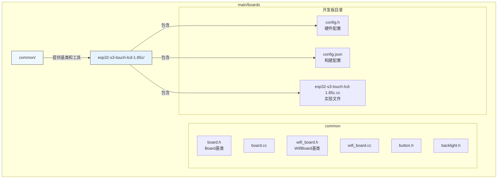
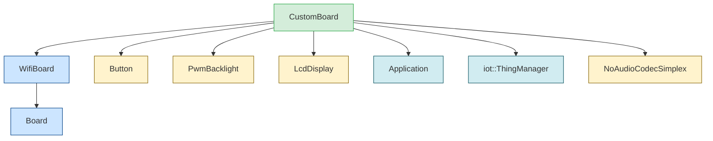

# 自定义开发板集成

<cite>
**本文档引用的文件**  
- [board.h](file://main/boards/common/board.h)
- [board.cc](file://main/boards/common/board.cc)
- [wifi_board.h](file://main/boards/common/wifi_board.h)
- [wifi_board.cc](file://main/boards/common/wifi_board.cc)
- [esp32-s3-touch-lcd-1.85c.cc](file://main/boards/esp32-s3-touch-lcd-1.85c/esp32-s3-touch-lcd-1.85c.cc)
- [config.h](file://main/boards/esp32-s3-touch-lcd-1.85c/config.h)
- [config.json](file://main/boards/esp32-s3-touch-lcd-1.85c/config.json)
</cite>

## 目录
1. [简介](#简介)
2. [项目结构](#项目结构)
3. [核心组件](#核心组件)
4. [架构概述](#架构概述)
5. [详细组件分析](#详细组件分析)
6. [依赖分析](#依赖分析)
7. [性能考虑](#性能考虑)
8. [故障排除指南](#故障排除指南)
9. [结论](#结论)

## 简介
本文档旨在为开发者提供一份详尽的自定义开发板集成指南，帮助其将新的硬件平台无缝接入当前系统。通过分析现有开发板的实现方式，本文将逐步说明如何创建新的开发板目录、实现`board.cc`中的初始化逻辑、配置`config.h`和`config.json`文件，并重点讲解`DECLARE_BOARD`宏的使用方法，确保新开发板能被系统正确识别与注册。此外，文档还将阐述如何实现必要的外设驱动（如显示、音频、按键等）并将其关联到`Board`实例，同时提供实用的调试技巧，如日志输出、硬件检测和配置验证，以帮助开发者快速定位和解决集成过程中可能遇到的问题。最后，文档将提供一个完整的参考实现示例，以便开发者进行对照和学习。

## 项目结构
本项目的开发板支持通过模块化的方式进行扩展。所有开发板相关的代码均位于`main/boards`目录下。该目录的结构清晰，分为两类：一是针对特定硬件型号的独立开发板目录（如`esp32-s3-touch-lcd-1.85c`），二是存放通用硬件抽象层（HAL）和基础功能实现的`common`目录。

每个特定开发板的目录都包含三个核心文件：
- **`config.h`**: 一个C/C++头文件，用于定义该开发板的硬件引脚、I2C/SPI地址、音频采样率等编译时常量。
- **`config.json`**: 一个JSON配置文件，主要用于指定ESP-IDF构建系统的目标芯片（如`esp32s3`）和构建配置。
- **`[board_name].cc`**: 一个C++源文件，包含该开发板的具体实现，继承自`Board`或其子类，并实现所有必需的虚拟函数。

`common`目录则包含了所有开发板共享的基础类和工具，如`Board`基类、`WifiBoard`网络基类、`Button`、`Backlight`等，这些构成了系统的硬件抽象层。



**图示来源**
- [board.h](file://main/boards/common/board.h)
- [wifi_board.h](file://main/boards/common/wifi_board.h)
- [esp32-s3-touch-lcd-1.85c.cc](file://main/boards/esp32-s3-touch-lcd-1.85c/esp32-s3-touch-lcd-1.85c.cc)
- [config.h](file://main/boards/esp32-s3-touch-lcd-1.85c/config.h)

**本节来源**
- [main/boards](file://main/boards)

## 核心组件
系统的核心在于`Board`抽象类，它定义了所有开发板必须实现的接口。通过单例模式的`GetInstance()`方法和`DECLARE_BOARD`宏，系统实现了开发板的动态注册与实例化。`Board`类不仅管理着设备的唯一标识（UUID），还负责创建网络通信对象（HTTP、WebSocket、MQTT、UDP）和获取外设实例（音频编解码器、显示屏、背光等）。

`WifiBoard`作为`Board`的一个重要子类，为支持Wi-Fi功能的开发板提供了统一的网络初始化和管理逻辑，简化了开发者的实现工作。此外，`config.h`和`config.json`文件共同构成了开发板的配置层，将硬件细节与核心逻辑分离，提高了代码的可维护性和可移植性。

**本节来源**
- [board.h](file://main/boards/common/board.h#L1-L55)
- [wifi_board.h](file://main/boards/common/wifi_board.h#L5-L23)
- [config.h](file://main/boards/esp32-s3-touch-lcd-1.85c/config.h)

## 架构概述
整个自定义开发板集成的架构基于面向对象的继承和多态机制。`Board`是所有开发板的抽象基类，它通过纯虚函数强制子类实现特定功能。`WifiBoard`在`Board`的基础上，为Wi-Fi设备提供了默认的网络功能实现。具体的开发板（如`CustomBoard`）则继承自`WifiBoard`，并根据其硬件特性进行最终的实现。

系统的入口点是`Board::GetInstance()`。该方法调用全局的`create_board()`函数来获取`Board`实例。`create_board()`函数的具体实现由`DECLARE_BOARD`宏在具体的开发板实现文件中生成，从而实现了“注册”机制。当编译特定开发板时，只有该开发板的`DECLARE_BOARD`宏会被展开，确保`create_board()`返回正确的实例。

```mermaid
classDiagram
class Board {
+static GetInstance() Board&
+virtual ~Board()
+virtual GetBoardType() string
+virtual GetAudioCodec() AudioCodec*
+virtual GetDisplay() Display*
+virtual CreateHttp() Http*
+virtual StartNetwork() void
-uuid_ string
}
class WifiBoard {
+virtual GetBoardType() string
+virtual StartNetwork() void
+virtual CreateHttp() Http*
+virtual CreateWebSocket() WebSocket*
+virtual CreateMqtt() Mqtt*
+virtual CreateUdp() Udp*
-wifi_config_mode_ bool
}
class CustomBoard {
-boot_button_ Button
-i2c_bus_ i2c_master_bus_handle_t
-io_expander esp_io_expander_handle_t
-display_ LcdDisplay*
+CustomBoard()
+GetAudioCodec() AudioCodec*
+GetDisplay() Display*
+GetBacklight() Backlight*
}
Board <|-- WifiBoard : "继承"
WifiBoard <|-- CustomBoard : "继承"
note right of Board
抽象基类，定义所有开发板的接口。
通过 DECLARE_BOARD 宏实现单例注册。
end note
note right of CustomBoard
具体开发板实现，继承自 WifiBoard。
在构造函数中完成所有硬件初始化。
end note
```

**图示来源**
- [board.h](file://main/boards/common/board.h#L1-L55)
- [wifi_board.h](file://main/boards/common/wifi_board.h#L5-L23)
- [esp32-s3-touch-lcd-1.85c.cc](file://main/boards/esp32-s3-touch-lcd-1.85c/esp32-s3-touch-lcd-1.85c.cc#L200-L413)

## 详细组件分析
### Board基类分析
`Board`基类是整个硬件抽象层的核心。它是一个单例，通过`GetInstance()`方法全局访问。其构造函数负责生成或读取设备的UUID，该UUID是设备在网络中的唯一标识。基类中定义了多个纯虚函数，如`GetBoardType()`、`GetAudioCodec()`、`CreateHttp()`等，这些函数必须由子类实现，以提供具体的硬件和功能支持。

```cpp
class Board {
public:
    static Board& GetInstance() {
        static Board* instance = static_cast<Board*>(create_board());
        return *instance;
    }
    virtual std::string GetBoardType() = 0;
    virtual AudioCodec* GetAudioCodec() = 0;
    // ... 其他纯虚函数
};
```

**本节来源**
- [board.h](file://main/boards/common/board.h#L1-L55)
- [board.cc](file://main/boards/common/board.cc#L1-L167)

### DECLARE_BOARD宏分析
`DECLARE_BOARD`宏是实现开发板“注册”的关键。它定义了一个全局的`create_board()`函数，该函数返回一个新创建的指定开发板类的实例。由于C++的链接规则，当编译系统链接特定开发板的目标时，只有该开发板源文件中的`DECLARE_BOARD`宏会生成`create_board()`函数，从而确保`Board::GetInstance()`能够获取到正确的实例。

```cpp
#define DECLARE_BOARD(BOARD_CLASS_NAME) \
void* create_board() { \
    return new BOARD_CLASS_NAME(); \
}
```

在`CustomBoard`的实现文件末尾，通过`DECLARE_BOARD(CustomBoard);`将`CustomBoard`类注册到系统中。

**本节来源**
- [board.h](file://main/boards/common/board.h#L50-L55)
- [esp32-s3-touch-lcd-1.85c.cc](file://main/boards/esp32-s3-touch-lcd-1.85c/esp32-s3-touch-lcd-1.85c.cc#L413)

### 具体开发板实现分析
以`esp32-s3-touch-lcd-1.85c`开发板为例，其`CustomBoard`类的实现展示了完整的集成流程。

#### 硬件初始化流程
`CustomBoard`的构造函数是硬件初始化的入口，它按顺序调用多个私有初始化函数：
1.  **I2C总线初始化** (`InitializeI2c`): 配置I2C端口、SDA和SCL引脚，创建I2C总线句柄。
2.  **I/O扩展器初始化** (`InitializeTca9554`): 使用I2C总线创建TCA9554 I/O扩展器实例，并通过它复位LCD和触摸屏。
3.  **SPI总线初始化** (`InitializeSpi`): 配置QSPI总线参数，用于高速驱动显示屏。
4.  **显示屏初始化** (`Initializest77916Display`): 创建LCD面板IO和面板实例，发送初始化命令序列，并创建`SpiLcdDisplay`对象。
5.  **按键初始化** (`InitializeButtons`): 配置启动按钮的点击回调函数。
6.  **物联网设备注册** (`InitializeIot`): 将“扬声器”和“屏幕”作为物联网设备注册到系统中。

#### 外设驱动实现
`CustomBoard`通过重写基类的虚函数来提供外设实例：
- **`GetAudioCodec()`**: 创建并返回一个`NoAudioCodecSimplex`实例，配置I2S接口的引脚和采样率。
- **`GetDisplay()`**: 返回在`Initializest77916Display`中创建的`display_`指针。
- **`GetBacklight()`**: 创建并返回一个`PwmBacklight`实例，用于控制显示屏背光的亮度。

```cpp
class CustomBoard : public WifiBoard {
    // ... 成员变量
public:
    CustomBoard() {
        // 调用所有初始化函数
        InitializeI2c();
        InitializeTca9554();
        InitializeSpi();
        Initializest77916Display();
        InitializeButtons();
        InitializeIot();
        GetBacklight()->RestoreBrightness();
    }

    virtual AudioCodec* GetAudioCodec() override {
        static NoAudioCodecSimplex audio_codec(/* ... */);
        return &audio_codec;
    }

    virtual Display* GetDisplay() override {
        return display_;
    }
    
    virtual Backlight* GetBacklight() override {
        static PwmBacklight backlight(DISPLAY_BACKLIGHT_PIN, DISPLAY_BACKLIGHT_OUTPUT_INVERT);
        return &backlight;
    }
};

DECLARE_BOARD(CustomBoard);
```

**本节来源**
- [esp32-s3-touch-lcd-1.85c.cc](file://main/boards/esp32-s3-touch-lcd-1.85c/esp32-s3-touch-lcd-1.85c.cc#L200-L413)
- [config.h](file://main/boards/esp32-s3-touch-lcd-1.85c/config.h)

## 依赖分析
新开发板的实现依赖于`main/boards/common`目录下的多个核心组件。`CustomBoard`直接继承自`WifiBoard`，而`WifiBoard`又继承自`Board`，形成了清晰的继承链。此外，实现中还依赖了`Button`、`PwmBacklight`、`LcdDisplay`等具体外设类，以及`Application`、`iot::ThingManager`等系统服务。



**图示来源**
- [esp32-s3-touch-lcd-1.85c.cc](file://main/boards/esp32-s3-touch-lcd-1.85c/esp32-s3-touch-lcd-1.85c.cc)
- [wifi_board.h](file://main/boards/common/wifi_board.h)
- [board.h](file://main/boards/common/board.h)

**本节来源**
- [esp32-s3-touch-lcd-1.85c.cc](file://main/boards/esp32-s3-touch-lcd-1.85c/esp32-s3-touch-lcd-1.85c.cc)

## 性能考虑
在集成新开发板时，需注意以下性能方面：
- **构造函数中的初始化**：所有硬件初始化都在`CustomBoard`的构造函数中完成。应确保这些操作是阻塞且可靠的，因为系统启动流程依赖于这些初始化的成功。
- **静态对象的使用**：外设驱动（如`AudioCodec`、`Backlight`）被声明为`static`，以确保它们在整个程序生命周期内存在且只被创建一次，避免了重复初始化的开销。
- **资源管理**：正确管理I2C、SPI总线句柄和内存分配，避免资源泄漏。

## 故障排除指南
在集成过程中，若遇到问题，可参考以下调试技巧：
1.  **检查日志输出**：查看串口日志，确认`Board`构造函数、`create_board()`调用以及各初始化函数的日志信息，定位失败环节。
2.  **验证硬件连接**：使用万用表或逻辑分析仪检查I2C、SPI总线的物理连接和信号是否正常。
3.  **核对引脚定义**：仔细检查`config.h`中的引脚定义是否与实际硬件原理图完全一致。
4.  **确认构建配置**：确保`config.json`中的`target`字段正确，并且构建系统指向了正确的开发板目录。
5.  **检查宏定义**：确认`DECLARE_BOARD`宏的参数是正确的类名，并且该宏在实现文件的末尾被调用。

**本节来源**
- [board.cc](file://main/boards/common/board.cc)
- [esp32-s3-touch-lcd-1.85c.cc](file://main/boards/esp32-s3-touch-lcd-1.85c/esp32-s3-touch-lcd-1.85c.cc)

## 结论
通过遵循本文档的指导，开发者可以系统地完成新开发板的集成工作。关键步骤包括：创建开发板目录、定义`config.h`和`config.json`、实现继承自`Board`或`WifiBoard`的`CustomBoard`类、在构造函数中完成所有硬件初始化、重写必要的虚函数以提供外设实例，以及最后使用`DECLARE_BOARD`宏进行注册。这种基于继承和宏注册的设计模式，使得系统能够灵活地支持多种硬件平台，同时保持了代码的清晰和可维护性。