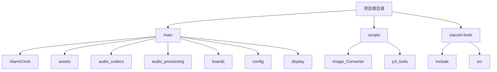
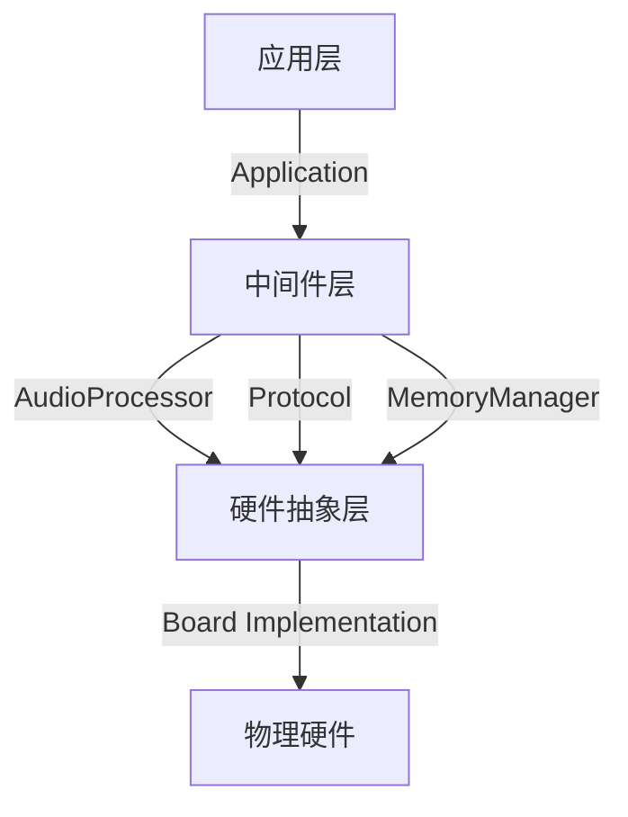
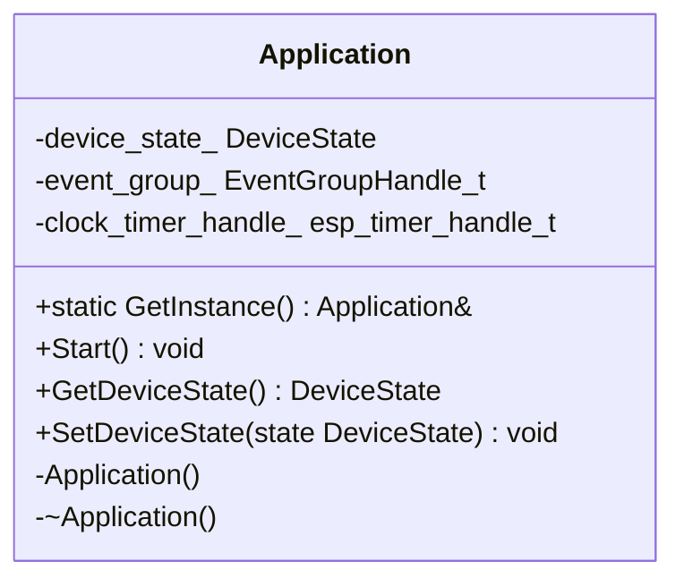
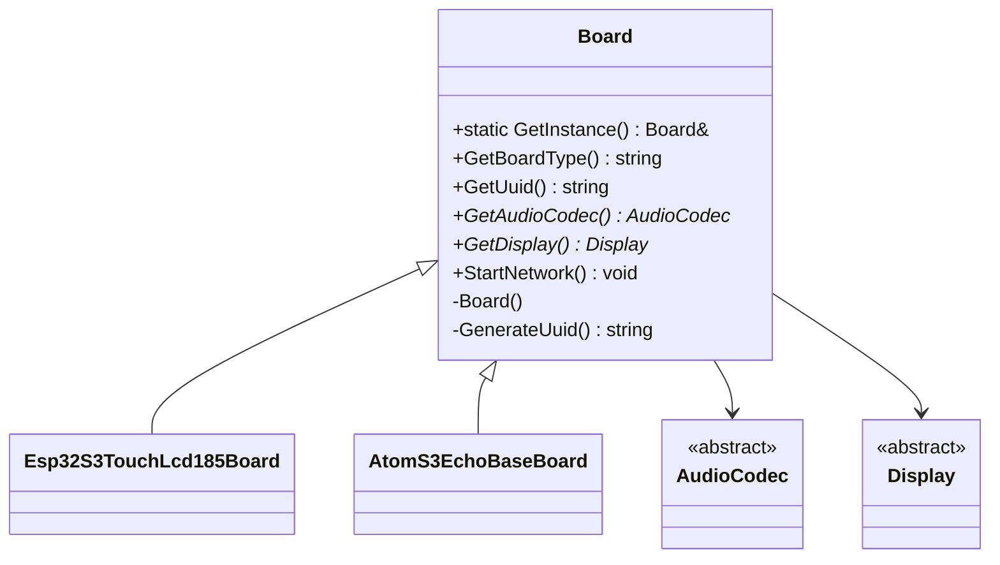
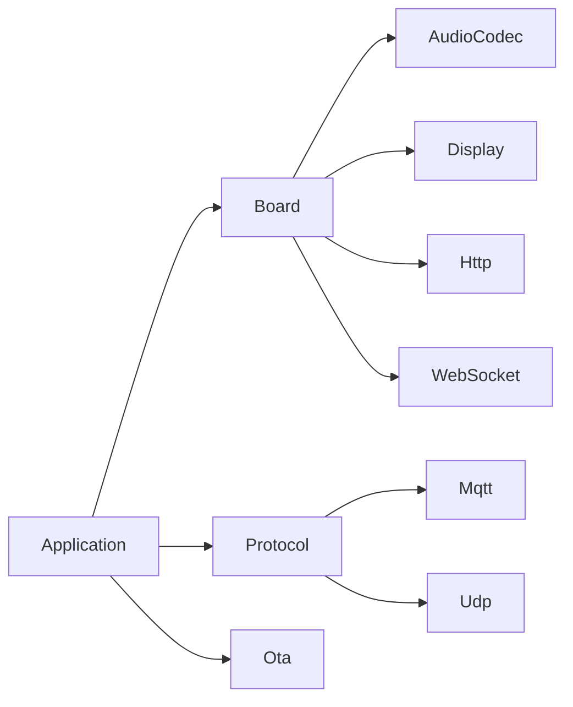
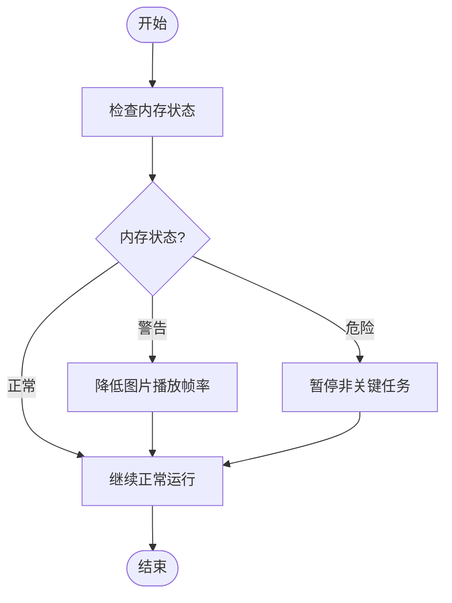

# 调试集成问题

<cite>
**本文档中引用的文件**   
- [board.h](file://main/boards/common/board.h)
- [board.cc](file://main/boards/common/board.cc)
- [application.h](file://main/application.h)
- [application.cc](file://main/application.cc)
- [sdkconfig.h](file://build/config/sdkconfig.h)
- [esp32-s3-touch-lcd-1.85.cc](file://main/boards/esp32-s3-touch-lcd-1.85/esp32-s3-touch-lcd-1.85.cc)
- [atoms3_echo_base.cc](file://main/boards/atoms3-echo-base/atoms3_echo_base.cc)
- [memory_manager.cc](file://main/memory/memory_manager.cc)
- [mqtt_watchdog_config.cc](file://main/config/mqtt_watchdog_config.cc)
</cite>

## 目录
1. [简介](#简介)
2. [项目结构](#项目结构)
3. [核心组件](#核心组件)
4. [架构概述](#架构概述)
5. [详细组件分析](#详细组件分析)
6. [依赖分析](#依赖分析)
7. [性能考量](#性能考量)
8. [故障排除指南](#故障排除指南)
9. [结论](#结论)

## 简介
本文档旨在为开发者提供一套系统性的调试策略，帮助快速定位和解决在集成过程中可能出现的问题。文档涵盖了日志配置、硬件初始化观察、常用调试手段、Board实例状态检查以及典型故障场景的排查步骤。通过结合断点调试和日志追踪，开发者可以更有效地进行问题定位。

## 项目结构
项目采用模块化设计，主要分为`main`、`scripts`和`xiaozhi-fonts`三个顶级目录。`main`目录包含了应用的核心逻辑，如`AlarmClock`、`audio_codecs`、`boards`等模块。`boards`目录下存放了针对不同硬件平台的具体实现，每个子目录对应一个特定的开发板。`scripts`目录包含了一系列辅助脚本，用于图像转换、音频处理和版本发布。`xiaozhi-fonts`目录则管理了项目中使用的字体资源。



**Diagram sources**
- [main](file://main)
- [scripts](file://scripts)
- [xiaozhi-fonts](file://xiaozhi-fonts)

**Section sources**
- [main](file://main)
- [scripts](file://scripts)
- [xiaozhi-fonts](file://xiaozhi-fonts)

## 核心组件
项目的核心组件包括`Application`、`Board`、`AudioCodec`和`Display`。`Application`类是整个应用的入口点，负责管理设备状态、协议通信和后台任务。`Board`类是一个抽象基类，定义了所有硬件平台共有的接口，如获取音频编解码器、显示设备和网络连接。具体的硬件实现通过继承`Board`类并重写其虚函数来完成。`AudioCodec`和`Display`类分别封装了音频和显示功能，提供了统一的API供上层应用调用。

**Section sources**
- [application.h](file://main/application.h#L1-L236)
- [board.h](file://main/boards/common/board.h#L1-L57)

## 架构概述
系统采用分层架构，从下到上依次为硬件抽象层、中间件层和应用层。硬件抽象层由`boards`目录下的各个具体实现组成，它们通过`Board`基类向上提供统一的硬件接口。中间件层包括音频处理、网络通信和内存管理等模块，负责处理具体的业务逻辑。应用层由`Application`类主导，协调各个模块的工作，实现最终的用户功能。



**Diagram sources**
- [application.h](file://main/application.h#L1-L236)
- [board.h](file://main/boards/common/board.h#L1-L57)

## 详细组件分析

### Application单例分析
`Application`类采用单例模式，确保在整个应用生命周期内只有一个实例存在。通过`GetInstance()`静态方法获取该实例，从而可以在任何地方访问应用的核心功能。



**Diagram sources**
- [application.h](file://main/application.h#L1-L236)
- [application.cc](file://main/application.cc#L1-L96)

**Section sources**
- [application.h](file://main/application.h#L1-L236)
- [application.cc](file://main/application.cc#L1-L96)

### Board基类分析
`Board`类是所有硬件平台的抽象基类，定义了获取硬件资源的标准接口。通过工厂函数`create_board()`和`GetInstance()`方法，可以创建并获取当前硬件平台的实例。



**Diagram sources**
- [board.h](file://main/boards/common/board.h#L1-L57)
- [board.cc](file://main/boards/common/board.cc#L1-L167)

**Section sources**
- [board.h](file://main/boards/common/board.h#L1-L57)
- [board.cc](file://main/boards/common/board.cc#L1-L167)

## 依赖分析
项目依赖于ESP-IDF框架提供的底层服务，如日志系统、网络栈和硬件驱动。通过`#include`指令引入必要的头文件，并在`CMakeLists.txt`中配置编译选项。各模块之间通过明确的接口进行交互，降低了耦合度。



**Diagram sources**
- [application.h](file://main/application.h#L1-L236)
- [board.h](file://main/boards/common/board.h#L1-L57)
- [protocol.h](file://main/protocols/protocol.h)

**Section sources**
- [application.h](file://main/application.h#L1-L236)
- [board.h](file://main/boards/common/board.h#L1-L57)
- [protocol.h](file://main/protocols/protocol.h)

## 性能考量
系统通过`MemoryManager`类监控内存使用情况，定期输出内存状态报告。当内存压力达到阈值时，会触发相应的降级策略，如降低图片播放帧率或暂停非关键任务，以保证核心功能的稳定运行。



**Section sources**
- [memory_manager.cc](file://main/memory/memory_manager.cc#L160-L195)

## 故障排除指南
### 启用详细日志输出
要启用详细的日志输出，需要在编译时设置`CONFIG_LOG_DEFAULT_LEVEL`为`3`（INFO级别）或更高。这可以在`sdkconfig.h`文件中找到并修改：
```c
#define CONFIG_LOG_DEFAULT_LEVEL_INFO 1
#define CONFIG_LOG_DEFAULT_LEVEL 3
```
修改后重新编译固件，即可在串口监视器中看到详细的日志信息。

### 检查硬件初始化
通过观察日志中的硬件初始化信息，可以确认各模块是否正常启动。例如，在`esp32-s3-touch-lcd-1.85.cc`中，`InitializeIli9341Display()`函数会输出SPI总线和显示面板的初始化状态。

### 使用逻辑分析仪
对于I2C/SPI通信问题，推荐使用逻辑分析仪抓取波形，验证通信协议是否符合预期。检查设备地址、时钟频率和数据格式是否正确。

### GPIO测试点
通过GPIO测试点可以确认电源和复位信号的时序。例如，`PWR_Control_PIN`（GPIO_NUM_7）用于控制电源，`BOOT_BUTTON_GPIO`（GPIO_NUM_0）用于触发启动。

### 获取Board实例
通过`Application::GetInstance().GetBoard()`可以获取当前的Board实例，并检查其状态：
```cpp
auto& board = Application::GetInstance().GetBoard();
auto display = board.GetDisplay();
if (display) {
    ESP_LOGI(TAG, "显示设备已就绪");
} else {
    ESP_LOGE(TAG, "无法获取显示设备");
}
```

### 典型故障场景排查
- **屏幕无显示**：检查`DISPLAY_MOSI_PIN`、`DISPLAY_SCLK_PIN`等引脚定义是否正确，确认电源电压是否稳定。
- **音频无声**：验证`AUDIO_I2S_GPIO_DOUT`引脚连接，检查音频编解码器的I2C地址是否正确。
- **按键无响应**：确认`BOOT_BUTTON_GPIO`配置，使用万用表测量按键信号是否正常。

**Section sources**
- [sdkconfig.h](file://build/config/sdkconfig.h#L710-L909)
- [esp32-s3-touch-lcd-1.85.cc](file://main/boards/esp32-s3-touch-lcd-1.85/esp32-s3-touch-lcd-1.85.cc#L448-L490)
- [atoms3_echo_base.cc](file://main/boards/atoms3-echo-base/atoms3_echo_base.cc#L114-L151)
- [board.cc](file://main/boards/common/board.cc#L43-L87)

## 结论
本文档提供了全面的调试策略，涵盖了从日志配置到具体故障排查的各个方面。通过合理利用日志系统、硬件测试工具和代码级调试方法，开发者可以高效地解决集成过程中的各种问题。建议在开发过程中养成良好的调试习惯，及时记录和分析日志信息，以提高开发效率。