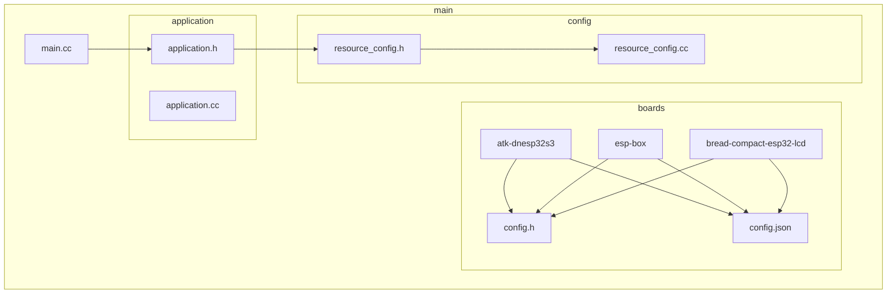
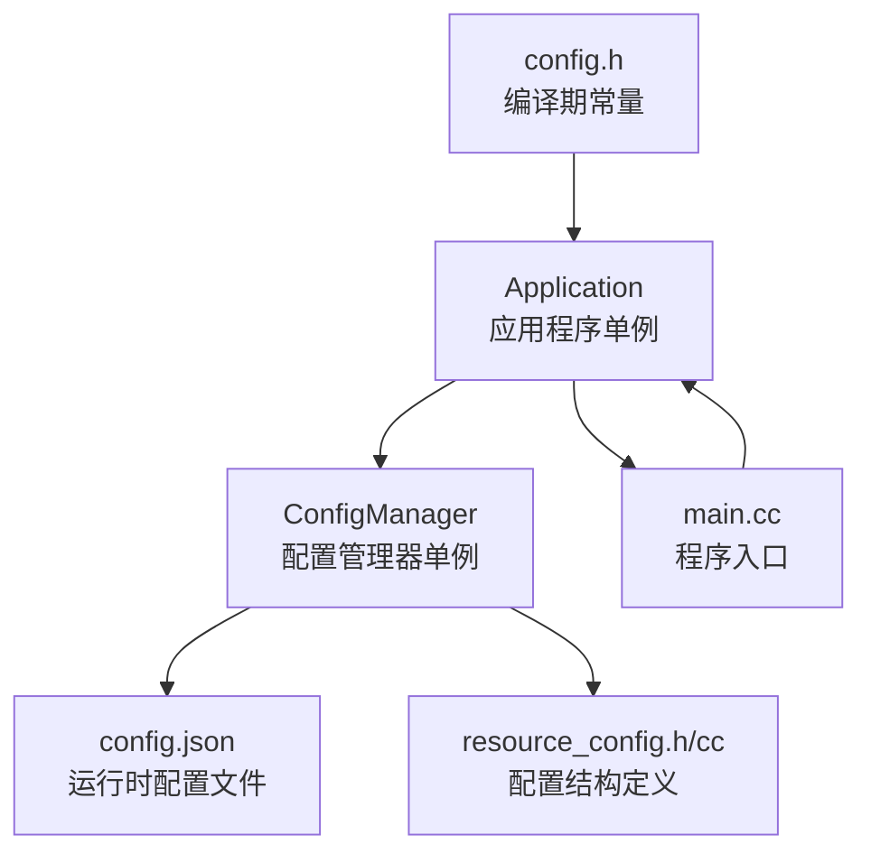
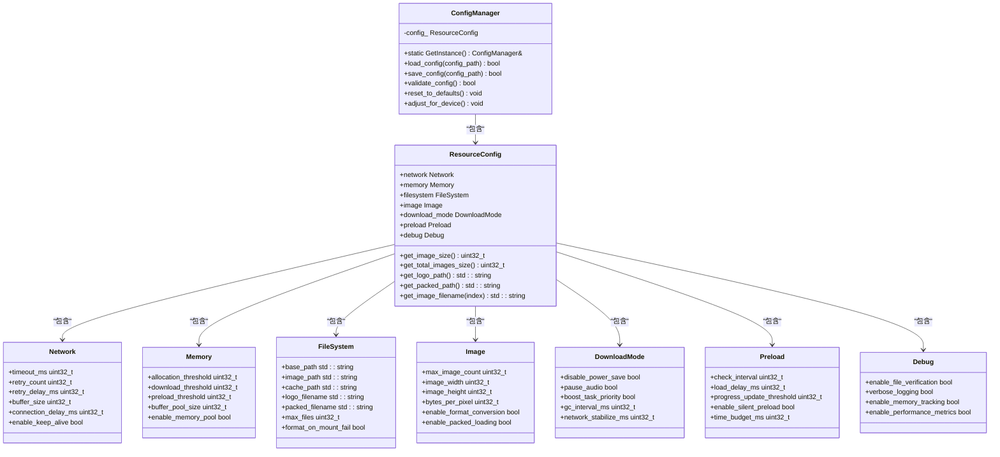
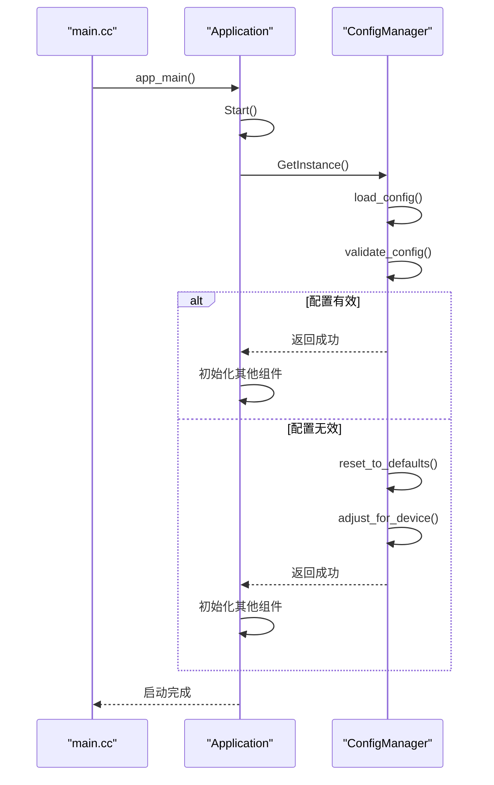

# 配置硬件参数

<cite>
**本文档引用的文件**   
- [config.h](file://main/boards/atk-dnesp32s3/config.h)
- [config.json](file://main/boards/atk-dnesp32s3/config.json)
- [resource_config.h](file://main/config/resource_config.h)
- [resource_config.cc](file://main/config/resource_config.cc)
- [config_api.h](file://main/config/config_api.h)
- [config_api.cc](file://main/config/config_api.cc)
- [application.h](file://main/application.h)
- [main.cc](file://main/main.cc)
</cite>

## 目录
1. [引言](#引言)
2. [项目结构](#项目结构)
3. [核心组件](#核心组件)
4. [架构概述](#架构概述)
5. [详细组件分析](#详细组件分析)
6. [依赖分析](#依赖分析)
7. [性能考虑](#性能考虑)
8. [故障排除指南](#故障排除指南)
9. [结论](#结论)

## 引言
本文档系统性地介绍了 `config.h` 和 `config.json` 两个配置文件的使用方法。`config.h` 文件用于定义编译期常量，如屏幕分辨率、I2C地址、音频采样率等硬件相关参数。`config.json` 文件则用于定义运行时可动态加载的配置信息，如板卡名称、版本、显示类型、音频芯片等。开发者需要根据实际硬件规格准确填写这些参数，以确保系统能够正确初始化和运行。`config.json` 中的信息将被 `Application` 单例读取，用于动态配置系统行为。本文档还提供了验证配置正确性的方法，如通过日志输出确认参数加载结果。

## 项目结构
项目采用基于功能的文件组织方式，主要模块包括 `main`、`scripts`、`xiaozhi-fonts` 等。`main` 目录下包含 `boards` 子目录，每个硬件板级支持一个独立的子目录，其中包含 `config.h` 和 `config.json` 两个核心配置文件。`config` 目录下包含 `resource_config.h` 和 `resource_config.cc`，实现了配置管理器单例，负责加载、保存、验证和调整配置参数。

**图示来源**
- [main.cc](file://main/main.cc)
- [application.h](file://main/application.h)
- [resource_config.h](file://main/config/resource_config.h)
- [resource_config.cc](file://main/config/resource_config.cc)

**本节来源**
- [main.cc](file://main/main.cc)
- [application.h](file://main/application.h)
- [resource_config.h](file://main/config/resource_config.h)
- [resource_config.cc](file://main/config/resource_config.cc)

## 核心组件
核心组件包括 `ConfigManager` 配置管理器单例和 `Application` 应用程序单例。`ConfigManager` 负责管理系统的运行时配置，提供加载、保存、验证和调整配置的功能。`Application` 是应用程序的主控制器，负责启动系统、管理设备状态和协调各个功能模块。

**本节来源**
- [resource_config.h](file://main/config/resource_config.h)
- [application.h](file://main/application.h)

## 架构概述
系统采用分层架构，上层为 `Application` 单例，负责业务逻辑和状态管理；中层为 `ConfigManager` 单例，负责配置管理；底层为硬件抽象层，通过 `config.h` 定义编译期常量。`Application` 在启动时会调用 `ConfigManager` 加载 `config.json` 文件中的配置，并根据配置动态调整系统行为。

**图示来源**
- [application.h](file://main/application.h)
- [resource_config.h](file://main/config/resource_config.h)
- [main.cc](file://main/main.cc)

## 详细组件分析

### ConfigManager 配置管理器分析
`ConfigManager` 是一个单例类，负责管理系统的运行时配置。它通过 `load_config` 方法从 `config.json` 文件中加载配置，并通过 `validate_config` 方法验证配置的有效性。如果配置验证失败，将使用默认配置。

#### 类图

**图示来源**
- [resource_config.h](file://main/config/resource_config.h)
- [resource_config.cc](file://main/config/resource_config.cc)

### Application 应用程序分析
`Application` 是应用程序的主控制器，通过 `Start` 方法启动系统。在启动过程中，它会初始化事件循环、NVS闪存，并最终调用 `Start` 方法启动应用程序。

#### 序列图

**图示来源**
- [main.cc](file://main/main.cc)
- [application.h](file://main/application.h)
- [resource_config.h](file://main/config/resource_config.h)
- [resource_config.cc](file://main/config/resource_config.cc)

**本节来源**
- [main.cc](file://main/main.cc)
- [application.h](file://main/application.h)
- [resource_config.h](file://main/config/resource_config.h)
- [resource_config.cc](file://main/config/resource_config.cc)

## 依赖分析
系统的主要依赖关系如下：`main.cc` 依赖 `application.h`，`application.h` 依赖 `resource_config.h`，`resource_config.h` 定义了 `ResourceConfig` 结构和 `ConfigManager` 类。`ConfigManager` 的实现依赖 `resource_config.cc`。

**图示来源**
- [main.cc](file://main/main.cc)
- [application.h](file://main/application.h)
- [resource_config.h](file://main/config/resource_config.h)
- [resource_config.cc](file://main/config/resource_config.cc)

**本节来源**
- [main.cc](file://main/main.cc)
- [application.h](file://main/application.h)
- [resource_config.h](file://main/config/resource_config.h)
- [resource_config.cc](file://main/config/resource_config.cc)

## 性能考虑
`ConfigManager` 提供了 `adjust_for_device` 方法，可以根据设备的可用内存自动调整配置参数。例如，在内存小于1MB的设备上，会减小网络缓冲区大小和内存阈值，以适应内存受限的环境。

## 故障排除指南
当配置加载失败时，系统会输出相应的错误日志。例如，如果 `config.json` 文件解析失败，会输出 "配置文件JSON解析失败" 的错误日志，并使用默认配置。开发者可以通过查看日志来判断配置是否加载成功。

**本节来源**
- [resource_config.cc](file://main/config/resource_config.cc)

## 结论
`config.h` 和 `config.json` 是系统中两个重要的配置文件。`config.h` 用于定义编译期常量，`config.json` 用于定义运行时可动态加载的配置。`ConfigManager` 单例负责管理 `config.json` 中的配置，`Application` 单例在启动时会加载并验证这些配置。开发者需要根据实际硬件规格准确填写这些参数，并通过日志输出确认配置加载结果。